# Ajustarea fină a Phi-3 cu Azure AI Foundry

Să explorăm cum să ajustăm fin modelul lingvistic Phi-3 Mini de la Microsoft folosind Azure AI Foundry. Ajustarea fină permite adaptarea Phi-3 Mini pentru sarcini specifice, făcându-l și mai puternic și mai conștient de context.

## Considerații

- **Capacități:** Ce modele pot fi ajustate fin? Ce poate face modelul de bază după ajustarea fină?
- **Cost:** Care este modelul de tarifare pentru ajustarea fină?
- **Personalizare:** Cât de mult pot modifica modelul de bază – și în ce moduri?
- **Conveniență:** Cum se realizează ajustarea fină – trebuie să scriu cod personalizat? Trebuie să aduc propriile resurse de calcul?
- **Siguranță:** Modelele ajustate fin sunt cunoscute pentru riscuri de siguranță – există măsuri de protecție împotriva efectelor negative neintenționate?

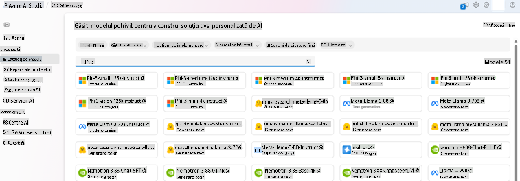

## Pregătirea pentru ajustarea fină

### Cerințe preliminare

> [!NOTE]
> Pentru modelele din familia Phi-3, opțiunea de ajustare fină pe baza modelului pay-as-you-go este disponibilă doar cu huburi create în regiunile **East US 2**.

- Un abonament Azure. Dacă nu aveți un abonament Azure, creați un [cont Azure plătit](https://azure.microsoft.com/pricing/purchase-options/pay-as-you-go) pentru a începe.

- Un [proiect AI Foundry](https://ai.azure.com?WT.mc_id=aiml-138114-kinfeylo).
- Controalele de acces bazate pe roluri Azure (Azure RBAC) sunt utilizate pentru a acorda acces la operațiunile din Azure AI Foundry. Pentru a efectua pașii din acest articol, contul de utilizator trebuie să fie atribuit rolului __Azure AI Developer__ pe grupul de resurse.

### Înregistrarea furnizorului de abonamente

Verificați dacă abonamentul este înregistrat la furnizorul de resurse `Microsoft.Network`.

1. Conectați-vă la [portalul Azure](https://portal.azure.com).
1. Selectați **Subscriptions** din meniul din stânga.
1. Selectați abonamentul pe care doriți să-l utilizați.
1. Selectați **AI project settings** > **Resource providers** din meniul din stânga.
1. Confirmați că **Microsoft.Network** se află pe lista furnizorilor de resurse. În caz contrar, adăugați-l.

### Pregătirea datelor

Pregătiți datele de antrenament și validare pentru a ajusta fin modelul. Seturile de date de antrenament și validare constau în exemple de intrare și ieșire care arată cum doriți să funcționeze modelul.

Asigurați-vă că toate exemplele de antrenament respectă formatul așteptat pentru inferență. Pentru a ajusta fin modelele în mod eficient, asigurați un set de date echilibrat și divers.

Acest lucru implică menținerea echilibrului datelor, includerea diverselor scenarii și rafinarea periodică a datelor de antrenament pentru a le alinia cu așteptările din lumea reală, ceea ce duce în cele din urmă la răspunsuri mai precise și mai echilibrate ale modelului.

Tipurile diferite de modele necesită formate diferite de date de antrenament.

### Completări în conversație

Datele de antrenament și validare pe care le utilizați **trebuie** să fie formate ca un document JSON Lines (JSONL). Pentru `Phi-3-mini-128k-instruct`, setul de date pentru ajustarea fină trebuie să fie formatat în formatul conversațional utilizat de API-ul Chat completions.

### Exemplu de format de fișier

```json
    {"messages": [{"role": "system", "content": "You are an Xbox customer support agent whose primary goal is to help users with issues they are experiencing with their Xbox devices. You are friendly and concise. You only provide factual answers to queries, and do not provide answers that are not related to Xbox."}, {"role": "user", "content": "Is Xbox better than PlayStation?"}, {"role": "assistant", "content": "I apologize, but I cannot provide personal opinions. My primary job is to assist you with any issues related to your Xbox device. Do you have any Xbox-related issues that need addressing?"}]}
    {"messages": [{"role": "system", "content": "You are an Xbox customer support agent whose primary goal is to help users with issues they are experiencing with their Xbox devices. You are friendly and concise. You only provide factual answers to queries, and do not provide answers that are not related to Xbox."}, {"role": "user", "content": "Can I play PC games on my Xbox?"}, {"role": "assistant", "content": "While Xbox consoles don't natively support PC games, they can play an array of Xbox games, many of which are also available on PC. Can I assist you with finding games compatible with your Xbox device?"}]}
    {"messages": [{"role": "system", "content": "You are an Xbox customer support agent whose primary goal is to help users with issues they are experiencing with their Xbox devices. You are friendly and concise. You only provide factual answers to queries, and do not provide answers that are not related to Xbox."}, {"role": "user", "content": "I'm having trouble connecting my Xbox to the Wi-Fi."}, {"role": "assistant", "content": "No worries, let's go through the network settings on your Xbox. Can you please tell me what happens when you try to connect it to the Wi-Fi?"}]}
```

Tipul de fișier acceptat este JSON Lines. Fișierele sunt încărcate în spațiul de stocare implicit și devin disponibile în proiectul dumneavoastră.

## Ajustarea fină a Phi-3 cu Azure AI Foundry

Azure AI Foundry vă permite să personalizați modelele lingvistice mari utilizând un proces cunoscut sub numele de ajustare fină. Ajustarea fină oferă valoare semnificativă prin personalizare și optimizare pentru sarcini și aplicații specifice. Aceasta conduce la îmbunătățirea performanței, eficiență a costurilor, reducerea latenței și rezultate adaptate.

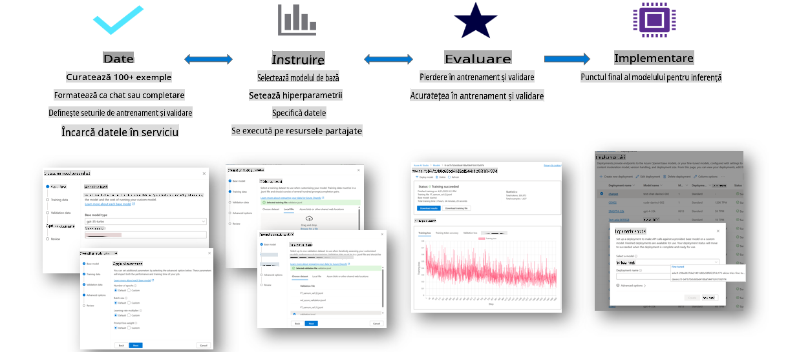

### Crearea unui nou proiect

1. Conectați-vă la [Azure AI Foundry](https://ai.azure.com).

1. Selectați **+New project** pentru a crea un nou proiect în Azure AI Foundry.

    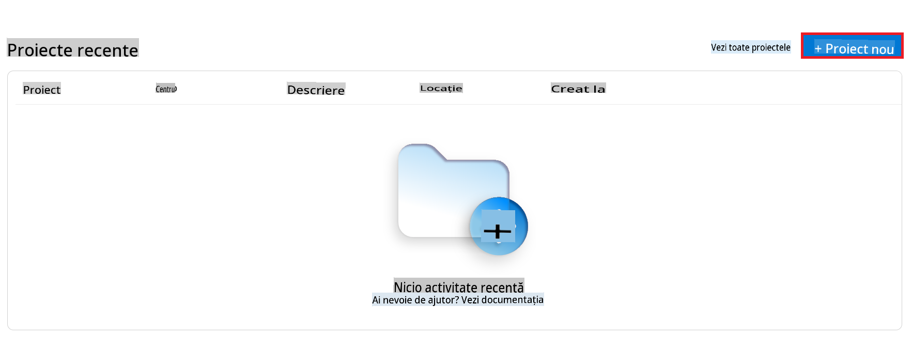

1. Efectuați următoarele sarcini:

    - **Numele hubului** proiectului. Trebuie să fie o valoare unică.
    - Selectați **Hubul** pe care doriți să-l utilizați (creați unul nou dacă este necesar).

    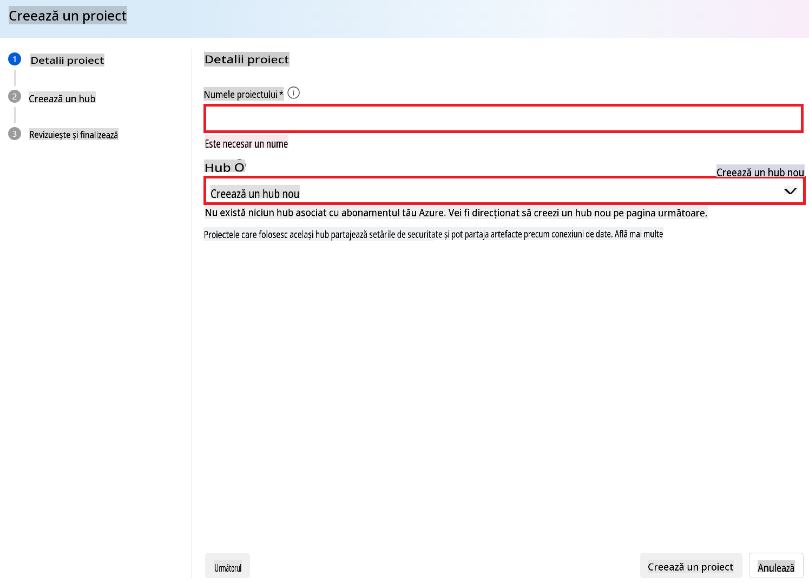

1. Efectuați următoarele sarcini pentru a crea un nou hub:

    - Introduceți **Numele hubului**. Trebuie să fie o valoare unică.
    - Selectați **Abonamentul Azure**.
    - Selectați **Grupul de resurse** pe care doriți să-l utilizați (creați unul nou dacă este necesar).
    - Selectați **Locația** pe care doriți să o utilizați.
    - Selectați **Conectare la serviciile Azure AI** pe care doriți să le utilizați (creați unul nou dacă este necesar).
    - Selectați **Conectare la Azure AI Search** pentru a **Sări peste conectare**.

    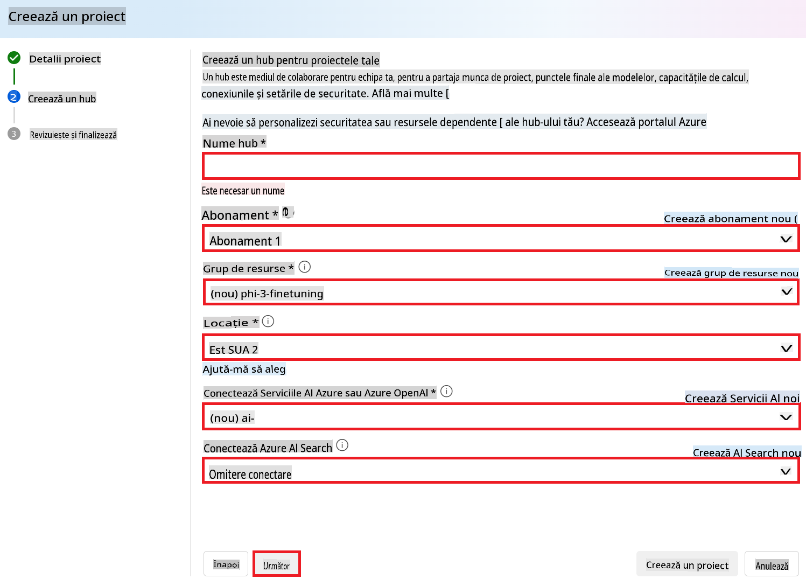

1. Selectați **Next**.
1. Selectați **Creare proiect**.

### Pregătirea datelor

Înainte de ajustarea fină, adunați sau creați un set de date relevant pentru sarcina dumneavoastră, cum ar fi instrucțiuni de chat, perechi întrebare-răspuns sau alte date textuale relevante. Curățați și preprocesați aceste date eliminând zgomotul, gestionând valorile lipsă și tokenizând textul.

### Ajustarea fină a modelelor Phi-3 în Azure AI Foundry

> [!NOTE]
> Ajustarea fină a modelelor Phi-3 este în prezent acceptată în proiecte situate în East US 2.

1. Selectați **Model catalog** din bara laterală.

1. Tastați *phi-3* în **bara de căutare** și selectați modelul phi-3 pe care doriți să-l utilizați.

    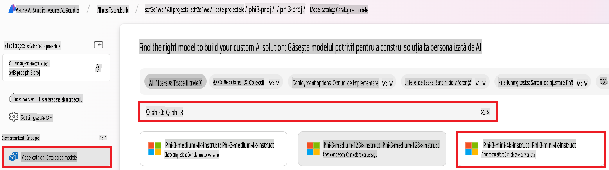

1. Selectați **Fine-tune**.

    

1. Introduceți **Numele modelului ajustat fin**.

    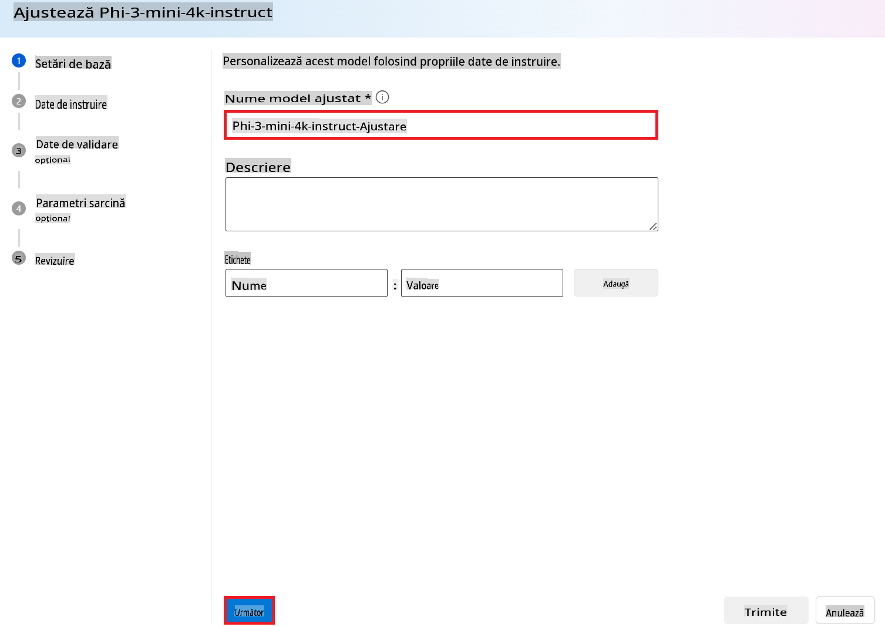

1. Selectați **Next**.

1. Efectuați următoarele sarcini:

    - Selectați **Tipul sarcinii** ca **Completare conversațională**.
    - Selectați **Datele de antrenament** pe care doriți să le utilizați. Le puteți încărca prin datele Azure AI Foundry sau din mediul local.

    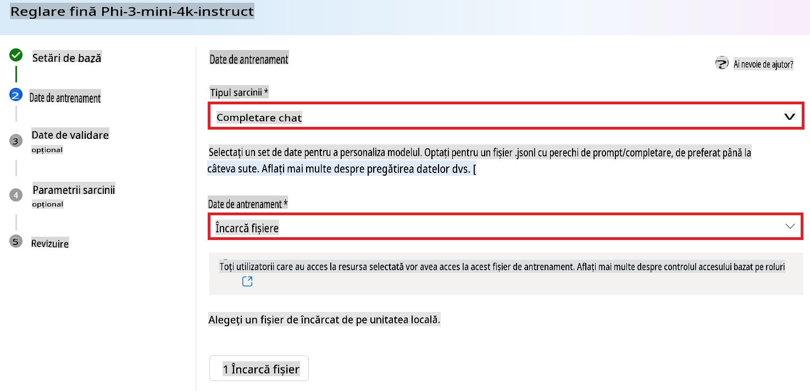

1. Selectați **Next**.

1. Încărcați **Datele de validare** pe care doriți să le utilizați sau selectați **Împărțire automată a datelor de antrenament**.

    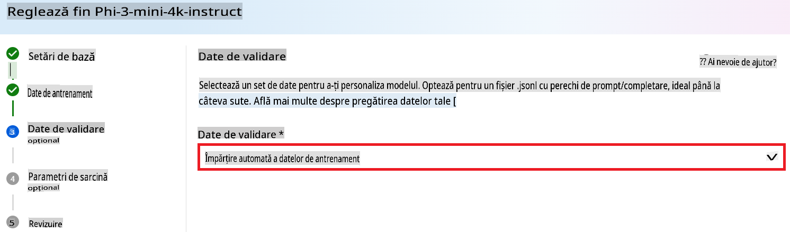

1. Selectați **Next**.

1. Efectuați următoarele sarcini:

    - Selectați **Multiplicatorul dimensiunii batch** pe care doriți să-l utilizați.
    - Selectați **Rata de învățare** pe care doriți să o utilizați.
    - Selectați **Epocile** pe care doriți să le utilizați.

    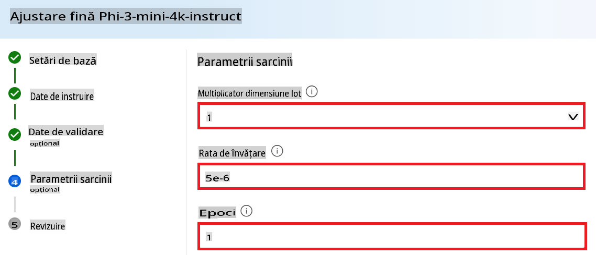

1. Selectați **Submit** pentru a începe procesul de ajustare fină.

    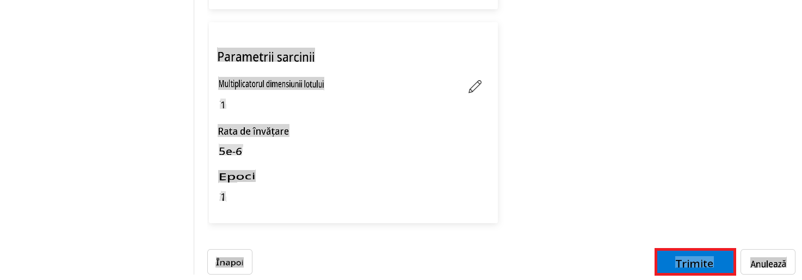

1. După ce modelul dumneavoastră este ajustat fin, starea va fi afișată ca **Completed**, așa cum se arată în imaginea de mai jos. Acum puteți implementa modelul și îl puteți utiliza în propria aplicație, în playground sau în fluxul de solicitări. Pentru mai multe informații, consultați [Cum să implementați familia de modele lingvistice mici Phi-3 cu Azure AI Foundry](https://learn.microsoft.com/azure/ai-studio/how-to/deploy-models-phi-3?tabs=phi-3-5&pivots=programming-language-python).

    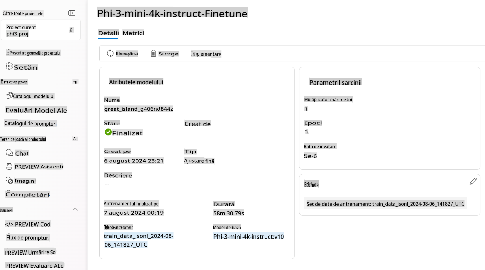

> [!NOTE]
> Pentru informații mai detaliate despre ajustarea fină a Phi-3, vizitați [Ajustarea fină a modelelor Phi-3 în Azure AI Foundry](https://learn.microsoft.com/azure/ai-studio/how-to/fine-tune-phi-3?tabs=phi-3-mini).

## Curățarea modelelor ajustate fin

Puteți șterge un model ajustat fin din lista de modele de ajustare fină din [Azure AI Foundry](https://ai.azure.com) sau de pe pagina detaliilor modelului. Selectați modelul ajustat fin pe care doriți să-l ștergeți din pagina Ajustare fină, apoi selectați butonul Ștergere pentru a-l elimina.

> [!NOTE]
> Nu puteți șterge un model personalizat dacă acesta are o implementare existentă. Trebuie mai întâi să ștergeți implementarea modelului înainte de a șterge modelul personalizat.

## Costuri și cote

### Considerații privind costurile și cotele pentru modelele Phi-3 ajustate fin ca serviciu

Modelele Phi ajustate fin ca serviciu sunt oferite de Microsoft și integrate cu Azure AI Foundry pentru utilizare. Puteți găsi prețurile atunci când [implementați](https://learn.microsoft.com/azure/ai-studio/how-to/deploy-models-phi-3?tabs=phi-3-5&pivots=programming-language-python) sau ajustați fin modelele sub fila Pricing and terms din expertul de implementare.

## Filtrarea conținutului

Modelele implementate ca serviciu cu opțiunea pay-as-you-go sunt protejate de Azure AI Content Safety. Când sunt implementate pe puncte finale în timp real, puteți renunța la această capacitate. Cu Azure AI Content Safety activat, atât solicitarea, cât și completarea trec printr-un ansamblu de modele de clasificare destinate detectării și prevenirii conținutului dăunător. Sistemul de filtrare a conținutului detectează și ia măsuri asupra anumitor categorii de conținut potențial dăunător în ambele solicitări de intrare și completări de ieșire. Aflați mai multe despre [Azure AI Content Safety](https://learn.microsoft.com/azure/ai-studio/concepts/content-filtering).

**Configurația ajustării fine**

Hiperparametri: Definiți hiperparametri precum rata de învățare, dimensiunea batch-ului și numărul de epoci de antrenament.

**Funcția de pierdere**

Alegeți o funcție de pierdere adecvată pentru sarcina dumneavoastră (de exemplu, entropie încrucișată).

**Optimizator**

Selectați un optimizator (de exemplu, Adam) pentru actualizările gradientului în timpul antrenamentului.

**Procesul de ajustare fină**

- Încărcați modelul pre-antrenat: Încărcați punctul de control al Phi-3 Mini.
- Adăugați straturi personalizate: Adăugați straturi specifice sarcinii (de exemplu, cap de clasificare pentru instrucțiuni de chat).

**Antrenați modelul**
Ajustați fin modelul utilizând setul dumneavoastră de date pregătit. Monitorizați progresul antrenamentului și ajustați hiperparametrii după cum este necesar.

**Evaluare și validare**

Set de validare: Împărțiți datele în seturi de antrenament și validare.

**Evaluați performanța**

Utilizați metrici precum acuratețea, scorul F1 sau perplexitatea pentru a evalua performanța modelului.

## Salvarea modelului ajustat fin

**Punct de control**
Salvați punctul de control al modelului ajustat fin pentru utilizare viitoare.

## Implementare

- Implementați ca serviciu web: Implementați modelul ajustat fin ca serviciu web în Azure AI Foundry.
- Testați punctul final: Trimiteți interogări de testare la punctul final implementat pentru a verifica funcționalitatea acestuia.

## Iterare și îmbunătățire

Iterați: Dacă performanța nu este satisfăcătoare, iterați ajustând hiperparametrii, adăugând mai multe date sau ajustând fin pentru epoci suplimentare.

## Monitorizare și rafinare

Monitorizați continuu comportamentul modelului și rafinați-l după cum este necesar.

## Personalizare și extindere

Sarcini personalizate: Phi-3 Mini poate fi ajustat fin pentru diverse sarcini dincolo de instrucțiunile de chat. Explorați alte cazuri de utilizare!
Experimentați: Încercați diferite arhitecturi, combinații de straturi și tehnici pentru a îmbunătăți performanța.

> [!NOTE]
> Ajustarea fină este un proces iterativ. Experimentați, învățați și adaptați modelul pentru a obține cele mai bune rezultate pentru sarcina dumneavoastră specifică!

**Declinarea responsabilității**:  
Acest document a fost tradus utilizând servicii de traducere automată bazate pe inteligență artificială. Deși depunem eforturi pentru a asigura acuratețea, vă rugăm să rețineți că traducerile automate pot conține erori sau inexactități. Documentul original, în limba sa de bază, ar trebui considerat sursa autoritară. Pentru informații critice, se recomandă traducerea realizată de un profesionist uman. Nu ne asumăm răspunderea pentru neînțelegerile sau interpretările greșite care pot apărea din utilizarea acestei traduceri.