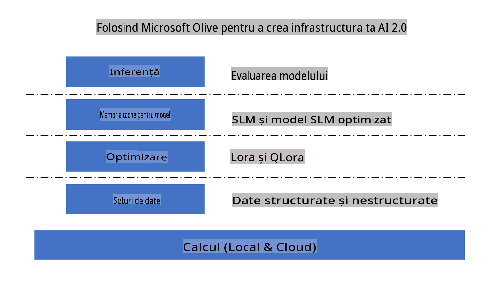
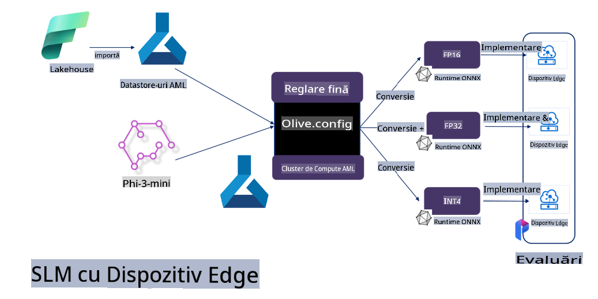

# **Fine-tuning Phi-3 cu Microsoft Olive**

[Olive](https://github.com/microsoft/OLive?WT.mc_id=aiml-138114-kinfeylo) este un instrument simplu de optimizare a modelelor, conștient de hardware, care reunește tehnici de vârf din industrie pentru comprimarea, optimizarea și compilarea modelelor.

Este conceput pentru a simplifica procesul de optimizare a modelelor de învățare automată, asigurând utilizarea eficientă a arhitecturilor hardware specifice.

Indiferent dacă lucrezi la aplicații bazate pe cloud sau pe dispozitive edge, Olive îți permite să optimizezi modelele fără efort și în mod eficient.

## Funcționalități principale:
- Olive integrează și automatizează tehnici de optimizare pentru hardware-ul dorit.
- Nicio tehnică de optimizare nu se potrivește tuturor scenariilor, astfel că Olive permite extinderea prin integrarea inovațiilor experților din industrie.

## Reducerea efortului de inginerie:
- Dezvoltatorii trebuie adesea să învețe și să folosească mai multe toolchain-uri specifice furnizorilor de hardware pentru a pregăti și optimiza modelele antrenate pentru implementare.
- Olive simplifică această experiență automatizând tehnicile de optimizare pentru hardware-ul dorit.

## Soluție completă de optimizare gata de utilizare:

Prin compunerea și ajustarea tehnicilor integrate, Olive oferă o soluție unificată pentru optimizare completă. Ia în considerare constrângeri precum acuratețea și latența în timpul optimizării modelelor.

## Utilizarea Microsoft Olive pentru fine-tuning

Microsoft Olive este un instrument open source foarte ușor de utilizat pentru optimizarea modelelor, care acoperă atât fine-tuning-ul, cât și utilizarea de referință în domeniul inteligenței artificiale generative. Necesită doar o configurare simplă, iar prin utilizarea modelelor open source de limbaj de dimensiuni mici și a mediilor de execuție asociate (AzureML / GPU local, CPU, DirectML), poți finaliza optimizarea sau utilizarea de referință a modelului prin optimizare automată și găsi cel mai bun model pentru a-l implementa în cloud sau pe dispozitive edge. Acest lucru permite companiilor să-și construiască propriile modele verticale în cloud sau on-premises.



## Fine-tuning Phi-3 cu Microsoft Olive 



## Exemplu de cod și utilizare Phi-3 Olive
În acest exemplu vei folosi Olive pentru:

- A face fine-tuning unui adaptor LoRA pentru a clasifica expresii în Sad, Joy, Fear, Surprise.
- A combina greutățile adaptorului cu modelul de bază.
- A optimiza și cuantifica modelul în int4.

[Exemplu de cod](../../code/03.Finetuning/olive-ort-example/README.md)

### Instalarea Microsoft Olive

Instalarea Microsoft Olive este foarte simplă și poate fi realizată pentru CPU, GPU, DirectML și Azure ML.

```bash
pip install olive-ai
```

Dacă dorești să rulezi un model ONNX pe un CPU, poți folosi

```bash
pip install olive-ai[cpu]
```

Dacă dorești să rulezi un model ONNX pe un GPU, poți folosi

```python
pip install olive-ai[gpu]
```

Dacă dorești să utilizezi Azure ML, folosește

```python
pip install git+https://github.com/microsoft/Olive#egg=olive-ai[azureml]
```

**Observație**
Cerințe OS: Ubuntu 20.04 / 22.04 

### **Config.json al Microsoft Olive**

După instalare, poți configura diferite setări specifice modelului prin fișierul Config, inclusiv date, calcul, antrenare, implementare și generarea modelului.

**1. Date**

Pe Microsoft Olive, se poate antrena folosind date locale sau din cloud, iar acest lucru poate fi configurat în setări.

*Setări pentru date locale*

Poți configura simplu setul de date care trebuie antrenat pentru fine-tuning, de obicei în format json, și să îl adaptezi cu un șablon de date. Acest lucru trebuie ajustat în funcție de cerințele modelului (de exemplu, adaptat la formatul necesar pentru Microsoft Phi-3-mini. Dacă ai alte modele, consultă formatele necesare pentru fine-tuning ale altor modele).

```json

    "data_configs": [
        {
            "name": "dataset_default_train",
            "type": "HuggingfaceContainer",
            "load_dataset_config": {
                "params": {
                    "data_name": "json", 
                    "data_files":"dataset/dataset-classification.json",
                    "split": "train"
                }
            },
            "pre_process_data_config": {
                "params": {
                    "dataset_type": "corpus",
                    "text_cols": [
                            "phrase",
                            "tone"
                    ],
                    "text_template": "### Text: {phrase}\n### The tone is:\n{tone}",
                    "corpus_strategy": "join",
                    "source_max_len": 2048,
                    "pad_to_max_len": false,
                    "use_attention_mask": false
                }
            }
        }
    ],
```

**Setări pentru sursele de date din cloud**

Prin conectarea datastore-ului din Azure AI Studio/Azure Machine Learning Service, poți introduce diferite surse de date în Azure AI Studio/Azure Machine Learning Service folosind Microsoft Fabric și Azure Data, ca suport pentru fine-tuning-ul datelor.

```json

    "data_configs": [
        {
            "name": "dataset_default_train",
            "type": "HuggingfaceContainer",
            "load_dataset_config": {
                "params": {
                    "data_name": "json", 
                    "data_files": {
                        "type": "azureml_datastore",
                        "config": {
                            "azureml_client": {
                                "subscription_id": "Your Azure Subscrition ID",
                                "resource_group": "Your Azure Resource Group",
                                "workspace_name": "Your Azure ML Workspaces name"
                            },
                            "datastore_name": "workspaceblobstore",
                            "relative_path": "Your train_data.json Azure ML Location"
                        }
                    },
                    "split": "train"
                }
            },
            "pre_process_data_config": {
                "params": {
                    "dataset_type": "corpus",
                    "text_cols": [
                            "Question",
                            "Best Answer"
                    ],
                    "text_template": "<|user|>\n{Question}<|end|>\n<|assistant|>\n{Best Answer}\n<|end|>",
                    "corpus_strategy": "join",
                    "source_max_len": 2048,
                    "pad_to_max_len": false,
                    "use_attention_mask": false
                }
            }
        }
    ],
    
```

**2. Configurația de calcul**

Dacă ai nevoie să lucrezi local, poți folosi direct resursele de date locale. Dacă ai nevoie de resursele Azure AI Studio / Azure Machine Learning Service, trebuie să configurezi parametrii Azure relevanți, numele resurselor de calcul etc.

```json

    "systems": {
        "aml": {
            "type": "AzureML",
            "config": {
                "accelerators": ["gpu"],
                "hf_token": true,
                "aml_compute": "Your Azure AI Studio / Azure Machine Learning Service Compute Name",
                "aml_docker_config": {
                    "base_image": "Your Azure AI Studio / Azure Machine Learning Service docker",
                    "conda_file_path": "conda.yaml"
                }
            }
        },
        "azure_arc": {
            "type": "AzureML",
            "config": {
                "accelerators": ["gpu"],
                "aml_compute": "Your Azure AI Studio / Azure Machine Learning Service Compute Name",
                "aml_docker_config": {
                    "base_image": "Your Azure AI Studio / Azure Machine Learning Service docker",
                    "conda_file_path": "conda.yaml"
                }
            }
        }
    },
```

***Observație***

Deoarece rulează printr-un container pe Azure AI Studio/Azure Machine Learning Service, mediul necesar trebuie configurat. Acest lucru se configurează în mediul conda.yaml.

```yaml

name: project_environment
channels:
  - defaults
dependencies:
  - python=3.8.13
  - pip=22.3.1
  - pip:
      - einops
      - accelerate
      - azure-keyvault-secrets
      - azure-identity
      - bitsandbytes
      - datasets
      - huggingface_hub
      - peft
      - scipy
      - sentencepiece
      - torch>=2.2.0
      - transformers
      - git+https://github.com/microsoft/Olive@jiapli/mlflow_loading_fix#egg=olive-ai[gpu]
      - --extra-index-url https://aiinfra.pkgs.visualstudio.com/PublicPackages/_packaging/ORT-Nightly/pypi/simple/ 
      - ort-nightly-gpu==1.18.0.dev20240307004
      - --extra-index-url https://aiinfra.pkgs.visualstudio.com/PublicPackages/_packaging/onnxruntime-genai/pypi/simple/
      - onnxruntime-genai-cuda

    

```

**3. Alege modelul SLM**

Poți folosi modelul direct de pe Hugging Face sau îl poți combina cu Model Catalog din Azure AI Studio / Azure Machine Learning pentru a selecta modelul dorit. În exemplul de cod de mai jos, vom folosi Microsoft Phi-3-mini.

Dacă ai modelul local, poți folosi această metodă

```json

    "input_model":{
        "type": "PyTorchModel",
        "config": {
            "hf_config": {
                "model_name": "model-cache/microsoft/phi-3-mini",
                "task": "text-generation",
                "model_loading_args": {
                    "trust_remote_code": true
                }
            }
        }
    },
```

Dacă dorești să folosești un model din Azure AI Studio / Azure Machine Learning Service, poți folosi această metodă

```json

    "input_model":{
        "type": "PyTorchModel",
        "config": {
            "model_path": {
                "type": "azureml_registry_model",
                "config": {
                    "name": "microsoft/Phi-3-mini-4k-instruct",
                    "registry_name": "azureml-msr",
                    "version": "11"
                }
            },
             "model_file_format": "PyTorch.MLflow",
             "hf_config": {
                "model_name": "microsoft/Phi-3-mini-4k-instruct",
                "task": "text-generation",
                "from_pretrained_args": {
                    "trust_remote_code": true
                }
            }
        }
    },
```

**Observație:**
Trebuie să integrezi cu Azure AI Studio / Azure Machine Learning Service, așa că atunci când configurezi modelul, te rugăm să te asiguri că respecți numărul de versiune și denumirile asociate.

Toate modelele din Azure trebuie să fie setate la PyTorch.MLflow.

Trebuie să ai un cont Hugging Face și să legi cheia acestuia la valoarea Key din Azure AI Studio / Azure Machine Learning.

**4. Algoritm**

Microsoft Olive integrează foarte bine algoritmii de fine-tuning Lora și QLora. Tot ce trebuie să configurezi sunt câțiva parametri relevanți. Aici, voi lua QLora ca exemplu.

```json
        "lora": {
            "type": "LoRA",
            "config": {
                "target_modules": [
                    "o_proj",
                    "qkv_proj"
                ],
                "double_quant": true,
                "lora_r": 64,
                "lora_alpha": 64,
                "lora_dropout": 0.1,
                "train_data_config": "dataset_default_train",
                "eval_dataset_size": 0.3,
                "training_args": {
                    "seed": 0,
                    "data_seed": 42,
                    "per_device_train_batch_size": 1,
                    "per_device_eval_batch_size": 1,
                    "gradient_accumulation_steps": 4,
                    "gradient_checkpointing": false,
                    "learning_rate": 0.0001,
                    "num_train_epochs": 3,
                    "max_steps": 10,
                    "logging_steps": 10,
                    "evaluation_strategy": "steps",
                    "eval_steps": 187,
                    "group_by_length": true,
                    "adam_beta2": 0.999,
                    "max_grad_norm": 0.3
                }
            }
        },
```

Dacă dorești conversia prin cuantificare, ramura principală Microsoft Olive deja suportă metoda onnxruntime-genai. Poți seta în funcție de nevoi:

1. Combinarea greutăților adaptorului cu modelul de bază.
2. Conversia modelului în model ONNX cu precizia necesară folosind ModelBuilder.

De exemplu, conversia în INT4 cuantificat.

```json

        "merge_adapter_weights": {
            "type": "MergeAdapterWeights"
        },
        "builder": {
            "type": "ModelBuilder",
            "config": {
                "precision": "int4"
            }
        }
```

**Observație** 
- Dacă folosești QLoRA, conversia prin cuantificare cu ONNXRuntime-genai nu este suportată momentan.

- Trebuie menționat că poți configura pașii de mai sus în funcție de nevoi. Nu este necesar să configurezi complet toți pașii de mai sus. În funcție de cerințe, poți folosi direct pașii algoritmului fără fine-tuning. În final, trebuie să configurezi motoarele relevante.

```json

    "engine": {
        "log_severity_level": 0,
        "host": "aml",
        "target": "aml",
        "search_strategy": false,
        "execution_providers": ["CUDAExecutionProvider"],
        "cache_dir": "../model-cache/models/phi3-finetuned/cache",
        "output_dir" : "../model-cache/models/phi3-finetuned"
    }
```

**5. Finalizarea fine-tuning-ului**

Pe linia de comandă, execută în directorul olive-config.json

```bash
olive run --config olive-config.json  
```

**Declinări de responsabilitate**:  
Acest document a fost tradus folosind servicii de traducere automată bazate pe inteligență artificială. Deși ne străduim să asigurăm acuratețea, vă rugăm să rețineți că traducerile automate pot conține erori sau inexactități. Documentul original în limba sa nativă trebuie considerat sursa autoritară. Pentru informații critice, se recomandă traducerea profesională realizată de un traducător uman. Nu ne asumăm răspunderea pentru eventualele neînțelegeri sau interpretări greșite care pot apărea în urma utilizării acestei traduceri.