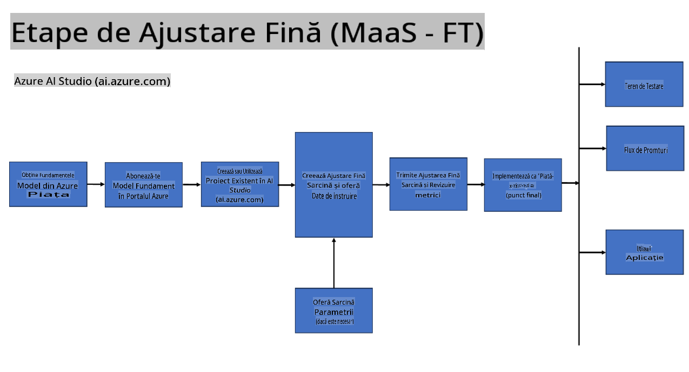
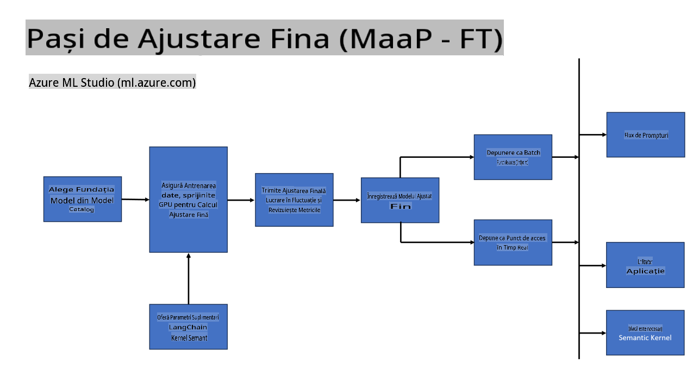
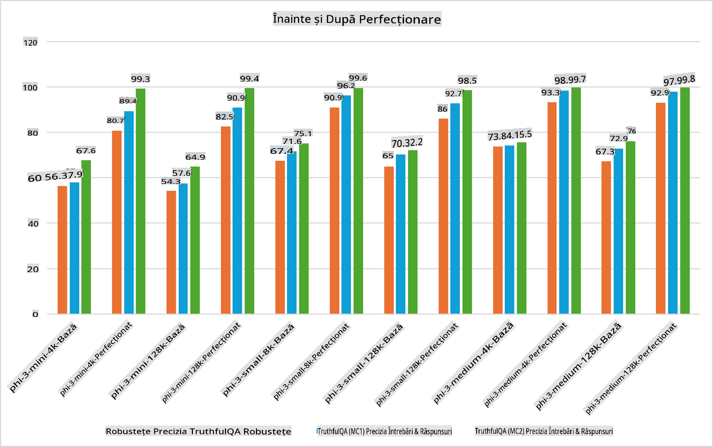

## Scenarii de Ajustare Fină

**Platformă** Aceasta include diverse tehnologii precum Azure AI Foundry, Azure Machine Learning, AI Tools, Kaito și ONNX Runtime. 

**Infrastructură** Aceasta include CPU și FPGA, care sunt esențiale pentru procesul de ajustare fină. Permiteți-mi să vă arăt pictogramele pentru fiecare dintre aceste tehnologii.

**Instrumente și Framework-uri** Aceasta include ONNX Runtime și ONNX Runtime. Permiteți-mi să vă arăt pictogramele pentru fiecare dintre aceste tehnologii.  
[Introduceți pictograme pentru ONNX Runtime și ONNX Runtime]

Procesul de ajustare fină cu tehnologiile Microsoft implică diverse componente și instrumente. Înțelegând și utilizând aceste tehnologii, putem ajusta eficient aplicațiile noastre și crea soluții mai bune.

## Model ca Serviciu

Ajustați fin modelul utilizând ajustarea găzduită, fără a fi nevoie să creați și să gestionați resursele de calcul.

Ajustarea fină fără server este disponibilă pentru modelele Phi-3-mini și Phi-3-medium, permițând dezvoltatorilor să personalizeze rapid și ușor modelele pentru scenarii de cloud și edge fără a fi nevoie să organizeze resurse de calcul. Am anunțat, de asemenea, că Phi-3-small este acum disponibil prin oferta noastră Models-as-a-Service, astfel încât dezvoltatorii să poată începe rapid și ușor dezvoltarea AI fără a gestiona infrastructura de bază.

## Model ca Platformă

Utilizatorii își gestionează propriile resurse de calcul pentru a ajusta fin modelele lor.

[Exemplu de Ajustare Fină](https://github.com/Azure/azureml-examples/blob/main/sdk/python/foundation-models/system/finetune/chat-completion/chat-completion.ipynb)

## Scenarii de Ajustare Fină

| | | | | | | |
|-|-|-|-|-|-|-|
|Scenariu|LoRA|QLoRA|PEFT|DeepSpeed|ZeRO|DORA|
|Adaptarea LLM-urilor pre-antrenate la sarcini sau domenii specifice|Da|Da|Da|Da|Da|Da|
|Ajustare fină pentru sarcini NLP precum clasificarea textului, recunoașterea entităților numite și traducerea automată|Da|Da|Da|Da|Da|Da|
|Ajustare fină pentru sarcini de întrebări și răspunsuri|Da|Da|Da|Da|Da|Da|
|Ajustare fină pentru generarea de răspunsuri asemănătoare celor umane în chatbot-uri|Da|Da|Da|Da|Da|Da|
|Ajustare fină pentru generarea de muzică, artă sau alte forme de creativitate|Da|Da|Da|Da|Da|Da|
|Reducerea costurilor computaționale și financiare|Da|Da|Nu|Da|Da|Nu|
|Reducerea utilizării memoriei|Nu|Da|Nu|Da|Da|Da|
|Utilizarea unui număr mai mic de parametri pentru ajustare fină eficientă|Nu|Da|Da|Nu|Nu|Da|
|Formă eficientă din punct de vedere al memoriei de paralelism al datelor care oferă acces la memoria agregată a GPU-urilor disponibile|Nu|Nu|Nu|Da|Da|Da|

## Exemple de Performanță în Ajustare Fină

**Declinare de responsabilitate**:  
Acest document a fost tradus folosind servicii de traducere automată bazate pe inteligență artificială. Deși depunem eforturi pentru acuratețe, vă rugăm să rețineți că traducerile automate pot conține erori sau inexactități. Documentul original în limba sa maternă ar trebui considerat sursa autoritară. Pentru informații critice, se recomandă traducerea profesională realizată de un specialist. Nu ne asumăm răspunderea pentru eventualele neînțelegeri sau interpretări greșite care pot apărea din utilizarea acestei traduceri.