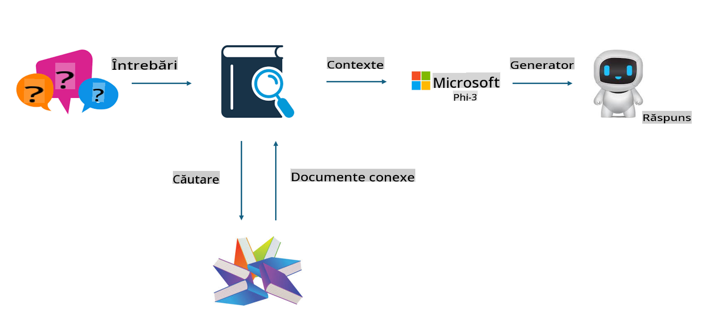

## Finetuning vs RAG

## Generare augmentată prin regăsire

RAG înseamnă regăsire de date + generare de text. Datele structurate și nestructurate ale unei organizații sunt stocate într-o bază de date vectorială. Atunci când se caută conținut relevant, se găsesc rezumatele și conținutul corespunzător pentru a forma un context, iar capacitatea de completare a textului a LLM/SLM este utilizată pentru a genera conținut.

## Procesul RAG

## Fine-tuning
Fine-tuning-ul presupune îmbunătățirea unui anumit model. Nu este necesar să se înceapă cu algoritmul modelului, dar este nevoie de acumularea continuă de date. Dacă doriți o terminologie mai precisă și o exprimare mai adecvată în aplicații industriale, fine-tuning-ul este o alegere mai bună. Totuși, dacă datele se schimbă frecvent, fine-tuning-ul poate deveni complicat.

## Cum să alegi
Dacă răspunsul nostru necesită introducerea de date externe, RAG este cea mai bună alegere.

Dacă trebuie să furnizați cunoștințe stabile și precise într-un domeniu specific, fine-tuning-ul va fi o opțiune bună. RAG prioritizează extragerea de conținut relevant, dar s-ar putea să nu surprindă întotdeauna nuanțele specializate.

Fine-tuning-ul necesită un set de date de înaltă calitate, iar dacă este vorba doar de un volum mic de date, diferența nu va fi semnificativă. RAG este mai flexibil.  
Fine-tuning-ul este o „cutie neagră”, o metafizică, și este dificil de înțeles mecanismul său intern. În schimb, RAG poate face mai ușoară identificarea sursei datelor, ceea ce permite ajustarea eficientă a halucinațiilor sau erorilor de conținut și oferă o transparență mai bună.

**Declinări de responsabilitate**:  
Acest document a fost tradus folosind servicii de traducere automată bazate pe inteligență artificială. Deși depunem eforturi pentru acuratețe, vă rugăm să rețineți că traducerile automate pot conține erori sau inexactități. Documentul original, în limba sa maternă, trebuie considerat sursa autoritară. Pentru informații critice, se recomandă traducerea umană profesională. Nu ne asumăm răspunderea pentru neînțelegerile sau interpretările greșite care pot apărea din utilizarea acestei traduceri.