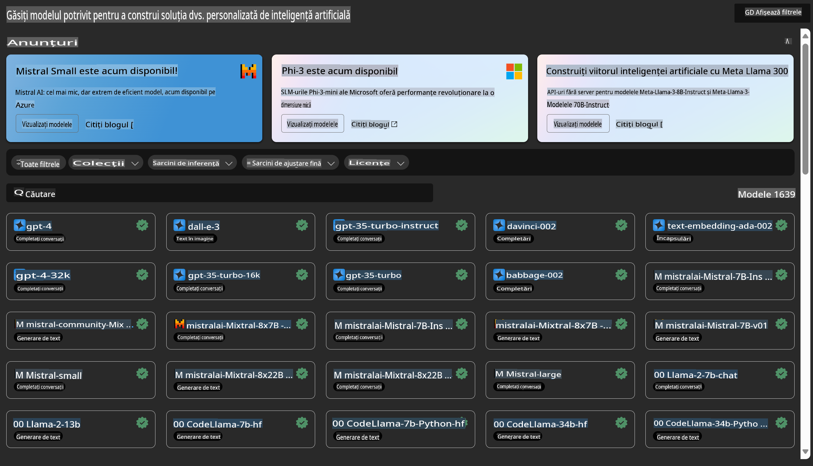

# **Introduce Azure Machine Learning Service**

[Azure Machine Learning](https://ml.azure.com?WT.mc_id=aiml-138114-kinfeylo) este un serviciu cloud pentru accelerarea și gestionarea ciclului de viață al proiectelor de învățare automată (ML).

Profesioniștii ML, oamenii de știință în domeniul datelor și inginerii îl pot folosi în activitățile lor zilnice pentru a:

- Antrena și implementa modele.
Gestiona operațiunile de învățare automată (MLOps).
- Puteți crea un model în Azure Machine Learning sau utiliza un model construit pe o platformă open-source, cum ar fi PyTorch, TensorFlow sau scikit-learn.
- Instrumentele MLOps vă ajută să monitorizați, reantrenați și să redeplasați modelele.

## Pentru cine este Azure Machine Learning?

**Oamenii de știință în domeniul datelor și inginerii ML**

Aceștia pot folosi instrumente pentru a accelera și automatiza activitățile lor zilnice.
Azure ML oferă funcții pentru echitate, explicabilitate, urmărire și auditabilitate.

**Dezvoltatori de aplicații**

Pot integra modelele în aplicații sau servicii fără probleme.

**Dezvoltatori de platforme**

Au acces la un set robust de instrumente susținut de API-urile durabile Azure Resource Manager.
Aceste instrumente permit construirea de soluții avansate pentru ML.

**Companii**

Lucrând în cloud-ul Microsoft Azure, companiile beneficiază de securitate familiară și control al accesului bazat pe roluri.
Configurați proiecte pentru a controla accesul la date protejate și operațiuni specifice.

## Productivitate pentru toată echipa
Proiectele ML necesită adesea o echipă cu un set variat de competențe pentru a construi și menține.

Azure ML oferă instrumente care vă permit să:
- Colaborați cu echipa prin notebook-uri partajate, resurse de calcul, calcul fără server, date și medii.
- Dezvoltați modele cu echitate, explicabilitate, urmărire și auditabilitate pentru a respecta cerințele de conformitate privind proveniența și auditul.
- Implementați rapid și ușor modele ML la scară și gestionați-le eficient cu MLOps.
- Rulați sarcini de lucru de învățare automată oriunde, cu guvernanță, securitate și conformitate încorporate.

## Instrumente compatibile între platforme

Oricine dintr-o echipă ML poate folosi instrumentele preferate pentru a-și face treaba.
Indiferent dacă efectuați experimente rapide, reglare de hiperparametri, construiți fluxuri de lucru sau gestionați inferențe, puteți utiliza interfețe familiare, inclusiv:
- Azure Machine Learning Studio
- Python SDK (v2)
- Azure CLI (v2)
- Azure Resource Manager REST APIs

Pe măsură ce rafinați modelele și colaborați de-a lungul ciclului de dezvoltare, puteți partaja și găsi resurse, active și metrici în interfața Azure Machine Learning Studio.

## **LLM/SLM în Azure ML**

Azure ML a adăugat multe funcții legate de LLM/SLM, combinând LLMOps și SLMOps pentru a crea o platformă tehnologică de inteligență artificială generativă la nivel de întreprindere.

### **Catalogul de modele**

Utilizatorii din întreprinderi pot implementa diferite modele în funcție de diverse scenarii de afaceri prin Catalogul de modele și pot oferi servicii sub forma Model as Service pentru ca dezvoltatorii sau utilizatorii din întreprindere să acceseze.

Catalogul de modele din Azure Machine Learning Studio este centrul pentru a descoperi și utiliza o gamă largă de modele care vă permit să construiți aplicații de inteligență artificială generativă. Catalogul de modele include sute de modele de la furnizori precum serviciul Azure OpenAI, Mistral, Meta, Cohere, Nvidia, Hugging Face, inclusiv modele antrenate de Microsoft. Modelele de la furnizori diferiți de Microsoft sunt Produse Non-Microsoft, așa cum sunt definite în Termenii Produselor Microsoft, și sunt supuse termenilor furnizați împreună cu modelul.

### **Pipeline-ul de sarcini**

Esența unui pipeline de învățare automată este de a împărți o sarcină completă de învățare automată într-un flux de lucru cu mai mulți pași. Fiecare pas este o componentă gestionabilă care poate fi dezvoltată, optimizată, configurată și automatizată individual. Pașii sunt conectați prin interfețe bine definite. Serviciul pipeline din Azure Machine Learning orchestrează automat toate dependențele dintre pașii pipeline-ului.

În reglarea fină a SLM/LLM, putem gestiona datele, procesele de antrenare și generare prin Pipeline.

### **Prompt flow**

Beneficiile utilizării fluxului de prompturi din Azure Machine Learning
Azure Machine Learning prompt flow oferă o serie de beneficii care ajută utilizatorii să treacă de la idee la experimentare și, în cele din urmă, la aplicații bazate pe LLM gata de producție:

**Agilitate în ingineria prompturilor**

Experiență interactivă de creare: Fluxul de prompturi din Azure Machine Learning oferă o reprezentare vizuală a structurii fluxului, permițând utilizatorilor să înțeleagă și să navigheze cu ușurință prin proiectele lor. De asemenea, oferă o experiență de codare asemănătoare unui notebook pentru dezvoltarea și depanarea eficientă a fluxurilor.
Variante pentru reglarea prompturilor: Utilizatorii pot crea și compara multiple variante de prompturi, facilitând un proces iterativ de rafinare.

Evaluare: Fluxurile de evaluare încorporate permit utilizatorilor să evalueze calitatea și eficiența prompturilor și fluxurilor lor.

Resurse cuprinzătoare: Fluxul de prompturi din Azure Machine Learning include o bibliotecă de instrumente, exemple și șabloane încorporate care servesc ca punct de plecare pentru dezvoltare, inspirând creativitatea și accelerând procesul.

**Pregătire pentru întreprinderi în aplicațiile bazate pe LLM**

Colaborare: Fluxul de prompturi din Azure Machine Learning susține colaborarea în echipă, permițând mai multor utilizatori să lucreze împreună la proiecte de inginerie a prompturilor, să partajeze cunoștințe și să mențină controlul versiunilor.

Platformă completă: Fluxul de prompturi din Azure Machine Learning simplifică întregul proces de inginerie a prompturilor, de la dezvoltare și evaluare până la implementare și monitorizare. Utilizatorii pot implementa cu ușurință fluxurile lor ca puncte finale Azure Machine Learning și să monitorizeze performanța acestora în timp real, asigurând o funcționare optimă și o îmbunătățire continuă.

Soluții de pregătire pentru întreprinderi Azure Machine Learning: Fluxul de prompturi valorifică soluțiile robuste de pregătire pentru întreprinderi ale Azure Machine Learning, oferind o bază sigură, scalabilă și fiabilă pentru dezvoltarea, experimentarea și implementarea fluxurilor.

Cu fluxul de prompturi din Azure Machine Learning, utilizatorii pot valorifica agilitatea în ingineria prompturilor, pot colabora eficient și pot utiliza soluții de nivel enterprise pentru dezvoltarea și implementarea cu succes a aplicațiilor bazate pe LLM.

Combinând puterea de calcul, datele și diferitele componente ale Azure ML, dezvoltatorii din întreprinderi pot construi cu ușurință propriile aplicații de inteligență artificială.

**Declinări de responsabilitate**:  
Acest document a fost tradus folosind servicii de traducere bazate pe inteligență artificială. Deși ne străduim să asigurăm acuratețea, vă rugăm să rețineți că traducerile automate pot conține erori sau inexactități. Documentul original în limba sa natală ar trebui considerat sursa autoritară. Pentru informații critice, se recomandă traducerea umană realizată de profesioniști. Nu ne asumăm răspunderea pentru eventualele neînțelegeri sau interpretări greșite care pot apărea din utilizarea acestei traduceri.