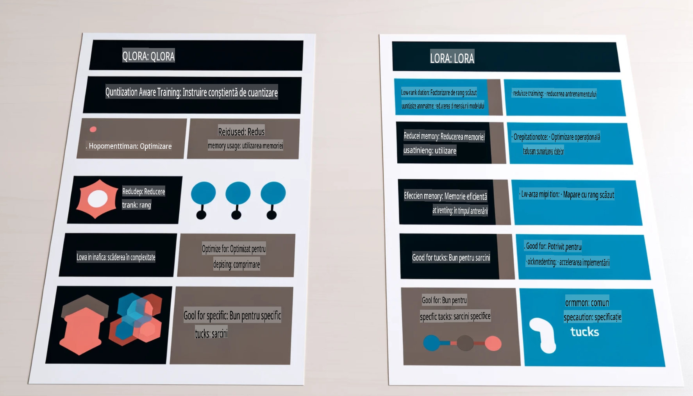

# **Transformați Phi-3 într-un expert în industrie**

Pentru a integra modelul Phi-3 într-o industrie, este necesar să adăugați date de afaceri specifice industriei la modelul Phi-3. Avem două opțiuni diferite: prima este RAG (Generare Augmentată prin Recuperare), iar a doua este Fine Tuning.

## **RAG vs Fine-Tuning**

### **Generare Augmentată prin Recuperare (RAG)**

RAG combină recuperarea datelor cu generarea de text. Datele structurate și nestructurate ale unei companii sunt stocate într-o bază de date vectorială. Când se caută conținut relevant, se găsesc rezumate și conținut relevante pentru a forma un context, iar apoi se combină cu capacitatea de completare a textului a LLM/SLM pentru a genera conținut.

### **Fine-tuning**

Fine-tuning presupune îmbunătățirea unui model existent. Nu este necesar să se înceapă cu algoritmul modelului, dar este nevoie de acumularea continuă a datelor. Dacă doriți o terminologie mai precisă și o exprimare lingvistică mai specifică pentru aplicațiile din industrie, fine-tuning este alegerea mai potrivită. Totuși, dacă datele dumneavoastră se schimbă frecvent, fine-tuning poate deveni complicat.

### **Cum să alegeți**

1. Dacă răspunsul nostru necesită introducerea de date externe, RAG este cea mai bună alegere.

2. Dacă aveți nevoie să generați cunoștințe stabile și precise dintr-o industrie, fine-tuning va fi o alegere bună. RAG prioritizează extragerea conținutului relevant, dar s-ar putea să nu surprindă întotdeauna nuanțele specializate.

3. Fine-tuning necesită un set de date de înaltă calitate, iar dacă este vorba doar despre un volum mic de date, nu va aduce o diferență semnificativă. RAG este mai flexibil.

4. Fine-tuning este un proces opac, aproape o metafizică, fiind dificil de înțeles mecanismul intern. În schimb, RAG face mai ușoară identificarea sursei datelor, permițând ajustarea eficientă a erorilor sau halucinațiilor și oferind o mai bună transparență.

### **Scenarii**

1. Industriile verticale care necesită vocabular și expresii profesionale specifice: ***Fine-tuning*** este cea mai bună alegere.

2. Sistemele de întrebări și răspunsuri, care implică sintetizarea mai multor puncte de cunoștințe: ***RAG*** este cea mai bună alegere.

3. Combinația fluxurilor de afaceri automatizate: ***RAG + Fine-tuning*** este cea mai bună alegere.

## **Cum să folosiți RAG**

O bază de date vectorială este o colecție de date stocate sub formă matematică. Bazele de date vectoriale fac mai ușor pentru modelele de învățare automată să-și amintească intrările anterioare, permițând utilizarea învățării automate pentru cazuri de utilizare precum căutarea, recomandările și generarea de text. Datele pot fi identificate pe baza metricilor de similaritate, mai degrabă decât a potrivirilor exacte, permițând modelelor computerizate să înțeleagă contextul datelor.

Baza de date vectorială este cheia realizării RAG. Putem converti datele în stocare vectorială prin intermediul modelelor vectoriale precum text-embedding-3, jina-ai-embedding etc.

Aflați mai multe despre crearea unei aplicații RAG [https://github.com/microsoft/Phi-3CookBook](https://github.com/microsoft/Phi-3CookBook?WT.mc_id=aiml-138114-kinfeylo)

## **Cum să folosiți Fine-tuning**

Algoritmii utilizați frecvent în Fine-tuning sunt Lora și QLora. Cum să alegeți?
- [Aflați mai multe cu acest notebook exemplu](../../../../code/04.Finetuning/Phi_3_Inference_Finetuning.ipynb)
- [Exemplu de script Python pentru Fine-Tuning](../../../../code/04.Finetuning/FineTrainingScript.py)

### **Lora și QLora**

LoRA (Low-Rank Adaptation) și QLoRA (Quantized Low-Rank Adaptation) sunt tehnici utilizate pentru a ajusta modelele mari de limbaj (LLMs) prin intermediul Fine Tuning Eficient din punct de vedere al parametrilor (PEFT). Tehnicile PEFT sunt concepute pentru a antrena modelele mai eficient decât metodele tradiționale.  
LoRA este o tehnică de fine-tuning autonomă care reduce amprenta memoriei prin aplicarea unei aproximări de rang redus la matricea de actualizare a greutății. Oferă timpi rapizi de antrenare și menține performanțe apropiate de metodele tradiționale de fine-tuning.

QLoRA este o versiune extinsă a LoRA care încorporează tehnici de cuantizare pentru a reduce și mai mult utilizarea memoriei. QLoRA cuantizează precizia parametrilor greutății din LLM-ul pre-antrenat la o precizie de 4 biți, ceea ce este mai eficient din punct de vedere al memoriei decât LoRA. Totuși, antrenarea cu QLoRA este cu aproximativ 30% mai lentă decât antrenarea cu LoRA, din cauza pașilor suplimentari de cuantizare și de-cuantizare.

QLoRA utilizează LoRA ca accesoriu pentru a corecta erorile introduse în timpul procesului de cuantizare. QLoRA permite ajustarea fină a modelelor masive cu miliarde de parametri pe GPU-uri relativ mici și disponibile. De exemplu, QLoRA poate ajusta fin un model cu 70 de miliarde de parametri care necesită 36 de GPU-uri folosind doar 2.

**Declinare responsabilitate**:  
Acest document a fost tradus folosind servicii de traducere automate bazate pe inteligență artificială. Deși ne străduim să asigurăm acuratețea, vă rugăm să rețineți că traducerile automate pot conține erori sau inexactități. Documentul original, în limba sa nativă, trebuie considerat sursa autoritară. Pentru informații critice, se recomandă traducerea profesională realizată de un specialist. Nu ne asumăm răspunderea pentru neînțelegeri sau interpretări greșite care pot apărea din utilizarea acestei traduceri.