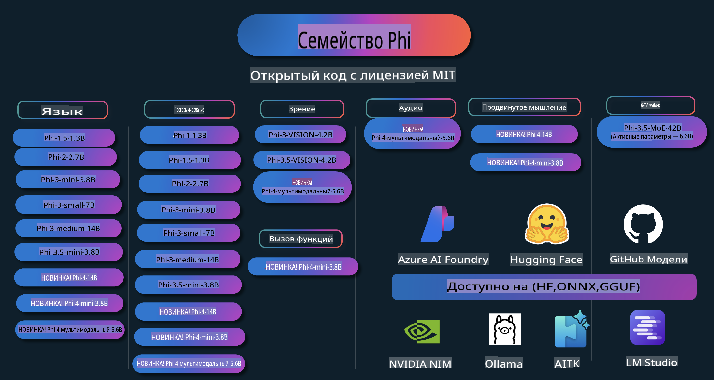

# Phi Cookbook: Практическое руководство по моделям Phi от Microsoft

  

  
  
  
  

  
  
  

  

Phi — это серия моделей искусственного интеллекта с открытым исходным кодом, разработанных Microsoft.  

Phi на данный момент является самой мощной и экономически эффективной малой языковой моделью (SLM), показывающей отличные результаты в задачах, связанных с многоязычностью, рассуждением, генерацией текста/чата, программированием, изображениями, аудио и другими сценариями.  

Вы можете развернуть Phi в облаке или на устройствах периферии, а также легко создавать приложения генеративного ИИ с ограниченными вычислительными ресурсами.  

Следуйте этим шагам, чтобы начать использовать эти ресурсы:  
1. **Сделайте форк репозитория**: Нажмите   
2. **Клонируйте репозиторий**:   `git clone https://github.com/microsoft/PhiCookBook.git`  
3. [**Присоединяйтесь к сообществу Microsoft AI в Discord и общайтесь с экспертами и разработчиками**](https://discord.com/invite/ByRwuEEgH4?WT.mc_id=aiml-137032-kinfeylo)  

  

## Содержание

- Введение  
  - [Добро пожаловать в семейство Phi](./md/01.Introduction/01/01.PhiFamily.md)  
  - [Настройка вашей среды](./md/01.Introduction/01/01.EnvironmentSetup.md)  
  - [Понимание ключевых технологий](./md/01.Introduction/01/01.Understandingtech.md)  
  - [Безопасность ИИ для моделей Phi](./md/01.Introduction/01/01.AISafety.md)  
  - [Поддержка оборудования для Phi](./md/01.Introduction/01/01.Hardwaresupport.md)  
  - [Модели Phi и их доступность на разных платформах](./md/01.Introduction/01/01.Edgeandcloud.md)  
  - [Использование Guidance-ai и Phi](./md/01.Introduction/01/01.Guidance.md)  
  - [Модели на GitHub Marketplace](https://github.com/marketplace/models)  
  - [Каталог моделей Azure AI](https://ai.azure.com)  

- Инференс Phi в различных средах  
    -  [Hugging Face](./md/01.Introduction/02/01.HF.md)  
    -  [Модели GitHub](./md/01.Introduction/02/02.GitHubModel.md)  
    -  [Каталог моделей Azure AI Foundry](./md/01.Introduction/02/03.AzureAIFoundry.md)  
    -  [Ollama](./md/01.Introduction/02/04.Ollama.md)  
    -  [AI Toolkit VSCode (AITK)](./md/01.Introduction/02/05.AITK.md)  
    -  [NVIDIA NIM](./md/01.Introduction/02/06.NVIDIA.md)  

- Инференс семейства Phi  
    - [Инференс Phi на iOS](./md/01.Introduction/03/iOS_Inference.md)  
    - [Инференс Phi на Android](./md/01.Introduction/03/Android_Inference.md)  
- [Inference Phi на Jetson](./md/01.Introduction/03/Jetson_Inference.md)  
    - [Inference Phi на AI PC](./md/01.Introduction/03/AIPC_Inference.md)  
    - [Inference Phi с использованием Apple MLX Framework](./md/01.Introduction/03/MLX_Inference.md)  
    - [Inference Phi на локальном сервере](./md/01.Introduction/03/Local_Server_Inference.md)  
    - [Inference Phi на удаленном сервере с использованием AI Toolkit](./md/01.Introduction/03/Remote_Interence.md)  
    - [Inference Phi с использованием Rust](./md/01.Introduction/03/Rust_Inference.md)  
    - [Inference Phi--Vision локально](./md/01.Introduction/03/Vision_Inference.md)  
    - [Inference Phi с Kaito AKS, Azure Containers (официальная поддержка)](./md/01.Introduction/03/Kaito_Inference.md)  

- [Квантование семейства Phi](./md/01.Introduction/04/QuantifyingPhi.md)  
    - [Квантование Phi-3.5 / 4 с использованием llama.cpp](./md/01.Introduction/04/UsingLlamacppQuantifyingPhi.md)  
    - [Квантование Phi-3.5 / 4 с использованием Generative AI расширений для onnxruntime](./md/01.Introduction/04/UsingORTGenAIQuantifyingPhi.md)  
    - [Квантование Phi-3.5 / 4 с использованием Intel OpenVINO](./md/01.Introduction/04/UsingIntelOpenVINOQuantifyingPhi.md)  
    - [Квантование Phi-3.5 / 4 с использованием Apple MLX Framework](./md/01.Introduction/04/UsingAppleMLXQuantifyingPhi.md)  

- Оценка Phi  
    - [Ответственный ИИ](./md/01.Introduction/05/ResponsibleAI.md)  
    - [Azure AI Foundry для оценки](./md/01.Introduction/05/AIFoundry.md)  
    - [Использование Promptflow для оценки](./md/01.Introduction/05/Promptflow.md)  

- RAG с Azure AI Search  
    - [Как использовать Phi-4-mini и Phi-4-multimodal (RAG) с Azure AI Search](https://github.com/microsoft/PhiCookBook/blob/main/code/06.E2E/E2E_Phi-4-RAG-Azure-AI-Search.ipynb)  

- Примеры разработки приложений с Phi  
  - Текстовые и чат-приложения  
    - Примеры Phi-4 🆕  
      - [📓] [Чат с моделью Phi-4-mini ONNX](./md/02.Application/01.TextAndChat/Phi4/ChatWithPhi4ONNX/README.md)  
      - [Чат с локальной моделью Phi-4 ONNX в .NET](../../md/04.HOL/dotnet/src/LabsPhi4-Chat-01OnnxRuntime)  
      - [Чат-консольное приложение .NET с Phi-4 ONNX, используя Semantic Kernel](../../md/04.HOL/dotnet/src/LabsPhi4-Chat-02SK)  
    - Примеры Phi-3 / 3.5  
      - [Локальный чат-бот в браузере с использованием Phi3, ONNX Runtime Web и WebGPU](https://github.com/microsoft/onnxruntime-inference-examples/tree/main/js/chat)  
      - [Чат с использованием OpenVino](./md/02.Application/01.TextAndChat/Phi3/E2E_OpenVino_Chat.md)  
      - [Мультимодельный - интерактивный Phi-3-mini и OpenAI Whisper](./md/02.Application/01.TextAndChat/Phi3/E2E_Phi-3-mini_with_whisper.md)  
      - [MLFlow - создание оболочки и использование Phi-3 с MLFlow](./md//02.Application/01.TextAndChat/Phi3/E2E_Phi-3-MLflow.md)  
      - [Оптимизация модели - как оптимизировать модель Phi-3-min для ONNX Runtime Web с помощью Olive](https://github.com/microsoft/Olive/tree/main/examples/phi3)  
      - [Приложение WinUI3 с Phi-3 mini-4k-instruct-onnx](https://github.com/microsoft/Phi3-Chat-WinUI3-Sample/)  
      - [Пример приложения заметок на базе ИИ для WinUI3 с мультимодельной поддержкой](https://github.com/microsoft/ai-powered-notes-winui3-sample)  
      - [Тонкая настройка и интеграция кастомных моделей Phi-3 с Prompt flow](./md/02.Application/01.TextAndChat/Phi3/E2E_Phi-3-FineTuning_PromptFlow_Integration.md)  
      - [Тонкая настройка и интеграция кастомных моделей Phi-3 с Prompt flow в Azure AI Foundry](./md/02.Application/01.TextAndChat/Phi3/E2E_Phi-3-FineTuning_PromptFlow_Integration_AIFoundry.md)  
      - [Оценка тонко настроенной модели Phi-3 / Phi-3.5 в Azure AI Foundry с акцентом на принципы ответственного ИИ от Microsoft](./md/02.Application/01.TextAndChat/Phi3/E2E_Phi-3-Evaluation_AIFoundry.md)  
- [📓] [Пример языкового предсказания Phi-3.5-mini-instruct (Китайский/Английский)](../../md/02.Application/01.TextAndChat/Phi3/phi3-instruct-demo.ipynb)
      - [Чат-бот RAG на основе Phi-3.5-Instruct с использованием WebGPU](./md/02.Application/01.TextAndChat/Phi3/WebGPUWithPhi35Readme.md)
      - [Использование GPU Windows для создания решения Prompt flow с Phi-3.5-Instruct ONNX](./md/02.Application/01.TextAndChat/Phi3/UsingPromptFlowWithONNX.md)
      - [Создание Android-приложения с использованием Microsoft Phi-3.5 tflite](./md/02.Application/01.TextAndChat/Phi3/UsingPhi35TFLiteCreateAndroidApp.md)
      - [Пример вопросов и ответов на .NET с использованием локальной модели ONNX Phi-3 через Microsoft.ML.OnnxRuntime](../../md/04.HOL/dotnet/src/LabsPhi301)
      - [Консольное чат-приложение на .NET с Semantic Kernel и Phi-3](../../md/04.HOL/dotnet/src/LabsPhi302)

  - Примеры на основе SDK Azure AI Inference 
    - Примеры Phi-4 🆕
      - [📓] [Генерация кода проекта с использованием Phi-4-multimodal](./md/02.Application/02.Code/Phi4/GenProjectCode/README.md)
    - Примеры Phi-3 / 3.5
      - [Создание собственного чат-бота GitHub Copilot для Visual Studio Code с помощью Microsoft Phi-3 Family](./md/02.Application/02.Code/Phi3/VSCodeExt/README.md)
      - [Создание агента Copilot Chat для Visual Studio Code с использованием Phi-3.5 и моделей GitHub](/md/02.Application/02.Code/Phi3/CreateVSCodeChatAgentWithGitHubModels.md)

  - Примеры для продвинутого анализа
    - Примеры Phi-4 🆕
      - [📓] [Примеры для продвинутого анализа Phi-4-mini](./md/02.Application/03.AdvancedReasoning/Phi4/AdvancedResoningPhi4mini/README.md)
  
  - Демонстрации
      - [Демонстрации Phi-4-mini, размещенные на Hugging Face Spaces](https://huggingface.co/spaces/microsoft/phi-4-mini?WT.mc_id=aiml-137032-kinfeylo)
      - [Демонстрации Phi-4-multimodal, размещенные на Hugging Face Spaces](https://huggingface.co/spaces/microsoft/phi-4-multimodal?WT.mc_id=aiml-137032-kinfeylo)
  - Примеры работы с изображениями
    - Примеры Phi-4 🆕
      - [📓] [Использование Phi-4-multimodal для чтения изображений и генерации кода](./md/02.Application/04.Vision/Phi4/CreateFrontend/README.md) 
    - Примеры Phi-3 / 3.5
      -  [📓][Phi-3-vision-Изображение текст в текст](../../md/02.Application/04.Vision/Phi3/E2E_Phi-3-vision-image-text-to-text-online-endpoint.ipynb)
      - [Phi-3-vision-ONNX](https://onnxruntime.ai/docs/genai/tutorials/phi3-v.html)
      - [📓][Phi-3-vision Встраивание CLIP](../../md/02.Application/04.Vision/Phi3/E2E_Phi-3-vision-image-text-to-text-online-endpoint.ipynb)
      - [ДЕМОНСТРАЦИЯ: Phi-3 Переработка](https://github.com/jennifermarsman/PhiRecycling/)
      - [Phi-3-vision - Визуальный языковой помощник - с Phi3-Vision и OpenVINO](https://docs.openvino.ai/nightly/notebooks/phi-3-vision-with-output.html)
      - [Phi-3 Vision Nvidia NIM](./md/02.Application/04.Vision/Phi3/E2E_Nvidia_NIM_Vision.md)
      - [Phi-3 Vision OpenVino](./md/02.Application/04.Vision/Phi3/E2E_OpenVino_Phi3Vision.md)
      - [📓][Phi-3.5 Vision пример с несколькими кадрами или изображениями](../../md/02.Application/04.Vision/Phi3/phi3-vision-demo.ipynb)
      - [Phi-3 Vision локальная модель ONNX с использованием Microsoft.ML.OnnxRuntime .NET](../../md/04.HOL/dotnet/src/LabsPhi303)
      - [Модель Phi-3 Vision ONNX с меню на базе Microsoft.ML.OnnxRuntime .NET](../../md/04.HOL/dotnet/src/LabsPhi304)

  - Примеры работы с аудио
    - Примеры Phi-4 🆕
      - [📓] [Извлечение транскриптов из аудио с использованием Phi-4-multimodal](./md/02.Application/05.Audio/Phi4/Transciption/README.md)
      - [📓] [Пример работы с аудио на Phi-4-multimodal](../../md/02.Application/05.Audio/Phi4/Siri/demo.ipynb)
      - [📓] [Пример перевода речи с использованием Phi-4-multimodal](../../md/02.Application/05.Audio/Phi4/Translate/demo.ipynb)
      - [Консольное приложение на .NET с использованием Phi-4-multimodal для анализа аудиофайла и создания транскрипта](../../md/04.HOL/dotnet/src/LabsPhi4-MultiModal-02Audio)

  - Примеры MOE
    - Примеры Phi-3 / 3.5
      - [📓] [Phi-3.5 Модели смеси экспертов (MoEs) Пример для социальных сетей](../../md/02.Application/06.MoE/Phi3/phi3_moe_demo.ipynb)
      - [📓] [Создание конвейера генерации с использованием поиска Azure AI, NVIDIA NIM Phi-3 MOE и LlamaIndex](../../md/02.Application/06.MoE/Phi3/azure-ai-search-nvidia-rag.ipynb)
  - Примеры вызова функций
    - Примеры Phi-4 🆕
      -  [📓] [Использование вызова функций с Phi-4-mini](./md/02.Application/07.FunctionCalling/Phi4/FunctionCallingBasic/README.md)
  - Примеры смешивания мультимодальных данных
    - Примеры Phi-4 🆕
- [📓] [Использование Phi-4-multimodal в качестве технологического журналиста](../../md/02.Application/08.Multimodel/Phi4/TechJournalist/phi_4_mm_audio_text_publish_news.ipynb)
      - [.NET консольное приложение с использованием Phi-4-multimodal для анализа изображений](../../md/04.HOL/dotnet/src/LabsPhi4-MultiModal-01Images)

- Тонкая настройка образцов Phi
  - [Сценарии тонкой настройки](./md/03.FineTuning/FineTuning_Scenarios.md)
  - [Тонкая настройка vs RAG](./md/03.FineTuning/FineTuning_vs_RAG.md)
  - [Тонкая настройка: Пусть Phi-3 станет экспертом в индустрии](./md/03.FineTuning/LetPhi3gotoIndustriy.md)
  - [Тонкая настройка Phi-3 с помощью AI Toolkit для VS Code](./md/03.FineTuning/Finetuning_VSCodeaitoolkit.md)
  - [Тонкая настройка Phi-3 с использованием Azure Machine Learning Service](./md/03.FineTuning/Introduce_AzureML.md)
  - [Тонкая настройка Phi-3 с использованием Lora](./md/03.FineTuning/FineTuning_Lora.md)
  - [Тонкая настройка Phi-3 с использованием QLora](./md/03.FineTuning/FineTuning_Qlora.md)
  - [Тонкая настройка Phi-3 с использованием Azure AI Foundry](./md/03.FineTuning/FineTuning_AIFoundry.md)
  - [Тонкая настройка Phi-3 с использованием Azure ML CLI/SDK](./md/03.FineTuning/FineTuning_MLSDK.md)
  - [Тонкая настройка с помощью Microsoft Olive](./md/03.FineTuning/FineTuning_MicrosoftOlive.md)
  - [Практическая лаборатория по тонкой настройке с Microsoft Olive](./md/03.FineTuning/olive-lab/readme.md)
  - [Тонкая настройка Phi-3-vision с использованием Weights and Bias](./md/03.FineTuning/FineTuning_Phi-3-visionWandB.md)
  - [Тонкая настройка Phi-3 с использованием Apple MLX Framework](./md/03.FineTuning/FineTuning_MLX.md)
  - [Тонкая настройка Phi-3-vision (официальная поддержка)](./md/03.FineTuning/FineTuning_Vision.md)
  - [Тонкая настройка Phi-3 с Kaito AKS, Azure Containers (официальная поддержка)](./md/03.FineTuning/FineTuning_Kaito.md)
  - [Тонкая настройка Phi-3 и 3.5 Vision](https://github.com/2U1/Phi3-Vision-Finetune)

- Практические лаборатории
  - [Изучение передовых моделей: LLMs, SLMs, локальная разработка и многое другое](https://github.com/microsoft/aitour-exploring-cutting-edge-models)
  - [Раскрытие потенциала NLP: тонкая настройка с Microsoft Olive](https://github.com/azure/Ignite_FineTuning_workshop)

- Научные статьи и публикации
  - [Textbooks Are All You Need II: технический отчет phi-1.5](https://arxiv.org/abs/2309.05463)
  - [Технический отчет Phi-3: высокопроизводительная языковая модель для локального использования на вашем телефоне](https://arxiv.org/abs/2404.14219)
  - [Технический отчет Phi-4](https://arxiv.org/abs/2412.08905)
  - [Оптимизация малых языковых моделей для вызова функций в автомобиле](https://arxiv.org/abs/2501.02342)
  - [(WhyPHI) Тонкая настройка PHI-3 для ответов на вопросы с несколькими вариантами: методология, результаты и вызовы](https://arxiv.org/abs/2501.01588)

## Использование моделей Phi

### Phi на Azure AI Foundry

Вы можете узнать, как использовать Microsoft Phi и как строить сквозные решения для различных аппаратных устройств. Чтобы попробовать Phi самостоятельно, начните с тестирования моделей и настройки Phi для ваших сценариев с помощью [каталога моделей Azure AI Foundry](https://aka.ms/phi3-azure-ai). Подробнее читайте в разделе [Начало работы с Azure AI Foundry](/md/02.QuickStart/AzureAIFoundry_QuickStart.md).

**Песочница**
Каждая модель имеет свою собственную песочницу для тестирования: [Azure AI Playground](https://aka.ms/try-phi3).

### Phi на GitHub Models

Вы можете узнать, как использовать Microsoft Phi и как строить сквозные решения для различных аппаратных устройств. Чтобы попробовать Phi самостоятельно, начните с тестирования модели и настройки Phi для ваших сценариев с помощью [каталога моделей GitHub](https://github.com/marketplace/models?WT.mc_id=aiml-137032-kinfeylo). Подробнее читайте в разделе [Начало работы с каталогом моделей GitHub](/md/02.QuickStart/GitHubModel_QuickStart.md).

**Песочница**
Каждая модель имеет отдельную [песочницу для тестирования модели](/md/02.QuickStart/GitHubModel_QuickStart.md).

### Phi на Hugging Face

Вы также можете найти модель на [Hugging Face](https://huggingface.co/microsoft)

**Песочница**  
[Hugging Chat playground](https://huggingface.co/chat/models/microsoft/Phi-3-mini-4k-instruct)

## Ответственный подход к ИИ

Microsoft стремится помогать нашим клиентам использовать продукты ИИ ответственно, делиться нашими знаниями и выстраивать партнерские отношения, основанные на доверии, с помощью таких инструментов, как Прозрачные заметки и Оценка воздействия. Многие из этих ресурсов доступны по адресу [https://aka.ms/RAI](https://aka.ms/RAI).  
Подход Microsoft к ответственному ИИ основан на наших принципах ИИ: справедливость, надежность и безопасность, конфиденциальность и защита, инклюзивность, прозрачность и подотчетность.

Модели естественного языка, изображения и речи большого масштаба, подобные тем, что используются в этом примере, потенциально могут вести себя несправедливо, ненадежно или оскорбительно, что, в свою очередь, может причинить вред. Ознакомьтесь с [Прозрачной заметкой об Azure OpenAI Service](https://learn.microsoft.com/legal/cognitive-services/openai/transparency-note?tabs=text), чтобы узнать о рисках и ограничениях.

Рекомендуемый подход к снижению этих рисков — включить систему безопасности в вашу архитектуру, которая сможет обнаруживать и предотвращать вредоносное поведение. [Azure AI Content Safety](https://learn.microsoft.com/azure/ai-services/content-safety/overview) предоставляет независимый уровень защиты, способный обнаруживать вредоносный контент, созданный пользователями или ИИ, в приложениях и сервисах. Azure AI Content Safety включает текстовые и визуальные API, которые позволяют обнаруживать вредоносный материал. В рамках Azure AI Foundry служба Content Safety позволяет просматривать, изучать и тестировать примерный код для обнаружения вредоносного контента в различных модальностях. Следующая [документация для быстрого старта](https://learn.microsoft.com/azure/ai-services/content-safety/quickstart-text?tabs=visual-studio%2Clinux&pivots=programming-language-rest) проведет вас через процесс создания запросов к сервису.

Еще один аспект, который следует учитывать, — это общая производительность приложения. В многофункциональных и многомодельных приложениях производительность означает, что система работает так, как вы и ваши пользователи ожидаете, включая предотвращение генерации вредоносного контента. Важно оценивать производительность вашего приложения в целом с использованием [оценщиков производительности и качества, а также рисков и безопасности](https://learn.microsoft.com/azure/ai-studio/concepts/evaluation-metrics-built-in). У вас также есть возможность создавать и использовать [кастомные оценщики](https://learn.microsoft.com/azure/ai-studio/how-to/develop/evaluate-sdk#custom-evaluators).

Вы можете оценить свое ИИ-приложение в вашей среде разработки с помощью [Azure AI Evaluation SDK](https://microsoft.github.io/promptflow/index.html). Используя либо тестовый набор данных, либо целевой показатель, ваши генерации в приложении на основе генеративного ИИ количественно измеряются с помощью встроенных или кастомных оценщиков по вашему выбору. Чтобы начать работу с Azure AI Evaluation SDK для оценки вашей системы, вы можете следовать [руководству по быстрому старту](https://learn.microsoft.com/azure/ai-studio/how-to/develop/flow-evaluate-sdk). После выполнения оценки вы можете [визуализировать результаты в Azure AI Foundry](https://learn.microsoft.com/azure/ai-studio/how-to/evaluate-flow-results).

## Торговые марки

Этот проект может содержать торговые марки или логотипы для проектов, продуктов или услуг. Авторизованное использование торговых марок или логотипов Microsoft должно соответствовать и подчиняться [Руководству по использованию торговых марок и брендов Microsoft](https://www.microsoft.com/legal/intellectualproperty/trademarks/usage/general).  
Использование торговых марок или логотипов Microsoft в измененных версиях этого проекта не должно вызывать путаницу или подразумевать спонсорство со стороны Microsoft. Любое использование торговых марок или логотипов третьих сторон должно соответствовать политике этих третьих сторон.

**Отказ от ответственности**:  
Этот документ был переведен с использованием автоматизированных AI-сервисов перевода. Хотя мы стремимся к точности, имейте в виду, что автоматические переводы могут содержать ошибки или неточности. Оригинальный документ на его родном языке следует считать авторитетным источником. Для получения критически важной информации рекомендуется обратиться к профессиональному переводу, выполненному человеком. Мы не несем ответственности за любые недоразумения или неверные интерпретации, возникшие в результате использования данного перевода.