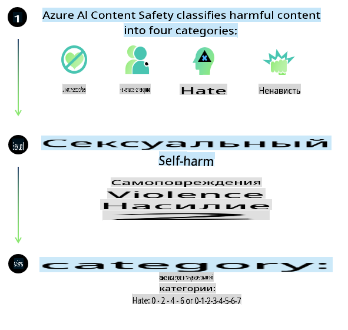
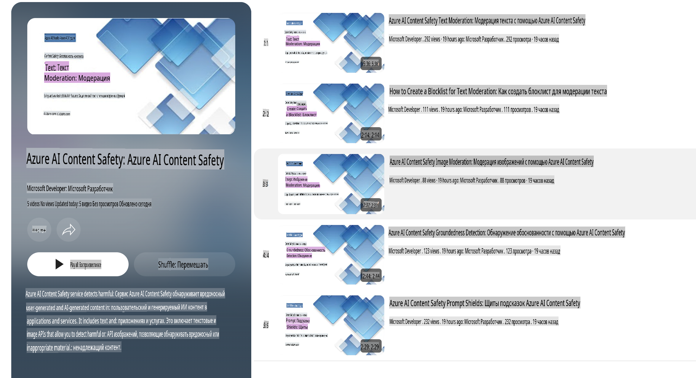

# Безопасность ИИ для моделей Phi

Семейство моделей Phi было разработано в соответствии с [Стандартом ответственного ИИ Microsoft](https://query.prod.cms.rt.microsoft.com/cms/api/am/binary/RE5cmFl), который представляет собой набор требований, основанный на следующих шести принципах: ответственность, прозрачность, справедливость, надежность и безопасность, конфиденциальность и инклюзивность, составляющих [Принципы ответственного ИИ Microsoft](https://www.microsoft.com/ai/responsible-ai).

Как и в случае с предыдущими моделями Phi, был применен многоаспектный подход к оценке безопасности и пост-тренировке с учетом дополнительных мер для поддержки многоязычных возможностей этого релиза. Наш подход к обучению и оценке безопасности, включая тестирование на разных языках и в различных категориях рисков, изложен в [Документе о пост-тренировке безопасности Phi](https://arxiv.org/abs/2407.13833). Несмотря на то, что модели Phi выигрывают от этого подхода, разработчикам следует применять лучшие практики ответственного ИИ, включая картирование, измерение и снижение рисков, связанных с их конкретным случаем использования и культурным или языковым контекстом.

## Лучшие практики

Как и другие модели, семейство Phi может демонстрировать поведение, которое может быть несправедливым, ненадежным или оскорбительным.

Некоторые ограничивающие особенности SLM и LLM, на которые стоит обратить внимание:

- **Качество обслуживания:** Модели Phi в основном обучены на текстах на английском языке. Для языков, отличных от английского, производительность может быть ниже. Варианты английского языка с меньшим представлением в обучающих данных могут демонстрировать худшую производительность по сравнению со стандартным американским английским.
- **Представление ущерба и усиление стереотипов:** Эти модели могут чрезмерно или недостаточно представлять определенные группы людей, игнорировать представление некоторых групп или усиливать уничижительные или негативные стереотипы. Несмотря на пост-тренировку безопасности, эти ограничения могут сохраняться из-за различий в уровне представления разных групп или наличия примеров негативных стереотипов в обучающих данных, которые отражают реальные социальные и культурные предубеждения.
- **Неподходящий или оскорбительный контент:** Эти модели могут генерировать другие виды неподходящего или оскорбительного контента, что может сделать их неподходящими для использования в чувствительных контекстах без дополнительных мер, специфичных для конкретного случая использования.
- **Надежность информации:** Языковые модели могут создавать бессмысленный контент или фабриковать информацию, которая может звучать правдоподобно, но на самом деле является неточной или устаревшей.
- **Ограниченная область применения кода:** Основная часть обучающих данных Phi-3 основана на Python и использует общие пакеты, такие как "typing, math, random, collections, datetime, itertools". Если модель генерирует Python-скрипты с использованием других пакетов или скрипты на других языках, мы настоятельно рекомендуем вручную проверять все вызовы API.

Разработчики должны применять лучшие практики ответственного ИИ и несут ответственность за обеспечение соответствия конкретного случая использования действующим законам и нормативным актам (например, в области конфиденциальности, торговли и т.д.).

## Соображения по ответственному ИИ

Как и другие языковые модели, модели серии Phi могут демонстрировать поведение, которое может быть несправедливым, ненадежным или оскорбительным. Некоторые из ограничивающих факторов, на которые следует обратить внимание:

**Качество обслуживания:** Модели Phi в основном обучены на текстах на английском языке. Для языков, отличных от английского, производительность может быть ниже. Варианты английского языка с меньшим представлением в обучающих данных могут демонстрировать худшую производительность по сравнению со стандартным американским английским.

**Представление ущерба и усиление стереотипов:** Эти модели могут чрезмерно или недостаточно представлять определенные группы людей, игнорировать представление некоторых групп или усиливать уничижительные или негативные стереотипы. Несмотря на пост-тренировку безопасности, эти ограничения могут сохраняться из-за различий в уровне представления разных групп или наличия примеров негативных стереотипов в обучающих данных, которые отражают реальные социальные и культурные предубеждения.

**Неподходящий или оскорбительный контент:** Эти модели могут генерировать другие виды неподходящего или оскорбительного контента, что может сделать их неподходящими для использования в чувствительных контекстах без дополнительных мер, специфичных для конкретного случая использования.

**Надежность информации:** Языковые модели могут создавать бессмысленный контент или фабриковать информацию, которая может звучать правдоподобно, но на самом деле является неточной или устаревшей.

**Ограниченная область применения кода:** Основная часть обучающих данных Phi-3 основана на Python и использует общие пакеты, такие как "typing, math, random, collections, datetime, itertools". Если модель генерирует Python-скрипты с использованием других пакетов или скрипты на других языках, мы настоятельно рекомендуем вручную проверять все вызовы API.

Разработчики должны применять лучшие практики ответственного ИИ и несут ответственность за обеспечение соответствия конкретного случая использования действующим законам и нормативным актам (например, в области конфиденциальности, торговли и т.д.). Важные области для рассмотрения включают:

**Распределение:** Модели могут быть не подходящими для сценариев, которые могут существенно повлиять на правовой статус, распределение ресурсов или жизненные возможности (например, жилье, трудоустройство, кредит и т.д.) без дополнительных оценок и методов устранения предвзятости.

**Сценарии высокого риска:** Разработчики должны оценить пригодность использования моделей в сценариях высокого риска, где несправедливые, ненадежные или оскорбительные результаты могут быть крайне затратными или причинить вред. Это включает предоставление советов в чувствительных или экспертных областях, где точность и надежность критически важны (например, юридические или медицинские консультации). Дополнительные меры безопасности должны быть реализованы на уровне приложения в зависимости от контекста развертывания.

**Дезинформация:** Модели могут генерировать неточную информацию. Разработчики должны следовать лучшим практикам прозрачности и информировать конечных пользователей о том, что они взаимодействуют с системой ИИ. На уровне приложения разработчики могут создавать механизмы обратной связи и конвейеры для обоснования ответов с использованием специфической для случая, контекстуальной информации, что известно как Retrieval Augmented Generation (RAG).

**Генерация вредоносного контента:** Разработчики должны оценивать результаты с учетом их контекста и использовать доступные классификаторы безопасности или индивидуальные решения, подходящие для их случая использования.

**Злоупотребления:** Другие формы злоупотреблений, такие как мошенничество, спам или создание вредоносного ПО, также возможны, и разработчики должны гарантировать, что их приложения не нарушают применимые законы и нормативные акты.

### Тонкая настройка и безопасность контента ИИ

После тонкой настройки модели мы настоятельно рекомендуем использовать меры [Azure AI Content Safety](https://learn.microsoft.com/azure/ai-services/content-safety/overview) для мониторинга генерируемого контента, выявления и блокировки потенциальных рисков, угроз и проблем с качеством.

[Azure AI Content Safety](https://learn.microsoft.com/azure/ai-services/content-safety/overview) поддерживает как текстовый, так и визуальный контент. Он может быть развернут в облаке, в автономных контейнерах и на периферийных/встроенных устройствах.

## Обзор Azure AI Content Safety

Azure AI Content Safety не является универсальным решением; его можно настроить в соответствии с конкретными политиками бизнеса. Кроме того, его многоязычные модели позволяют понимать несколько языков одновременно.

- **Azure AI Content Safety**
- **Microsoft Developer**
- **5 видео**

Сервис Azure AI Content Safety обнаруживает вредоносный пользовательский и сгенерированный ИИ контент в приложениях и сервисах. Он включает API для работы с текстом и изображениями, которые позволяют выявлять вредоносный или неподходящий материал.

[Плейлист AI Content Safety](https://www.youtube.com/playlist?list=PLlrxD0HtieHjaQ9bJjyp1T7FeCbmVcPkQ)

**Отказ от ответственности**:  
Этот документ был переведен с использованием машинных сервисов автоматизированного перевода. Хотя мы стремимся к точности, обратите внимание, что автоматические переводы могут содержать ошибки или неточности. Оригинальный документ на его родном языке следует считать авторитетным источником. Для получения критически важной информации рекомендуется профессиональный перевод человеком. Мы не несем ответственности за любые недоразумения или неправильные интерпретации, возникающие в результате использования данного перевода.