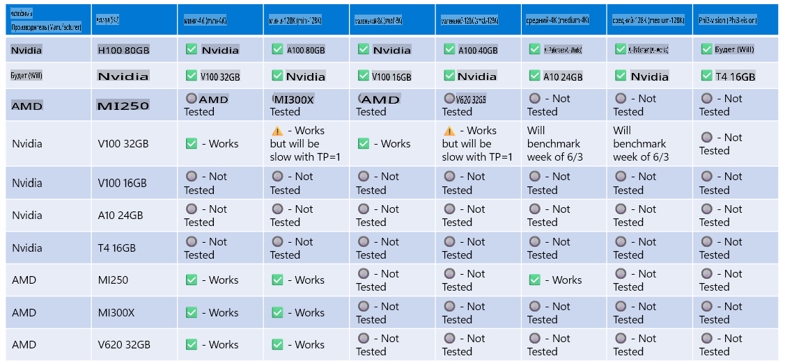

# Поддержка оборудования Phi

Microsoft Phi оптимизирован для ONNX Runtime и поддерживает Windows DirectML. Он хорошо работает на различных типах оборудования, включая GPU, CPU и даже мобильные устройства.

## Аппаратное обеспечение устройства
Поддерживаемое оборудование включает:

- GPU SKU: RTX 4090 (DirectML)
- GPU SKU: 1 A100 80GB (CUDA)
- CPU SKU: Standard F64s v2 (64 vCPU, 128 ГБ памяти)

## Мобильные устройства

- Android - Samsung Galaxy S21
- Apple iPhone 14 или выше с процессором A16/A17

## Спецификация оборудования Phi

- Минимальная необходимая конфигурация.
- Windows: GPU с поддержкой DirectX 12 и минимум 4 ГБ объединенной оперативной памяти

CUDA: NVIDIA GPU с Compute Capability >= 7.02



## Запуск onnxruntime на нескольких GPU

В настоящее время доступные модели Phi ONNX предназначены только для одного GPU. Возможна поддержка нескольких GPU для модели Phi, но ORT с двумя GPU не гарантирует более высокую пропускную способность по сравнению с двумя экземплярами ORT. Пожалуйста, ознакомьтесь с [ONNX Runtime](https://onnxruntime.ai/) для получения последних обновлений.

На [Build 2024 команда GenAI ONNX](https://youtu.be/WLW4SE8M9i8?si=EtG04UwDvcjunyfC) объявила, что они включили поддержку нескольких экземпляров вместо нескольких GPU для моделей Phi.

На данный момент это позволяет запускать одну onnxruntime или onnxruntime-genai с использованием переменной окружения CUDA_VISIBLE_DEVICES, например, так:

```Python
CUDA_VISIBLE_DEVICES=0 python infer.py
CUDA_VISIBLE_DEVICES=1 python infer.py
```

Не стесняйтесь изучать Phi дальше на [Azure AI Foundry](https://ai.azure.com)

**Отказ от ответственности**:  
Этот документ был переведен с использованием автоматизированных сервисов перевода на основе ИИ. Несмотря на наши усилия обеспечить точность, имейте в виду, что автоматические переводы могут содержать ошибки или неточности. Оригинальный документ на его родном языке следует считать авторитетным источником. Для получения критически важной информации рекомендуется профессиональный перевод человеком. Мы не несем ответственности за любые недоразумения или неправильные интерпретации, возникшие в результате использования данного перевода.