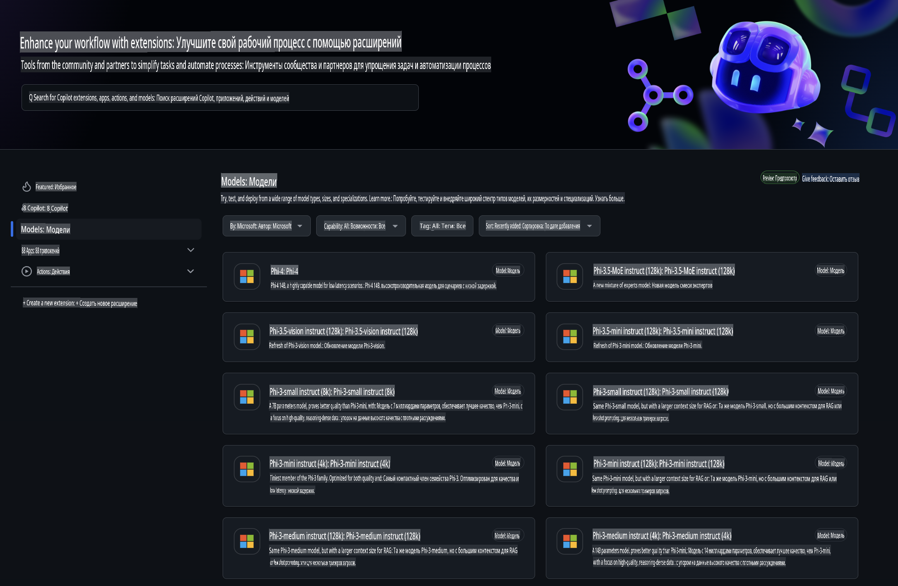
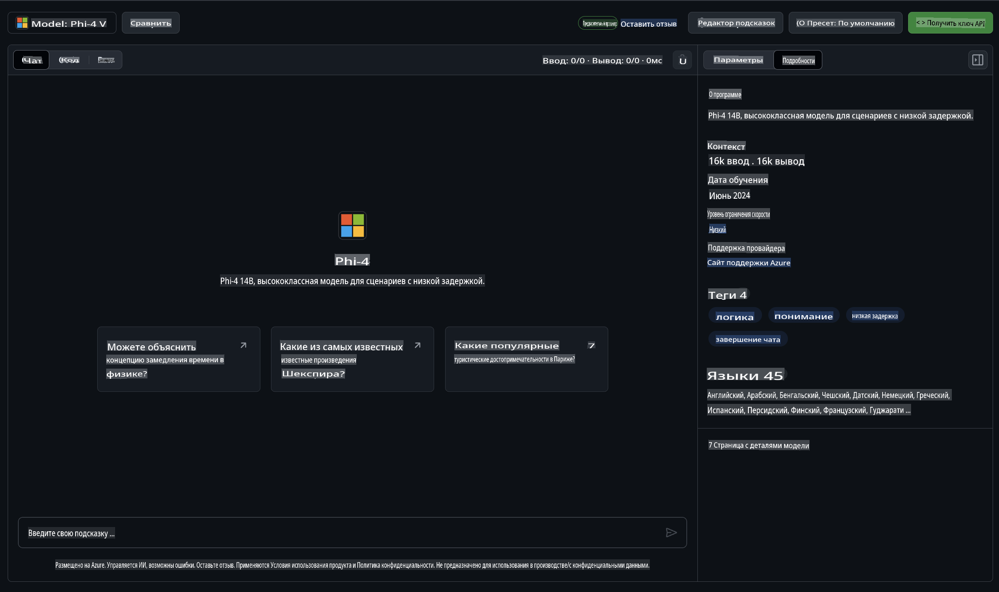
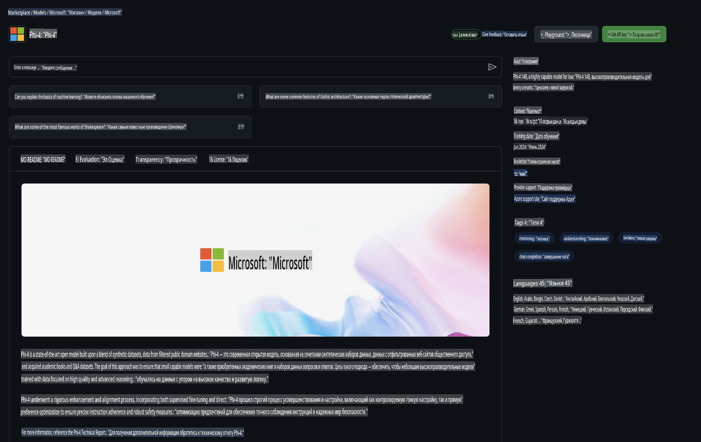

## Семейство Phi в GitHub Models

Добро пожаловать в [GitHub Models](https://github.com/marketplace/models)! Мы подготовили всё необходимое, чтобы вы могли исследовать AI-модели, размещенные на Azure AI.



Для получения дополнительной информации о доступных моделях на GitHub Models посетите [GitHub Model Marketplace](https://github.com/marketplace/models).

## Доступные модели

Каждая модель имеет свою собственную тестовую площадку и пример кода.



### Семейство Phi в каталоге GitHub Models

- [Phi-4](https://github.com/marketplace/models/azureml/Phi-4)

- [Phi-3.5-MoE instruct (128k)](https://github.com/marketplace/models/azureml/Phi-3-5-MoE-instruct)

- [Phi-3.5-vision instruct (128k)](https://github.com/marketplace/models/azureml/Phi-3-5-vision-instruct)

- [Phi-3.5-mini instruct (128k)](https://github.com/marketplace/models/azureml/Phi-3-5-mini-instruct)

- [Phi-3-Medium-128k-Instruct](https://github.com/marketplace/models/azureml/Phi-3-medium-128k-instruct)

- [Phi-3-medium-4k-instruct](https://github.com/marketplace/models/azureml/Phi-3-medium-4k-instruct)

- [Phi-3-mini-128k-instruct](https://github.com/marketplace/models/azureml/Phi-3-mini-128k-instruct)

- [Phi-3-mini-4k-instruct](https://github.com/marketplace/models/azureml/Phi-3-mini-4k-instruct)

- [Phi-3-small-128k-instruct](https://github.com/marketplace/models/azureml/Phi-3-small-128k-instruct)

- [Phi-3-small-8k-instruct](https://github.com/marketplace/models/azureml/Phi-3-small-8k-instruct)

## Начало работы

У нас есть несколько базовых примеров, которые готовы к запуску. Вы можете найти их в каталоге с примерами. Если вы хотите сразу перейти к вашему любимому языку программирования, примеры доступны на следующих языках:

- Python
- JavaScript
- C#
- Java
- cURL

Также доступна специальная среда Codespaces для запуска примеров и моделей.


## Пример кода

Ниже приведены фрагменты примеров кода для некоторых сценариев использования. Для получения дополнительной информации о Azure AI Inference SDK смотрите полную документацию и примеры.

## Настройка

1. Создайте персональный токен доступа.  
Токен не требует предоставления каких-либо разрешений. Обратите внимание, что токен будет отправлен в сервис Microsoft.

Чтобы использовать приведенные ниже фрагменты кода, создайте переменную окружения для установки токена в качестве ключа для клиентского кода.

Если вы используете bash:  
```
export GITHUB_TOKEN="<your-github-token-goes-here>"
```  
Если вы используете PowerShell:  

```
$Env:GITHUB_TOKEN="<your-github-token-goes-here>"
```  

Если вы используете командную строку Windows:  

```
set GITHUB_TOKEN=<your-github-token-goes-here>
```  

## Пример на Python

### Установка зависимостей
Установите Azure AI Inference SDK с помощью pip (Требуется: Python >=3.8):

```
pip install azure-ai-inference
```  

### Запуск базового примера кода

Этот пример демонстрирует базовый вызов API завершения чата. Он использует конечную точку GitHub AI model inference и ваш токен GitHub. Вызов является синхронным.

```python
import os
from azure.ai.inference import ChatCompletionsClient
from azure.ai.inference.models import SystemMessage, UserMessage
from azure.core.credentials import AzureKeyCredential

endpoint = "https://models.inference.ai.azure.com"
model_name = "Phi-4"
token = os.environ["GITHUB_TOKEN"]

client = ChatCompletionsClient(
    endpoint=endpoint,
    credential=AzureKeyCredential(token),
)

response = client.complete(
    messages=[
        UserMessage(content="I have $20,000 in my savings account, where I receive a 4% profit per year and payments twice a year. Can you please tell me how long it will take for me to become a millionaire? Also, can you please explain the math step by step as if you were explaining it to an uneducated person?"),
    ],
    temperature=0.4,
    top_p=1.0,
    max_tokens=2048,
    model=model_name
)

print(response.choices[0].message.content)
```  

### Запуск многопользовательского разговора

Этот пример демонстрирует многопользовательский разговор с API завершения чата. При использовании модели для чат-приложения вам нужно будет управлять историей этого разговора и отправлять последние сообщения модели.

```
import os
from azure.ai.inference import ChatCompletionsClient
from azure.ai.inference.models import AssistantMessage, SystemMessage, UserMessage
from azure.core.credentials import AzureKeyCredential

token = os.environ["GITHUB_TOKEN"]
endpoint = "https://models.inference.ai.azure.com"
# Replace Model_Name
model_name = "Phi-4"

client = ChatCompletionsClient(
    endpoint=endpoint,
    credential=AzureKeyCredential(token),
)

messages = [
    SystemMessage(content="You are a helpful assistant."),
    UserMessage(content="What is the capital of France?"),
    AssistantMessage(content="The capital of France is Paris."),
    UserMessage(content="What about Spain?"),
]

response = client.complete(messages=messages, model=model_name)

print(response.choices[0].message.content)
```  

### Потоковый вывод

Для улучшения пользовательского опыта вы можете настроить потоковый вывод ответа модели, чтобы первые токены отображались раньше, и избежать долгого ожидания ответа.

```
import os
from azure.ai.inference import ChatCompletionsClient
from azure.ai.inference.models import SystemMessage, UserMessage
from azure.core.credentials import AzureKeyCredential

token = os.environ["GITHUB_TOKEN"]
endpoint = "https://models.inference.ai.azure.com"
# Replace Model_Name
model_name = "Phi-4"

client = ChatCompletionsClient(
    endpoint=endpoint,
    credential=AzureKeyCredential(token),
)

response = client.complete(
    stream=True,
    messages=[
        SystemMessage(content="You are a helpful assistant."),
        UserMessage(content="Give me 5 good reasons why I should exercise every day."),
    ],
    model=model_name,
)

for update in response:
    if update.choices:
        print(update.choices[0].delta.content or "", end="")

client.close()
```  

## Бесплатное использование и ограничения скорости для GitHub Models



[Ограничения скорости для тестовой площадки и бесплатного использования API](https://docs.github.com/en/github-models/prototyping-with-ai-models#rate-limits) предназначены для того, чтобы вы могли экспериментировать с моделями и разрабатывать прототипы вашего AI-приложения. Для использования сверх этих ограничений и масштабирования вашего приложения необходимо выделить ресурсы из учетной записи Azure и пройти аутентификацию оттуда вместо использования вашего персонального токена GitHub. При этом вам не потребуется вносить изменения в ваш код. Используйте эту ссылку, чтобы узнать, как выйти за пределы бесплатного уровня в Azure AI.

### Уведомления

Помните, что при взаимодействии с моделью вы экспериментируете с AI, поэтому возможны ошибки в содержании.

Эта функция подчиняется различным ограничениям (включая количество запросов в минуту, запросов в день, токенов на запрос и одновременных запросов) и не предназначена для использования в производственных сценариях.

GitHub Models использует Azure AI Content Safety. Эти фильтры нельзя отключить в рамках опыта использования GitHub Models. Если вы решите использовать модели через платный сервис, настройте фильтры содержимого в соответствии с вашими требованиями.

Эта услуга предоставляется в рамках Условий предварительного выпуска GitHub.

**Отказ от ответственности**:  
Этот документ был переведен с использованием машинных сервисов перевода на основе ИИ. Хотя мы стремимся к точности, имейте в виду, что автоматические переводы могут содержать ошибки или неточности. Оригинальный документ на его исходном языке следует считать авторитетным источником. Для критически важной информации рекомендуется профессиональный перевод человеком. Мы не несем ответственности за любые недоразумения или неправильные интерпретации, возникающие в результате использования данного перевода.