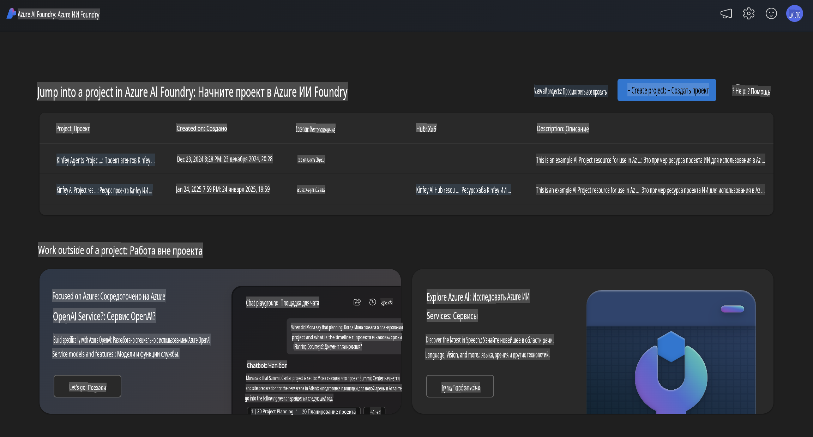
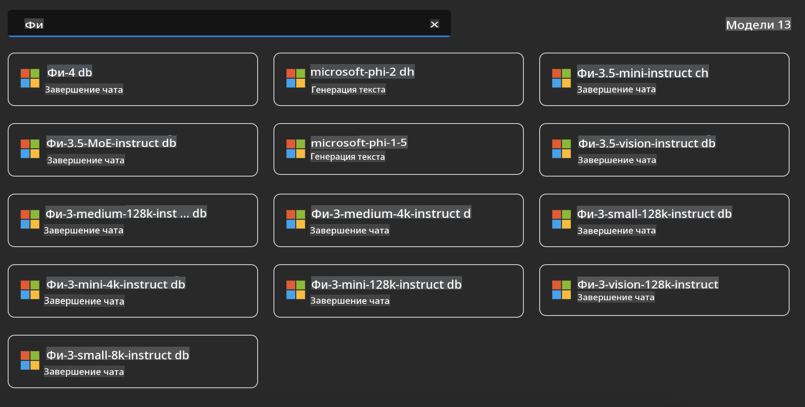
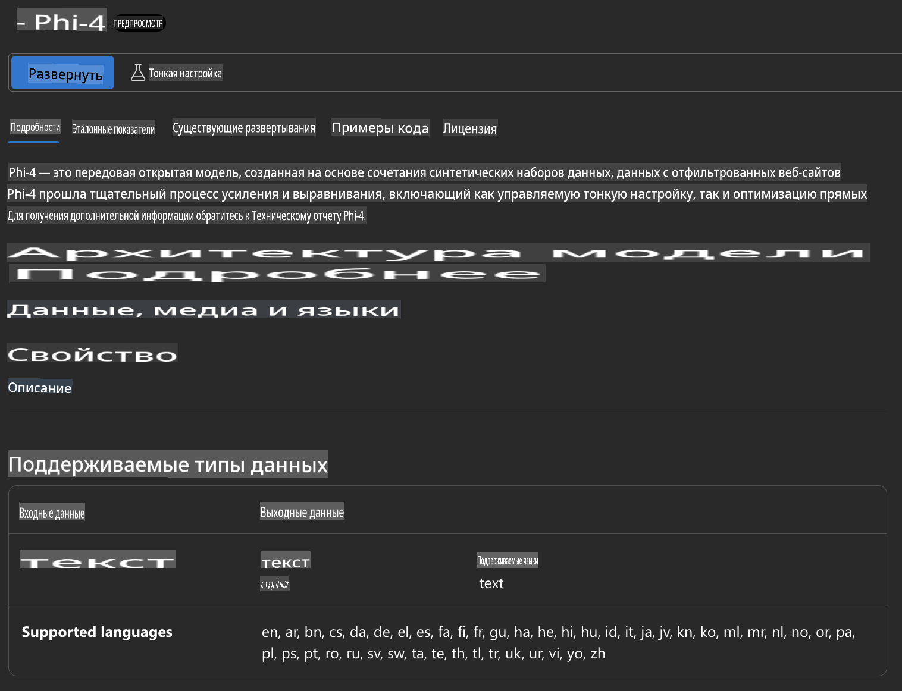
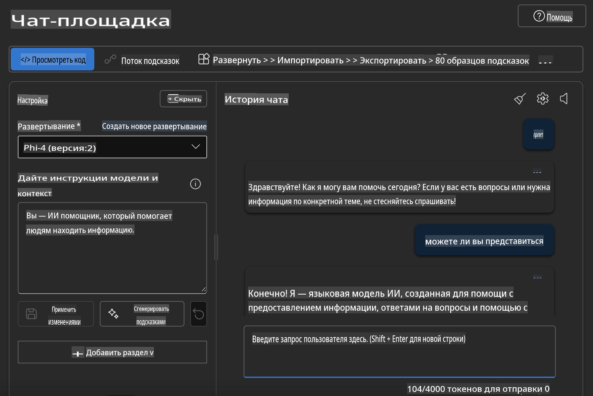

## Семейство Phi в Azure AI Foundry

[Azure AI Foundry](https://ai.azure.com) — это надежная платформа, которая позволяет разработчикам внедрять инновации и формировать будущее с помощью ИИ безопасным, надежным и ответственным образом.

[Azure AI Foundry](https://ai.azure.com) создана для разработчиков, чтобы:

- Создавать генеративные приложения ИИ на платформе корпоративного уровня.
- Исследовать, разрабатывать, тестировать и развертывать с использованием передовых инструментов ИИ и моделей машинного обучения, основанных на принципах ответственного ИИ.
- Сотрудничать в команде на всех этапах жизненного цикла разработки приложений.

С Azure AI Foundry вы можете исследовать широкий спектр моделей, сервисов и возможностей, чтобы создавать ИИ-приложения, которые наилучшим образом соответствуют вашим целям. Платформа Azure AI Foundry упрощает масштабирование для преобразования концептуальных моделей в полноценные производственные приложения. Непрерывный мониторинг и улучшение обеспечивают долгосрочный успех.



Помимо использования Azure AOAI Service в Azure AI Foundry, вы также можете использовать сторонние модели из каталога моделей Azure AI Foundry. Это отличный выбор, если вы хотите использовать Azure AI Foundry в качестве платформы для ваших решений на основе ИИ.

Мы можем быстро развернуть модели семейства Phi через каталог моделей в Azure AI Foundry.



### **Развертывание Phi-4 в Azure AI Foundry**



### **Тестирование Phi-4 в Azure AI Foundry Playground**



### **Выполнение Python-кода для вызова Azure AI Foundry Phi-4**

```python

import os  
import base64
from openai import AzureOpenAI  
from azure.identity import DefaultAzureCredential, get_bearer_token_provider  
        
endpoint = os.getenv("ENDPOINT_URL", "Your Azure AOAI Service Endpoint")  
deployment = os.getenv("DEPLOYMENT_NAME", "Phi-4")  
      
token_provider = get_bearer_token_provider(  
    DefaultAzureCredential(),  
    "https://cognitiveservices.azure.com/.default"  
)  
  
client = AzureOpenAI(  
    azure_endpoint=endpoint,  
    azure_ad_token_provider=token_provider,  
    api_version="2024-05-01-preview",  
)  
  

chat_prompt = [
    {
        "role": "system",
        "content": "You are an AI assistant that helps people find information."
    },
    {
        "role": "user",
        "content": "can you introduce yourself"
    }
] 
    
# Include speech result if speech is enabled  
messages = chat_prompt 

completion = client.chat.completions.create(  
    model=deployment,  
    messages=messages,
    max_tokens=800,  
    temperature=0.7,  
    top_p=0.95,  
    frequency_penalty=0,  
    presence_penalty=0,
    stop=None,  
    stream=False  
)  
  
print(completion.to_json())  

```

**Отказ от ответственности**:  
Этот документ был переведен с использованием автоматизированных сервисов машинного перевода на основе ИИ. Несмотря на наши усилия обеспечить точность, автоматические переводы могут содержать ошибки или неточности. Оригинальный документ на его исходном языке следует считать авторитетным источником. Для критически важной информации рекомендуется использовать профессиональный перевод человеком. Мы не несем ответственности за любые недоразумения или неверные интерпретации, возникшие в результате использования данного перевода.