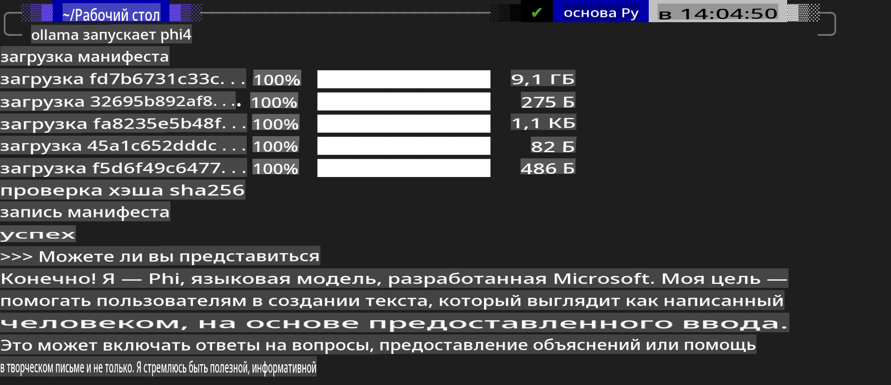
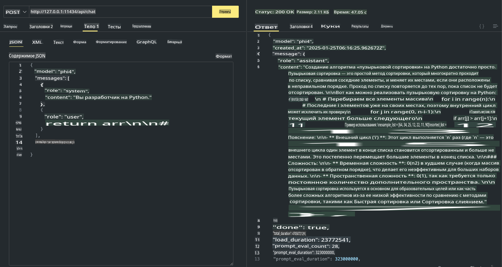

## Семейство Phi в Ollama

[Ollama](https://ollama.com) позволяет большему числу людей напрямую развертывать открытые модели LLM или SLM с помощью простых скриптов, а также создавать API для локальных приложений Copilot.

## **1. Установка**

Ollama поддерживает работу на Windows, macOS и Linux. Вы можете установить Ollama по этой ссылке ([https://ollama.com/download](https://ollama.com/download)). После успешной установки вы сможете использовать скрипт Ollama для вызова Phi-3 через терминал. Все [доступные библиотеки в Ollama](https://ollama.com/library) можно найти по этой ссылке. Если вы открыли этот репозиторий в Codespace, Ollama уже будет установлена.

```bash

ollama run phi4

```

> [!NOTE]
> При первом запуске модель будет загружена автоматически. Конечно, вы также можете заранее указать скачанную модель Phi-4. Рассмотрим пример выполнения команды в WSL. После успешной загрузки модели можно взаимодействовать с ней напрямую через терминал.



## **2. Вызов API phi-4 через Ollama**

Если вы хотите вызвать API Phi-4, сгенерированный Ollama, используйте следующую команду в терминале для запуска сервера Ollama.

```bash

ollama serve

```

> [!NOTE]
> Если вы используете macOS или Linux, возможно, вы столкнетесь с ошибкой **"Error: listen tcp 127.0.0.1:11434: bind: address already in use"**. Эта ошибка может возникнуть при выполнении команды. Вы можете либо проигнорировать её, так как она обычно означает, что сервер уже запущен, либо остановить и перезапустить Ollama:

**macOS**

```bash

brew services restart ollama

```

**Linux**

```bash

sudo systemctl stop ollama

```

Ollama поддерживает два API: generate и chat. Вы можете вызывать API модели Ollama в зависимости от ваших потребностей, отправляя запросы на локальный сервер, работающий на порту 11434.

**Chat**

```bash

curl http://127.0.0.1:11434/api/chat -d '{
  "model": "phi3",
  "messages": [
    {
      "role": "system",
      "content": "Your are a python developer."
    },
    {
      "role": "user",
      "content": "Help me generate a bubble algorithm"
    }
  ],
  "stream": false
  
}'

This is the result in Postman



## Additional Resources

Check the list of available models in Ollama in [their library](https://ollama.com/library).

Pull your model from the Ollama server using this command

```bash
ollama pull phi4
```

Run the model using this command

```bash
ollama run phi4
```

***Note:*** Visit this link [https://github.com/ollama/ollama/blob/main/docs/api.md](https://github.com/ollama/ollama/blob/main/docs/api.md) to learn more

## Calling Ollama from Python

You can use `requests` or `urllib3` to make requests to the local server endpoints used above. However, a popular way to use Ollama in Python is via the [openai](https://pypi.org/project/openai/) SDK, since Ollama provides OpenAI-compatible server endpoints as well.

Here is an example for phi3-mini:

```python
import openai

client = openai.OpenAI(
    base_url="http://localhost:11434/v1",
    api_key="nokeyneeded",
)

response = client.chat.completions.create(
    model="phi4",
    temperature=0.7,
    n=1,
    messages=[
        {"role": "system", "content": "Вы — полезный ассистент."},
        {"role": "user", "content": "Напишите хайку о голодном коте"},
    ],
)

print("Ответ:")
print(response.choices[0].message.content)
```

## Calling Ollama from JavaScript 

```javascript
// Пример: резюмирование файла с помощью Phi-4
script({
    model: "ollama:phi4",
    title: "Резюмирование с помощью Phi-4",
    system: ["system"],
})

// Пример резюмирования
const file = def("FILE", env.files)
$`Резюмируйте ${file} в одном абзаце.`
```

## Calling Ollama from C#

Create a new C# Console application and add the following NuGet package:

```bash
dotnet add package Microsoft.SemanticKernel --version 1.34.0
```

Then replace this code in the `Program.cs` file

```csharp
using Microsoft.SemanticKernel;
using Microsoft.SemanticKernel.ChatCompletion;

// добавляем сервис чат-комплитов, используя локальный сервер Ollama
#pragma warning disable SKEXP0001, SKEXP0003, SKEXP0010, SKEXP0011, SKEXP0050, SKEXP0052
builder.AddOpenAIChatCompletion(
    modelId: "phi4",
    endpoint: new Uri("http://localhost:11434/"),
    apiKey: "non required");

// отправляем простой запрос в чат-сервис
string prompt = "Расскажите шутку про котят";
var response = await kernel.InvokePromptAsync(prompt);
Console.WriteLine(response.GetValue<string>());
```

Run the app with the command:

```bash
dotnet run
```

**Отказ от ответственности**:  
Этот документ был переведен с использованием автоматизированных сервисов перевода на основе ИИ. Хотя мы стремимся к точности, пожалуйста, имейте в виду, что автоматические переводы могут содержать ошибки или неточности. Оригинальный документ на его исходном языке следует считать авторитетным источником. Для получения критически важной информации рекомендуется профессиональный перевод человеком. Мы не несем ответственности за любые недоразумения или неправильные интерпретации, возникающие в результате использования данного перевода.