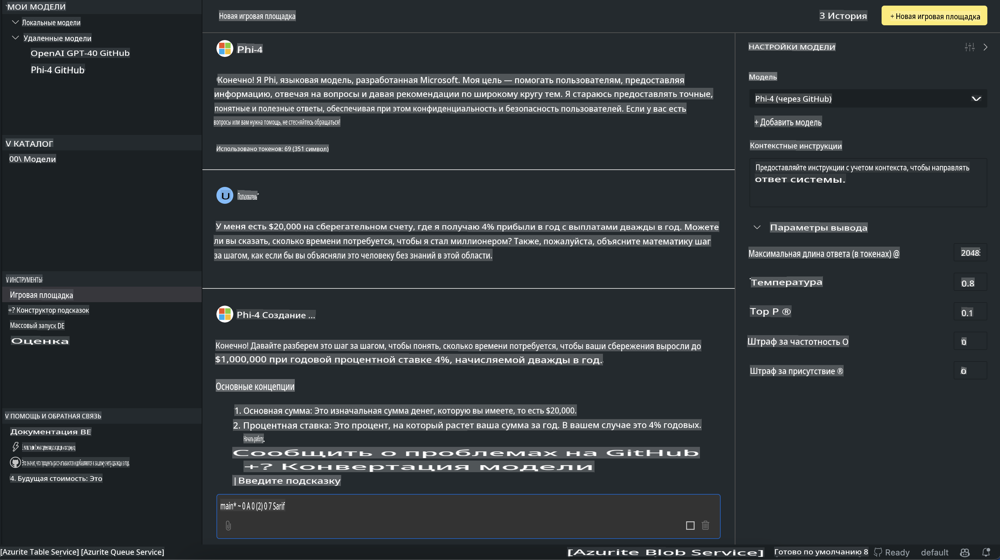

# Семейство Phi в AITK

[AI Toolkit для VS Code](https://marketplace.visualstudio.com/items?itemName=ms-windows-ai-studio.windows-ai-studio) упрощает разработку приложений с генеративным ИИ, объединяя передовые инструменты разработки ИИ и модели из каталога Azure AI Foundry и других каталогов, таких как Hugging Face. Вы сможете просматривать каталог моделей ИИ, работающий на базе GitHub Models и Azure AI Foundry Model Catalogs, загружать их локально или удаленно, настраивать, тестировать и использовать в своем приложении.

AI Toolkit Preview работает локально. Локальный вывод или настройка зависят от выбранной вами модели, и вам может понадобиться GPU, такой как NVIDIA CUDA GPU. Вы также можете запускать модели GitHub непосредственно с помощью AITK.

## Начало работы

[Узнайте больше о том, как установить подсистему Windows для Linux](https://learn.microsoft.com/windows/wsl/install?WT.mc_id=aiml-137032-kinfeylo)

и [изменить дистрибутив по умолчанию](https://learn.microsoft.com/windows/wsl/install#change-the-default-linux-distribution-installed).

[Репозиторий AI Toolkit на GitHub](https://github.com/microsoft/vscode-ai-toolkit/)

- Windows, Linux, macOS
  
- Для настройки на Windows и Linux вам потребуется GPU от Nvidia. Кроме того, **Windows** требует подсистему для Linux с дистрибутивом Ubuntu версии 18.4 или выше. [Узнайте больше о том, как установить подсистему Windows для Linux](https://learn.microsoft.com/windows/wsl/install) и [изменить дистрибутив по умолчанию](https://learn.microsoft.com/windows/wsl/install#change-the-default-linux-distribution-installed).

### Установка AI Toolkit

AI Toolkit поставляется в виде [расширения для Visual Studio Code](https://code.visualstudio.com/docs/setup/additional-components#_vs-code-extensions), поэтому сначала вам нужно установить [VS Code](https://code.visualstudio.com/docs/setup/windows?WT.mc_id=aiml-137032-kinfeylo), а затем загрузить AI Toolkit из [VS Marketplace](https://marketplace.visualstudio.com/items?itemName=ms-windows-ai-studio.windows-ai-studio).  
[AI Toolkit доступен в Visual Studio Marketplace](https://marketplace.visualstudio.com/items?itemName=ms-windows-ai-studio.windows-ai-studio) и может быть установлен как любое другое расширение для VS Code. 

Если вы не знакомы с установкой расширений для VS Code, выполните следующие шаги:

### Вход в систему

1. В панели активности VS Code выберите **Расширения**.
2. В строке поиска расширений введите "AI Toolkit".
3. Выберите "AI Toolkit для Visual Studio Code".
4. Нажмите **Установить**.

Теперь вы готовы использовать расширение!

Вас попросят войти в систему через GitHub, поэтому нажмите "Разрешить", чтобы продолжить. Вы будете перенаправлены на страницу входа GitHub.

Пожалуйста, выполните вход и следуйте инструкциям. После успешного завершения вы будете перенаправлены обратно в VS Code.

После установки расширения вы увидите значок AI Toolkit в панели активности.

Давайте изучим доступные действия!

### Доступные действия

Основная боковая панель AI Toolkit организована следующим образом:

- **Модели**
- **Ресурсы**
- **Песочница**
- **Тонкая настройка**
- **Оценка**

Все это доступно в разделе "Ресурсы". Чтобы начать, выберите **Каталог моделей**.

### Загрузка модели из каталога

После запуска AI Toolkit с боковой панели VS Code вы можете выбрать из следующих опций:


- Найдите поддерживаемую модель в **Каталоге моделей** и загрузите ее локально.
- Протестируйте вывод модели в **Песочнице моделей**.
- Настройте модель локально или удаленно в **Тонкой настройке модели**.
- Разверните настроенные модели в облаке через палитру команд AI Toolkit.
- Оцените модели.

> [!NOTE]
>
> **GPU против CPU**
>
> Вы заметите, что карточки моделей показывают размер модели, платформу и тип ускорителя (CPU, GPU). Для оптимальной производительности на **устройствах Windows с хотя бы одним GPU** выбирайте версии моделей, которые ориентированы только на Windows.
>
> Это гарантирует, что у вас будет модель, оптимизированная для ускорителя DirectML.
>
> Названия моделей имеют формат:
>
> - `{model_name}-{accelerator}-{quantization}-{format}`.
>
> Чтобы проверить, есть ли GPU на вашем устройстве с Windows, откройте **Диспетчер задач**, а затем выберите вкладку **Производительность**. Если у вас есть GPU, они будут перечислены под названиями, такими как "GPU 0" или "GPU 1".

### Запуск модели в песочнице

После настройки всех параметров нажмите **Создать проект**.

После загрузки вашей модели выберите **Загрузить в песочницу** на карточке модели в каталоге:

- Инициируйте загрузку модели.
- Установите все необходимые зависимости.
- Создайте рабочее пространство VS Code.



### Использование REST API в вашем приложении

AI Toolkit включает локальный веб-сервер REST API **на порту 5272**, который использует [формат завершений чата OpenAI](https://platform.openai.com/docs/api-reference/chat/create).  

Это позволяет тестировать ваше приложение локально, не полагаясь на облачную службу моделей ИИ. Например, следующий JSON-файл показывает, как настроить тело запроса:

```json
{
    "model": "Phi-4",
    "messages": [
        {
            "role": "user",
            "content": "what is the golden ratio?"
        }
    ],
    "temperature": 0.7,
    "top_p": 1,
    "top_k": 10,
    "max_tokens": 100,
    "stream": true
}
```

Вы можете протестировать REST API с помощью (например) [Postman](https://www.postman.com/) или утилиты CURL (Client URL):

```bash
curl -vX POST http://127.0.0.1:5272/v1/chat/completions -H 'Content-Type: application/json' -d @body.json
```

### Использование клиентской библиотеки OpenAI для Python

```python
from openai import OpenAI

client = OpenAI(
    base_url="http://127.0.0.1:5272/v1/", 
    api_key="x" # required for the API but not used
)

chat_completion = client.chat.completions.create(
    messages=[
        {
            "role": "user",
            "content": "what is the golden ratio?",
        }
    ],
    model="Phi-4",
)

print(chat_completion.choices[0].message.content)
```

### Использование клиентской библиотеки Azure OpenAI для .NET

Добавьте [клиентскую библиотеку Azure OpenAI для .NET](https://www.nuget.org/packages/Azure.AI.OpenAI/) в ваш проект с помощью NuGet:

```bash
dotnet add {project_name} package Azure.AI.OpenAI --version 1.0.0-beta.17
```

Добавьте файл C# под названием **OverridePolicy.cs** в ваш проект и вставьте следующий код:

```csharp
// OverridePolicy.cs
using Azure.Core.Pipeline;
using Azure.Core;

internal partial class OverrideRequestUriPolicy(Uri overrideUri)
    : HttpPipelineSynchronousPolicy
{
    private readonly Uri _overrideUri = overrideUri;

    public override void OnSendingRequest(HttpMessage message)
    {
        message.Request.Uri.Reset(_overrideUri);
    }
}
```

Далее вставьте следующий код в ваш файл **Program.cs**:

```csharp
// Program.cs
using Azure.AI.OpenAI;

Uri localhostUri = new("http://localhost:5272/v1/chat/completions");

OpenAIClientOptions clientOptions = new();
clientOptions.AddPolicy(
    new OverrideRequestUriPolicy(localhostUri),
    Azure.Core.HttpPipelinePosition.BeforeTransport);
OpenAIClient client = new(openAIApiKey: "unused", clientOptions);

ChatCompletionsOptions options = new()
{
    DeploymentName = "Phi-4",
    Messages =
    {
        new ChatRequestSystemMessage("You are a helpful assistant. Be brief and succinct."),
        new ChatRequestUserMessage("What is the golden ratio?"),
    }
};

StreamingResponse<StreamingChatCompletionsUpdate> streamingChatResponse
    = await client.GetChatCompletionsStreamingAsync(options);

await foreach (StreamingChatCompletionsUpdate chatChunk in streamingChatResponse)
{
    Console.Write(chatChunk.ContentUpdate);
}
```

## Тонкая настройка с AI Toolkit

- Начните с изучения моделей и песочницы.
- Тонкая настройка и вывод моделей с использованием локальных вычислительных ресурсов.
- Удаленная тонкая настройка и вывод с использованием ресурсов Azure.

[Тонкая настройка с AI Toolkit](../../03.FineTuning/Finetuning_VSCodeaitoolkit.md)

## Ресурсы для вопросов и ответов AI Toolkit

Пожалуйста, ознакомьтесь с нашей [страницей вопросов и ответов](https://github.com/microsoft/vscode-ai-toolkit/blob/main/archive/QA.md) для получения информации о наиболее распространенных проблемах и их решениях.

**Отказ от ответственности**:  
Этот документ был переведен с использованием автоматизированных сервисов перевода на основе ИИ. Несмотря на наши усилия обеспечить точность, автоматические переводы могут содержать ошибки или неточности. Оригинальный документ на его родном языке следует считать авторитетным источником. Для получения критически важной информации рекомендуется профессиональный перевод человеком. Мы не несем ответственности за любые недоразумения или неверные интерпретации, возникающие в результате использования данного перевода.