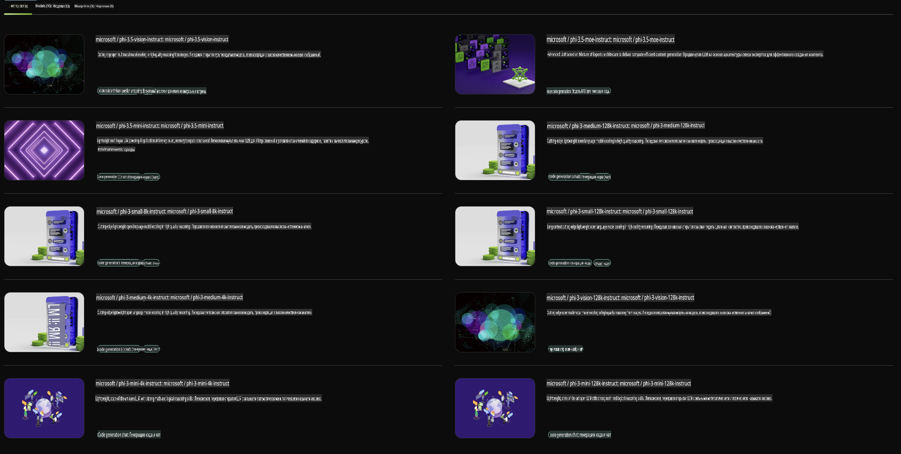

## Семейство Phi в NVIDIA NIM

NVIDIA NIM — это набор удобных микросервисов, разработанных для ускорения развертывания генеративных моделей ИИ в облаке, дата-центрах и на рабочих станциях. NIM классифицируются по семействам моделей и на основе каждой конкретной модели. Например, NVIDIA NIM для больших языковых моделей (LLMs) предоставляет возможности передовых LLM для корпоративных приложений, обеспечивая непревзойденную обработку и понимание естественного языка.

NIM упрощает для IT- и DevOps-команд возможность самостоятельно размещать большие языковые модели (LLMs) в своих управляемых средах, при этом предоставляя разработчикам стандартные API, которые позволяют создавать мощных копилотов, чат-ботов и AI-ассистентов, способных преобразовать их бизнес. Используя передовые технологии GPU-ускорения и масштабируемого развертывания от NVIDIA, NIM предлагает самый быстрый путь к выводу с беспрецедентной производительностью.

С помощью NVIDIA NIM вы можете выполнять вывод моделей семейства Phi.



### **Примеры - Phi-3-Vision в NVIDIA NIM**

Представьте, что у вас есть изображение (`demo.png`), и вы хотите сгенерировать Python-код, который обрабатывает это изображение и сохраняет его новую версию (`phi-3-vision.jpg`).

Код выше автоматизирует этот процесс следующим образом:

1. Настраивает окружение и необходимые конфигурации.
2. Создает запрос, который инструктирует модель сгенерировать требуемый Python-код.
3. Отправляет запрос модели и собирает сгенерированный код.
4. Извлекает и выполняет сгенерированный код.
5. Отображает оригинальное и обработанное изображения.

Этот подход использует возможности ИИ для автоматизации задач обработки изображений, что делает достижение ваших целей проще и быстрее.

[Пример решения с кодом](../../../../../code/06.E2E/E2E_Nvidia_NIM_Phi3_Vision.ipynb)

Давайте разберем, что делает весь код шаг за шагом:

1. **Установка необходимого пакета**:
    ```python
    !pip install langchain_nvidia_ai_endpoints -U
    ```
    Эта команда устанавливает пакет `langchain_nvidia_ai_endpoints`, гарантируя, что используется его последняя версия.

2. **Импорт необходимых модулей**:
    ```python
    from langchain_nvidia_ai_endpoints import ChatNVIDIA
    import getpass
    import os
    import base64
    ```
    Эти импорты обеспечивают взаимодействие с NVIDIA AI endpoints, безопасную работу с паролями, взаимодействие с операционной системой и кодирование/декодирование данных в формате base64.

3. **Настройка API-ключа**:
    ```python
    if not os.getenv("NVIDIA_API_KEY"):
        os.environ["NVIDIA_API_KEY"] = getpass.getpass("Enter your NVIDIA API key: ")
    ```
    Этот код проверяет, установлен ли переменная окружения `NVIDIA_API_KEY`. Если нет, пользователю предлагается ввести API-ключ безопасно.

4. **Определение модели и пути к изображению**:
    ```python
    model = 'microsoft/phi-3-vision-128k-instruct'
    chat = ChatNVIDIA(model=model)
    img_path = './imgs/demo.png'
    ```
    Здесь задается используемая модель, создается экземпляр `ChatNVIDIA` с указанной моделью и определяется путь к файлу изображения.

5. **Создание текстового запроса**:
    ```python
    text = "Please create Python code for image, and use plt to save the new picture under imgs/ and name it phi-3-vision.jpg."
    ```
    Здесь определяется текстовый запрос, который инструктирует модель сгенерировать Python-код для обработки изображения.

6. **Кодирование изображения в base64**:
    ```python
    with open(img_path, "rb") as f:
        image_b64 = base64.b64encode(f.read()).decode()
    image = f''
    ```
    Этот код читает файл изображения, кодирует его в base64 и создает HTML-тег изображения с закодированными данными.

7. **Объединение текста и изображения в запрос**:
    ```python
    prompt = f"{text} {image}"
    ```
    Здесь текстовый запрос и HTML-тег изображения объединяются в одну строку.

8. **Генерация кода с использованием ChatNVIDIA**:
    ```python
    code = ""
    for chunk in chat.stream(prompt):
        print(chunk.content, end="")
        code += chunk.content
    ```
    Этот код отправляет запрос в `ChatNVIDIA` model and collects the generated code in chunks, printing and appending each chunk to the `code` строку.

9. **Извлечение Python-кода из сгенерированного содержимого**:
    ```python
    begin = code.index('```python') + 9
    code = code[begin:]
    end = code.index('```')
    code = code[:end]
    ```
    Этот шаг извлекает фактический Python-код из сгенерированного содержимого, удаляя форматирование Markdown.

10. **Выполнение сгенерированного кода**:
    ```python
    import subprocess
    result = subprocess.run(["python", "-c", code], capture_output=True)
    ```
    Здесь извлеченный Python-код выполняется как подпроцесс, и его вывод захватывается.

11. **Отображение изображений**:
    ```python
    from IPython.display import Image, display
    display(Image(filename='./imgs/phi-3-vision.jpg'))
    display(Image(filename='./imgs/demo.png'))
    ```
    Эти строки отображают изображения с использованием модуля `IPython.display`.

**Отказ от ответственности**:  
Этот документ был переведен с использованием автоматических услуг машинного перевода. Хотя мы стремимся к точности, имейте в виду, что автоматические переводы могут содержать ошибки или неточности. Оригинальный документ на его исходном языке следует считать авторитетным источником. Для получения критически важной информации рекомендуется профессиональный перевод человеком. Мы не несем ответственности за любые недоразумения или неправильные интерпретации, возникшие в результате использования данного перевода.