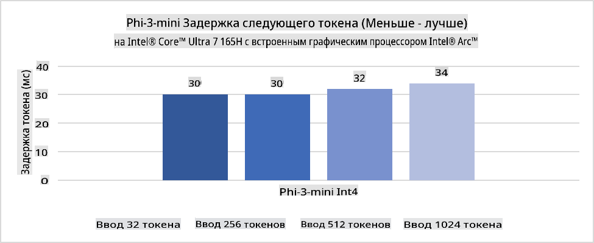
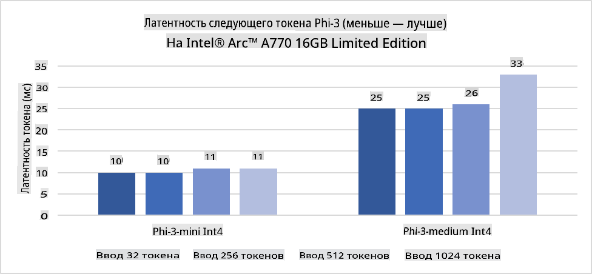
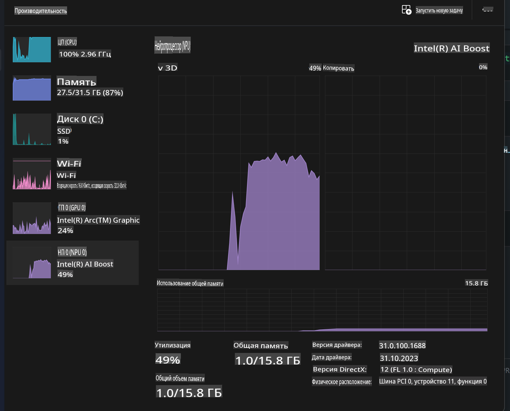
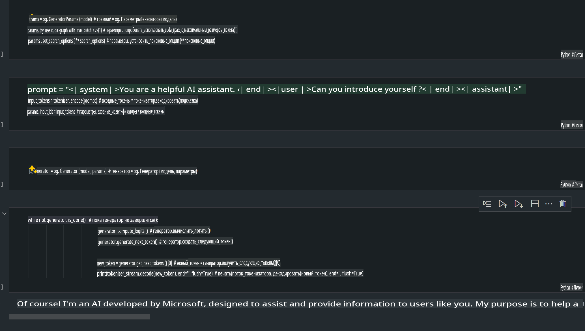
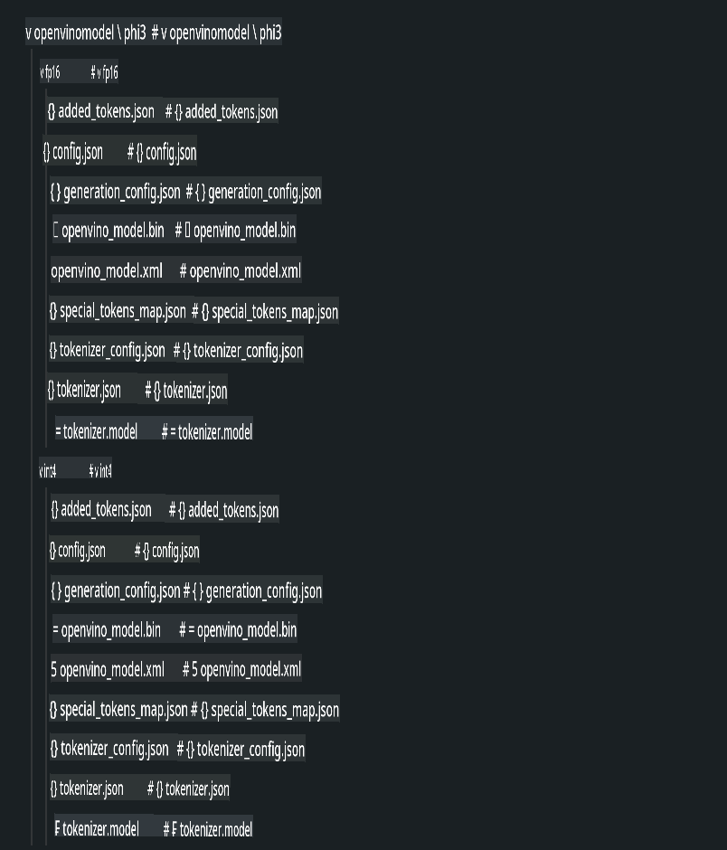
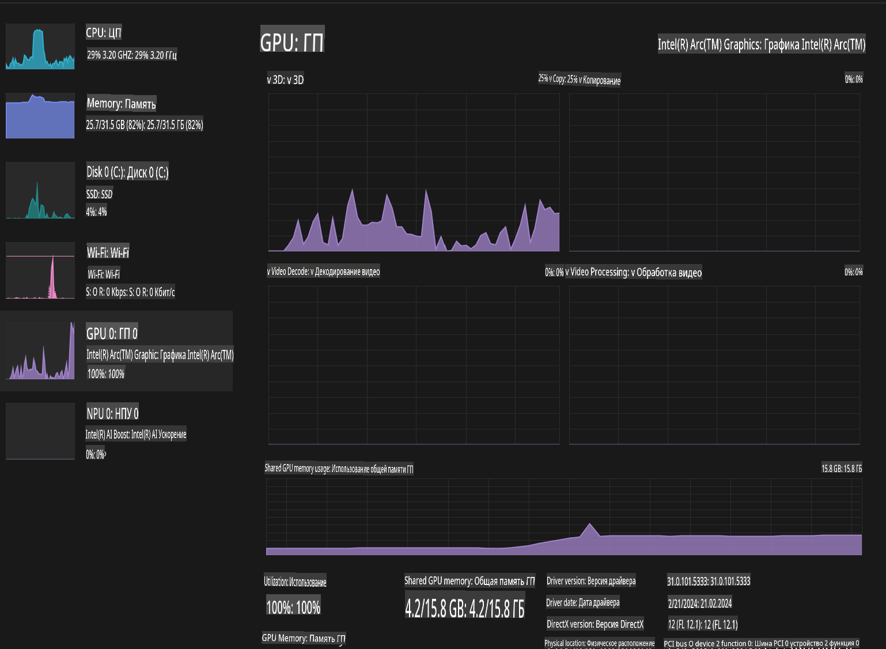

# **Inference Phi-3 на AI ПК**

С развитием генеративного ИИ и улучшением возможностей оборудования периферийных устройств всё больше моделей генеративного ИИ могут быть интегрированы в устройства пользователей в формате Bring Your Own Device (BYOD). AI ПК — одно из таких решений. Начиная с 2024 года, Intel, AMD и Qualcomm совместно с производителями ПК начали внедрять AI ПК, которые поддерживают локальное развертывание генеративных ИИ моделей благодаря аппаратным модификациям. В данном обсуждении мы сосредоточимся на AI ПК от Intel и рассмотрим, как развернуть модель Phi-3 на таком устройстве.

### Что такое NPU

NPU (нейронный процессор, Neural Processing Unit) — это специализированный процессор или вычислительный блок в составе более крупной системы на кристалле (SoC), разработанный специально для ускорения операций с нейронными сетями и выполнения задач ИИ. В отличие от универсальных CPU и GPU, NPU оптимизирован для параллельных вычислений, ориентированных на обработку данных, что делает его крайне эффективным при обработке больших объемов мультимедийных данных, таких как видео и изображения, а также данных для нейронных сетей. NPU особенно хорошо справляется с задачами, связанными с ИИ, такими как распознавание речи, размытие фона во время видеозвонков и редактирование фото и видео, включая распознавание объектов.

## NPU vs GPU

Хотя многие рабочие нагрузки, связанные с ИИ и машинным обучением, выполняются на GPU, между GPU и NPU есть важное различие.  
GPU известны своими возможностями параллельных вычислений, но не все GPU одинаково эффективны за пределами обработки графики. NPU, напротив, специально созданы для сложных вычислений, связанных с операциями нейронных сетей, что делает их особенно эффективными для задач ИИ.

В итоге, NPU — это "математические гении", которые ускоряют вычисления ИИ и играют ключевую роль в новой эре AI ПК!

***Этот пример основан на последнем процессоре Intel Core Ultra***

## **1. Использование NPU для запуска модели Phi-3**

Устройство Intel® NPU — это ускоритель вывода ИИ, интегрированный в клиентские процессоры Intel, начиная с поколения Intel® Core™ Ultra (ранее известного как Meteor Lake). Оно обеспечивает энергоэффективное выполнение задач искусственных нейронных сетей.





**Библиотека ускорения Intel NPU**

Библиотека ускорения Intel NPU [https://github.com/intel/intel-npu-acceleration-library](https://github.com/intel/intel-npu-acceleration-library) — это Python-библиотека, разработанная для повышения эффективности ваших приложений за счёт использования возможностей Intel Neural Processing Unit (NPU) для выполнения высокоскоростных вычислений на совместимом оборудовании.

Пример использования Phi-3-mini на AI ПК с процессорами Intel® Core™ Ultra.


Установка Python-библиотеки через pip:

```bash

   pip install intel-npu-acceleration-library

```

***Примечание*** Проект всё ещё находится в стадии разработки, но эталонная модель уже практически завершена.

### **Запуск Phi-3 с использованием библиотеки ускорения Intel NPU**

Используя ускорение Intel NPU, эта библиотека не влияет на традиционный процесс кодирования. Вам нужно только использовать библиотеку для квантизации оригинальной модели Phi-3, например, в форматах FP16, INT8, INT4, таких как:

```python
from transformers import AutoTokenizer, pipeline,TextStreamer
from intel_npu_acceleration_library import NPUModelForCausalLM, int4
from intel_npu_acceleration_library.compiler import CompilerConfig
import warnings

model_id = "microsoft/Phi-3-mini-4k-instruct"

compiler_conf = CompilerConfig(dtype=int4)
model = NPUModelForCausalLM.from_pretrained(
    model_id, use_cache=True, config=compiler_conf, attn_implementation="sdpa"
).eval()

tokenizer = AutoTokenizer.from_pretrained(model_id)

text_streamer = TextStreamer(tokenizer, skip_prompt=True)
```

После успешной квантизации продолжайте выполнение, чтобы вызвать NPU для запуска модели Phi-3.

```python
generation_args = {
   "max_new_tokens": 1024,
   "return_full_text": False,
   "temperature": 0.3,
   "do_sample": False,
   "streamer": text_streamer,
}

pipe = pipeline(
   "text-generation",
   model=model,
   tokenizer=tokenizer,
)

query = "<|system|>You are a helpful AI assistant.<|end|><|user|>Can you introduce yourself?<|end|><|assistant|>"

with warnings.catch_warnings():
    warnings.simplefilter("ignore")
    pipe(query, **generation_args)
```

При выполнении кода мы можем просматривать статус работы NPU через диспетчер задач.



***Примеры***: [AIPC_NPU_DEMO.ipynb](../../../../../code/03.Inference/AIPC/AIPC_NPU_DEMO.ipynb)

## **2. Использование DirectML + ONNX Runtime для запуска модели Phi-3**

### **Что такое DirectML**

[DirectML](https://github.com/microsoft/DirectML) — это высокопроизводительная библиотека машинного обучения с аппаратным ускорением DirectX 12. DirectML предоставляет GPU-ускорение для выполнения задач машинного обучения на широком спектре совместимого оборудования и драйверов, включая все GPU с поддержкой DirectX 12 от таких производителей, как AMD, Intel, NVIDIA и Qualcomm.

При самостоятельном использовании API DirectML представляет собой низкоуровневую библиотеку DirectX 12, подходящую для высокопроизводительных приложений с низкой задержкой, таких как фреймворки, игры и другие приложения реального времени. Благодаря бесшовной совместимости DirectML с Direct3D 12, низкой нагрузке и предсказуемости результатов на разных аппаратных платформах, DirectML идеально подходит для ускорения машинного обучения в случаях, когда важны высокая производительность и надёжность.

***Примечание***: Последняя версия DirectML уже поддерживает NPU (https://devblogs.microsoft.com/directx/introducing-neural-processor-unit-npu-support-in-directml-developer-preview/).

### DirectML и CUDA: сравнение возможностей и производительности

**DirectML** — это библиотека машинного обучения, разработанная Microsoft. Она предназначена для ускорения задач машинного обучения на устройствах с Windows, включая настольные ПК, ноутбуки и периферийные устройства.
- Основана на DX12: DirectML построена на базе DirectX 12 (DX12), что обеспечивает широкий спектр аппаратной поддержки GPU, включая NVIDIA и AMD.
- Широкая совместимость: Благодаря использованию DX12, DirectML может работать с любым GPU, поддерживающим DX12, даже с интегрированными GPU.
- Обработка изображений: DirectML обрабатывает изображения и другие данные с использованием нейронных сетей, что делает её подходящей для задач, таких как распознавание изображений, обнаружение объектов и др.
- Простота настройки: Настройка DirectML проста и не требует специальных SDK или библиотек от производителей GPU.
- Производительность: В некоторых случаях DirectML демонстрирует хорошую производительность и может быть быстрее CUDA для определённых задач.
- Ограничения: Однако бывают случаи, когда DirectML работает медленнее, особенно при больших размерах пакетов float16.

**CUDA** — это платформа параллельных вычислений и модель программирования от NVIDIA. Она позволяет разработчикам использовать возможности GPU NVIDIA для вычислений общего назначения, включая машинное обучение и научные симуляции.
- Привязка к NVIDIA: CUDA тесно интегрирована с GPU NVIDIA и специально разработана для них.
- Высокая оптимизация: CUDA обеспечивает отличную производительность для задач с GPU-ускорением, особенно при использовании GPU NVIDIA.
- Широкое использование: Многие фреймворки и библиотеки машинного обучения (например, TensorFlow и PyTorch) поддерживают CUDA.
- Настройка: Разработчики могут тонко настраивать параметры CUDA для конкретных задач, что позволяет достичь оптимальной производительности.
- Ограничения: Зависимость от оборудования NVIDIA может быть ограничивающим фактором, если требуется более широкая совместимость с различными GPU.

### Выбор между DirectML и CUDA

Выбор между DirectML и CUDA зависит от ваших конкретных задач, доступного оборудования и предпочтений.  
Если вам нужна широкая совместимость и простота настройки, DirectML может быть хорошим выбором. Однако, если у вас есть GPU NVIDIA и требуется высокая оптимизация, CUDA остаётся сильным кандидатом. В итоге, у обеих технологий есть свои преимущества и недостатки, поэтому при выборе стоит учитывать ваши требования и доступное оборудование.

### **Генеративный ИИ с ONNX Runtime**

В эпоху ИИ портативность моделей становится крайне важной. ONNX Runtime позволяет легко развертывать обученные модели на различных устройствах. Разработчикам не нужно учитывать фреймворк вывода, используя единый API для выполнения вывода моделей. В эпоху генеративного ИИ ONNX Runtime также прошёл оптимизацию кода (https://onnxruntime.ai/docs/genai/). С помощью оптимизированного ONNX Runtime можно выполнять вывод квантизированных генеративных моделей ИИ на разных устройствах. В Generative AI with ONNX Runtime можно вызывать API модели ИИ через Python, C# или C/C++. Конечно, развертывание на iPhone может использовать API Generative AI с ONNX Runtime на C++.

[Пример кода](https://github.com/Azure-Samples/Phi-3MiniSamples/tree/main/onnx)

***Компиляция библиотеки генеративного ИИ с ONNX Runtime***

```bash

winget install --id=Kitware.CMake  -e

git clone https://github.com/microsoft/onnxruntime.git

cd .\onnxruntime\

./build.bat --build_shared_lib --skip_tests --parallel --use_dml --config Release

cd ../

git clone https://github.com/microsoft/onnxruntime-genai.git

cd .\onnxruntime-genai\

mkdir ort

cd ort

mkdir include

mkdir lib

copy ..\onnxruntime\include\onnxruntime\core\providers\dml\dml_provider_factory.h ort\include

copy ..\onnxruntime\include\onnxruntime\core\session\onnxruntime_c_api.h ort\include

copy ..\onnxruntime\build\Windows\Release\Release\*.dll ort\lib

copy ..\onnxruntime\build\Windows\Release\Release\onnxruntime.lib ort\lib

python build.py --use_dml


```

**Установка библиотеки**

```bash

pip install .\onnxruntime_genai_directml-0.3.0.dev0-cp310-cp310-win_amd64.whl

```

Результат выполнения:



***Примеры***: [AIPC_DirectML_DEMO.ipynb](../../../../../code/03.Inference/AIPC/AIPC_DirectML_DEMO.ipynb)

## **3. Использование Intel OpenVINO для запуска модели Phi-3**

### **Что такое OpenVINO**

[OpenVINO](https://github.com/openvinotoolkit/openvino) — это инструмент с открытым исходным кодом для оптимизации и развертывания моделей глубокого обучения. Он обеспечивает ускорение производительности глубокого обучения для моделей обработки изображений, звука и языка из популярных фреймворков, таких как TensorFlow, PyTorch и др. OpenVINO также может использоваться в сочетании с CPU и GPU для запуска модели Phi-3.

***Примечание***: На данный момент OpenVINO не поддерживает NPU.

### **Установка библиотеки OpenVINO**

```bash

 pip install git+https://github.com/huggingface/optimum-intel.git

 pip install git+https://github.com/openvinotoolkit/nncf.git

 pip install openvino-nightly

```

### **Запуск Phi-3 с использованием OpenVINO**

Как и в случае с NPU, OpenVINO выполняет вызов генеративных моделей ИИ через запуск квантизированных моделей. Сначала нужно выполнить квантизацию модели Phi-3 и завершить её через командную строку с использованием optimum-cli.

**INT4**

```bash

optimum-cli export openvino --model "microsoft/Phi-3-mini-4k-instruct" --task text-generation-with-past --weight-format int4 --group-size 128 --ratio 0.6  --sym  --trust-remote-code ./openvinomodel/phi3/int4

```

**FP16**

```bash

optimum-cli export openvino --model "microsoft/Phi-3-mini-4k-instruct" --task text-generation-with-past --weight-format fp16 --trust-remote-code ./openvinomodel/phi3/fp16

```

Результат преобразования выглядит следующим образом:



Загрузите пути к моделям (model_dir), связанные конфигурации (ov_config = {"PERFORMANCE_HINT": "LATENCY", "NUM_STREAMS": "1", "CACHE_DIR": ""}) и устройства с аппаратным ускорением (GPU.0) через OVModelForCausalLM.

```python

ov_model = OVModelForCausalLM.from_pretrained(
     model_dir,
     device='GPU.0',
     ov_config=ov_config,
     config=AutoConfig.from_pretrained(model_dir, trust_remote_code=True),
     trust_remote_code=True,
)

```

При выполнении кода мы можем просматривать статус работы GPU через диспетчер задач.



***Примеры***: [AIPC_OpenVino_Demo.ipynb](../../../../../code/03.Inference/AIPC/AIPC_OpenVino_Demo.ipynb)

### ***Примечание***: У каждого из трёх описанных методов есть свои преимущества, но для вывода ИИ на AI ПК рекомендуется использовать ускорение через NPU.

**Отказ от ответственности**:  
Этот документ был переведен с использованием автоматических сервисов машинного перевода. Несмотря на наши усилия обеспечить точность, имейте в виду, что автоматический перевод может содержать ошибки или неточности. Оригинальный документ на его исходном языке следует считать авторитетным источником. Для получения критически важной информации рекомендуется профессиональный перевод человеком. Мы не несем ответственности за любые недоразумения или неправильные толкования, возникшие в результате использования данного перевода.