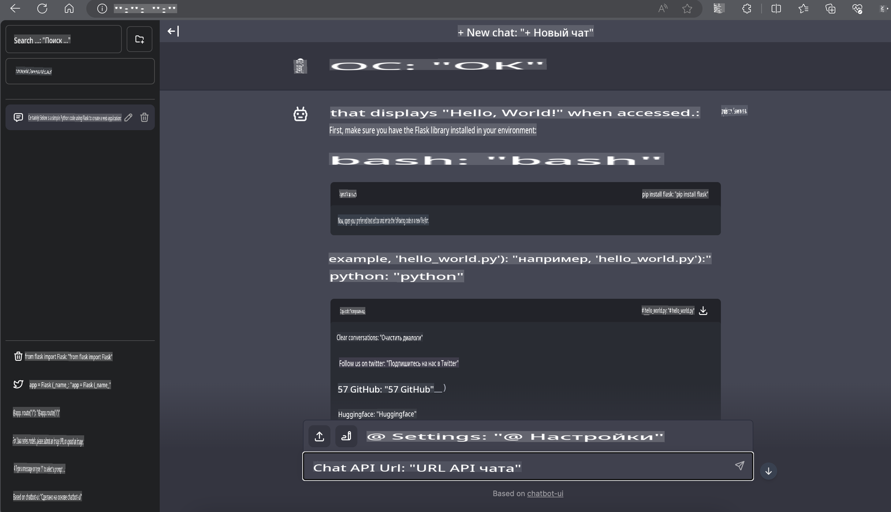

# **Inference Phi-3 на Nvidia Jetson**

Nvidia Jetson — это серия встраиваемых вычислительных плат от Nvidia. Модели Jetson TK1, TX1 и TX2 оснащены процессором Tegra (или SoC) от Nvidia, который включает центральный процессор (CPU) с архитектурой ARM. Jetson — это энергоэффективная система, разработанная для ускорения приложений машинного обучения. Nvidia Jetson используется профессиональными разработчиками для создания прорывных AI-продуктов в различных отраслях, а также студентами и энтузиастами для практического обучения искусственному интеллекту и создания потрясающих проектов. SLM разворачивается на пограничных устройствах, таких как Jetson, что обеспечивает более качественную реализацию промышленных сценариев применения генеративного ИИ.

## Развертывание на NVIDIA Jetson:
Разработчики, работающие над автономной робототехникой и встраиваемыми устройствами, могут использовать Phi-3 Mini. Относительно небольшой размер Phi-3 делает его идеальным для развертывания на периферийных устройствах. Параметры были тщательно настроены во время обучения, что обеспечивает высокую точность ответов.

### Оптимизация TensorRT-LLM:
Библиотека [TensorRT-LLM от NVIDIA](https://github.com/NVIDIA/TensorRT-LLM?WT.mc_id=aiml-138114-kinfeylo) оптимизирует вывод больших языковых моделей. Она поддерживает длинное контекстное окно Phi-3 Mini, улучшая как пропускную способность, так и задержку. Среди оптимизаций — такие техники, как LongRoPE, FP8 и обработка запросов в процессе выполнения (inflight batching).

### Доступность и развертывание:
Разработчики могут ознакомиться с Phi-3 Mini с контекстным окном на 128K на платформе [NVIDIA's AI](https://www.nvidia.com/en-us/ai-data-science/generative-ai/). Модель предоставляется в виде NVIDIA NIM — микросервиса со стандартным API, который можно развернуть где угодно. Также доступны [реализации TensorRT-LLM на GitHub](https://github.com/NVIDIA/TensorRT-LLM).

## **1. Подготовка**

a. Jetson Orin NX / Jetson NX

b. JetPack 5.1.2+

c. Cuda 11.8

d. Python 3.8+

## **2. Запуск Phi-3 на Jetson**

Мы можем выбрать [Ollama](https://ollama.com) или [LlamaEdge](https://llamaedge.com).

Если вы хотите использовать gguf одновременно в облаке и на периферийных устройствах, LlamaEdge можно рассматривать как WasmEdge (WasmEdge — это легковесная, высокопроизводительная, масштабируемая среда выполнения WebAssembly, подходящая для облачных, периферийных и децентрализованных приложений. Она поддерживает бессерверные приложения, встроенные функции, микросервисы, смарт-контракты и устройства IoT). Вы можете развернуть количественную модель gguf на периферийных устройствах и в облаке через LlamaEdge.


Вот шаги для использования:

1. Установите и скачайте соответствующие библиотеки и файлы

```bash

curl -sSf https://raw.githubusercontent.com/WasmEdge/WasmEdge/master/utils/install.sh | bash -s -- --plugin wasi_nn-ggml

curl -LO https://github.com/LlamaEdge/LlamaEdge/releases/latest/download/llama-api-server.wasm

curl -LO https://github.com/LlamaEdge/chatbot-ui/releases/latest/download/chatbot-ui.tar.gz

tar xzf chatbot-ui.tar.gz

```

**Примечание**: llama-api-server.wasm и chatbot-ui должны находиться в одной директории.

2. Запустите скрипты в терминале

```bash

wasmedge --dir .:. --nn-preload default:GGML:AUTO:{Your gguf path} llama-api-server.wasm -p phi-3-chat

```

Вот результат выполнения:



***Пример кода*** [Пример Phi-3 mini WASM Notebook](https://github.com/Azure-Samples/Phi-3MiniSamples/tree/main/wasm)

В заключение, Phi-3 Mini представляет собой значительный шаг вперед в языковом моделировании, объединяя эффективность, осведомленность о контексте и оптимизационные возможности NVIDIA. Независимо от того, создаете ли вы роботов или приложения для периферийных устройств, Phi-3 Mini — это мощный инструмент, который стоит учитывать.

**Отказ от ответственности**:  
Этот документ был переведен с использованием машинных сервисов автоматического перевода на основе ИИ. Хотя мы стремимся к точности, пожалуйста, имейте в виду, что автоматизированные переводы могут содержать ошибки или неточности. Оригинальный документ на его исходном языке следует считать авторитетным источником. Для получения критически важной информации рекомендуется профессиональный перевод человеком. Мы не несем ответственности за любые недоразумения или неверные толкования, возникшие в результате использования данного перевода.