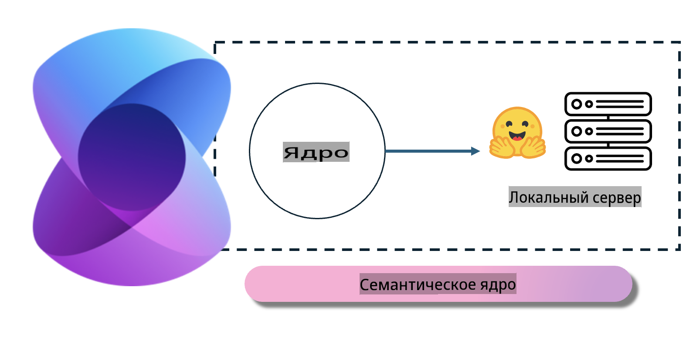
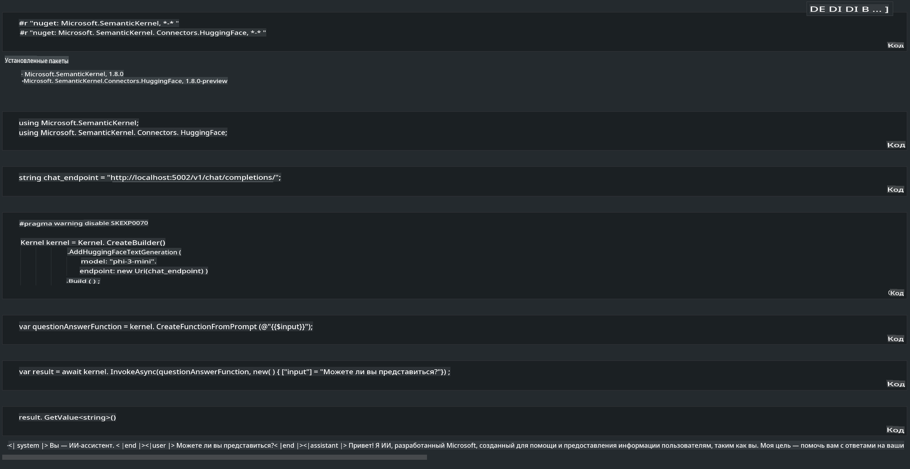

# **Развертывание Phi-3 на локальном сервере**

Мы можем развернуть Phi-3 на локальном сервере. Пользователи могут выбрать решения [Ollama](https://ollama.com) или [LM Studio](https://llamaedge.com), либо написать собственный код. Вы можете подключить локальные сервисы Phi-3 через [Semantic Kernel](https://github.com/microsoft/semantic-kernel?WT.mc_id=aiml-138114-kinfeylo) или [Langchain](https://www.langchain.com/) для создания приложений Copilot.

## **Использование Semantic Kernel для доступа к Phi-3-mini**

В приложении Copilot мы создаем приложения с помощью Semantic Kernel / LangChain. Этот тип фреймворка приложений обычно совместим с Azure OpenAI Service / OpenAI моделями, а также поддерживает модели с открытым исходным кодом на Hugging Face и локальные модели. Что делать, если мы хотим использовать Semantic Kernel для доступа к Phi-3-mini? Используя .NET в качестве примера, мы можем объединить его с Hugging Face Connector в Semantic Kernel. По умолчанию он может соответствовать id модели на Hugging Face (при первом использовании модель будет загружена с Hugging Face, что займет много времени). Вы также можете подключиться к созданному локальному сервису. Сравнивая оба варианта, мы рекомендуем использовать последний, так как он обеспечивает большую автономию, особенно в корпоративных приложениях.

На рисунке видно, что доступ к локальным сервисам через Semantic Kernel позволяет легко подключиться к созданному серверу модели Phi-3-mini. Вот результат выполнения:

***Пример кода*** https://github.com/kinfey/Phi3MiniSamples/tree/main/semantickernel

**Отказ от ответственности**:  
Этот документ был переведен с использованием автоматизированных сервисов машинного перевода на основе искусственного интеллекта. Хотя мы стремимся к точности, пожалуйста, учитывайте, что автоматические переводы могут содержать ошибки или неточности. Оригинальный документ на его родном языке следует считать авторитетным источником. Для получения критически важной информации рекомендуется профессиональный перевод человеком. Мы не несем ответственности за любые недоразумения или неправильные интерпретации, возникшие в результате использования данного перевода.