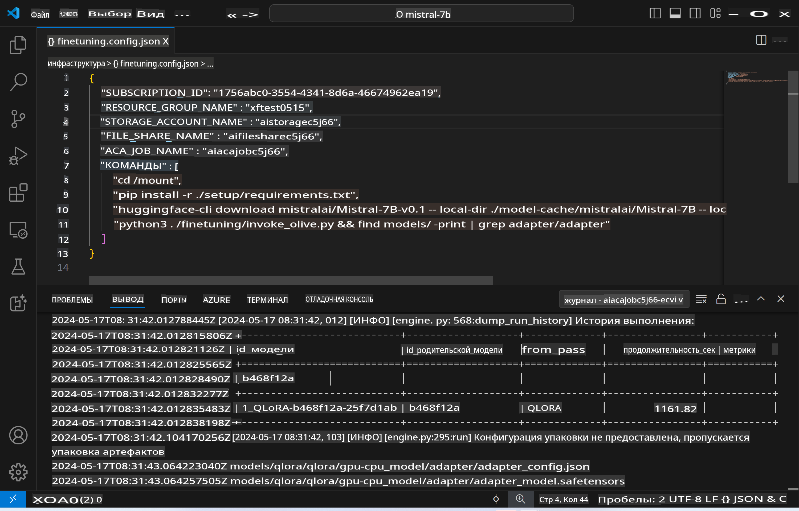
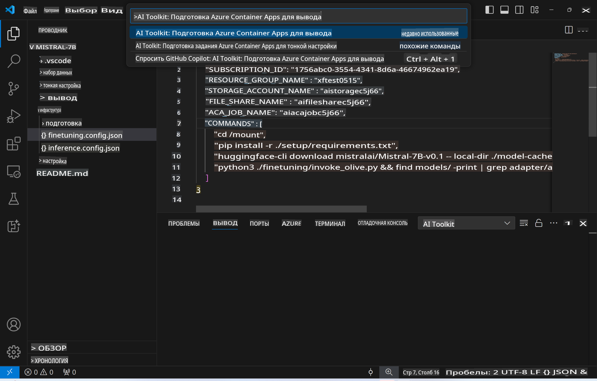
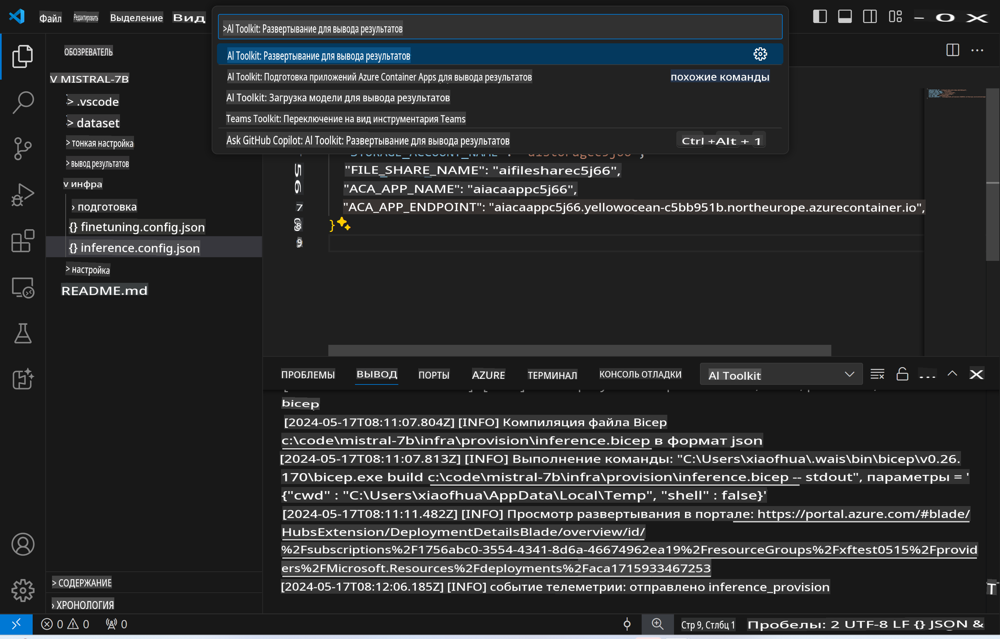
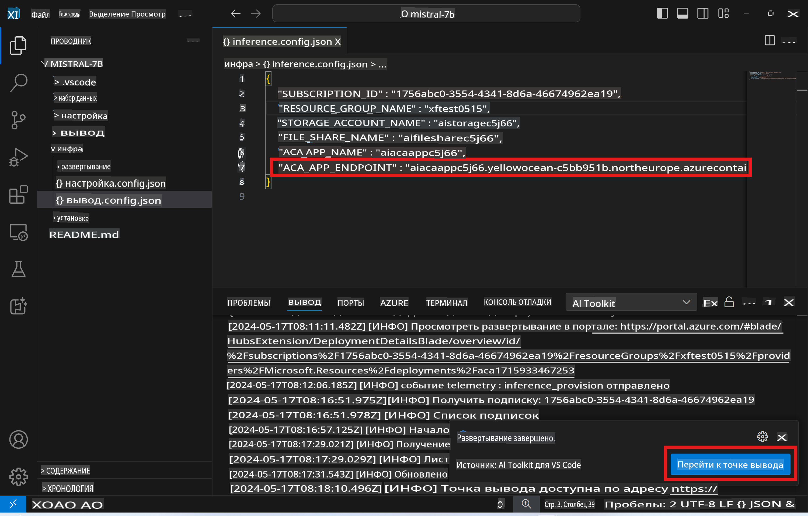

# Удаленное прогнозирование с настроенной моделью

После того как адаптеры обучены в удаленной среде, вы можете использовать простое приложение Gradio для взаимодействия с моделью.



### Настройка ресурсов Azure
Необходимо настроить ресурсы Azure для удаленного прогнозирования, выполнив команду `AI Toolkit: Provision Azure Container Apps for inference` из палитры команд. Во время настройки вам будет предложено выбрать подписку Azure и группу ресурсов.  

   
По умолчанию подписка и группа ресурсов для прогнозирования должны совпадать с теми, которые использовались для настройки. Для прогнозирования будет использоваться та же среда Azure Container App, а также модель и адаптер модели, хранящиеся в Azure Files, которые были созданы на этапе настройки.

## Использование AI Toolkit 

### Развертывание для прогнозирования  
Если вы хотите изменить код прогнозирования или перезагрузить модель, выполните команду `AI Toolkit: Deploy for inference`. Это синхронизирует ваш последний код с ACA и перезапустит реплику.  



После успешного завершения развертывания модель готова к оценке через этот конечный пункт.

### Доступ к API прогнозирования

Вы можете получить доступ к API прогнозирования, нажав кнопку "*Перейти к конечной точке прогнозирования*" в уведомлении VSCode. Также веб-адрес API можно найти под `ACA_APP_ENDPOINT` в `./infra/inference.config.json` и в выходной панели.



> **Примечание:** Конечная точка прогнозирования может занять несколько минут, чтобы стать полностью доступной.

## Компоненты прогнозирования, включенные в шаблон
 
| Папка | Содержимое |
| ------ |--------- |
| `infra` | Содержит все необходимые конфигурации для удаленных операций. |
| `infra/provision/inference.parameters.json` | Содержит параметры для bicep-шаблонов, используемых для настройки ресурсов Azure для прогнозирования. |
| `infra/provision/inference.bicep` | Содержит шаблоны для настройки ресурсов Azure для прогнозирования. |
| `infra/inference.config.json` | Конфигурационный файл, созданный командой `AI Toolkit: Provision Azure Container Apps for inference`. Используется в качестве входных данных для других удаленных команд. |

### Использование AI Toolkit для настройки ресурсов Azure
Настройте [AI Toolkit](https://marketplace.visualstudio.com/items?itemName=ms-windows-ai-studio.windows-ai-studio).

Настройте Azure Container Apps для прогнозирования ` command.

You can find configuration parameters in `./infra/provision/inference.parameters.json` file. Here are the details:
| Parameter | Description |
| --------- |------------ |
| `defaultCommands` | This is the commands to initiate a web API. |
| `maximumInstanceCount` | This parameter sets the maximum capacity of GPU instances. |
| `location` | This is the location where Azure resources are provisioned. The default value is the same as the chosen resource group's location. |
| `storageAccountName`, `fileShareName` `acaEnvironmentName`, `acaEnvironmentStorageName`, `acaAppName`,  `acaLogAnalyticsName` | These parameters are used to name the Azure resources for provision. By default, they will be same to the fine-tuning resource name. You can input a new, unused resource name to create your own custom-named resources, or you can input the name of an already existing Azure resource if you'd prefer to use that. For details, refer to the section [Using existing Azure Resources](../../../../../md/01.Introduction/03). |

### Using Existing Azure Resources

By default, the inference provision use the same Azure Container App Environment, Storage Account, Azure File Share, and Azure Log Analytics that were used for fine-tuning. A separate Azure Container App is created solely for the inference API. 

If you have customized the Azure resources during the fine-tuning step or want to use your own existing Azure resources for inference, specify their names in the `./infra/inference.parameters.json` файл. Затем выполните команду `AI Toolkit: Provision Azure Container Apps for inference` из палитры команд. Это обновит указанные ресурсы и создаст отсутствующие.

Например, если у вас уже есть существующая среда Azure Container, ваш файл `./infra/finetuning.parameters.json` должен выглядеть следующим образом:

```json
{
    "$schema": "https://schema.management.azure.com/schemas/2019-04-01/deploymentParameters.json#",
    "contentVersion": "1.0.0.0",
    "parameters": {
      ...
      "acaEnvironmentName": {
        "value": "<your-aca-env-name>"
      },
      "acaEnvironmentStorageName": {
        "value": null
      },
      ...
    }
  }
```

### Ручная настройка  
Если вы предпочитаете вручную настраивать ресурсы Azure, вы можете использовать предоставленные bicep-файлы в папке `./infra/provision` folders. If you have already set up and configured all the Azure resources without using the AI Toolkit command palette, you can simply enter the resource names in the `inference.config.json`.

Например:

```json
{
  "SUBSCRIPTION_ID": "<your-subscription-id>",
  "RESOURCE_GROUP_NAME": "<your-resource-group-name>",
  "STORAGE_ACCOUNT_NAME": "<your-storage-account-name>",
  "FILE_SHARE_NAME": "<your-file-share-name>",
  "ACA_APP_NAME": "<your-aca-name>",
  "ACA_APP_ENDPOINT": "<your-aca-endpoint>"
}
```

**Отказ от ответственности**:  
Данный документ был переведен с использованием автоматизированных сервисов машинного перевода на основе искусственного интеллекта. Несмотря на наши усилия по обеспечению точности, автоматические переводы могут содержать ошибки или неточности. Оригинальный документ на его исходном языке следует считать авторитетным источником. Для получения критически важной информации рекомендуется профессиональный перевод человеком. Мы не несем ответственности за любые недоразумения или неправильные интерпретации, возникающие в результате использования данного перевода.