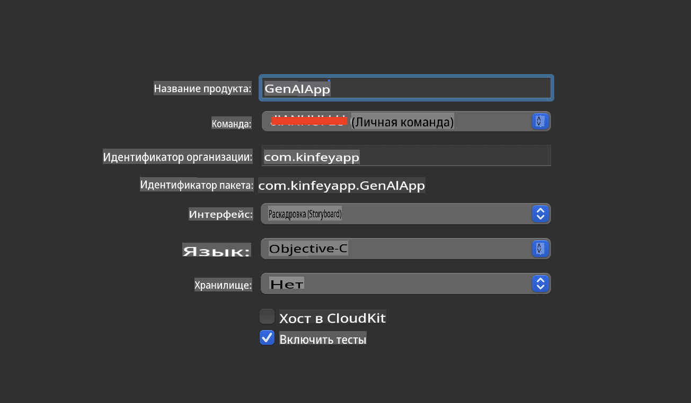
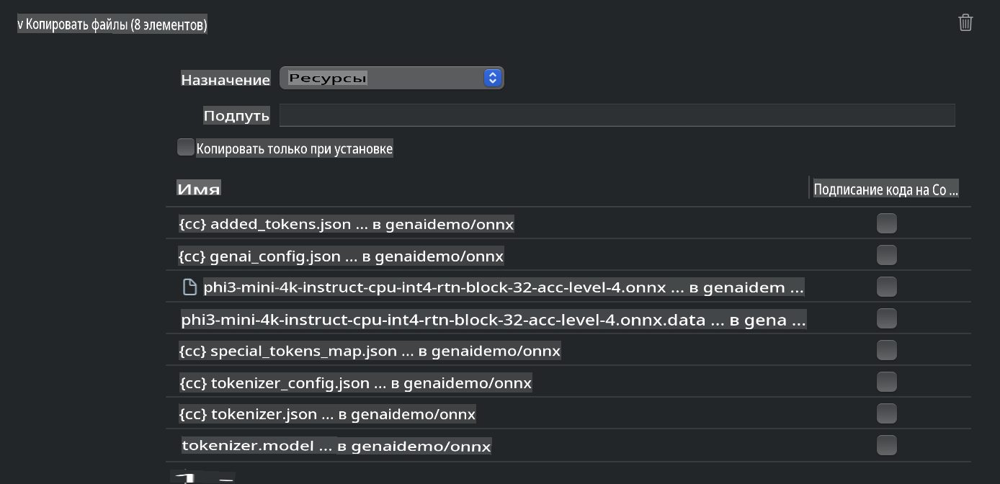
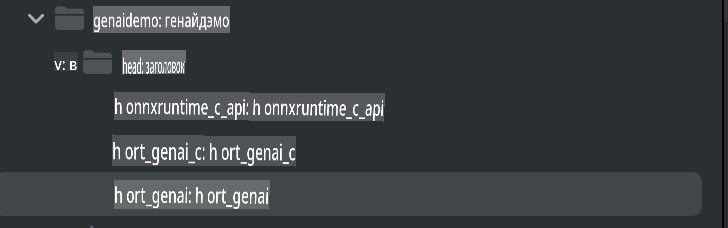
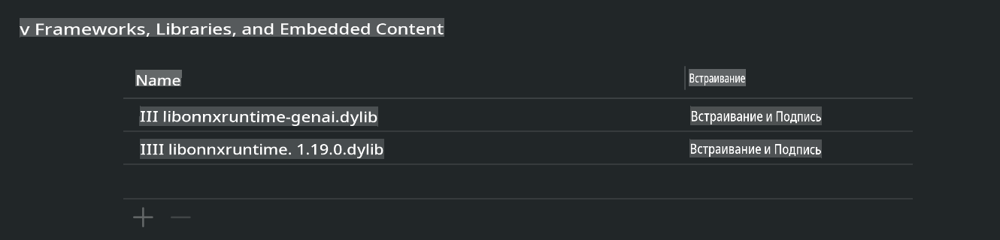
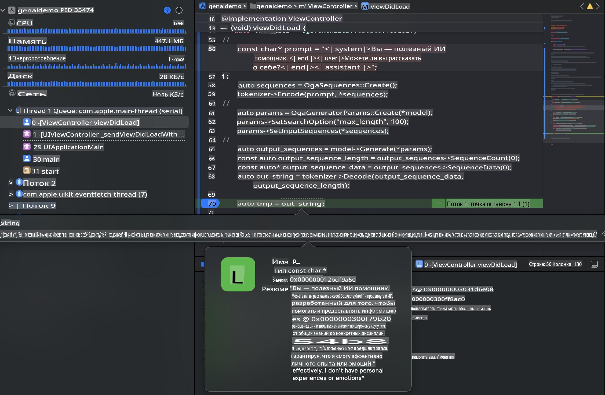

# **Inference Phi-3 на iOS**

Phi-3-mini — это новая серия моделей от Microsoft, которая позволяет разворачивать большие языковые модели (LLMs) на edge-устройствах и устройствах IoT. Phi-3-mini доступна для iOS, Android и Edge-устройств, что позволяет внедрять генеративный ИИ в средах BYOD. Пример ниже демонстрирует, как развернуть Phi-3-mini на iOS.

## **1. Подготовка**

- **a.** macOS 14+
- **b.** Xcode 15+
- **c.** iOS SDK 17.x (iPhone 14 A16 или новее)
- **d.** Установите Python 3.10+ (рекомендуется Conda)
- **e.** Установите библиотеку Python: `python-flatbuffers`
- **f.** Установите CMake

### Semantic Kernel и Inference

Semantic Kernel — это фреймворк для приложений, который позволяет создавать приложения, совместимые с Azure OpenAI Service, моделями OpenAI и локальными моделями. Доступ к локальным сервисам через Semantic Kernel упрощает интеграцию с вашим локально размещенным сервером модели Phi-3-mini.

### Вызов квантованных моделей с Ollama или LlamaEdge

Многие пользователи предпочитают использовать квантованные модели для локального запуска. [Ollama](https://ollama.com) и [LlamaEdge](https://llamaedge.com) позволяют вызывать различные квантованные модели:

#### **Ollama**

Вы можете запускать `ollama run phi3` напрямую или настроить его для оффлайн-работы. Создайте Modelfile с путем к вашему файлу `gguf`. Пример кода для запуска квантованной модели Phi-3-mini:

```gguf
FROM {Add your gguf file path}
TEMPLATE \"\"\"<|user|> .Prompt<|end|> <|assistant|>\"\"\"
PARAMETER stop <|end|>
PARAMETER num_ctx 4096
```

#### **LlamaEdge**

Если вы хотите использовать `gguf` одновременно в облаке и на edge-устройствах, LlamaEdge станет отличным выбором.

## **2. Компиляция ONNX Runtime для iOS**

```bash

git clone https://github.com/microsoft/onnxruntime.git

cd onnxruntime

./build.sh --build_shared_lib --ios --skip_tests --parallel --build_dir ./build_ios --ios --apple_sysroot iphoneos --osx_arch arm64 --apple_deploy_target 17.5 --cmake_generator Xcode --config Release

cd ../

```

### **Обратите внимание**

- **a.** Перед компиляцией убедитесь, что Xcode правильно настроен, и установите его как активный каталог разработчика в терминале:

    ```bash
    sudo xcode-select -switch /Applications/Xcode.app/Contents/Developer
    ```

- **b.** ONNX Runtime необходимо компилировать для разных платформ. Для iOS вы можете компилировать для `arm64` or `x86_64`.

- **c.** Рекомендуется использовать последнюю версию iOS SDK для компиляции. Однако вы также можете использовать более старую версию для совместимости с предыдущими SDK.

## **3. Компиляция Generative AI с ONNX Runtime для iOS**

> **Примечание:** Поскольку Generative AI с ONNX Runtime находится в стадии предварительного просмотра, возможны изменения.

```bash

git clone https://github.com/microsoft/onnxruntime-genai
 
cd onnxruntime-genai
 
mkdir ort
 
cd ort
 
mkdir include
 
mkdir lib
 
cd ../
 
cp ../onnxruntime/include/onnxruntime/core/session/onnxruntime_c_api.h ort/include
 
cp ../onnxruntime/build_ios/Release/Release-iphoneos/libonnxruntime*.dylib* ort/lib
 
export OPENCV_SKIP_XCODEBUILD_FORCE_TRYCOMPILE_DEBUG=1
 
python3 build.py --parallel --build_dir ./build_ios --ios --ios_sysroot iphoneos --ios_arch arm64 --ios_deployment_target 17.5 --cmake_generator Xcode --cmake_extra_defines CMAKE_XCODE_ATTRIBUTE_CODE_SIGNING_ALLOWED=NO

```

## **4. Создание приложения App в Xcode**

Я выбрал Objective-C в качестве метода разработки приложения, так как использование Generative AI с C++ API ONNX Runtime лучше совместимо с Objective-C. Конечно, вы также можете выполнить соответствующие вызовы через Swift bridging.



## **5. Копирование квантованной модели INT4 ONNX в проект приложения**

Необходимо импортировать модель с квантованием INT4 в формате ONNX, которую нужно сначала загрузить.


После загрузки необходимо добавить ее в директорию Resources проекта в Xcode.



## **6. Добавление C++ API в ViewControllers**

> **Обратите внимание:**

- **a.** Добавьте соответствующие заголовочные файлы C++ в проект.

  

- **b.** Включите `onnxruntime-genai` dynamic library in Xcode.

  

- **c.** Use the C Samples code for testing. You can also add additional features like ChatUI for more functionality.

- **d.** Since you need to use C++ in your project, rename `ViewController.m` to `ViewController.mm` для поддержки Objective-C++.

```objc

    NSString *llmPath = [[NSBundle mainBundle] resourcePath];
    char const *modelPath = llmPath.cString;

    auto model =  OgaModel::Create(modelPath);

    auto tokenizer = OgaTokenizer::Create(*model);

    const char* prompt = "<|system|>You are a helpful AI assistant.<|end|><|user|>Can you introduce yourself?<|end|><|assistant|>";

    auto sequences = OgaSequences::Create();
    tokenizer->Encode(prompt, *sequences);

    auto params = OgaGeneratorParams::Create(*model);
    params->SetSearchOption("max_length", 100);
    params->SetInputSequences(*sequences);

    auto output_sequences = model->Generate(*params);
    const auto output_sequence_length = output_sequences->SequenceCount(0);
    const auto* output_sequence_data = output_sequences->SequenceData(0);
    auto out_string = tokenizer->Decode(output_sequence_data, output_sequence_length);
    
    auto tmp = out_string;

```

## **7. Запуск приложения**

После завершения настройки вы можете запустить приложение и увидеть результаты инференса модели Phi-3-mini.



Для получения дополнительного примера кода и подробных инструкций посетите [репозиторий Phi-3 Mini Samples](https://github.com/Azure-Samples/Phi-3MiniSamples/tree/main/ios).

**Отказ от ответственности**:  
Данный документ был переведен с использованием автоматических AI-сервисов перевода. Несмотря на наши усилия обеспечить точность, обратите внимание, что автоматизированные переводы могут содержать ошибки или неточности. Оригинальный документ на его исходном языке следует считать авторитетным источником. Для получения критически важной информации рекомендуется использовать профессиональный перевод, выполненный человеком. Мы не несем ответственности за любые недоразумения или неправильные интерпретации, возникшие в результате использования данного перевода.