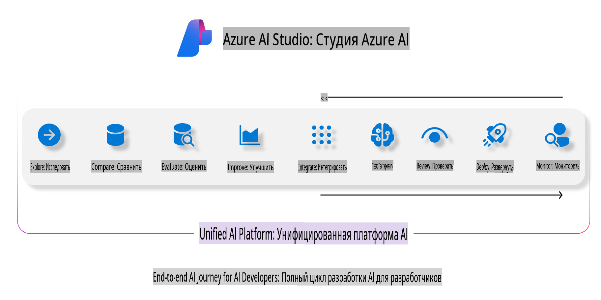
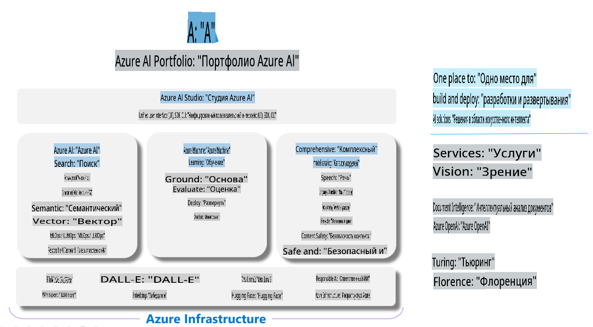

# **Использование Azure AI Foundry для оценки**

Как оценить ваше приложение с генеративным ИИ с помощью [Azure AI Foundry](https://ai.azure.com?WT.mc_id=aiml-138114-kinfeylo). Независимо от того, оцениваете ли вы одноходовые или многоходовые диалоги, Azure AI Foundry предоставляет инструменты для анализа производительности и безопасности модели.

## Как оценивать приложения с генеративным ИИ с помощью Azure AI Foundry
Для получения более подробных инструкций обратитесь к [документации Azure AI Foundry](https://learn.microsoft.com/azure/ai-studio/how-to/evaluate-generative-ai-app?WT.mc_id=aiml-138114-kinfeylo).

Вот шаги для начала:

## Оценка генеративных моделей ИИ в Azure AI Foundry

**Предварительные требования**

- Тестовый набор данных в формате CSV или JSON.  
- Развернутая генеративная модель ИИ (например, Phi-3, GPT 3.5, GPT 4 или модели Davinci).  
- Среда выполнения с вычислительным экземпляром для запуска оценки.  

## Встроенные метрики оценки

Azure AI Foundry позволяет оценивать как одноходовые, так и сложные многоходовые диалоги.  
Для сценариев Retrieval Augmented Generation (RAG), где модель основывается на конкретных данных, вы можете оценивать производительность с помощью встроенных метрик.  
Кроме того, можно оценивать общие сценарии одноходового ответа на вопросы (не RAG).

## Создание процесса оценки

В интерфейсе Azure AI Foundry перейдите на страницу Evaluate или Prompt Flow.  
Следуйте мастеру создания оценки, чтобы настроить процесс оценки. Укажите необязательное имя для вашей оценки.  
Выберите сценарий, который соответствует целям вашего приложения.  
Выберите одну или несколько метрик оценки для анализа результатов модели.

## Пользовательский процесс оценки (опционально)

Для большей гибкости вы можете создать пользовательский процесс оценки. Настройте процесс оценки в соответствии с вашими конкретными требованиями.

## Просмотр результатов

После завершения оценки просмотрите и проанализируйте детализированные метрики в Azure AI Foundry. Получите представление о возможностях и ограничениях вашего приложения.

**Примечание** Azure AI Foundry в настоящее время находится в стадии публичного предварительного просмотра, поэтому используйте его для экспериментов и разработки. Для рабочих нагрузок в производственной среде рассмотрите другие варианты. Изучите официальную [документацию AI Foundry](https://learn.microsoft.com/azure/ai-studio/?WT.mc_id=aiml-138114-kinfeylo) для получения дополнительных сведений и пошаговых инструкций.

**Отказ от ответственности**:  
Этот документ был переведен с использованием автоматизированных сервисов машинного перевода. Несмотря на наши усилия обеспечить точность, имейте в виду, что автоматические переводы могут содержать ошибки или неточности. Оригинальный документ на его исходном языке следует считать авторитетным источником. Для получения критически важной информации рекомендуется использовать профессиональный человеческий перевод. Мы не несем ответственности за любые недоразумения или неправильные интерпретации, возникшие в результате использования данного перевода.