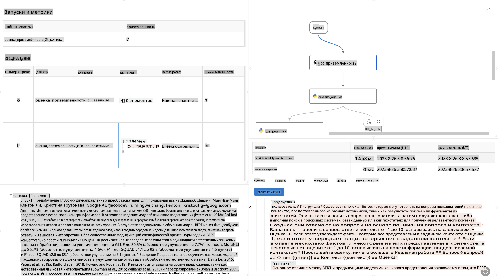

# **Введение в Promptflow**

[Microsoft Prompt Flow](https://microsoft.github.io/promptflow/index.html?WT.mc_id=aiml-138114-kinfeylo) — это визуальный инструмент автоматизации рабочих процессов, который позволяет пользователям создавать автоматизированные процессы с использованием готовых шаблонов и пользовательских коннекторов. Он разработан для того, чтобы разработчики и бизнес-аналитики могли быстро создавать автоматизированные процессы для задач, таких как управление данными, сотрудничество и оптимизация процессов. С помощью Prompt Flow пользователи могут легко соединять различные сервисы, приложения и системы, автоматизируя сложные бизнес-процессы.

Microsoft Prompt Flow упрощает полный цикл разработки приложений на основе больших языковых моделей (LLM). Независимо от того, на каком этапе вы находитесь — идеи, прототипирование, тестирование, оценка или развертывание — Prompt Flow делает процесс проще и позволяет создавать приложения на основе LLM промышленного уровня.

## Основные возможности и преимущества Microsoft Prompt Flow:

**Интерактивный опыт разработки**

Prompt Flow предоставляет визуальное представление структуры вашего процесса, что облегчает понимание и навигацию по проектам.  
Он предлагает интерфейс, напоминающий ноутбуки, для эффективной разработки и отладки процессов.

**Варианты запросов и их настройка**

Создавайте и сравнивайте несколько вариантов запросов, чтобы упростить процесс итеративного улучшения.  
Оценивайте производительность различных запросов и выбирайте наиболее эффективные.

**Встроенные потоки оценки**

Оценивайте качество и эффективность ваших запросов и процессов с помощью встроенных инструментов оценки.  
Понимайте, насколько хорошо работают ваши приложения на основе LLM.

**Обширные ресурсы**

Prompt Flow включает библиотеку встроенных инструментов, примеров и шаблонов.  
Эти ресурсы служат отправной точкой для разработки, вдохновляют на творчество и ускоряют процесс.

**Совместная работа и готовность к корпоративному использованию**

Поддерживайте командную работу, позволяя нескольким пользователям совместно работать над проектами по созданию запросов.  
Обеспечивайте контроль версий и эффективно делитесь знаниями. Упрощайте весь процесс создания запросов — от разработки и оценки до развертывания и мониторинга.

## Оценка в Prompt Flow

В Microsoft Prompt Flow оценка играет ключевую роль в анализе производительности ваших AI-моделей. Давайте рассмотрим, как вы можете настроить потоки оценки и метрики в Prompt Flow:

**Понимание оценки в Prompt Flow**

В Prompt Flow процесс представляет собой последовательность узлов, которые обрабатывают входные данные и генерируют выходные. Потоки оценки — это особый тип процессов, предназначенный для анализа производительности выполнения на основе определённых критериев и целей.

**Основные характеристики потоков оценки**

Они обычно запускаются после тестируемого процесса, используя его выходные данные.  
Они рассчитывают баллы или метрики для измерения производительности тестируемого процесса.  
Метрики могут включать точность, релевантность или другие значимые показатели.

### Настройка потоков оценки

**Определение входных данных**

Потоки оценки должны принимать выходные данные тестируемого процесса. Определяйте входные данные так же, как и для стандартных процессов.  
Например, если вы оцениваете процесс "Вопрос-Ответ", назовите вход "ответ". Если оцениваете процесс классификации, назовите вход "категория". Также могут потребоваться эталонные входные данные (например, фактические метки).

**Выходные данные и метрики**

Потоки оценки создают результаты, измеряющие производительность тестируемого процесса.  
Метрики можно рассчитывать с использованием Python или LLM (больших языковых моделей).  
Используйте функцию log_metric() для регистрации соответствующих метрик.

**Использование настроенных потоков оценки**

Разрабатывайте свои собственные потоки оценки, адаптированные под ваши задачи и цели.  
Настраивайте метрики в зависимости от ваших целей оценки.  
Применяйте эти настроенные потоки оценки к пакетным запускам для масштабного тестирования.

## Встроенные методы оценки

Prompt Flow также предоставляет встроенные методы оценки.  
Вы можете отправлять пакетные запуски и использовать эти методы для анализа производительности процессов на больших наборах данных.  
Просматривайте результаты оценки, сравнивайте метрики и вносите изменения по мере необходимости.  
Помните, что оценка необходима для того, чтобы убедиться, что ваши AI-модели соответствуют желаемым критериям и целям. Ознакомьтесь с официальной документацией для получения подробных инструкций по разработке и использованию потоков оценки в Microsoft Prompt Flow.

В заключение, Microsoft Prompt Flow предоставляет разработчикам возможность создавать качественные приложения на основе LLM, упрощая процесс создания запросов и обеспечивая надёжную среду разработки. Если вы работаете с LLM, Prompt Flow — это инструмент, который стоит изучить. Ознакомьтесь с [документацией по оценке в Prompt Flow](https://learn.microsoft.com/azure/machine-learning/prompt-flow/how-to-develop-an-evaluation-flow?view=azureml-api-2?WT.mc_id=aiml-138114-kinfeylo) для получения подробных инструкций по разработке и использованию потоков оценки в Microsoft Prompt Flow.

**Отказ от ответственности**:  
Этот документ был переведен с использованием автоматических сервисов перевода на основе ИИ. Хотя мы стремимся к точности, пожалуйста, имейте в виду, что автоматические переводы могут содержать ошибки или неточности. Оригинальный документ на его исходном языке следует считать авторитетным источником. Для получения критически важной информации рекомендуется профессиональный перевод человеком. Мы не несем ответственности за любые недоразумения или неправильные интерпретации, возникающие в результате использования данного перевода.