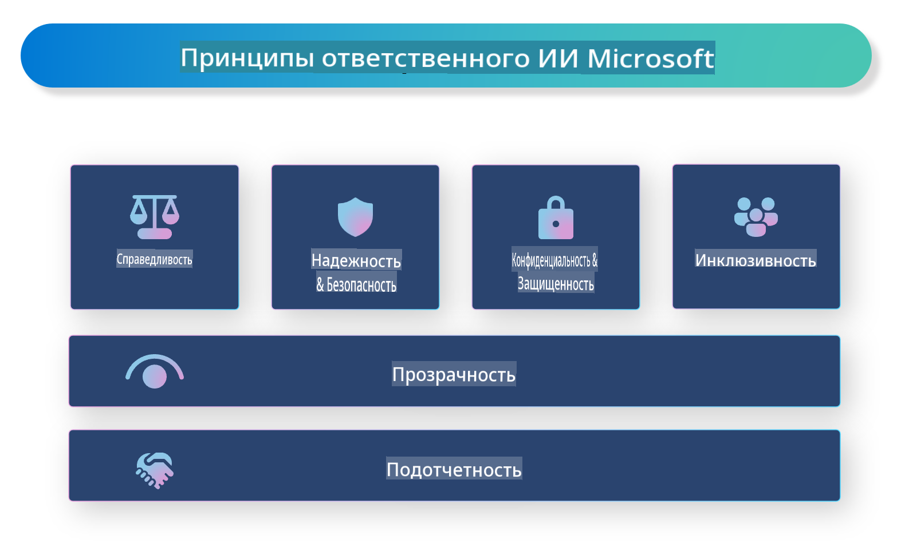

# **Введение в ответственное ИИ**

[Microsoft Responsible AI](https://www.microsoft.com/ai/responsible-ai?WT.mc_id=aiml-138114-kinfeylo) — это инициатива, направленная на помощь разработчикам и организациям в создании ИИ-систем, которые являются прозрачными, надежными и подотчетными. Эта инициатива предоставляет рекомендации и ресурсы для разработки ответственных ИИ-решений, соответствующих этическим принципам, таким как конфиденциальность, справедливость и прозрачность. Мы также рассмотрим некоторые вызовы и лучшие практики, связанные с созданием ответственных ИИ-систем.

## Обзор Microsoft Responsible AI

**Этические принципы**

Microsoft Responsible AI основывается на наборе этических принципов, таких как конфиденциальность, справедливость, прозрачность, подотчетность и безопасность. Эти принципы направлены на то, чтобы ИИ-системы разрабатывались этично и ответственно.

**Прозрачный ИИ**

Microsoft Responsible AI подчеркивает важность прозрачности в ИИ-системах. Это включает в себя предоставление четких объяснений работы моделей ИИ, а также обеспечение доступности источников данных и алгоритмов.

**Подотчетный ИИ**

[Microsoft Responsible AI](https://www.microsoft.com/ai/responsible-ai?WT.mc_id=aiml-138114-kinfeylo) продвигает разработку подотчетных ИИ-систем, которые могут предоставлять информацию о том, как модели ИИ принимают решения. Это помогает пользователям понять и доверять результатам работы ИИ.

**Инклюзивность**

ИИ-системы должны быть разработаны для блага всех. Microsoft стремится создавать инклюзивный ИИ, который учитывает разнообразные точки зрения и избегает предвзятости или дискриминации.

**Надежность и безопасность**

Обеспечение надежности и безопасности ИИ-систем является ключевым. Microsoft фокусируется на создании устойчивых моделей, которые работают стабильно и избегают вредоносных последствий.

**Справедливость в ИИ**

Microsoft Responsible AI признает, что ИИ-системы могут поддерживать предвзятость, если они обучены на предвзятых данных или алгоритмах. Инициатива предоставляет рекомендации по разработке справедливых ИИ-систем, которые не дискриминируют по признакам, таким как раса, пол или возраст.

**Конфиденциальность и безопасность**

Microsoft Responsible AI подчеркивает важность защиты конфиденциальности пользователей и безопасности данных в ИИ-системах. Это включает в себя использование надежного шифрования данных и контроля доступа, а также регулярный аудит ИИ-систем на наличие уязвимостей.

**Подотчетность и ответственность**

Microsoft Responsible AI продвигает подотчетность и ответственность в разработке и развертывании ИИ. Это включает в себя обеспечение осведомленности разработчиков и организаций о потенциальных рисках, связанных с ИИ-системами, и принятие мер по их минимизации.

## Лучшие практики для создания ответственных ИИ-систем

**Разрабатывайте модели ИИ, используя разнообразные наборы данных**

Чтобы избежать предвзятости в ИИ-системах, важно использовать разнообразные наборы данных, которые отражают широкий спектр точек зрения и опыта.

**Используйте объяснимые методы ИИ**

Объяснимые методы ИИ помогают пользователям понять, как модели принимают решения, что увеличивает доверие к системе.

**Регулярно проводите аудит ИИ-систем на наличие уязвимостей**

Регулярные аудиты ИИ-систем помогают выявлять потенциальные риски и уязвимости, которые требуют устранения.

**Реализуйте надежное шифрование данных и контроль доступа**

Шифрование данных и контроль доступа помогают защитить конфиденциальность пользователей и безопасность в ИИ-системах.

**Следуйте этическим принципам в разработке ИИ**

Следование этическим принципам, таким как справедливость, прозрачность и подотчетность, помогает повысить доверие к ИИ-системам и гарантирует их ответственную разработку.

## Использование AI Foundry для ответственного ИИ

[Azure AI Foundry](https://ai.azure.com?WT.mc_id=aiml-138114-kinfeylo) — это мощная платформа, которая позволяет разработчикам и организациям быстро создавать интеллектуальные, передовые, готовые к рынку и ответственные приложения. Вот некоторые ключевые функции и возможности Azure AI Foundry:

**Готовые API и модели**

Azure AI Foundry предоставляет готовые и настраиваемые API и модели. Они охватывают широкий спектр задач ИИ, включая генеративный ИИ, обработку естественного языка для общения, поиск, мониторинг, перевод, речь, зрение и принятие решений.

**Prompt Flow**

Функция prompt flow в Azure AI Foundry позволяет создавать интерактивные ИИ-решения. Она упрощает проектирование и управление диалоговыми потоками, что особенно полезно для создания чат-ботов, виртуальных помощников и других интерактивных приложений.

**Генерация с использованием дополненного извлечения (RAG)**

RAG — это метод, который сочетает подходы на основе извлечения и генерации. Он улучшает качество сгенерированных ответов, используя как существующие знания (извлечение), так и творческую генерацию.

**Оценка и мониторинг метрик для генеративного ИИ**

Azure AI Foundry предоставляет инструменты для оценки и мониторинга моделей генеративного ИИ. Вы можете оценивать их производительность, справедливость и другие важные метрики для обеспечения ответственного развертывания. Кроме того, если вы создали дашборд, вы можете использовать интерфейс без кода в Azure Machine Learning Studio для настройки и создания панели Responsible AI Dashboard и сопутствующей карты оценок на основе [Responsible AI Toolbox](https://responsibleaitoolbox.ai/?WT.mc_id=aiml-138114-kinfeylo) библиотек Python. Эта карта помогает делиться ключевыми выводами, связанными со справедливостью, важностью признаков и другими аспектами ответственного развертывания, как с техническими, так и с нетехническими заинтересованными сторонами.

Чтобы использовать AI Foundry для ответственного ИИ, следуйте этим лучшим практикам:

**Определите задачу и цели вашей ИИ-системы**

Перед началом разработки важно четко определить задачу или цель, которую должна решить ваша ИИ-система. Это поможет вам определить данные, алгоритмы и ресурсы, необходимые для создания эффективной модели.

**Соберите и обработайте релевантные данные**

Качество и объем данных, используемых для обучения ИИ-системы, существенно влияют на ее производительность. Поэтому важно собрать релевантные данные, очистить их, обработать и убедиться, что они представляют популяцию или проблему, которую вы пытаетесь решить.

**Выберите подходящие методы оценки**

Существует множество алгоритмов оценки. Важно выбрать наиболее подходящий алгоритм в зависимости от ваших данных и задачи.

**Оцените и интерпретируйте модель**

После создания модели ИИ важно оценить ее производительность с использованием соответствующих метрик и прозрачно интерпретировать результаты. Это поможет выявить возможные предвзятости или ограничения модели и внести необходимые улучшения.

**Обеспечьте прозрачность и объяснимость**

ИИ-системы должны быть прозрачными и объяснимыми, чтобы пользователи могли понять, как они работают и как принимаются решения. Это особенно важно для приложений, которые оказывают значительное влияние на человеческую жизнь, таких как здравоохранение, финансы и правовая сфера.

**Мониторьте и обновляйте модель**

ИИ-системы должны постоянно мониториться и обновляться, чтобы оставаться точными и эффективными со временем. Это требует регулярного обслуживания, тестирования и переобучения модели.

В заключение, Microsoft Responsible AI — это инициатива, направленная на помощь разработчикам и организациям в создании прозрачных, надежных и подотчетных ИИ-систем. Помните, что ответственное внедрение ИИ крайне важно, и Azure AI Foundry стремится сделать это практичным для организаций. Следуя этическим принципам и лучшим практикам, мы можем гарантировать, что ИИ-системы разрабатываются и внедряются ответственно, принося пользу всему обществу.

**Отказ от ответственности**:  
Этот документ был переведен с использованием автоматизированных сервисов машинного перевода на основе ИИ. Хотя мы стремимся к точности, пожалуйста, имейте в виду, что автоматические переводы могут содержать ошибки или неточности. Оригинальный документ на его родном языке должен рассматриваться как авторитетный источник. Для получения критически важной информации рекомендуется профессиональный перевод человеком. Мы не несем ответственности за любые недоразумения или неправильные интерпретации, возникшие в результате использования данного перевода.