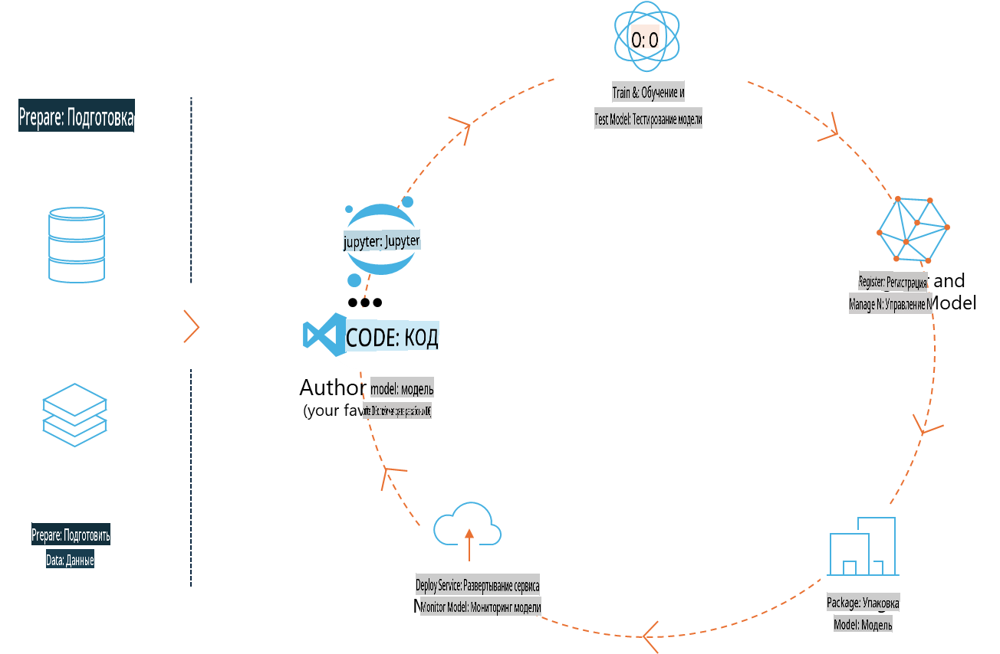
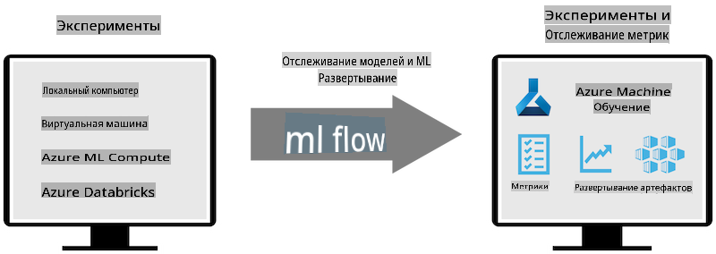
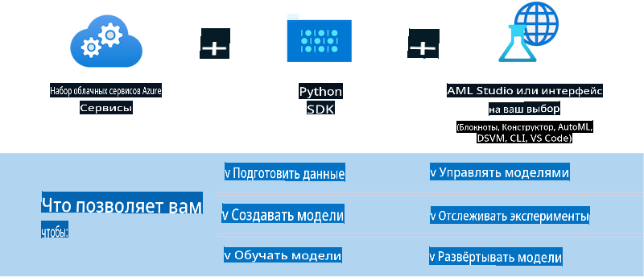

# MLflow

[MLflow](https://mlflow.org/) — это открытая платформа, предназначенная для управления всем жизненным циклом машинного обучения.



MLFlow используется для управления жизненным циклом машинного обучения, включая эксперименты, воспроизводимость, развертывание и центральный реестр моделей. В настоящее время MLFlow предлагает четыре компонента:

- **MLflow Tracking:** Запись и запрос экспериментов, кода, конфигурации данных и результатов.
- **MLflow Projects:** Упаковка кода для науки о данных в формате, который позволяет воспроизводить выполнение на любой платформе.
- **Mlflow Models:** Развертывание моделей машинного обучения в различных средах обслуживания.
- **Model Registry:** Хранение, аннотирование и управление моделями в центральном репозитории.

MLFlow включает возможности для отслеживания экспериментов, упаковки кода в воспроизводимые выполнения, а также обмена и развертывания моделей. MLFlow интегрирован с Databricks и поддерживает множество библиотек машинного обучения, что делает его независимым от конкретных библиотек. Он может использоваться с любой библиотекой машинного обучения и на любом языке программирования, предоставляя REST API и CLI для удобства.



Ключевые возможности MLFlow включают:

- **Отслеживание экспериментов:** Запись и сравнение параметров и результатов.
- **Управление моделями:** Развертывание моделей на различных платформах обслуживания и инференса.
- **Реестр моделей:** Совместное управление жизненным циклом моделей MLFlow, включая версионирование и аннотации.
- **Проекты:** Упаковка кода машинного обучения для обмена или использования в производстве.

MLFlow также поддерживает цикл MLOps, включающий подготовку данных, регистрацию и управление моделями, упаковку моделей для выполнения, развертывание сервисов и мониторинг моделей. Цель — упростить процесс перехода от прототипа к производственному рабочему процессу, особенно в облачных и периферийных средах.

## Сценарий от начала до конца (E2E) — Создание обертки и использование Phi-3 в качестве модели MLFlow

В этом примере от начала до конца мы продемонстрируем два различных подхода к созданию обертки вокруг малой языковой модели Phi-3 (SLM), а затем запуску ее в качестве модели MLFlow либо локально, либо в облаке, например, в рабочей области Azure Machine Learning.



| Проект | Описание | Местоположение |
| ------------ | ----------- | -------- |
| Transformer Pipeline | Transformer Pipeline — это самый простой способ создать обертку, если вы хотите использовать модель HuggingFace с экспериментальным "transformers" форматом MLFlow. | [**TransformerPipeline.ipynb**](../../../../../../code/06.E2E/E2E_Phi-3-MLflow_TransformerPipeline.ipynb) |
| Custom Python Wrapper | На момент написания статьи, "transformer pipeline" не поддерживал генерацию обертки MLFlow для моделей HuggingFace в формате ONNX, даже с экспериментальным пакетом Python "optimum". В таких случаях вы можете создать свою собственную обертку на Python для режима MLFlow. | [**CustomPythonWrapper.ipynb**](../../../../../../code/06.E2E/E2E_Phi-3-MLflow_CustomPythonWrapper.ipynb) |

## Проект: Transformer Pipeline

1. Вам понадобятся соответствующие пакеты Python из MLFlow и HuggingFace:

    ``` Python
    import mlflow
    import transformers
    ```

2. Далее, вы должны инициировать pipeline, ссылаясь на целевую модель Phi-3 в реестре HuggingFace. Как видно из карточки модели _Phi-3-mini-4k-instruct_, ее задача относится к типу "Генерация текста":

    ``` Python
    pipeline = transformers.pipeline(
        task = "text-generation",
        model = "microsoft/Phi-3-mini-4k-instruct"
    )
    ```

3. Теперь вы можете сохранить pipeline модели Phi-3 в формате MLFlow и указать дополнительные детали, такие как путь для артефактов, настройки конфигурации модели и тип API для инференса:

    ``` Python
    model_info = mlflow.transformers.log_model(
        transformers_model = pipeline,
        artifact_path = "phi3-mlflow-model",
        model_config = model_config,
        task = "llm/v1/chat"
    )
    ```

## Проект: Custom Python Wrapper

1. Здесь мы можем использовать [ONNX Runtime generate() API](https://github.com/microsoft/onnxruntime-genai) от Microsoft для инференса модели ONNX и кодирования/декодирования токенов. Вам нужно выбрать пакет _onnxruntime_genai_ для вашей целевой вычислительной среды, например, для CPU:

    ``` Python
    import mlflow
    from mlflow.models import infer_signature
    import onnxruntime_genai as og
    ```

1. Наш пользовательский класс реализует два метода: _load_context()_ для инициализации **ONNX модели** Phi-3 Mini 4K Instruct, **параметров генератора** и **токенизатора**; и _predict()_ для генерации выходных токенов на основе предоставленного запроса:

    ``` Python
    class Phi3Model(mlflow.pyfunc.PythonModel):
        def load_context(self, context):
            # Retrieving model from the artifacts
            model_path = context.artifacts["phi3-mini-onnx"]
            model_options = {
                 "max_length": 300,
                 "temperature": 0.2,         
            }
        
            # Defining the model
            self.phi3_model = og.Model(model_path)
            self.params = og.GeneratorParams(self.phi3_model)
            self.params.set_search_options(**model_options)
            
            # Defining the tokenizer
            self.tokenizer = og.Tokenizer(self.phi3_model)
    
        def predict(self, context, model_input):
            # Retrieving prompt from the input
            prompt = model_input["prompt"][0]
            self.params.input_ids = self.tokenizer.encode(prompt)
    
            # Generating the model's response
            response = self.phi3_model.generate(self.params)
    
            return self.tokenizer.decode(response[0][len(self.params.input_ids):])
    ```

1. Теперь вы можете использовать функцию _mlflow.pyfunc.log_model()_ для генерации пользовательской обертки на Python (в формате pickle) для модели Phi-3, вместе с оригинальной моделью ONNX и необходимыми зависимостями:

    ``` Python
    model_info = mlflow.pyfunc.log_model(
        artifact_path = artifact_path,
        python_model = Phi3Model(),
        artifacts = {
            "phi3-mini-onnx": "cpu_and_mobile/cpu-int4-rtn-block-32-acc-level-4",
        },
        input_example = input_example,
        signature = infer_signature(input_example, ["Run"]),
        extra_pip_requirements = ["torch", "onnxruntime_genai", "numpy"],
    )
    ```

## Подписи сгенерированных моделей MLFlow

1. На шаге 3 проекта Transformer Pipeline мы установили задачу модели MLFlow как “_llm/v1/chat_”. Такая инструкция создает API-обертку модели, совместимую с Chat API от OpenAI, как показано ниже:

    ``` Python
    {inputs: 
      ['messages': Array({content: string (required), name: string (optional), role: string (required)}) (required), 'temperature': double (optional), 'max_tokens': long (optional), 'stop': Array(string) (optional), 'n': long (optional), 'stream': boolean (optional)],
    outputs: 
      ['id': string (required), 'object': string (required), 'created': long (required), 'model': string (required), 'choices': Array({finish_reason: string (required), index: long (required), message: {content: string (required), name: string (optional), role: string (required)} (required)}) (required), 'usage': {completion_tokens: long (required), prompt_tokens: long (required), total_tokens: long (required)} (required)],
    params: 
      None}
    ```

1. В результате вы можете отправить ваш запрос в следующем формате:

    ``` Python
    messages = [{"role": "user", "content": "What is the capital of Spain?"}]
    ```

1. Затем используйте постобработку, совместимую с OpenAI API, например, _response[0][‘choices’][0][‘message’][‘content’]_, чтобы привести ваш вывод к следующему виду:

    ``` JSON
    Question: What is the capital of Spain?
    
    Answer: The capital of Spain is Madrid. It is the largest city in Spain and serves as the political, economic, and cultural center of the country. Madrid is located in the center of the Iberian Peninsula and is known for its rich history, art, and architecture, including the Royal Palace, the Prado Museum, and the Plaza Mayor.
    
    Usage: {'prompt_tokens': 11, 'completion_tokens': 73, 'total_tokens': 84}
    ```

1. На шаге 3 проекта Custom Python Wrapper мы позволяем пакету MLFlow сгенерировать подпись модели на основе предоставленного примера ввода. Подпись обертки MLFlow будет выглядеть следующим образом:

    ``` Python
    {inputs: 
      ['prompt': string (required)],
    outputs: 
      [string (required)],
    params: 
      None}
    ```

1. Таким образом, ваш запрос должен содержать ключ словаря "prompt", например:

    ``` Python
    {"prompt": "<|system|>You are a stand-up comedian.<|end|><|user|>Tell me a joke about atom<|end|><|assistant|>",}
    ```

1. Вывод модели будет предоставлен в строковом формате:

    ``` JSON
    Alright, here's a little atom-related joke for you!
    
    Why don't electrons ever play hide and seek with protons?
    
    Because good luck finding them when they're always "sharing" their electrons!
    
    Remember, this is all in good fun, and we're just having a little atomic-level humor!
    ```

**Отказ от ответственности**:  
Этот документ был переведен с использованием машинных услуг автоматизированного перевода. Хотя мы стремимся к точности, пожалуйста, имейте в виду, что автоматические переводы могут содержать ошибки или неточности. Оригинальный документ на его родном языке следует считать авторитетным источником. Для получения критически важной информации рекомендуется профессиональный перевод человеком. Мы не несем ответственности за любые недоразумения или неверные толкования, возникающие в результате использования данного перевода.