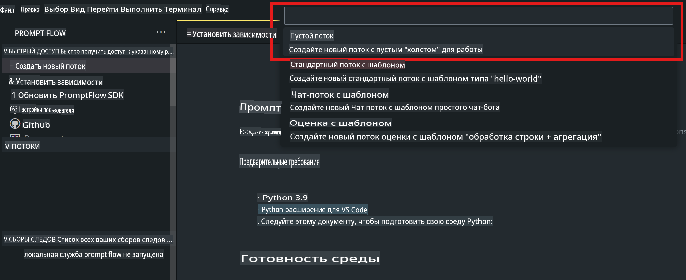
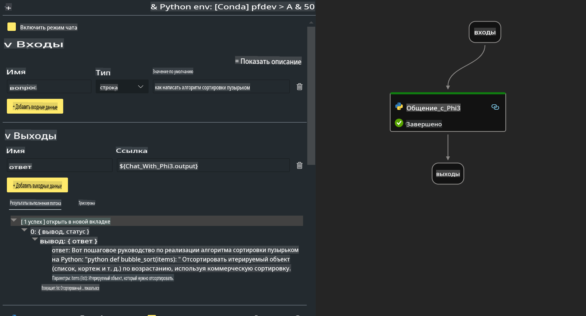

# **Лабораторная работа 2 - Запуск Prompt flow с Phi-3-mini на AIPC**

## **Что такое Prompt flow**

Prompt flow — это набор инструментов разработки, созданных для упрощения полного цикла разработки приложений на базе LLM, начиная от генерации идей, прототипирования, тестирования, оценки и заканчивая развертыванием в производственной среде и мониторингом. Он значительно упрощает процесс работы с подсказками (prompt engineering) и позволяет создавать приложения на базе LLM с качеством, соответствующим требованиям к производственным системам.

С помощью Prompt flow вы сможете:

- Создавать потоки, которые связывают LLM, подсказки, Python-код и другие инструменты в исполняемый рабочий процесс.

- Легко отлаживать и итеративно улучшать ваши потоки, особенно взаимодействие с LLM.

- Оценивать ваши потоки, рассчитывать показатели качества и производительности на больших наборах данных.

- Интегрировать тестирование и оценку в вашу систему CI/CD для обеспечения качества вашего потока.

- Развертывать ваши потоки на выбранной вами платформе или легко интегрировать их в кодовую базу вашего приложения.

- (Необязательно, но настоятельно рекомендуется) Сотрудничать с вашей командой, используя облачную версию Prompt flow в Azure AI.

## **Что такое AIPC**

AI PC включает в себя CPU, GPU и NPU, каждый из которых обладает определенными возможностями ускорения AI. NPU, или нейропроцессор, — это специализированный ускоритель, который обрабатывает задачи искусственного интеллекта (AI) и машинного обучения (ML) непосредственно на вашем компьютере, вместо отправки данных для обработки в облаке. GPU и CPU также могут обрабатывать такие задачи, но NPU особенно эффективен для низкоэнергетических AI-вычислений. AI PC представляет собой фундаментальный сдвиг в том, как работают наши компьютеры. Это не решение проблемы, которой раньше не существовало, а значительное улучшение для повседневного использования ПК.

Как это работает? В отличие от генеративного AI и массивных больших языковых моделей (LLM), обученных на огромных объемах публичных данных, AI, который будет работать на вашем ПК, гораздо более доступен практически на всех уровнях. Концепция проще для понимания, а благодаря тому, что обучение происходит на ваших данных, без необходимости обращения к облаку, преимущества становятся более очевидными для широкой аудитории.

В ближайшей перспективе мир AI PC включает в себя персональных помощников и небольшие AI-модели, работающие непосредственно на вашем ПК, используя ваши данные для предоставления персонализированных, приватных и более безопасных AI-улучшений для повседневных задач — ведение протоколов встреч, организация лиги по фэнтези-футболу, автоматизация улучшений для редактирования фото и видео или составление идеального маршрута для семейного собрания с учетом времени прибытия и отъезда всех участников.

## **Создание потоков генерации кода на AIPC**

***Примечание***: Если вы еще не завершили установку окружения, посетите [Лабораторная работа 0 - Установки](./01.Installations.md)

1. Откройте расширение Prompt flow в Visual Studio Code и создайте пустой проект потока.



2. Добавьте параметры входа и выхода, а также добавьте Python-код как новый поток.



Вы можете использовать эту структуру (flow.dag.yaml) для построения вашего потока:

```yaml

inputs:
  question:
    type: string
    default: how to write Bubble Algorithm
outputs:
  answer:
    type: string
    reference: ${Chat_With_Phi3.output}
nodes:
- name: Chat_With_Phi3
  type: python
  source:
    type: code
    path: Chat_With_Phi3.py
  inputs:
    question: ${inputs.question}


```

3. Добавьте код в ***Chat_With_Phi3.py***.

```python


from promptflow.core import tool

# import torch
from transformers import AutoTokenizer, pipeline,TextStreamer
import intel_npu_acceleration_library as npu_lib

import warnings

import asyncio
import platform

class Phi3CodeAgent:
    
    model = None
    tokenizer = None
    text_streamer = None
    
    model_id = "microsoft/Phi-3-mini-4k-instruct"

    @staticmethod
    def init_phi3():
        
        if Phi3CodeAgent.model is None or Phi3CodeAgent.tokenizer is None or Phi3CodeAgent.text_streamer is None:
            Phi3CodeAgent.model = npu_lib.NPUModelForCausalLM.from_pretrained(
                                    Phi3CodeAgent.model_id,
                                    torch_dtype="auto",
                                    dtype=npu_lib.int4,
                                    trust_remote_code=True
                                )
            Phi3CodeAgent.tokenizer = AutoTokenizer.from_pretrained(Phi3CodeAgent.model_id)
            Phi3CodeAgent.text_streamer = TextStreamer(Phi3CodeAgent.tokenizer, skip_prompt=True)

    

    @staticmethod
    def chat_with_phi3(prompt):
        
        Phi3CodeAgent.init_phi3()

        messages = "<|system|>You are a AI Python coding assistant. Please help me to generate code in Python.The answer only genertated Python code, but any comments and instructions do not need to be generated<|end|><|user|>" + prompt +"<|end|><|assistant|>"


        generation_args = {
            "max_new_tokens": 1024,
            "return_full_text": False,
            "temperature": 0.3,
            "do_sample": False,
            "streamer": Phi3CodeAgent.text_streamer,
        }

        pipe = pipeline(
            "text-generation",
            model=Phi3CodeAgent.model,
            tokenizer=Phi3CodeAgent.tokenizer,
            # **generation_args
        )

        result = ''

        with warnings.catch_warnings():
            warnings.simplefilter("ignore")
            response = pipe(messages, **generation_args)
            result =response[0]['generated_text']
            return result


@tool
def my_python_tool(question: str) -> str:
    if platform.system() == 'Windows':
        asyncio.set_event_loop_policy(asyncio.WindowsSelectorEventLoopPolicy())
    return Phi3CodeAgent.chat_with_phi3(question)


```

4. Вы можете протестировать поток через Debug или Run, чтобы проверить, корректно ли генерируется код.


5. Запустите поток как API разработки в терминале.

```

pf flow serve --source ./ --port 8080 --host localhost   

```

Вы можете протестировать его в Postman / Thunder Client.

### **Примечания**

1. Первый запуск занимает много времени. Рекомендуется загрузить модель phi-3 с помощью Hugging Face CLI.

2. Учитывая ограниченные вычислительные возможности Intel NPU, рекомендуется использовать Phi-3-mini-4k-instruct.

3. Мы используем ускорение Intel NPU для квантования в формат INT4, но если вы повторно запускаете сервис, необходимо удалить папки cache и nc_workshop.

## **Ресурсы**

1. Изучите Promptflow [https://microsoft.github.io/promptflow/](https://microsoft.github.io/promptflow/)

2. Изучите Intel NPU Acceleration [https://github.com/intel/intel-npu-acceleration-library](https://github.com/intel/intel-npu-acceleration-library)

3. Пример кода, скачать [Пример локального NPU-агента](../../../../../../../../../code/07.Lab/01/AIPC)

**Отказ от ответственности**:  
Этот документ был переведен с использованием автоматических сервисов машинного перевода на основе искусственного интеллекта. Хотя мы стремимся к точности, имейте в виду, что автоматический перевод может содержать ошибки или неточности. Оригинальный документ на его родном языке следует считать авторитетным источником. Для получения критически важной информации рекомендуется использовать профессиональный перевод, выполненный человеком. Мы не несем ответственности за любые недоразумения или неправильные интерпретации, возникшие в результате использования данного перевода.