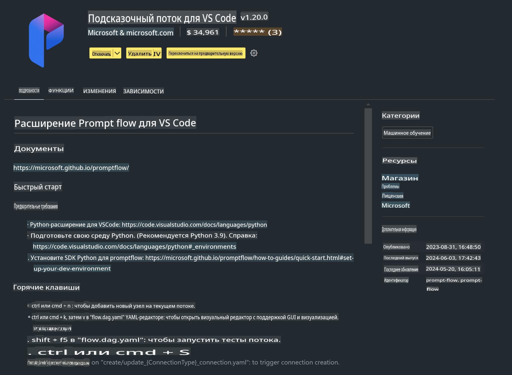

# **Лаборатория 0 - Установка**

Когда мы заходим в лабораторию, необходимо настроить соответствующую среду:


### **1. Python 3.11+**

Рекомендуется использовать miniforge для настройки среды Python.

Для настройки miniforge обратитесь к [https://github.com/conda-forge/miniforge](https://github.com/conda-forge/miniforge)

После настройки miniforge выполните следующую команду в Power Shell:

```bash

conda create -n pyenv python==3.11.8 -y

conda activate pyenv

```


### **2. Установка Prompt flow SDK**

В Лаборатории 1 мы будем использовать Prompt flow, поэтому необходимо настроить Prompt flow SDK.

```bash

pip install promptflow --upgrade

```

Вы можете проверить promptflow sdk с помощью этой команды:

```bash

pf --version

```

### **3. Установка расширения Prompt flow для Visual Studio Code**



### **4. MLX Framework от Apple**

MLX — это фреймворк для работы с массивами в исследованиях машинного обучения на Apple Silicon, разработанный исследовательским подразделением Apple. Вы можете использовать **фреймворк Apple MLX**, чтобы ускорить работу LLM / SLM на Apple Silicon. Если хотите узнать больше, ознакомьтесь с [https://github.com/microsoft/PhiCookBook/blob/main/md/01.Introduction/03/MLX_Inference.md](https://github.com/microsoft/PhiCookBook/blob/main/md/01.Introduction/03/MLX_Inference.md).

Установите библиотеку MLX framework в bash:

```bash

pip install mlx-lm

```


### **5. Другие библиотеки Python**

Создайте файл requirements.txt и добавьте в него следующий контент:

```txt

notebook
numpy 
scipy 
scikit-learn 
matplotlib 
pandas 
pillow 
graphviz

```


### **6. Установка NVM**

Установите nvm в Powershell:

```bash

brew install nvm

```

Установите nodejs версии 18.20:

```bash

nvm install 18.20.0

nvm use 18.20.0

```

### **7. Установка поддержки разработки в Visual Studio Code**

```bash

npm install --global yo generator-code

```

Поздравляем! Вы успешно настроили SDK. Далее переходите к практическим шагам.

**Отказ от ответственности**:  
Этот документ был переведен с использованием автоматизированных сервисов перевода на основе ИИ. Хотя мы стремимся к точности, пожалуйста, имейте в виду, что автоматические переводы могут содержать ошибки или неточности. Оригинальный документ на его исходном языке следует считать авторитетным источником. Для получения критически важной информации рекомендуется профессиональный перевод человеком. Мы не несем ответственности за любые недоразумения или неверные толкования, возникшие в результате использования данного перевода.