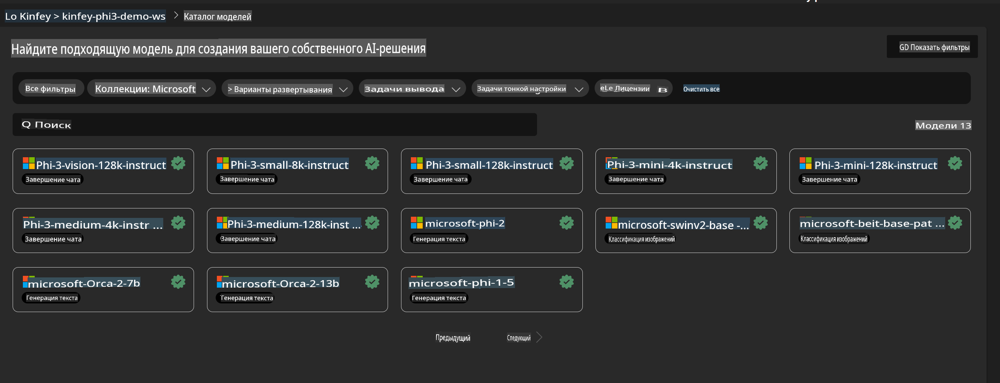
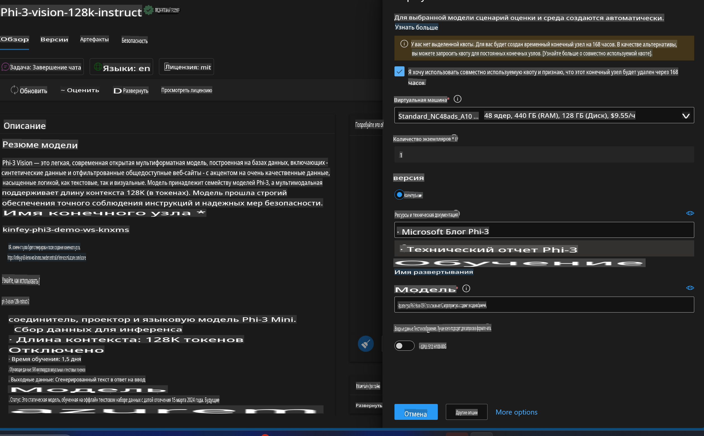
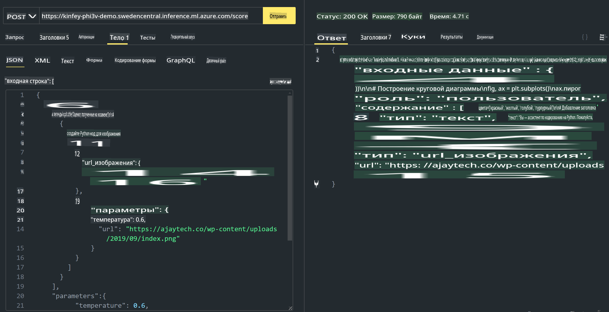

# **Лабораторная работа 3 - Развертывание Phi-3-Vision в Azure Machine Learning Service**

Мы используем NPU для завершения производственного развертывания локального кода, а затем хотим внедрить возможность использования PHI-3-VISION для преобразования изображений в код.

В данном руководстве мы быстро создадим сервис Model As Service Phi-3 Vision в Azure Machine Learning Service.

***Примечание***: Phi-3 Vision требует вычислительных мощностей для более быстрого создания контента. Нам необходимы облачные ресурсы для достижения этой цели.


### **1. Создание Azure Machine Learning Service**

Нам нужно создать Azure Machine Learning Service в Azure Portal. Если вы хотите узнать, как это сделать, посетите следующую ссылку [https://learn.microsoft.com/azure/machine-learning/quickstart-create-resources?view=azureml-api-2](https://learn.microsoft.com/azure/machine-learning/quickstart-create-resources?view=azureml-api-2)


### **2. Выбор Phi-3 Vision в Azure Machine Learning Service**




### **3. Развертывание Phi-3-Vision в Azure**




### **4. Тестирование конечной точки в Postman**




***Примечание***

1. Передаваемые параметры должны включать Authorization, azureml-model-deployment и Content-Type. Необходимо проверить информацию о развертывании, чтобы получить эти данные.

2. Для передачи параметров Phi-3-Vision требуется ссылка на изображение. Пожалуйста, обратитесь к методу GPT-4-Vision для передачи параметров, например:

```json

{
  "input_data":{
    "input_string":[
      {
        "role":"user",
        "content":[ 
          {
            "type": "text",
            "text": "You are a Python coding assistant.Please create Python code for image "
          },
          {
              "type": "image_url",
              "image_url": {
                "url": "https://ajaytech.co/wp-content/uploads/2019/09/index.png"
              }
          }
        ]
      }
    ],
    "parameters":{
          "temperature": 0.6,
          "top_p": 0.9,
          "do_sample": false,
          "max_new_tokens": 2048
    }
  }
}

```

3. Вызовите **/score** с использованием метода Post.

**Поздравляем**! Вы завершили быстрое развертывание PHI-3-VISION и попробовали использовать изображения для генерации кода. Далее мы можем создавать приложения, комбинируя NPU и облачные технологии.

**Отказ от ответственности**:  
Этот документ был переведен с использованием автоматических сервисов машинного перевода на основе ИИ. Хотя мы стремимся к точности, пожалуйста, учитывайте, что автоматические переводы могут содержать ошибки или неточности. Оригинальный документ на его родном языке следует считать авторитетным источником. Для критически важной информации рекомендуется профессиональный перевод человеком. Мы не несем ответственности за недоразумения или неправильные интерпретации, возникающие в результате использования данного перевода.