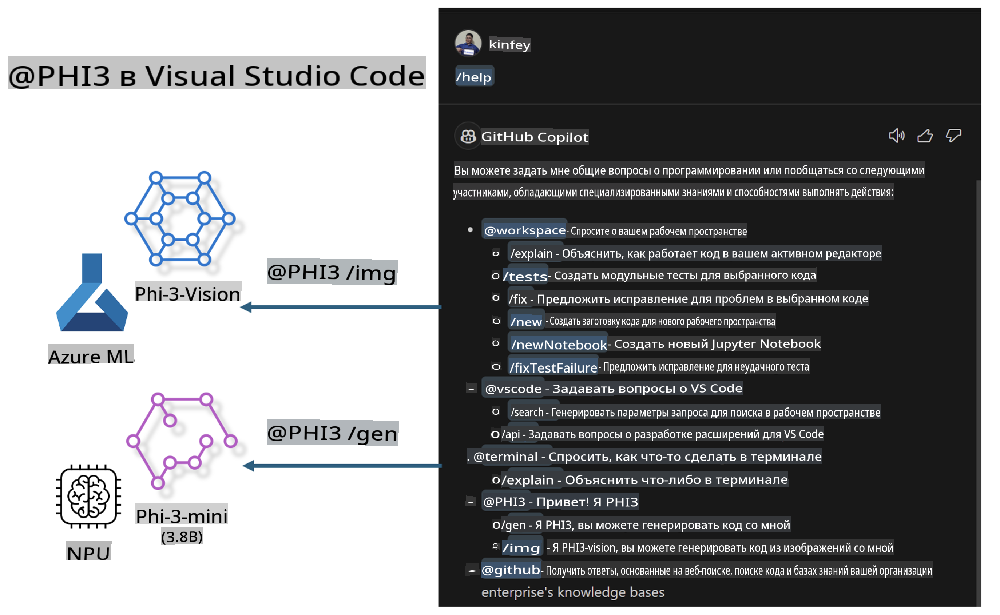

# **Создайте свой собственный чат GitHub Copilot в Visual Studio Code с использованием Microsoft Phi-3 Family**

Вы использовали агент рабочей области в GitHub Copilot Chat? Хотите создать собственного агента для вашей команды? В этой практической лаборатории мы постараемся объединить модель с открытым исходным кодом для создания корпоративного агента, ориентированного на бизнес-код.

## **Основы**

### **Почему стоит выбрать Microsoft Phi-3**

Phi-3 — это серия моделей, включающая phi-3-mini, phi-3-small и phi-3-medium, основанные на разных параметрах обучения для генерации текста, завершения диалогов и генерации кода. Также существует phi-3-vision, основанная на Vision. Эта модель подходит для предприятий или различных команд, чтобы создавать офлайн-решения на базе генеративного ИИ.

Рекомендуется ознакомиться с этой ссылкой: [https://github.com/microsoft/PhiCookBook/blob/main/md/01.Introduction/01/01.PhiFamily.md](https://github.com/microsoft/PhiCookBook/blob/main/md/01.Introduction/01/01.PhiFamily.md)

### **Microsoft GitHub Copilot Chat**

Расширение GitHub Copilot Chat предоставляет интерфейс чата, который позволяет взаимодействовать с GitHub Copilot и получать ответы на вопросы, связанные с кодированием, прямо в VS Code, без необходимости переходить к документации или искать информацию на форумах.

Copilot Chat может использовать подсветку синтаксиса, отступы и другие функции форматирования, чтобы сделать сгенерированный ответ более понятным. В зависимости от типа вопроса пользователя, результат может содержать ссылки на контекст, который Copilot использовал для генерации ответа, например, файлы исходного кода или документацию, или кнопки для доступа к функционалу VS Code.

- Copilot Chat интегрируется в рабочий процесс разработчика и предоставляет помощь там, где это нужно:

- Начните чат прямо из редактора или терминала, чтобы получить помощь во время написания кода

- Используйте окно чата, чтобы иметь помощника ИИ всегда под рукой

- Запустите Quick Chat, чтобы быстро задать вопрос и вернуться к работе

Вы можете использовать GitHub Copilot Chat в различных сценариях, таких как:

- Ответы на вопросы о том, как лучше решить задачу

- Объяснение чужого кода и предложение улучшений

- Предложение исправлений кода

- Генерация тестов для кода

- Создание документации кода

Рекомендуется ознакомиться с этой ссылкой: [https://code.visualstudio.com/docs/copilot/copilot-chat](https://code.visualstudio.com/docs/copilot/copilot-chat?WT.mc_id=aiml-137032-kinfeylo)

###  **Microsoft GitHub Copilot Chat @workspace**

Использование **@workspace** в Copilot Chat позволяет задавать вопросы о всей кодовой базе. В зависимости от вопроса, Copilot интеллектуально извлекает соответствующие файлы и символы, которые он затем использует в своем ответе в виде ссылок и примеров кода.

Чтобы ответить на ваш вопрос, **@workspace** ищет информацию в тех же источниках, которые разработчик использовал бы при навигации по кодовой базе в VS Code:

- Все файлы в рабочей области, за исключением тех, которые игнорируются файлом .gitignore

- Структура каталогов с вложенными папками и именами файлов

- Индекс поиска кода GitHub, если рабочая область является репозиторием GitHub и индексируется поиском кода

- Символы и определения в рабочей области

- Текущая выделенная или видимая в активном редакторе текстовая информация

Примечание: файл .gitignore игнорируется, если у вас открыт файл или выделен текст в игнорируемом файле.

Рекомендуется ознакомиться с этой ссылкой: [https://code.visualstudio.com/docs/copilot/workspace-context](https://code.visualstudio.com/docs/copilot/workspace-context?WT.mc_id=aiml-137032-kinfeylo)

## **Подробнее об этой лаборатории**

GitHub Copilot значительно повысил эффективность программирования в компаниях, и каждая организация стремится адаптировать функции GitHub Copilot под свои нужды. Многие компании уже создали расширения, похожие на GitHub Copilot, основываясь на своих бизнес-сценариях и моделях с открытым исходным кодом. Для предприятий кастомизированные расширения проще в управлении, но это также может повлиять на пользовательский опыт. Ведь GitHub Copilot обладает более широкими возможностями для работы с общими и специализированными сценариями. Если удастся сохранить тот же уровень опыта, кастомизация собственного расширения станет еще более привлекательной. GitHub Copilot Chat предоставляет API для расширения функционала чата, что позволяет поддерживать единый опыт и добавлять уникальные функции.

В этой лаборатории мы используем модель Phi-3 в сочетании с локальным NPU и гибридным решением Azure, чтобы создать кастомного агента в GitHub Copilot Chat ***@PHI3*** для помощи разработчикам в создании кода ***(@PHI3 /gen)*** и генерации кода на основе изображений ***(@PHI3 /img)***.

### ***Примечание:*** 

Эта лаборатория в данный момент реализована на AIPC для процессоров Intel и Apple Silicon. Мы продолжим обновлять версию для NPU Qualcomm.

## **Лаборатория**

| Название | Описание | AIPC | Apple |
| ------------ | ----------- | -------- |-------- |
| Lab0 - Установка (✅) | Настройка и установка необходимых сред и инструментов | [Перейти](./HOL/AIPC/01.Installations.md) |[Перейти](./HOL/Apple/01.Installations.md) |
| Lab1 - Запуск Prompt Flow с Phi-3-mini (✅) | Использование локального NPU на базе AIPC / Apple Silicon для генерации кода с помощью Phi-3-mini | [Перейти](./HOL/AIPC/02.PromptflowWithNPU.md) |  [Перейти](./HOL/Apple/02.PromptflowWithMLX.md) |
| Lab2 - Развертывание Phi-3-vision на Azure Machine Learning Service (✅) | Генерация кода путем развертывания Phi-3-vision из каталога моделей Azure Machine Learning Service | [Перейти](./HOL/AIPC/03.DeployPhi3VisionOnAzure.md) |[Перейти](./HOL/Apple/03.DeployPhi3VisionOnAzure.md) |
| Lab3 - Создание агента @phi-3 в GitHub Copilot Chat (✅) | Создание кастомного агента Phi-3 в GitHub Copilot Chat для выполнения генерации кода, генерации графиков, RAG и др. | [Перейти](./HOL/AIPC/04.CreatePhi3AgentInVSCode.md) | [Перейти](./HOL/Apple/04.CreatePhi3AgentInVSCode.md) |
| Примеры кода (✅)  | Скачать примеры кода | [Перейти](../../../../../../../code/07.Lab/01/AIPC) | [Перейти](../../../../../../../code/07.Lab/01/Apple) |

## **Ресурсы**

1. Phi-3 Cookbook [https://github.com/microsoft/Phi-3CookBook](https://github.com/microsoft/Phi-3CookBook)

2. Узнайте больше о GitHub Copilot [https://learn.microsoft.com/training/paths/copilot/](https://learn.microsoft.com/training/paths/copilot/?WT.mc_id=aiml-137032-kinfeylo)

3. Узнайте больше о GitHub Copilot Chat [https://learn.microsoft.com/training/paths/accelerate-app-development-using-github-copilot/](https://learn.microsoft.com/training/paths/accelerate-app-development-using-github-copilot/?WT.mc_id=aiml-137032-kinfeylo)

4. Узнайте больше о GitHub Copilot Chat API [https://code.visualstudio.com/api/extension-guides/chat](https://code.visualstudio.com/api/extension-guides/chat?WT.mc_id=aiml-137032-kinfeylo)

5. Узнайте больше о Azure AI Foundry [https://learn.microsoft.com/training/paths/create-custom-copilots-ai-studio/](https://learn.microsoft.com/training/paths/create-custom-copilots-ai-studio/?WT.mc_id=aiml-137032-kinfeylo)

6. Узнайте больше о каталоге моделей Azure AI Foundry [https://learn.microsoft.com/azure/ai-studio/how-to/model-catalog-overview](https://learn.microsoft.com/azure/ai-studio/how-to/model-catalog-overview)

**Отказ от ответственности**:  
Этот документ был переведен с использованием автоматических сервисов машинного перевода. Хотя мы стремимся к точности, обратите внимание, что автоматизированные переводы могут содержать ошибки или неточности. Оригинальный документ на его родном языке должен рассматриваться как авторитетный источник. Для получения критически важной информации рекомендуется профессиональный перевод человеком. Мы не несем ответственности за любые недоразумения или неправильные интерпретации, возникающие в результате использования данного перевода.