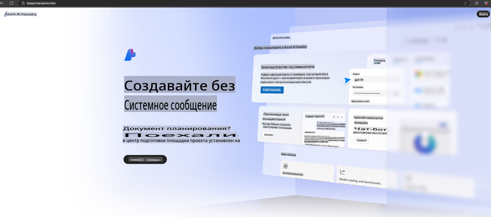

# **Использование Phi-3 в Azure AI Foundry**

С развитием генеративного ИИ мы стремимся использовать единую платформу для управления различными LLM и SLM, интеграции данных предприятия, операций по дообучению/извлечению релевантной информации (RAG), оценки различных бизнес-процессов после интеграции LLM и SLM и т.д., чтобы генеративный ИИ мог лучше внедряться в умные приложения. [Azure AI Foundry](https://ai.azure.com) — это корпоративная платформа для генеративных ИИ-приложений.

С помощью Azure AI Foundry вы можете оценивать ответы больших языковых моделей (LLM) и оркестровать компоненты приложений с использованием prompt flow для повышения производительности. Платформа обеспечивает масштабируемость, позволяя легко преобразовывать прототипы в полноценные рабочие решения. Постоянный мониторинг и доработка поддерживают долгосрочный успех.

Мы можем быстро развернуть модель Phi-3 на Azure AI Foundry с помощью простых шагов, а затем использовать Azure AI Foundry для выполнения связанных задач, таких как Playground/Chat, дообучение, оценка и другие.

## **1. Подготовка**

Если у вас уже установлен [Azure Developer CLI](https://learn.microsoft.com/azure/developer/azure-developer-cli/overview?WT.mc_id=aiml-138114-kinfeylo) на вашем устройстве, использование этого шаблона будет так же просто, как выполнение следующей команды в новой директории.

## Ручное создание

Создание проекта и хаба в Microsoft Azure AI Foundry — это отличный способ организовать и управлять вашей работой с ИИ. Вот пошаговое руководство, чтобы начать:

### Создание проекта в Azure AI Foundry

1. **Перейдите в Azure AI Foundry**: Войдите в портал Azure AI Foundry.
2. **Создайте проект**:
   - Если вы находитесь в проекте, выберите "Azure AI Foundry" в верхнем левом углу страницы, чтобы перейти на домашнюю страницу.
   - Нажмите "+ Create project".
   - Введите название для проекта.
   - Если у вас есть хаб, он будет выбран по умолчанию. Если у вас есть доступ к нескольким хабам, вы можете выбрать другой из выпадающего списка. Если вы хотите создать новый хаб, выберите "Create new hub" и укажите название.
   - Нажмите "Create".

### Создание хаба в Azure AI Foundry

1. **Перейдите в Azure AI Foundry**: Войдите с вашей учетной записью Azure.
2. **Создайте хаб**:
   - Выберите "Management center" в левом меню.
   - Выберите "All resources", затем стрелку вниз рядом с "+ New project" и нажмите "+ New hub".
   - В диалоговом окне "Create a new hub" введите название для вашего хаба (например, contoso-hub) и при необходимости измените другие поля.
   - Нажмите "Next", проверьте введенную информацию, затем нажмите "Create".

Для получения более подробных инструкций вы можете обратиться к официальной [документации Microsoft](https://learn.microsoft.com/azure/ai-studio/how-to/create-projects).

После успешного создания вы сможете получить доступ к созданной студии через [ai.azure.com](https://ai.azure.com/).

На одном AI Foundry может быть несколько проектов. Создайте проект в AI Foundry для подготовки.

Создайте Azure AI Foundry [QuickStarts](https://learn.microsoft.com/azure/ai-studio/quickstarts/get-started-code).

## **2. Развертывание модели Phi в Azure AI Foundry**

Нажмите на опцию Explore проекта, чтобы войти в Model Catalog и выберите Phi-3.

Выберите Phi-3-mini-4k-instruct.

Нажмите 'Deploy', чтобы развернуть модель Phi-3-mini-4k-instruct.

> [!NOTE]
>
> При развертывании вы можете выбрать вычислительные ресурсы.

## **3. Playground Chat Phi в Azure AI Foundry**

Перейдите на страницу развертывания, выберите Playground и начните чат с Phi-3 в Azure AI Foundry.

## **4. Развертывание модели из Azure AI Foundry**

Чтобы развернуть модель из каталога моделей Azure, выполните следующие шаги:

- Войдите в Azure AI Foundry.
- Выберите модель, которую вы хотите развернуть, из каталога моделей Azure AI Foundry.
- На странице "Details" модели выберите "Deploy", а затем "Serverless API with Azure AI Content Safety".
- Выберите проект, в котором вы хотите развернуть ваши модели. Чтобы использовать Serverless API, ваш workspace должен находиться в регионе East US 2 или Sweden Central. Вы можете настроить имя развертывания.
- В мастере развертывания выберите "Pricing and terms", чтобы узнать о стоимости и условиях использования.
- Нажмите "Deploy". Дождитесь завершения развертывания, после чего вы будете перенаправлены на страницу Deployments.
- Выберите "Open in playground", чтобы начать взаимодействие с моделью.
- Вы можете вернуться на страницу Deployments, выбрать развертывание и записать URL-адрес цели и секретный ключ, которые можно использовать для вызова развертывания и генерации результатов.
- Вы всегда можете найти детали конечной точки, URL и ключи доступа, перейдя на вкладку "Build" и выбрав "Deployments" в разделе Components.

> [!NOTE]
> Обратите внимание, что ваша учетная запись должна иметь разрешения роли Azure AI Developer на Resource Group для выполнения этих шагов.

## **5. Использование Phi API в Azure AI Foundry**

Вы можете получить доступ к https://{Your project name}.region.inference.ml.azure.com/swagger.json через Postman GET и в сочетании с Key изучить предоставленные интерфейсы.

Вы можете очень удобно получить параметры запроса, а также параметры ответа.

**Отказ от ответственности**:  
Данный документ был переведен с использованием автоматических AI-сервисов перевода. Несмотря на наши усилия обеспечить точность, обратите внимание, что автоматические переводы могут содержать ошибки или неточности. Оригинальный документ на его исходном языке следует считать авторитетным источником. Для получения критически важной информации рекомендуется профессиональный перевод человеком. Мы не несем ответственности за любые недоразумения или неправильные интерпретации, возникшие в результате использования данного перевода.