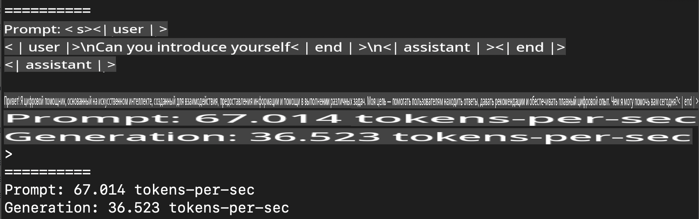
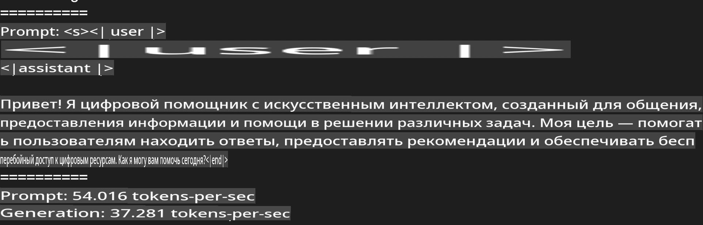
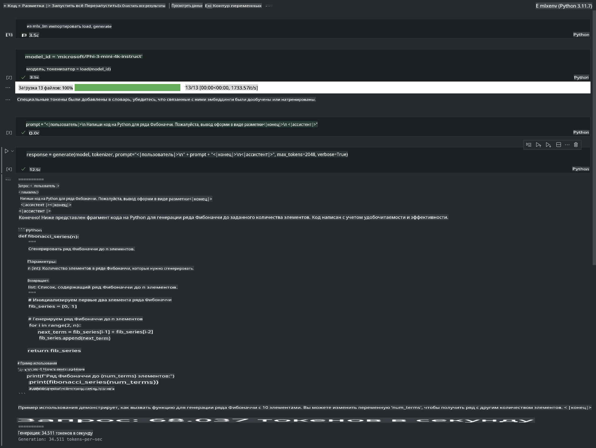

# **Inference Phi-3 с использованием Apple MLX Framework**

## **Что такое MLX Framework**

MLX — это фреймворк для исследований в области машинного обучения на устройствах с процессорами Apple Silicon, разработанный командой Apple machine learning research.

MLX создан исследователями машинного обучения для исследователей машинного обучения. Этот фреймворк ориентирован на удобство использования, оставаясь при этом эффективным для обучения и развертывания моделей. Концептуально он также достаточно прост. Мы стремимся сделать MLX легко расширяемым и улучшать его, чтобы быстро исследовать новые идеи.

LLM-модели могут быть ускорены на устройствах с Apple Silicon с помощью MLX, и модели могут запускаться локально с большим удобством.

## **Использование MLX для инференса Phi-3-mini**

### **1. Настройка окружения MLX**

1. Python 3.11.x  
2. Установите библиотеку MLX  

```bash

pip install mlx-lm

```

### **2. Запуск Phi-3-mini в терминале с MLX**

```bash

python -m mlx_lm.generate --model microsoft/Phi-3-mini-4k-instruct --max-token 2048 --prompt  "<|user|>\nCan you introduce yourself<|end|>\n<|assistant|>"

```

Результат (в моем окружении Apple M1 Max, 64GB):



### **3. Квантование Phi-3-mini с помощью MLX в терминале**

```bash

python -m mlx_lm.convert --hf-path microsoft/Phi-3-mini-4k-instruct

```

***Примечание:*** Модель может быть квантована с помощью mlx_lm.convert, и по умолчанию используется квантование в INT4. В этом примере Phi-3-mini квантуется в INT4. 

Модель может быть квантована с помощью mlx_lm.convert, и по умолчанию используется квантование в INT4. В этом примере Phi-3-mini квантуется в INT4. После квантования она будет сохранена в стандартной директории ./mlx_model.

Мы можем протестировать квантованную модель с помощью MLX из терминала.

```bash

python -m mlx_lm.generate --model ./mlx_model/ --max-token 2048 --prompt  "<|user|>\nCan you introduce yourself<|end|>\n<|assistant|>"

```

Результат:



### **4. Запуск Phi-3-mini с MLX в Jupyter Notebook**



***Примечание:*** Пожалуйста, ознакомьтесь с этим примером [нажав на ссылку](../../../../../code/03.Inference/MLX/MLX_DEMO.ipynb)

## **Ресурсы**

1. Узнайте больше о Apple MLX Framework [https://ml-explore.github.io](https://ml-explore.github.io/mlx/build/html/index.html)

2. Репозиторий Apple MLX на GitHub [https://github.com/ml-explore](https://github.com/ml-explore)

**Отказ от ответственности**:  
Этот документ был переведен с использованием автоматизированных сервисов машинного перевода на основе искусственного интеллекта. Несмотря на наши усилия обеспечить точность, автоматический перевод может содержать ошибки или неточности. Оригинальный документ на его исходном языке следует считать авторитетным источником. Для получения критически важной информации рекомендуется профессиональный перевод человеком. Мы не несем ответственности за любые недоразумения или неправильные интерпретации, возникающие в результате использования данного перевода.