# Настройка Phi-3 с помощью Azure AI Foundry

Давайте рассмотрим, как настроить языковую модель Microsoft Phi-3 Mini с использованием Azure AI Foundry. Настройка позволяет адаптировать Phi-3 Mini под конкретные задачи, делая её ещё более мощной и контекстно-осведомлённой.

## Важные моменты

- **Возможности:** Какие модели можно настраивать? Какие задачи можно решить с помощью базовой модели после настройки?
- **Стоимость:** Какова ценовая политика настройки?
- **Кастомизация:** Насколько можно модифицировать базовую модель и каким образом?
- **Удобство:** Как происходит настройка? Нужно ли писать собственный код? Нужны ли собственные вычислительные ресурсы?
- **Безопасность:** Настроенные модели могут представлять риски для безопасности – есть ли механизмы защиты от непреднамеренного вреда?

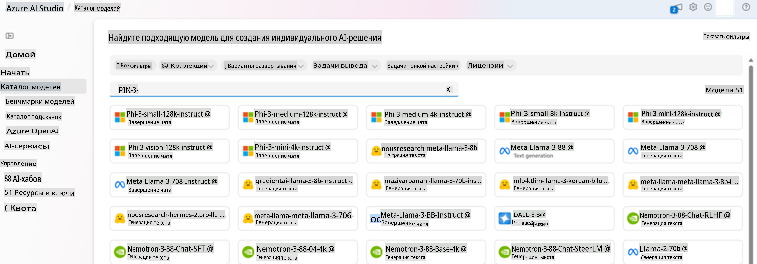

## Подготовка к настройке

### Предварительные требования

> [!NOTE]
> Для моделей семейства Phi-3 настройка по модели с оплатой по факту доступна только для хабов, созданных в регионе **East US 2**.

- Подписка Azure. Если у вас нет подписки, создайте [платный аккаунт Azure](https://azure.microsoft.com/pricing/purchase-options/pay-as-you-go), чтобы начать работу.

- [Проект AI Foundry](https://ai.azure.com?WT.mc_id=aiml-138114-kinfeylo).
- Ролевое управление доступом Azure (Azure RBAC) используется для предоставления доступа к операциям в Azure AI Foundry. Чтобы выполнить шаги из этой статьи, вашей учётной записи должен быть назначен __ролевой доступ разработчика Azure AI__ для группы ресурсов.

### Регистрация поставщика услуг подписки

Убедитесь, что подписка зарегистрирована для поставщика услуг `Microsoft.Network`.

1. Войдите в [портал Azure](https://portal.azure.com).
1. Выберите **Подписки** в левом меню.
1. Выберите подписку, которую вы хотите использовать.
1. Выберите **Настройки AI проекта** > **Поставщики ресурсов** в левом меню.
1. Убедитесь, что **Microsoft.Network** есть в списке поставщиков ресурсов. Если его нет, добавьте его.

### Подготовка данных

Подготовьте данные для обучения и проверки, чтобы настроить модель. Ваши наборы данных для обучения и проверки должны содержать примеры ввода и вывода, которые демонстрируют, как вы хотите, чтобы модель работала.

Убедитесь, что все примеры для обучения соответствуют ожидаемому формату для вывода. Чтобы эффективно настраивать модели, обеспечьте сбалансированный и разнообразный набор данных.

Это включает в себя поддержание баланса данных, охват различных сценариев и периодическое уточнение данных обучения для соответствия реальным ожиданиям, что в конечном итоге приведёт к более точным и сбалансированным ответам модели.

Разные типы моделей требуют различных форматов данных для обучения.

### Chat Completion

Данные для обучения и проверки **должны** быть отформатированы в виде документа JSON Lines (JSONL). Для `Phi-3-mini-128k-instruct` набор данных для настройки должен быть представлен в разговорном формате, используемом API Chat completions.

### Пример формата файла

```json
    {"messages": [{"role": "system", "content": "You are an Xbox customer support agent whose primary goal is to help users with issues they are experiencing with their Xbox devices. You are friendly and concise. You only provide factual answers to queries, and do not provide answers that are not related to Xbox."}, {"role": "user", "content": "Is Xbox better than PlayStation?"}, {"role": "assistant", "content": "I apologize, but I cannot provide personal opinions. My primary job is to assist you with any issues related to your Xbox device. Do you have any Xbox-related issues that need addressing?"}]}
    {"messages": [{"role": "system", "content": "You are an Xbox customer support agent whose primary goal is to help users with issues they are experiencing with their Xbox devices. You are friendly and concise. You only provide factual answers to queries, and do not provide answers that are not related to Xbox."}, {"role": "user", "content": "Can I play PC games on my Xbox?"}, {"role": "assistant", "content": "While Xbox consoles don't natively support PC games, they can play an array of Xbox games, many of which are also available on PC. Can I assist you with finding games compatible with your Xbox device?"}]}
    {"messages": [{"role": "system", "content": "You are an Xbox customer support agent whose primary goal is to help users with issues they are experiencing with their Xbox devices. You are friendly and concise. You only provide factual answers to queries, and do not provide answers that are not related to Xbox."}, {"role": "user", "content": "I'm having trouble connecting my Xbox to the Wi-Fi."}, {"role": "assistant", "content": "No worries, let's go through the network settings on your Xbox. Can you please tell me what happens when you try to connect it to the Wi-Fi?"}]}
```

Поддерживаемый тип файла – JSON Lines. Файлы загружаются в хранилище по умолчанию и становятся доступными в вашем проекте.

## Настройка Phi-3 с помощью Azure AI Foundry

Azure AI Foundry позволяет адаптировать крупные языковые модели к вашим персональным наборам данных с использованием процесса, известного как настройка. Настройка обеспечивает значительную ценность, позволяя персонализировать и оптимизировать модели для конкретных задач и приложений. Это приводит к улучшению производительности, снижению затрат, уменьшению задержек и созданию уникальных результатов.

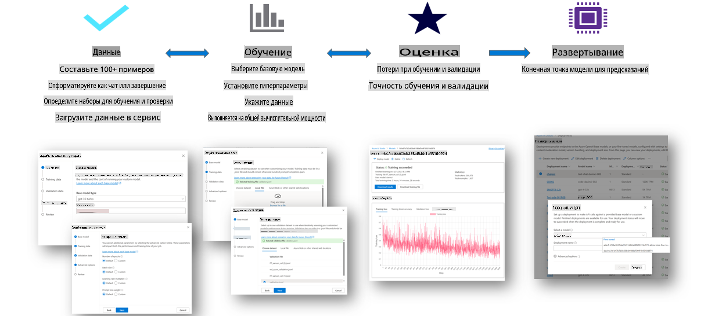

### Создание нового проекта

1. Войдите в [Azure AI Foundry](https://ai.azure.com).

1. Выберите **+Новый проект**, чтобы создать новый проект в Azure AI Foundry.

    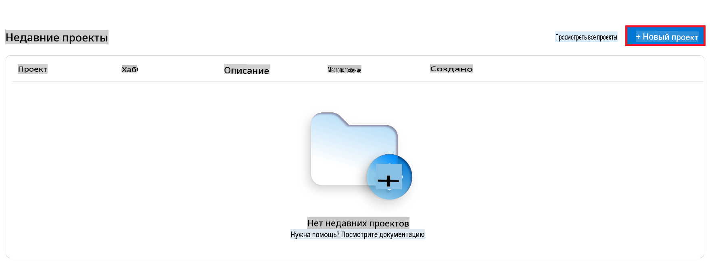

1. Выполните следующие действия:

    - Укажите **Имя хаба проекта**. Оно должно быть уникальным.
    - Выберите **Хаб** для использования (создайте новый, если это необходимо).

    

1. Для создания нового хаба выполните следующие действия:

    - Введите **Имя хаба**. Оно должно быть уникальным.
    - Выберите вашу подписку Azure **Subscription**.
    - Выберите **Группу ресурсов**, которую вы хотите использовать (создайте новую, если это необходимо).
    - Укажите **Местоположение**, которое вы хотите использовать.
    - Выберите **Подключить Azure AI Services** (создайте новую, если это необходимо).
    - Выберите **Пропустить подключение** для Azure AI Search.

    

1. Нажмите **Далее**.
1. Выберите **Создать проект**.

### Подготовка данных

Перед настройкой соберите или создайте набор данных, относящийся к вашей задаче, например, инструкции для чата, пары вопросов и ответов или любой другой релевантный текст. Очистите и предварительно обработайте эти данные, удалив шум, обработав отсутствующие значения и токенизировав текст.

### Настройка моделей Phi-3 в Azure AI Foundry

> [!NOTE]
> Настройка моделей Phi-3 в настоящее время поддерживается только в проектах, расположенных в East US 2.

1. Выберите **Каталог моделей** в левом меню.

1. Введите *phi-3* в **поисковую строку** и выберите модель phi-3, которую вы хотите использовать.

    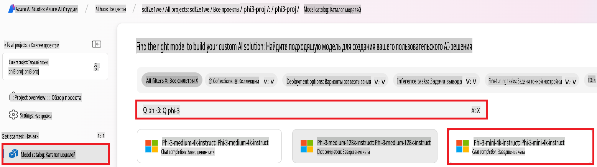

1. Нажмите **Настроить**.

    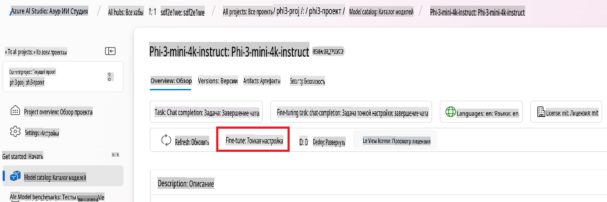

1. Укажите **Имя настроенной модели**.

    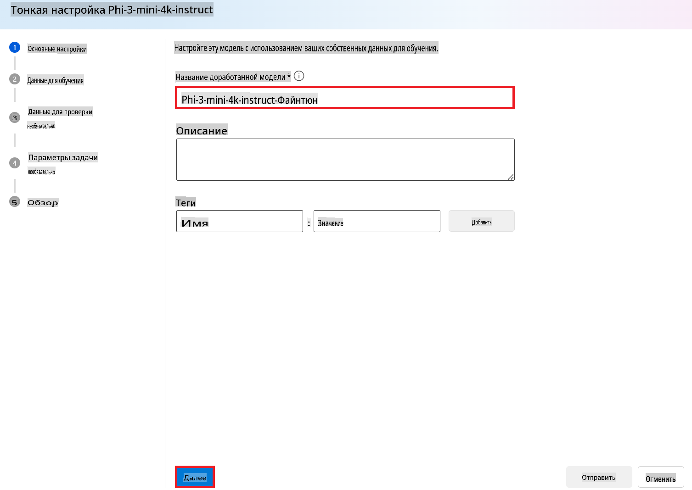

1. Нажмите **Далее**.

1. Выполните следующие действия:

    - Выберите **Тип задачи** – **Chat completion**.
    - Выберите данные для **Обучения**, которые вы хотите использовать. Вы можете загрузить их через Azure AI Foundry или из локального окружения.

    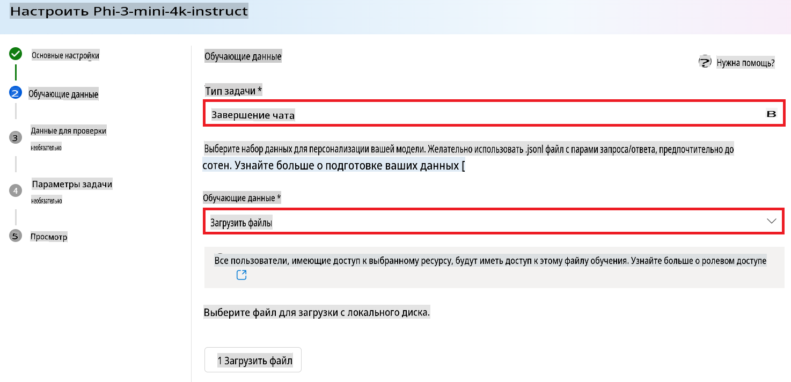

1. Нажмите **Далее**.

1. Загрузите данные для **Проверки**, которые вы хотите использовать, или выберите **Автоматическое разделение данных для обучения**.

    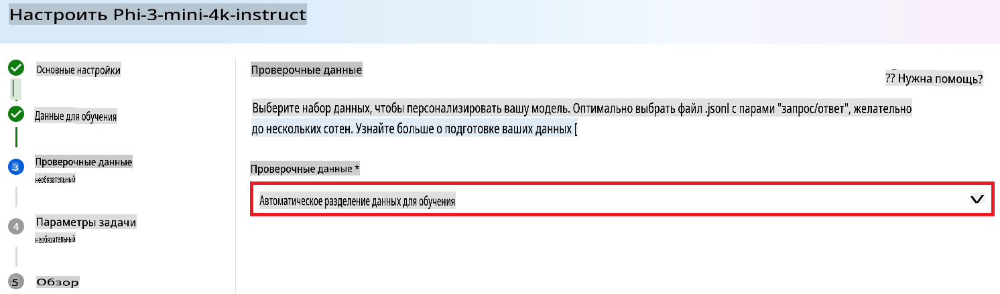

1. Нажмите **Далее**.

1. Выполните следующие действия:

    - Укажите **Множитель размера пакета**, который вы хотите использовать.
    - Укажите **Скорость обучения**, которую вы хотите использовать.
    - Укажите количество **Эпох**, которое вы хотите использовать.

    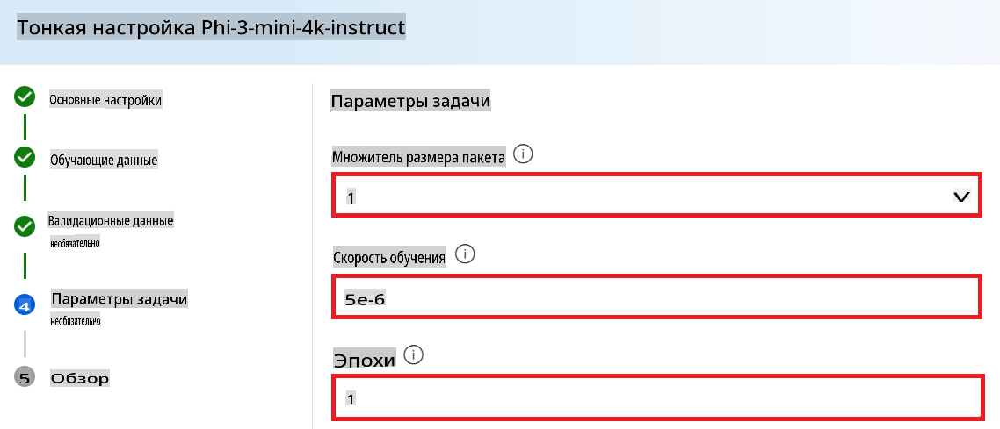

1. Нажмите **Отправить**, чтобы начать процесс настройки.

    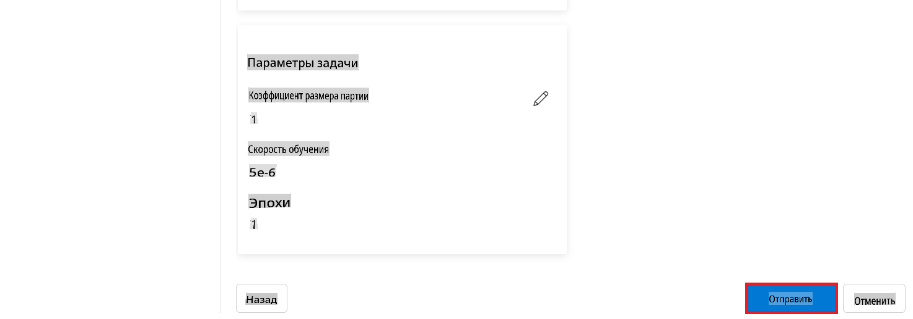

1. После завершения настройки статус будет отображаться как **Завершено**, как показано на изображении ниже. Теперь вы можете развернуть модель и использовать её в своём приложении, на платформе Playground или в Prompt Flow. Для получения дополнительной информации см. [Как развернуть семейство моделей Phi-3 в Azure AI Foundry](https://learn.microsoft.com/azure/ai-studio/how-to/deploy-models-phi-3?tabs=phi-3-5&pivots=programming-language-python).

    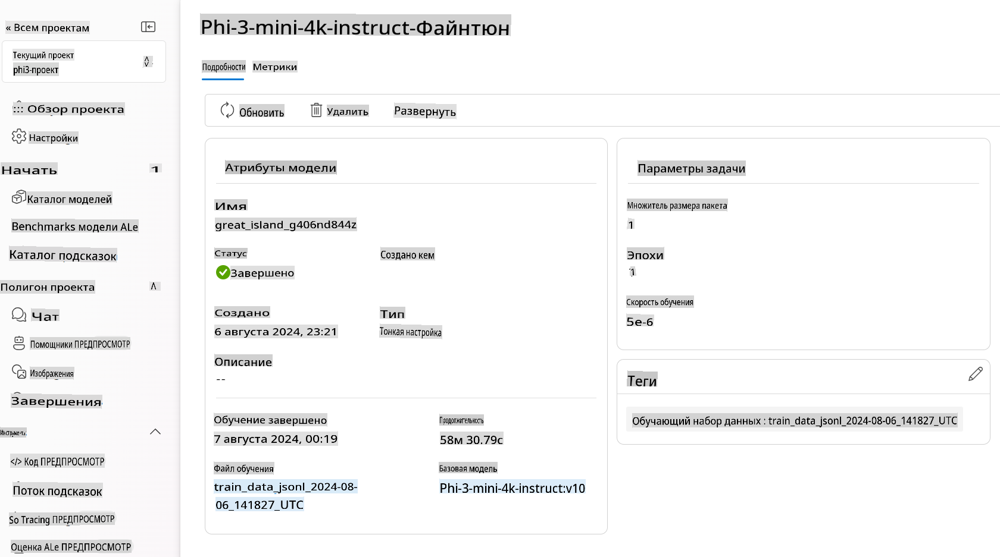

> [!NOTE]
> Для получения более подробной информации о настройке Phi-3 посетите [Fine-tune Phi-3 models in Azure AI Foundry](https://learn.microsoft.com/azure/ai-studio/how-to/fine-tune-phi-3?tabs=phi-3-mini).

## Удаление настроенных моделей

Вы можете удалить настроенную модель из списка настроек в [Azure AI Foundry](https://ai.azure.com) или на странице деталей модели. Выберите настроенную модель, которую хотите удалить, на странице настройки, затем нажмите кнопку Удалить.

> [!NOTE]
> Вы не можете удалить пользовательскую модель, если она уже развернута. Сначала необходимо удалить развертывание модели.

## Стоимость и квоты

### Соображения о стоимости и квотах для настройки моделей Phi-3 как услуги

Модели Phi, настроенные как услуга, предоставляются Microsoft и интегрированы с Azure AI Foundry для использования. Вы можете узнать стоимость при [развертывании](https://learn.microsoft.com/azure/ai-studio/how-to/deploy-models-phi-3?tabs=phi-3-5&pivots=programming-language-python) или настройке моделей на вкладке Цены и условия в мастере развертывания.

## Фильтрация контента

Модели, развернутые как услуга с оплатой по факту, защищены системой безопасности контента Azure AI. При развертывании на реальных конечных точках вы можете отказаться от этой функции. При включенной системе безопасности контента Azure AI как запрос, так и результат проходят через классификационные модели, направленные на выявление и предотвращение вредоносного контента. Система фильтрации контента обнаруживает и принимает меры по конкретным категориям потенциально вредоносного контента как в запросах, так и в ответах. Узнайте больше о [Системе безопасности контента Azure AI](https://learn.microsoft.com/azure/ai-studio/concepts/content-filtering).

**Конфигурация настройки**

Гиперпараметры: Определите гиперпараметры, такие как скорость обучения, размер пакета и количество эпох обучения.

**Функция потерь**

Выберите подходящую функцию потерь для вашей задачи (например, кросс-энтропия).

**Оптимизатор**

Выберите оптимизатор (например, Adam) для обновления градиентов во время обучения.

**Процесс настройки**

- Загрузите предварительно обученную модель: Загрузите контрольную точку Phi-3 Mini.
- Добавьте пользовательские слои: Добавьте слои, специфичные для задачи (например, классификационный слой для инструкций чата).

**Обучение модели**
Настройте модель, используя подготовленный набор данных. Отслеживайте прогресс обучения и при необходимости корректируйте гиперпараметры.

**Оценка и проверка**

Набор для проверки: Разделите данные на обучающий и проверочный наборы.

**Оцените производительность**

Используйте метрики, такие как точность, F1-мера или перплексия, для оценки производительности модели.

## Сохранение настроенной модели

**Контрольная точка**
Сохраните контрольную точку настроенной модели для дальнейшего использования.

## Развертывание

- Развертывание как веб-служба: Разверните настроенную модель как веб-службу в Azure AI Foundry.
- Тестирование конечной точки: Отправьте тестовые запросы на развернутую конечную точку, чтобы проверить её функциональность.

## Итерация и улучшение

Итерация: Если производительность неудовлетворительна, повторите процесс, скорректировав гиперпараметры, добавив больше данных или настроив дополнительные эпохи.

## Мониторинг и уточнение

Постоянно отслеживайте поведение модели и при необходимости уточняйте её.

## Кастомизация и расширение

Пользовательские задачи: Phi-3 Mini можно настроить для различных задач помимо инструкций чата. Исследуйте другие варианты использования!
Экспериментируйте: Пробуйте разные архитектуры, комбинации слоёв и техники для повышения производительности.

> [!NOTE]
> Настройка – это итеративный процесс. Экспериментируйте, учитесь и адаптируйте свою модель, чтобы достичь лучших результатов для вашей конкретной задачи!

**Отказ от ответственности**:  
Этот документ был переведен с использованием автоматизированных сервисов перевода на основе ИИ. Несмотря на наши усилия обеспечить точность, пожалуйста, имейте в виду, что автоматические переводы могут содержать ошибки или неточности. Оригинальный документ на его родном языке следует считать авторитетным источником. Для получения критически важной информации рекомендуется профессиональный перевод человеком. Мы не несем ответственности за недоразумения или неправильные интерпретации, возникшие в результате использования данного перевода.