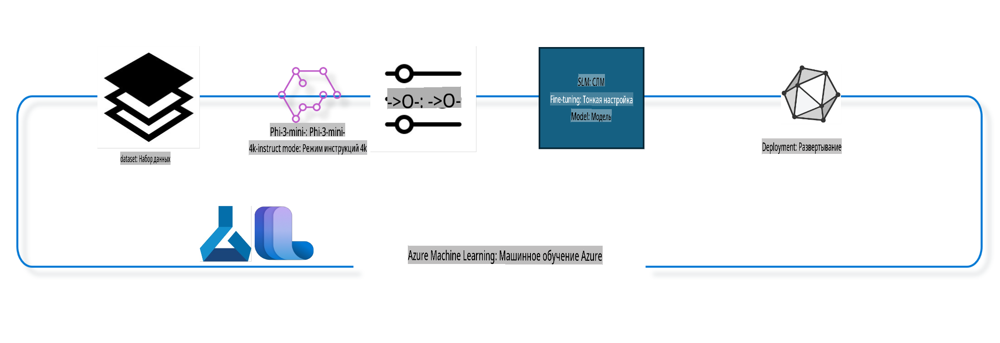

## Как использовать компоненты chat-completion из системного реестра Azure ML для тонкой настройки модели

В этом примере мы проведем тонкую настройку модели Phi-3-mini-4k-instruct для завершения разговора между двумя людьми, используя датасет ultrachat_200k.



Пример покажет, как выполнить тонкую настройку с использованием Azure ML SDK и Python, а затем развернуть настроенную модель в онлайн-эндпоинте для выполнения реальных предсказаний в реальном времени.

### Обучающие данные

Мы будем использовать датасет ultrachat_200k. Это сильно отфильтрованная версия датасета UltraChat, которая использовалась для обучения Zephyr-7B-β, современной 7-миллиардной модели для чата.

### Модель

Мы будем использовать модель Phi-3-mini-4k-instruct, чтобы показать, как пользователь может настроить модель для задачи завершения чата. Если вы открыли этот ноутбук из карточки конкретной модели, не забудьте заменить название модели на соответствующее.

### Задачи

- Выбрать модель для тонкой настройки.
- Выбрать и изучить обучающие данные.
- Настроить задание на тонкую настройку.
- Запустить задание на тонкую настройку.
- Проверить метрики обучения и оценки.
- Зарегистрировать настроенную модель.
- Развернуть настроенную модель для выполнения предсказаний в реальном времени.
- Очистить ресурсы.

## 1. Настройка предварительных условий

- Установите зависимости.
- Подключитесь к рабочей области AzureML. Подробнее о настройке аутентификации SDK. Замените <WORKSPACE_NAME>, <RESOURCE_GROUP> и <SUBSCRIPTION_ID> ниже.
- Подключитесь к системному реестру AzureML.
- Задайте необязательное имя эксперимента.
- Проверьте или создайте вычислительный ресурс.

> [!NOTE]
> Требования: один узел GPU может иметь несколько видеокарт. Например, в одном узле Standard_NC24rs_v3 есть 4 GPU NVIDIA V100, а в Standard_NC12s_v3 — 2 GPU NVIDIA V100. Обратитесь к документации для получения этой информации. Количество GPU на узел задается параметром gpus_per_node ниже. Указание этого значения правильно обеспечит использование всех GPU на узле. Рекомендуемые вычислительные конфигурации GPU можно найти здесь и здесь.

### Библиотеки Python

Установите зависимости, запустив ячейку ниже. Этот шаг обязателен, если вы работаете в новой среде.

```bash
pip install azure-ai-ml
pip install azure-identity
pip install datasets==2.9.0
pip install mlflow
pip install azureml-mlflow
```

### Взаимодействие с Azure ML

1. Этот скрипт Python используется для взаимодействия с сервисом Azure Machine Learning (Azure ML). Вот его основные функции:

    - Импортирует необходимые модули из пакетов azure.ai.ml, azure.identity и azure.ai.ml.entities. Также импортируется модуль time.

    - Пытается аутентифицироваться с использованием DefaultAzureCredential(), что упрощает процесс аутентификации для приложений в облаке Azure. Если это не удается, используется InteractiveBrowserCredential() для интерактивного входа.

    - Создает экземпляр MLClient, используя метод from_config, который считывает конфигурацию из файла config.json. Если это не удается, создается экземпляр MLClient вручную, предоставляя subscription_id, resource_group_name и workspace_name.

    - Создает другой экземпляр MLClient для реестра Azure ML с именем "azureml". Этот реестр содержит модели, пайплайны для тонкой настройки и окружения.

    - Устанавливает имя эксперимента "chat_completion_Phi-3-mini-4k-instruct".

    - Генерирует уникальную временную метку, преобразуя текущее время в секунды в целое число, а затем в строку. Эта метка может использоваться для создания уникальных имен и версий.

    ```python
    # Import necessary modules from Azure ML and Azure Identity
    from azure.ai.ml import MLClient
    from azure.identity import (
        DefaultAzureCredential,
        InteractiveBrowserCredential,
    )
    from azure.ai.ml.entities import AmlCompute
    import time  # Import time module
    
    # Try to authenticate using DefaultAzureCredential
    try:
        credential = DefaultAzureCredential()
        credential.get_token("https://management.azure.com/.default")
    except Exception as ex:  # If DefaultAzureCredential fails, use InteractiveBrowserCredential
        credential = InteractiveBrowserCredential()
    
    # Try to create an MLClient instance using the default config file
    try:
        workspace_ml_client = MLClient.from_config(credential=credential)
    except:  # If that fails, create an MLClient instance by manually providing the details
        workspace_ml_client = MLClient(
            credential,
            subscription_id="<SUBSCRIPTION_ID>",
            resource_group_name="<RESOURCE_GROUP>",
            workspace_name="<WORKSPACE_NAME>",
        )
    
    # Create another MLClient instance for the Azure ML registry named "azureml"
    # This registry is where models, fine-tuning pipelines, and environments are stored
    registry_ml_client = MLClient(credential, registry_name="azureml")
    
    # Set the experiment name
    experiment_name = "chat_completion_Phi-3-mini-4k-instruct"
    
    # Generate a unique timestamp that can be used for names and versions that need to be unique
    timestamp = str(int(time.time()))
    ```

## 2. Выбор базовой модели для тонкой настройки

1. Phi-3-mini-4k-instruct — это модель с 3,8 миллиардами параметров, легковесная, современная открытая модель, созданная на основе датасетов, использованных для Phi-2. Модель относится к семейству Phi-3, а версия Mini доступна в двух вариантах: 4K и 128K, что соответствует длине контекста (в токенах), которую она поддерживает. Для использования модели для наших целей требуется её тонкая настройка. Вы можете найти эти модели в каталоге моделей в AzureML Studio, отфильтровав их по задаче завершения чата. В этом примере мы используем модель Phi-3-mini-4k-instruct. Если вы открыли этот ноутбук для другой модели, замените имя модели и версию соответственно.

    > [!NOTE]
    > id модели. Это свойство будет передано в качестве входных данных для задания на тонкую настройку. Оно также доступно как поле Asset ID на странице деталей модели в каталоге моделей AzureML Studio.

2. Этот скрипт Python взаимодействует с сервисом Azure Machine Learning (Azure ML). Вот его основные функции:

    - Устанавливает имя модели model_name как "Phi-3-mini-4k-instruct".

    - Использует метод get свойства models объекта registry_ml_client для получения последней версии модели с указанным именем из реестра Azure ML. Метод get вызывается с двумя аргументами: именем модели и меткой, указывающей на необходимость получения последней версии модели.

    - Выводит сообщение в консоль с указанием имени, версии и id модели, которая будет использоваться для тонкой настройки. Метод format строки используется для вставки имени, версии и id модели в сообщение. Имя, версия и id модели доступны как свойства объекта foundation_model.

    ```python
    # Set the model name
    model_name = "Phi-3-mini-4k-instruct"
    
    # Get the latest version of the model from the Azure ML registry
    foundation_model = registry_ml_client.models.get(model_name, label="latest")
    
    # Print the model name, version, and id
    # This information is useful for tracking and debugging
    print(
        "\n\nUsing model name: {0}, version: {1}, id: {2} for fine tuning".format(
            foundation_model.name, foundation_model.version, foundation_model.id
        )
    )
    ```

## 3. Создание вычислительного ресурса для задания

Задание на тонкую настройку работает ТОЛЬКО с GPU. Размер вычислительного ресурса зависит от размера модели, и в большинстве случаев сложно определить подходящий ресурс. В этой ячейке мы помогаем пользователю выбрать подходящий ресурс.

> [!NOTE]
> Приведенные ниже вычислительные конфигурации работают с наиболее оптимизированной настройкой. Любые изменения конфигурации могут привести к ошибке Cuda Out Of Memory. В таких случаях попробуйте обновить вычислительный ресурс до большего размера.

> [!NOTE]
> При выборе compute_cluster_size ниже убедитесь, что вычислительный ресурс доступен в вашей группе ресурсов. Если определённый ресурс недоступен, вы можете отправить запрос на доступ к вычислительным ресурсам.

### Проверка поддержки тонкой настройки для модели

1. Этот скрипт Python взаимодействует с моделью Azure Machine Learning (Azure ML). Вот его основные функции:

    - Импортирует модуль ast, предоставляющий функции для обработки деревьев грамматики абстрактного синтаксиса Python.

    - Проверяет, имеет ли объект foundation_model (представляющий модель в Azure ML) тег с именем finetune_compute_allow_list. Теги в Azure ML — это пары ключ-значение, которые можно создавать и использовать для фильтрации и сортировки моделей.

    - Если тег finetune_compute_allow_list присутствует, он использует функцию ast.literal_eval для безопасного преобразования значения тега (строки) в список Python. Этот список затем присваивается переменной computes_allow_list. Выводится сообщение о необходимости создать вычислительный ресурс из списка.

    - Если тег finetune_compute_allow_list отсутствует, переменной computes_allow_list присваивается значение None, и выводится сообщение о том, что тег finetune_compute_allow_list отсутствует в метаданных модели.

    - В итоге этот скрипт проверяет наличие конкретного тега в метаданных модели, преобразует значение тега в список, если он существует, и предоставляет обратную связь пользователю.

    ```python
    # Import the ast module, which provides functions to process trees of the Python abstract syntax grammar
    import ast
    
    # Check if the 'finetune_compute_allow_list' tag is present in the model's tags
    if "finetune_compute_allow_list" in foundation_model.tags:
        # If the tag is present, use ast.literal_eval to safely parse the tag's value (a string) into a Python list
        computes_allow_list = ast.literal_eval(
            foundation_model.tags["finetune_compute_allow_list"]
        )  # convert string to python list
        # Print a message indicating that a compute should be created from the list
        print(f"Please create a compute from the above list - {computes_allow_list}")
    else:
        # If the tag is not present, set computes_allow_list to None
        computes_allow_list = None
        # Print a message indicating that the 'finetune_compute_allow_list' tag is not part of the model's tags
        print("`finetune_compute_allow_list` is not part of model tags")
    ```

### Проверка вычислительного экземпляра

1. Этот скрипт Python взаимодействует с сервисом Azure Machine Learning (Azure ML) и выполняет несколько проверок вычислительного экземпляра. Вот его основные функции:

    - Пытается получить вычислительный экземпляр с именем, хранящимся в compute_cluster, из рабочей области Azure ML. Если состояние экземпляра "failed", генерируется ValueError.

    - Проверяет, что computes_allow_list не равен None. Если это так, он преобразует все размеры вычислительных ресурсов в списке в нижний регистр и проверяет, соответствует ли размер текущего экземпляра одному из них. Если нет, генерируется ValueError.

    - Если computes_allow_list равен None, он проверяет, входит ли размер вычислительного экземпляра в список неподдерживаемых GPU VM размеров. Если это так, генерируется ValueError.

    - Получает список всех доступных размеров вычислительных ресурсов в рабочей области. Затем он перебирает этот список и для каждого размера проверяет, соответствует ли его имя размеру текущего экземпляра. Если соответствует, он получает количество GPU для этого размера и устанавливает gpu_count_found в True.

    - Если gpu_count_found равен True, выводится количество GPU в вычислительном экземпляре. Если gpu_count_found равен False, генерируется ValueError.

    - В итоге этот скрипт выполняет несколько проверок вычислительного экземпляра в рабочей области Azure ML, включая проверку его состояния, размера относительно списка разрешений или запретов и количества GPU.

    ```python
    # Print the exception message
    print(e)
    # Raise a ValueError if the compute size is not available in the workspace
    raise ValueError(
        f"WARNING! Compute size {compute_cluster_size} not available in workspace"
    )
    
    # Retrieve the compute instance from the Azure ML workspace
    compute = workspace_ml_client.compute.get(compute_cluster)
    # Check if the provisioning state of the compute instance is "failed"
    if compute.provisioning_state.lower() == "failed":
        # Raise a ValueError if the provisioning state is "failed"
        raise ValueError(
            f"Provisioning failed, Compute '{compute_cluster}' is in failed state. "
            f"please try creating a different compute"
        )
    
    # Check if computes_allow_list is not None
    if computes_allow_list is not None:
        # Convert all compute sizes in computes_allow_list to lowercase
        computes_allow_list_lower_case = [x.lower() for x in computes_allow_list]
        # Check if the size of the compute instance is in computes_allow_list_lower_case
        if compute.size.lower() not in computes_allow_list_lower_case:
            # Raise a ValueError if the size of the compute instance is not in computes_allow_list_lower_case
            raise ValueError(
                f"VM size {compute.size} is not in the allow-listed computes for finetuning"
            )
    else:
        # Define a list of unsupported GPU VM sizes
        unsupported_gpu_vm_list = [
            "standard_nc6",
            "standard_nc12",
            "standard_nc24",
            "standard_nc24r",
        ]
        # Check if the size of the compute instance is in unsupported_gpu_vm_list
        if compute.size.lower() in unsupported_gpu_vm_list:
            # Raise a ValueError if the size of the compute instance is in unsupported_gpu_vm_list
            raise ValueError(
                f"VM size {compute.size} is currently not supported for finetuning"
            )
    
    # Initialize a flag to check if the number of GPUs in the compute instance has been found
    gpu_count_found = False
    # Retrieve a list of all available compute sizes in the workspace
    workspace_compute_sku_list = workspace_ml_client.compute.list_sizes()
    available_sku_sizes = []
    # Iterate over the list of available compute sizes
    for compute_sku in workspace_compute_sku_list:
        available_sku_sizes.append(compute_sku.name)
        # Check if the name of the compute size matches the size of the compute instance
        if compute_sku.name.lower() == compute.size.lower():
            # If it does, retrieve the number of GPUs for that compute size and set gpu_count_found to True
            gpus_per_node = compute_sku.gpus
            gpu_count_found = True
    # If gpu_count_found is True, print the number of GPUs in the compute instance
    if gpu_count_found:
        print(f"Number of GPU's in compute {compute.size}: {gpus_per_node}")
    else:
        # If gpu_count_found is False, raise a ValueError
        raise ValueError(
            f"Number of GPU's in compute {compute.size} not found. Available skus are: {available_sku_sizes}."
            f"This should not happen. Please check the selected compute cluster: {compute_cluster} and try again."
        )
    ```

## 4. Выбор датасета для тонкой настройки модели

1. Мы используем датасет ultrachat_200k. Датасет имеет четыре раздела, подходящих для следующих задач:
   - Supervised fine-tuning (sft).
   - Generation ranking (gen).
   Количество примеров в каждом разделе показано ниже:

    ```bash
    train_sft test_sft  train_gen  test_gen
    207865  23110  256032  28304
    ```

1. Следующие ячейки показывают базовую подготовку данных для тонкой настройки:

### Визуализация строк данных

Мы хотим, чтобы этот пример выполнялся быстро, поэтому сохраним файлы train_sft и test_sft, содержащие 5% уже обрезанных строк. Это означает, что точность настроенной модели будет ниже, поэтому её не следует использовать в реальных задачах. 
Скрипт download-dataset.py используется для загрузки датасета ultrachat_200k и преобразования его в формат, подходящий для компонента пайплайна тонкой настройки. Поскольку датасет большой, здесь используется только его часть.

1. Запуск скрипта ниже загружает только 5% данных. Это значение можно увеличить, изменив параметр dataset_split_pc на желаемый процент.

    > [!NOTE]
    > Некоторые языковые модели используют разные языковые коды, поэтому названия колонок в датасете должны это учитывать.

1. Пример того, как должны выглядеть данные:
   Датасет chat-completion хранится в формате parquet, причём каждая запись имеет следующую схему:

    - Это JSON-документ (JavaScript Object Notation), популярный формат обмена данными. Это не исполняемый код, а способ хранения и передачи данных. Вот его структура:

    - "prompt": Ключ содержит строку, представляющую задачу или вопрос, заданный AI-ассистенту.

    - "messages": Ключ содержит массив объектов. Каждый объект представляет сообщение в диалоге между пользователем и AI-ассистентом. У каждого объекта сообщения есть два ключа:

    - "content": Ключ содержит строку, представляющую содержание сообщения.
    - "role": Ключ содержит строку, представляющую роль отправителя сообщения. Это может быть "user" или "assistant".
    - "prompt_id": Ключ содержит строку, представляющую уникальный идентификатор для prompt.

1. В данном JSON-документе представлена беседа, где пользователь просит AI-ассистента создать главного героя для антиутопической истории. Ассистент отвечает, а пользователь просит больше деталей. Ассистент соглашается предоставить больше деталей. Вся беседа связана с конкретным prompt_id.

    ```python
    {
        // The task or question posed to an AI assistant
        "prompt": "Create a fully-developed protagonist who is challenged to survive within a dystopian society under the rule of a tyrant. ...",
        
        // An array of objects, each representing a message in a conversation between a user and an AI assistant
        "messages":[
            {
                // The content of the user's message
                "content": "Create a fully-developed protagonist who is challenged to survive within a dystopian society under the rule of a tyrant. ...",
                // The role of the entity that sent the message
                "role": "user"
            },
            {
                // The content of the assistant's message
                "content": "Name: Ava\n\n Ava was just 16 years old when the world as she knew it came crashing down. The government had collapsed, leaving behind a chaotic and lawless society. ...",
                // The role of the entity that sent the message
                "role": "assistant"
            },
            {
                // The content of the user's message
                "content": "Wow, Ava's story is so intense and inspiring! Can you provide me with more details.  ...",
                // The role of the entity that sent the message
                "role": "user"
            }, 
            {
                // The content of the assistant's message
                "content": "Certainly! ....",
                // The role of the entity that sent the message
                "role": "assistant"
            }
        ],
        
        // A unique identifier for the prompt
        "prompt_id": "d938b65dfe31f05f80eb8572964c6673eddbd68eff3db6bd234d7f1e3b86c2af"
    }
    ```

### Загрузка данных

1. Этот скрипт Python используется для загрузки датасета с помощью вспомогательного скрипта download-dataset.py. Вот его основные функции:

    - Импортирует модуль os, предоставляющий портативный способ работы с функциональностью, зависящей от операционной системы.

    - Использует функцию os.system для запуска скрипта download-dataset.py в оболочке с конкретными аргументами командной строки. Аргументы указывают датасет для загрузки (HuggingFaceH4/ultrachat_200k), каталог для загрузки (ultrachat_200k_dataset) и процент разделения датасета (5). Функция os.system возвращает статус выхода выполненной команды; этот статус сохраняется в переменной exit_status.

    - Проверяет, равен ли exit_status 0. В Unix-подобных операционных системах статус выхода 0 обычно указывает на успешное выполнение команды, а любое другое число — на ошибку. Если exit_status не равен 0, генерируется Exception с сообщением об ошибке загрузки датасета.

    - В итоге этот скрипт запускает команду для загрузки датасета с помощью вспомогательного скрипта и генерирует исключение в случае ошибки выполнения команды.

    ```python
    # Import the os module, which provides a way of using operating system dependent functionality
    import os
    
    # Use the os.system function to run the download-dataset.py script in the shell with specific command-line arguments
    # The arguments specify the dataset to download (HuggingFaceH4/ultrachat_200k), the directory to download it to (ultrachat_200k_dataset), and the percentage of the dataset to split (5)
    # The os.system function returns the exit status of the command it executed; this status is stored in the exit_status variable
    exit_status = os.system(
        "python ./download-dataset.py --dataset HuggingFaceH4/ultrachat_200k --download_dir ultrachat_200k_dataset --dataset_split_pc 5"
    )
    
    # Check if exit_status is not 0
    # In Unix-like operating systems, an exit status of 0 usually indicates that a command has succeeded, while any other number indicates an error
    # If exit_status is not 0, raise an Exception with a message indicating that there was an error downloading the dataset
    if exit_status != 0:
        raise Exception("Error downloading dataset")
    ```

### Загрузка данных в DataFrame

1. Этот скрипт Python загружает файл в формате JSON Lines в DataFrame pandas и отображает первые 5 строк. Вот его основные функции:

    - Импортирует библиотеку pandas, мощный инструмент для манипуляции и анализа данных.

    - Устанавливает максимальную ширину столбца для отображения pandas на 0. Это означает, что полный текст каждого столбца будет отображаться без обрезки при печати DataFrame.

    - Использует функцию pd.read_json для загрузки файла train_sft.jsonl из каталога ultrachat_200k_dataset в DataFrame. Аргумент lines=True указывает, что файл имеет формат JSON Lines, где каждая строка представляет отдельный JSON-объект.

    - Использует метод head для отображения первых 5 строк DataFrame. Если в DataFrame меньше 5 строк, будут отображены все.

    - В итоге этот скрипт загружает файл в формате JSON Lines в DataFrame и отображает первые 5 строк с полным текстом столбцов.

    ```python
    # Import the pandas library, which is a powerful data manipulation and analysis library
    import pandas as pd
    
    # Set the maximum column width for pandas' display options to 0
    # This means that the full text of each column will be displayed without truncation when the DataFrame is printed
    pd.set_option("display.max_colwidth", 0)
    
    # Use the pd.read_json function to load the train_sft.jsonl file from the ultrachat_200k_dataset directory into a DataFrame
    # The lines=True argument indicates that the file is in JSON Lines format, where each line is a separate JSON object
    df = pd.read_json("./ultrachat_200k_dataset/train_sft.jsonl", lines=True)
    
    # Use the head method to display the first 5 rows of the DataFrame
    # If the DataFrame has less than 5 rows, it will display all of them
    df.head()
    ```

## 5. Отправка задания на тонкую настройку с использованием модели и данных в качестве входных данных

Создайте задание, которое использует компонент пайплайна для завершения чата. Узнайте больше о всех параметрах, поддерживаемых для тонкой настройки.

### Определение параметров тонкой настройки

1. Параметры тонкой настройки можно разделить на 2 категории: параметры обучения, параметры оптимизации.

1. Параметры обучения определяют аспекты обучения, такие как:

    - Оптимизатор, планировщик, который нужно использовать.
    - Метрика для оптимизации тонкой настройки.
    - Количество шагов обучения, размер пакета и так далее.

1. Параметры оптимизации помогают оптимизировать использование памяти GPU и эффективно использовать вычислительные ресурсы.

    - Включение DeepSpeed и LoRA.
    - Включение обучения с использованием смешанной точности.
    - Включение обучения на нескольких узлах.

> [!NOTE]
> Тонкая настройка с использованием супервизии может привести к потере согласованности или катастрофическому забыванию. Мы рекомендуем проверять эту проблему и запускать этап согласования после выполнения тонкой настройки.

### Параметры тонкой настройки

1. Этот скрипт Python настраивает параметры для тонкой настройки модели машинного обучения. Вот его основные функции:

    - Устанавливает параметры обучения по умолчанию, такие как количество эпох, размеры пакетов для обучения и оценки, скорость обучения и тип планировщика скорости обучения.

    - Устанавливает параметры оптимизации по умолчанию, такие как использование Layer-wise Relevance Propagation (LoRa) и DeepSpeed, а также этап DeepSpeed.

    - Объединяет параметры обучения и оптимизации в один словарь finetune_parameters.

    - Проверяет, есть ли у foundation_model какие-либо параметры по умолчанию, специфичные для модели. Если есть, выводит предупреждающее сообщение и обновляет словарь finetune_parameters этими параметрами. Функция ast.literal_eval используется для преобразования параметров из строки в словарь Python.

    - Выводит окончательный набор параметров тонкой настройки, которые будут использоваться для выполнения.

    - В итоге этот скрипт настраивает и отображает параметры для тонкой настройки модели машинного обучения с возможностью переопределения параметров по умолчанию.

    ```python
    # Set up default training parameters such as the number of training epochs, batch sizes for training and evaluation, learning rate, and learning rate scheduler type
    training_parameters = dict(
        num_train_epochs=3,
        per_device_train_batch_size=1,
        per_device_eval_batch_size=1,
        learning_rate=5e-6,
        lr_scheduler_type="cosine",
    )
    
    # Set up default optimization parameters such as whether to apply Layer-wise Relevance Propagation (LoRa) and DeepSpeed, and the DeepSpeed stage
    optimization_parameters = dict(
        apply_lora="true",
        apply_deepspeed="true",
        deepspeed_stage=2,
    )
    
    # Combine the training and optimization parameters into a single dictionary called finetune_parameters
    finetune_parameters = {**training_parameters, **optimization_parameters}
    
    # Check if the foundation_model has any model-specific default parameters
    # If it does, print a warning message and update the finetune_parameters dictionary with these model-specific defaults
    # The ast.literal_eval function is used to convert the model-specific defaults from a string to a Python dictionary
    if "model_specific_defaults" in foundation_model.tags:
        print("Warning! Model specific defaults exist. The defaults could be overridden.")
        finetune_parameters.update(
            ast.literal_eval(  # convert string to python dict
                foundation_model.tags["model_specific_defaults"]
            )
        )
    
    # Print the final set of fine-tuning parameters that will be used for the run
    print(
        f"The following finetune parameters are going to be set for the run: {finetune_parameters}"
    )
    ```

### Обучающий пайплайн

1. Этот скрипт Python определяет функцию для генерации имени для обучающего пайплайна и вызывает эту функцию для генерации и вывода имени. Вот его основные функции:

    - Функция get_pipeline_display_name определена для генерации имени на основе различных параметров, связанных с обучающим пайплайном.

    - Внутри функции рассчитывается общий размер пакета, умножая размер пакета на устройство, количество шагов накопления градиента, количество GPU на узел и количество узлов.

    - Извлекаются различные другие параметры, такие как тип планировщика скорости обучения, использование DeepSpeed, этап DeepSpeed, использование LoRA, лимит количества сохраняемых контрольных точек модели и максимальная длина последовательности.

    - Конструируется строка, включающая все эти параметры, разделенные дефисами. Если используются DeepSpeed или LoRA, строка включает "ds" с указанием этапа DeepSpeed или "lora". Если нет, добавляется "nods" или "nolora".

    - Функция возвращает эту строку, которая служит именем для обучающего пайплайна.

    - После определения функции она вызывается для генерации имени, которое затем выводится.

    - В итоге этот скрипт генерирует имя для обучающего пайплайна машинного обучения.
Translation for chunk 2 skipped due to timeout.

**Отказ от ответственности**:  
Этот документ был переведен с использованием автоматизированных сервисов перевода на основе ИИ. Хотя мы стремимся к точности, пожалуйста, имейте в виду, что автоматические переводы могут содержать ошибки или неточности. Оригинальный документ на его исходном языке следует считать авторитетным источником. Для получения критически важной информации рекомендуется профессиональный перевод человеком. Мы не несем ответственности за любые недоразумения или неправильные интерпретации, возникшие в результате использования данного перевода.