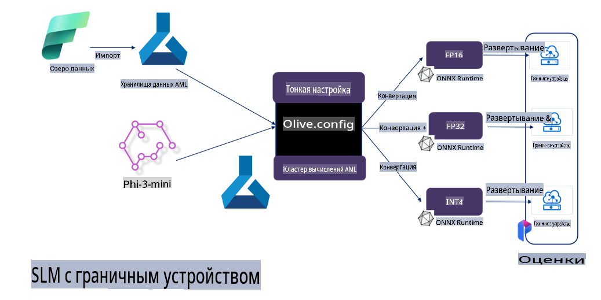

# **Тонкая настройка Phi-3 с помощью Microsoft Olive**

[Olive](https://github.com/microsoft/OLive?WT.mc_id=aiml-138114-kinfeylo) — это удобный инструмент оптимизации моделей с учетом аппаратного обеспечения, который объединяет передовые методы сжатия, оптимизации и компиляции моделей.

Он разработан для упрощения процесса оптимизации моделей машинного обучения, чтобы они максимально эффективно использовали конкретные аппаратные архитектуры.

Независимо от того, работаете ли вы с облачными приложениями или устройствами на периферии, Olive позволяет оптимизировать ваши модели легко и эффективно.

## Основные особенности:
- Olive объединяет и автоматизирует методы оптимизации для целевых аппаратных платформ.
- Не существует единственного метода оптимизации, подходящего для всех сценариев, поэтому Olive позволяет расширять возможности, предоставляя экспертам отрасли возможность внедрять свои инновации.

## Снижение инженерных усилий:
- Разработчикам часто приходится изучать и использовать множество специфичных для аппаратных вендоров инструментов для подготовки и оптимизации обученных моделей к развертыванию.
- Olive упрощает этот процесс, автоматизируя методы оптимизации для целевого аппаратного обеспечения.

## Готовое комплексное решение для оптимизации:

С помощью интеграции и настройки различных методов Olive предоставляет унифицированное решение для комплексной оптимизации.
При этом учитываются такие ограничения, как точность и задержка, для достижения оптимального результата.

## Использование Microsoft Olive для тонкой настройки

Microsoft Olive — это очень простой в использовании инструмент с открытым исходным кодом для оптимизации моделей, который подходит как для тонкой настройки, так и для применения в области генеративного искусственного интеллекта. Благодаря простой конфигурации, в сочетании с использованием небольших языковых моделей с открытым исходным кодом и связанных сред выполнения (AzureML / локальный GPU, CPU, DirectML), вы можете автоматически оптимизировать модель для тонкой настройки или применения, а также найти лучшую модель для развертывания в облаке или на периферии. Это позволяет компаниям создавать собственные отраслевые вертикальные модели локально и в облаке.


## Тонкая настройка Phi-3 с Microsoft Olive



## Пример кода и использования Phi-3 Olive
В этом примере вы используете Olive для:

- Тонкой настройки адаптера LoRA для классификации фраз на категории: грусть, радость, страх, удивление.
- Объединения весов адаптера с базовой моделью.
- Оптимизации и квантования модели до int4.

[Пример кода](../../code/03.Finetuning/olive-ort-example/README.md)

### Установка Microsoft Olive

Установка Microsoft Olive очень проста и доступна как для CPU, GPU, DirectML, так и для Azure ML.

```bash
pip install olive-ai
```

Если вы хотите запустить модель ONNX на CPU, используйте:

```bash
pip install olive-ai[cpu]
```

Если вы хотите запустить модель ONNX на GPU, используйте:

```python
pip install olive-ai[gpu]
```

Если вы хотите использовать Azure ML, используйте:

```python
pip install git+https://github.com/microsoft/Olive#egg=olive-ai[azureml]
```

**Обратите внимание**
Требования к ОС: Ubuntu 20.04 / 22.04 

### **Config.json для Microsoft Olive**

После установки вы можете настроить различные параметры, специфичные для модели, через файл конфигурации, включая данные, вычисления, обучение, развертывание и генерацию модели.

**1. Данные**

В Microsoft Olive поддерживается обучение как на локальных, так и на облачных данных, что можно настроить в параметрах.

*Настройки локальных данных*

Вы можете просто указать набор данных для тонкой настройки, обычно в формате json, и адаптировать его с помощью шаблона данных. Это нужно настраивать в зависимости от требований модели (например, адаптировать к формату, требуемому Microsoft Phi-3-mini. Если у вас другая модель, обратитесь к требованиям для тонкой настройки других моделей).

```json

    "data_configs": [
        {
            "name": "dataset_default_train",
            "type": "HuggingfaceContainer",
            "load_dataset_config": {
                "params": {
                    "data_name": "json", 
                    "data_files":"dataset/dataset-classification.json",
                    "split": "train"
                }
            },
            "pre_process_data_config": {
                "params": {
                    "dataset_type": "corpus",
                    "text_cols": [
                            "phrase",
                            "tone"
                    ],
                    "text_template": "### Text: {phrase}\n### The tone is:\n{tone}",
                    "corpus_strategy": "join",
                    "source_max_len": 2048,
                    "pad_to_max_len": false,
                    "use_attention_mask": false
                }
            }
        }
    ],
```

**Настройки облачного источника данных**

Связав хранилище данных Azure AI Studio/Azure Machine Learning Service, можно подключить данные в облаке и выбрать разные источники данных через Microsoft Fabric и Azure Data для поддержки тонкой настройки.

```json

    "data_configs": [
        {
            "name": "dataset_default_train",
            "type": "HuggingfaceContainer",
            "load_dataset_config": {
                "params": {
                    "data_name": "json", 
                    "data_files": {
                        "type": "azureml_datastore",
                        "config": {
                            "azureml_client": {
                                "subscription_id": "Your Azure Subscrition ID",
                                "resource_group": "Your Azure Resource Group",
                                "workspace_name": "Your Azure ML Workspaces name"
                            },
                            "datastore_name": "workspaceblobstore",
                            "relative_path": "Your train_data.json Azure ML Location"
                        }
                    },
                    "split": "train"
                }
            },
            "pre_process_data_config": {
                "params": {
                    "dataset_type": "corpus",
                    "text_cols": [
                            "Question",
                            "Best Answer"
                    ],
                    "text_template": "<|user|>\n{Question}<|end|>\n<|assistant|>\n{Best Answer}\n<|end|>",
                    "corpus_strategy": "join",
                    "source_max_len": 2048,
                    "pad_to_max_len": false,
                    "use_attention_mask": false
                }
            }
        }
    ],
    
```

**2. Конфигурация вычислений**

Если вам нужно работать локально, вы можете использовать локальные ресурсы данных. Если вам нужно использовать ресурсы Azure AI Studio / Azure Machine Learning Service, необходимо настроить соответствующие параметры Azure, имя вычислительного ресурса и т. д.

```json

    "systems": {
        "aml": {
            "type": "AzureML",
            "config": {
                "accelerators": ["gpu"],
                "hf_token": true,
                "aml_compute": "Your Azure AI Studio / Azure Machine Learning Service Compute Name",
                "aml_docker_config": {
                    "base_image": "Your Azure AI Studio / Azure Machine Learning Service docker",
                    "conda_file_path": "conda.yaml"
                }
            }
        },
        "azure_arc": {
            "type": "AzureML",
            "config": {
                "accelerators": ["gpu"],
                "aml_compute": "Your Azure AI Studio / Azure Machine Learning Service Compute Name",
                "aml_docker_config": {
                    "base_image": "Your Azure AI Studio / Azure Machine Learning Service docker",
                    "conda_file_path": "conda.yaml"
                }
            }
        }
    },
```

***Обратите внимание***

Поскольку выполнение происходит через контейнер на Azure AI Studio/Azure Machine Learning Service, необходимо настроить соответствующую среду. Это настраивается в файле conda.yaml.

```yaml

name: project_environment
channels:
  - defaults
dependencies:
  - python=3.8.13
  - pip=22.3.1
  - pip:
      - einops
      - accelerate
      - azure-keyvault-secrets
      - azure-identity
      - bitsandbytes
      - datasets
      - huggingface_hub
      - peft
      - scipy
      - sentencepiece
      - torch>=2.2.0
      - transformers
      - git+https://github.com/microsoft/Olive@jiapli/mlflow_loading_fix#egg=olive-ai[gpu]
      - --extra-index-url https://aiinfra.pkgs.visualstudio.com/PublicPackages/_packaging/ORT-Nightly/pypi/simple/ 
      - ort-nightly-gpu==1.18.0.dev20240307004
      - --extra-index-url https://aiinfra.pkgs.visualstudio.com/PublicPackages/_packaging/onnxruntime-genai/pypi/simple/
      - onnxruntime-genai-cuda

    

```

**3. Выбор SLM**

Вы можете использовать модель непосредственно из Hugging Face или интегрировать с Model Catalog в Azure AI Studio / Azure Machine Learning для выбора модели. В приведенном ниже примере кода мы используем Microsoft Phi-3-mini.

Если модель у вас локально, используйте этот метод:

```json

    "input_model":{
        "type": "PyTorchModel",
        "config": {
            "hf_config": {
                "model_name": "model-cache/microsoft/phi-3-mini",
                "task": "text-generation",
                "model_loading_args": {
                    "trust_remote_code": true
                }
            }
        }
    },
```

Если вы хотите использовать модель из Azure AI Studio / Azure Machine Learning Service, используйте этот метод:

```json

    "input_model":{
        "type": "PyTorchModel",
        "config": {
            "model_path": {
                "type": "azureml_registry_model",
                "config": {
                    "name": "microsoft/Phi-3-mini-4k-instruct",
                    "registry_name": "azureml-msr",
                    "version": "11"
                }
            },
             "model_file_format": "PyTorch.MLflow",
             "hf_config": {
                "model_name": "microsoft/Phi-3-mini-4k-instruct",
                "task": "text-generation",
                "from_pretrained_args": {
                    "trust_remote_code": true
                }
            }
        }
    },
```

**Обратите внимание:**
Мы интегрируемся с Azure AI Studio / Azure Machine Learning Service, поэтому при настройке модели обратите внимание на номер версии и соответствующие имена.

Все модели в Azure должны быть настроены как PyTorch.MLflow.

Вам нужно иметь учетную запись Hugging Face и привязать ключ к значению Key в Azure AI Studio / Azure Machine Learning.

**4. Алгоритм**

Microsoft Olive отлично интегрирует алгоритмы тонкой настройки Lora и QLora. Вам нужно настроить только некоторые соответствующие параметры. Здесь я приведу пример с QLora.

```json
        "lora": {
            "type": "LoRA",
            "config": {
                "target_modules": [
                    "o_proj",
                    "qkv_proj"
                ],
                "double_quant": true,
                "lora_r": 64,
                "lora_alpha": 64,
                "lora_dropout": 0.1,
                "train_data_config": "dataset_default_train",
                "eval_dataset_size": 0.3,
                "training_args": {
                    "seed": 0,
                    "data_seed": 42,
                    "per_device_train_batch_size": 1,
                    "per_device_eval_batch_size": 1,
                    "gradient_accumulation_steps": 4,
                    "gradient_checkpointing": false,
                    "learning_rate": 0.0001,
                    "num_train_epochs": 3,
                    "max_steps": 10,
                    "logging_steps": 10,
                    "evaluation_strategy": "steps",
                    "eval_steps": 187,
                    "group_by_length": true,
                    "adam_beta2": 0.999,
                    "max_grad_norm": 0.3
                }
            }
        },
```

Если вам нужно преобразование с квантованием, основная ветка Microsoft Olive уже поддерживает метод onnxruntime-genai. Вы можете настроить это в зависимости от ваших потребностей:

1. Объединить веса адаптера с базовой моделью.
2. Преобразовать модель в onnx-модель с требуемой точностью с помощью ModelBuilder.

Например, преобразование в квантованный INT4:

```json

        "merge_adapter_weights": {
            "type": "MergeAdapterWeights"
        },
        "builder": {
            "type": "ModelBuilder",
            "config": {
                "precision": "int4"
            }
        }
```

**Обратите внимание** 
- Если вы используете QLoRA, квантование с использованием ONNXRuntime-genai пока не поддерживается.

- Следует отметить, что вы можете настроить вышеуказанные шаги в зависимости от ваших потребностей. Нет необходимости полностью выполнять все шаги. В зависимости от ситуации вы можете использовать только алгоритмические шаги без тонкой настройки. В конце необходимо настроить соответствующие движки.

```json

    "engine": {
        "log_severity_level": 0,
        "host": "aml",
        "target": "aml",
        "search_strategy": false,
        "execution_providers": ["CUDAExecutionProvider"],
        "cache_dir": "../model-cache/models/phi3-finetuned/cache",
        "output_dir" : "../model-cache/models/phi3-finetuned"
    }
```

**5. Завершение тонкой настройки**

На командной строке выполните в директории с файлом olive-config.json:

```bash
olive run --config olive-config.json  
```

**Отказ от ответственности**:  
Данный документ был переведен с использованием автоматизированных сервисов машинного перевода. Несмотря на наши усилия обеспечить точность, автоматический перевод может содержать ошибки или неточности. Оригинальный документ на его исходном языке следует считать авторитетным источником. Для получения критически важной информации рекомендуется профессиональный перевод человеком. Мы не несем ответственности за любые недоразумения или неверные интерпретации, возникающие в результате использования данного перевода.