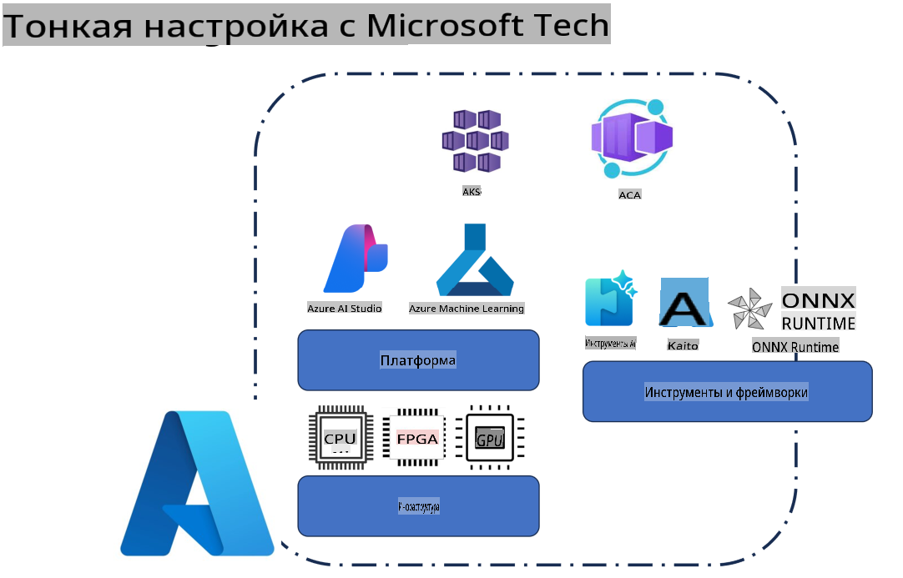
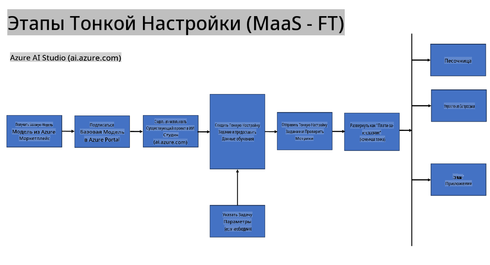
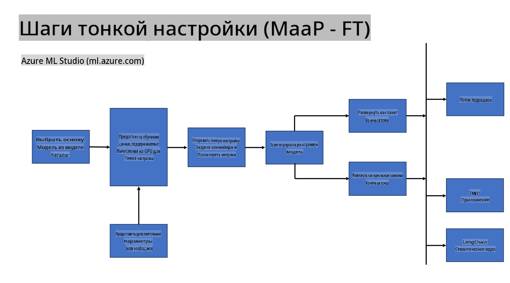
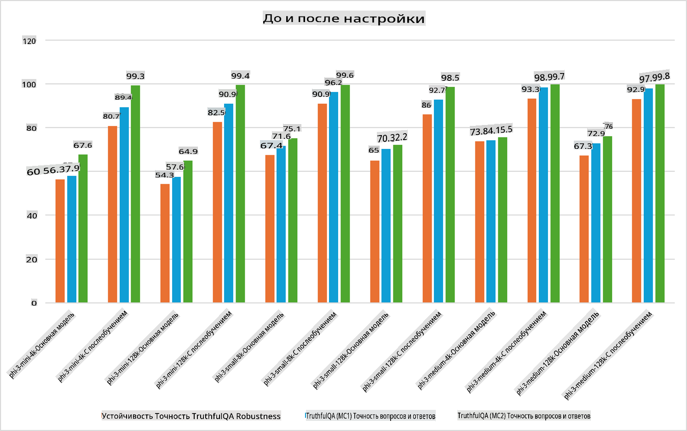

## Сценарии Тонкой Настройки

**Платформа** Включает различные технологии, такие как Azure AI Foundry, Azure Machine Learning, AI Tools, Kaito и ONNX Runtime.

**Инфраструктура** Включает CPU и FPGA, которые являются важными элементами процесса тонкой настройки. Давайте покажу вам иконки для каждой из этих технологий.

**Инструменты и Фреймворки** Включает ONNX Runtime и ONNX Runtime. Давайте покажу вам иконки для каждой из этих технологий.  
[Вставьте иконки для ONNX Runtime и ONNX Runtime]

Процесс тонкой настройки с использованием технологий Microsoft включает в себя различные компоненты и инструменты. Понимая и используя эти технологии, мы можем эффективно настраивать наши приложения и создавать лучшие решения.

## Модель как Сервис

Настраивайте модель с помощью размещенной настройки, без необходимости создавать и управлять вычислительными ресурсами.

Безсерверная тонкая настройка доступна для моделей Phi-3-mini и Phi-3-medium, что позволяет разработчикам быстро и легко адаптировать модели для облачных и периферийных сценариев без необходимости организовывать вычислительные ресурсы. Мы также объявили, что Phi-3-small теперь доступна через наше предложение Models-as-a-Service, что позволяет разработчикам быстро и легко начать работу с разработкой AI без управления базовой инфраструктурой.

## Модель как Платформа

Пользователи управляют своими собственными вычислительными ресурсами для настройки моделей.

[Пример Тонкой Настройки](https://github.com/Azure/azureml-examples/blob/main/sdk/python/foundation-models/system/finetune/chat-completion/chat-completion.ipynb)

## Сценарии Тонкой Настройки

| | | | | | | |
|-|-|-|-|-|-|-|
|Сценарий|LoRA|QLoRA|PEFT|DeepSpeed|ZeRO|DORA|
|Адаптация предварительно обученных LLM для конкретных задач или доменов|Да|Да|Да|Да|Да|Да|
|Тонкая настройка для задач NLP, таких как классификация текста, распознавание именованных сущностей и машинный перевод|Да|Да|Да|Да|Да|Да|
|Тонкая настройка для задач вопросов и ответов|Да|Да|Да|Да|Да|Да|
|Тонкая настройка для генерации ответов, похожих на человеческие, в чат-ботах|Да|Да|Да|Да|Да|Да|
|Тонкая настройка для создания музыки, искусства или других форм творчества|Да|Да|Да|Да|Да|Да|
|Снижение вычислительных и финансовых затрат|Да|Да|Нет|Да|Да|Нет|
|Снижение использования памяти|Нет|Да|Нет|Да|Да|Да|
|Использование меньшего количества параметров для эффективной настройки|Нет|Да|Да|Нет|Нет|Да|
|Эффективная по памяти форма параллелизма данных, которая дает доступ к совокупной памяти GPU всех доступных устройств GPU|Нет|Нет|Нет|Да|Да|Да|

## Примеры Производительности Тонкой Настройки

**Отказ от ответственности**:  
Этот документ был переведен с использованием автоматизированных сервисов перевода на основе ИИ. Несмотря на наши усилия обеспечить точность, имейте в виду, что автоматические переводы могут содержать ошибки или неточности. Оригинальный документ на его исходном языке следует считать авторитетным источником. Для получения критически важной информации рекомендуется профессиональный перевод человеком. Мы не несем ответственности за любые недоразумения или неправильные толкования, возникающие в результате использования данного перевода.