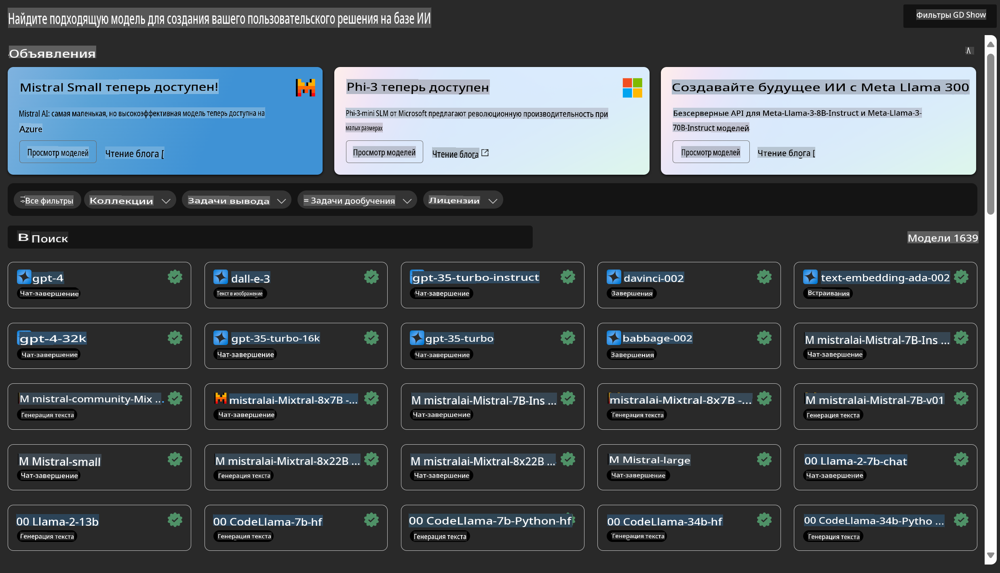
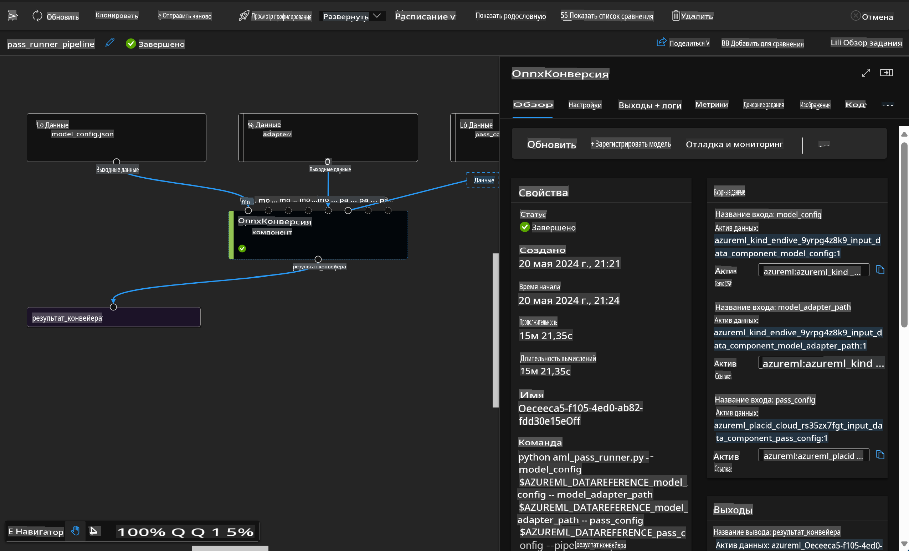

# **Введение в Azure Machine Learning Service**

[Azure Machine Learning](https://ml.azure.com?WT.mc_id=aiml-138114-kinfeylo) — это облачный сервис, предназначенный для ускорения и управления жизненным циклом проектов машинного обучения (ML).

Специалисты по ML, дата-сайентисты и инженеры могут использовать его в своей повседневной работе для:

- Обучения и развертывания моделей.
- Управления операциями машинного обучения (MLOps).
- Создания моделей непосредственно в Azure Machine Learning или использования моделей, разработанных на платформах с открытым исходным кодом, таких как PyTorch, TensorFlow или scikit-learn.
- Инструменты MLOps позволяют отслеживать, переобучать и повторно развертывать модели.

## Для кого предназначен Azure Machine Learning?

**Дата-сайентисты и ML-инженеры**

Они могут использовать инструменты для ускорения и автоматизации своей повседневной работы.  
Azure ML предоставляет функции для обеспечения справедливости, объяснимости, отслеживаемости и аудита.  

**Разработчики приложений**

Они могут легко интегрировать модели в приложения или сервисы.  

**Платформенные разработчики**

Имеют доступ к надежному набору инструментов, поддерживаемых устойчивыми API Azure Resource Manager.  
Эти инструменты позволяют создавать сложные инструменты для ML.  

**Предприятия**

Работая в облаке Microsoft Azure, предприятия получают преимущества в виде знакомой системы безопасности и управления доступом на основе ролей.  
Можно настраивать проекты для контроля доступа к защищенным данным и определенным операциям.  

## Повышение продуктивности для всей команды

Проекты в области машинного обучения часто требуют участия команды с разнообразными навыками для разработки и поддержки.

Azure ML предоставляет инструменты, которые позволяют:

- Сотрудничать с командой через общие ноутбуки, вычислительные ресурсы, бессерверные вычисления, данные и окружения.
- Разрабатывать модели с учетом требований к справедливости, объяснимости, отслеживаемости и аудита для выполнения нормативных и аудиторских требований.
- Быстро и легко развертывать модели ML в масштабах, эффективно управлять и администрировать их с помощью MLOps.
- Выполнять рабочие нагрузки машинного обучения где угодно, с встроенным управлением, безопасностью и соответствием требованиям.

## Инструменты платформы с кросс-совместимостью

Каждый член команды по ML может использовать предпочитаемые инструменты для выполнения задач.  
Будь то быстрые эксперименты, настройка гиперпараметров, создание конвейеров или управление выводами, вы можете использовать знакомые интерфейсы, включая:

- Azure Machine Learning Studio  
- Python SDK (v2)  
- Azure CLI (v2)  
- REST API Azure Resource Manager  

В процессе совершенствования моделей и совместной работы на протяжении цикла разработки вы можете делиться и находить активы, ресурсы и метрики в интерфейсе Azure Machine Learning studio.

## **LLM/SLM в Azure ML**

Azure ML добавил множество функций, связанных с LLM/SLM, объединяя LLMOps и SLMOps для создания корпоративной платформы генеративного искусственного интеллекта.

### **Каталог моделей**

Корпоративные пользователи могут развертывать различные модели в зависимости от бизнес-сценариев через Каталог моделей, предоставляя сервис Model as Service для доступа разработчиков или пользователей.

Каталог моделей в Azure Machine Learning studio — это центр, где можно находить и использовать широкий спектр моделей для создания приложений на основе генеративного ИИ. В каталоге представлены сотни моделей от различных поставщиков, таких как Azure OpenAI Service, Mistral, Meta, Cohere, Nvidia, Hugging Face, а также модели, обученные Microsoft. Модели от поставщиков, кроме Microsoft, считаются продуктами сторонних производителей, как указано в Условиях использования продуктов Microsoft, и подчиняются условиям, предоставленным вместе с моделью.

### **Конвейер задач**

Основная идея конвейера машинного обучения заключается в разделении задачи машинного обучения на многошаговый рабочий процесс. Каждый шаг представляет собой управляемый компонент, который можно разрабатывать, оптимизировать, настраивать и автоматизировать по отдельности. Шаги соединяются через четко определенные интерфейсы. Сервис конвейеров Azure Machine Learning автоматически организует все зависимости между шагами конвейера.

В процессе дообучения SLM / LLM мы можем управлять данными, процессами обучения и генерации через Pipeline.

### **Prompt flow**

**Преимущества использования Azure Machine Learning prompt flow**  
Azure Machine Learning prompt flow предлагает ряд преимуществ, которые помогают пользователям переходить от идеи к экспериментам и, в конечном итоге, к приложениям на основе LLM, готовым к производству:

**Гибкость в инженерии подсказок**

- Интерактивный процесс разработки: Azure Machine Learning prompt flow предоставляет визуальное представление структуры потока, позволяя пользователям легко понимать и управлять проектами. Также доступен опыт разработки, напоминающий работу с ноутбуками, для эффективного создания и отладки потоков.
- Варианты настройки подсказок: Пользователи могут создавать и сравнивать несколько вариантов подсказок, что способствует итеративному процессу их улучшения.
- Оценка: Встроенные потоки оценки позволяют пользователям анализировать качество и эффективность подсказок и потоков.
- Обширные ресурсы: Azure Machine Learning prompt flow включает библиотеку встроенных инструментов, примеров и шаблонов, которые служат отправной точкой для разработки, вдохновляя и ускоряя процесс.

**Готовность к корпоративному использованию приложений на основе LLM**

- Сотрудничество: Azure Machine Learning prompt flow поддерживает командную работу, позволяя нескольким пользователям совместно работать над проектами, делиться знаниями и поддерживать контроль версий.
- Универсальная платформа: Azure Machine Learning prompt flow упрощает весь процесс инженерии подсказок — от разработки и оценки до развертывания и мониторинга. Пользователи могут без труда развертывать свои потоки как конечные точки Azure Machine Learning и отслеживать их производительность в реальном времени, обеспечивая оптимальную работу и постоянное улучшение.
- Решения корпоративного уровня: Prompt flow использует надежные решения Azure Machine Learning, обеспечивая безопасную, масштабируемую и надежную основу для разработки, экспериментов и развертывания потоков.

С помощью Azure Machine Learning prompt flow пользователи могут раскрыть гибкость в создании подсказок, эффективно сотрудничать и использовать решения корпоративного уровня для успешной разработки и развертывания приложений на основе LLM.

Объединив вычислительные мощности, данные и различные компоненты Azure ML, корпоративные разработчики могут легко создавать собственные приложения на основе искусственного интеллекта.

**Отказ от ответственности**:  
Этот документ был переведен с использованием машинных сервисов перевода на основе ИИ. Хотя мы стремимся к точности, пожалуйста, имейте в виду, что автоматические переводы могут содержать ошибки или неточности. Оригинальный документ на его исходном языке следует считать авторитетным источником. Для получения критически важной информации рекомендуется профессиональный перевод человеком. Мы не несем ответственности за любые недоразумения или неверные интерпретации, возникающие в результате использования данного перевода.