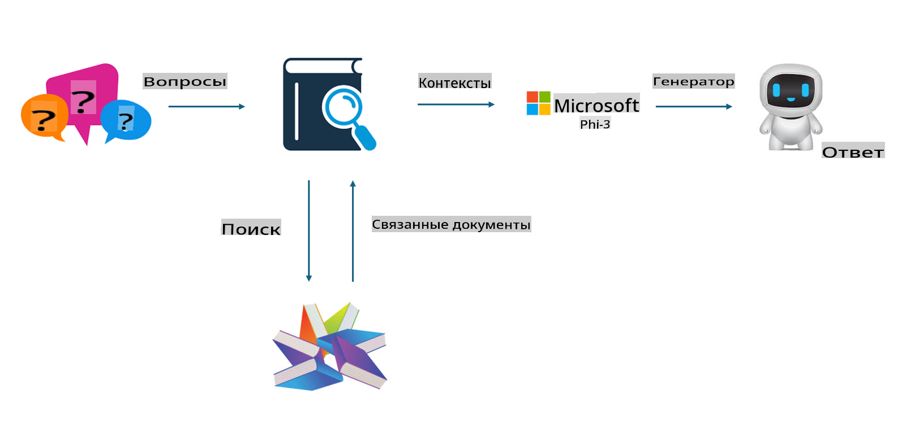
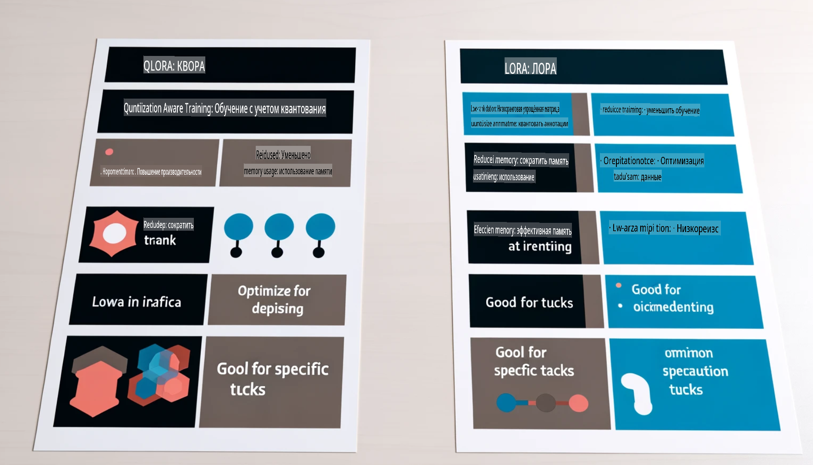

# **Сделайте Phi-3 экспертом в отрасли**

Чтобы внедрить модель Phi-3 в отрасль, необходимо добавить в нее данные о бизнесе отрасли. У нас есть два варианта: RAG (Retrieval Augmented Generation) и Тонкая Настройка (Fine Tuning).

## **RAG vs Тонкая Настройка**

### **Retrieval Augmented Generation**

RAG — это извлечение данных + генерация текста. Структурированные и неструктурированные данные предприятия хранятся в векторной базе данных. При поиске релевантного контента находятся соответствующие резюме и материалы, которые формируют контекст, а затем комбинируются с возможностями завершения текста LLM/SLM для генерации содержимого.

### **Тонкая Настройка**

Тонкая настройка — это улучшение существующей модели. Это не требует работы с алгоритмом модели, но требует постоянного накопления данных. Если вам нужны более точные термины и выражения в отраслевых приложениях, тонкая настройка — это лучший выбор. Однако если ваши данные часто меняются, тонкая настройка может стать сложной.

### **Как выбрать**

1. Если наш ответ требует привлечения внешних данных, RAG — лучший выбор.

2. Если необходимо выдавать стабильные и точные отраслевые знания, тонкая настройка будет хорошим выбором. RAG ориентирован на извлечение релевантного контента, но может не всегда точно учитывать специализированные нюансы.

3. Тонкая настройка требует высококачественного набора данных, и если это всего лишь небольшой объем данных, разница будет незначительной. RAG более гибок.

4. Тонкая настройка — это "черный ящик", метафизика, и внутренний механизм сложно понять. Но RAG позволяет легче находить источник данных, тем самым эффективно корректируя галлюцинации или ошибки в содержимом и обеспечивая лучшую прозрачность.

### **Сценарии**

1. Для вертикальных отраслей, где требуется специфическая профессиональная терминология и выражения, ***Тонкая настройка*** будет лучшим выбором.

2. Для системы вопросов и ответов, включающей синтез различных точек знаний, ***RAG*** будет лучшим выбором.

3. Для автоматизации бизнес-процессов ***RAG + Тонкая настройка*** — лучший выбор.

## **Как использовать RAG**

Векторная база данных — это коллекция данных, хранящихся в математической форме. Векторные базы данных упрощают для моделей машинного обучения запоминание предыдущих входных данных, что позволяет использовать машинное обучение для поддержки таких задач, как поиск, рекомендации и генерация текста. Данные можно идентифицировать на основе метрик сходства, а не точных совпадений, что позволяет компьютерным моделям понимать контекст данных.

Векторная база данных — ключ к реализации RAG. Мы можем преобразовывать данные в векторное хранилище с помощью векторных моделей, таких как text-embedding-3, jina-ai-embedding и других.

Узнайте больше о создании приложений RAG [https://github.com/microsoft/Phi-3CookBook](https://github.com/microsoft/Phi-3CookBook?WT.mc_id=aiml-138114-kinfeylo)

## **Как использовать Тонкую Настройку**

Наиболее часто используемые алгоритмы для тонкой настройки — это Lora и QLora. Как выбрать?
- [Подробнее в этом примере ноутбука](../../../../code/04.Finetuning/Phi_3_Inference_Finetuning.ipynb)
- [Пример скрипта на Python для тонкой настройки](../../../../code/04.Finetuning/FineTrainingScript.py)

### **Lora и QLora**

LoRA (Low-Rank Adaptation) и QLoRA (Quantized Low-Rank Adaptation) — это техники, используемые для тонкой настройки больших языковых моделей (LLMs) с использованием параметрически эффективной тонкой настройки (PEFT). Техники PEFT разработаны для более эффективного обучения моделей по сравнению с традиционными методами.

LoRA — это автономная техника тонкой настройки, которая снижает объем памяти за счет применения низкорангового приближения к матрице обновления весов. Она обеспечивает быстрое обучение и сохраняет производительность, близкую к традиционным методам тонкой настройки.

QLoRA — это расширенная версия LoRA, которая включает методы квантования для дальнейшего уменьшения использования памяти. QLoRA снижает точность параметров весов в предварительно обученной LLM до 4-битной точности, что делает ее более экономичной по памяти, чем LoRA. Однако обучение с QLoRA примерно на 30% медленнее, чем с LoRA, из-за дополнительных шагов квантования и деквантования.

QLoRA использует LoRA в качестве вспомогательного средства для исправления ошибок, возникающих при квантовании. QLoRA позволяет выполнять тонкую настройку массивных моделей с миллиардами параметров на относительно небольших и доступных GPU. Например, QLoRA может настроить модель с 70 миллиардами параметров, которая требует 36 GPU, используя всего 2.

**Отказ от ответственности**:  
Этот документ был переведен с использованием автоматизированных AI-сервисов перевода. Хотя мы стремимся к точности, пожалуйста, имейте в виду, что автоматические переводы могут содержать ошибки или неточности. Оригинальный документ на его исходном языке следует считать авторитетным источником. Для получения критически важной информации рекомендуется профессиональный перевод человеком. Мы не несем ответственности за любые недоразумения или неверные интерпретации, возникающие в результате использования этого перевода.