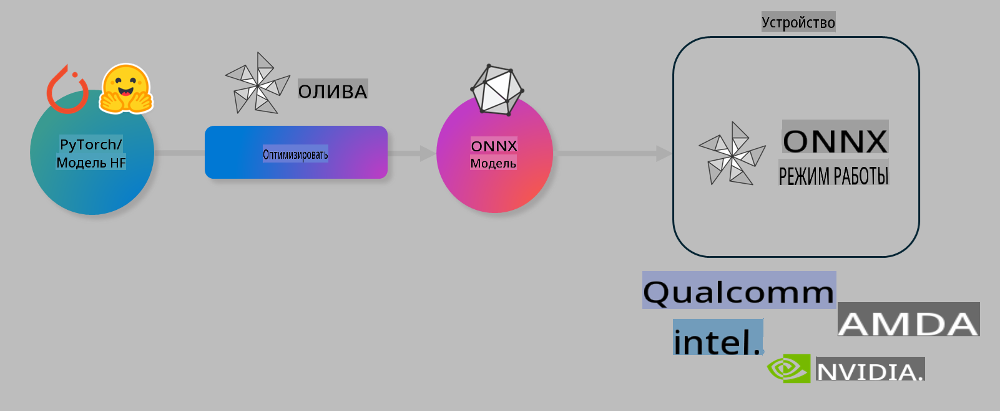

# Лабораторная работа. Оптимизация AI-моделей для локального инференса

## Введение

> [!IMPORTANT]
> Для выполнения этой лабораторной работы требуется **GPU Nvidia A10 или A100** с установленными драйверами и инструментарием CUDA (версии 12+).

> [!NOTE]
> Эта лабораторная работа рассчитана на **35 минут** и предоставит вам практическое введение в основные концепции оптимизации моделей для локального инференса с использованием OLIVE.

## Учебные цели

К концу этой лабораторной работы вы сможете использовать OLIVE для:

- Квантования AI-модели с использованием метода квантования AWQ.
- Тонкой настройки AI-модели для конкретной задачи.
- Генерации адаптеров LoRA (тонко настроенной модели) для эффективного локального инференса на ONNX Runtime.

### Что такое Olive

Olive (*O*NNX *live*) — это инструмент для оптимизации моделей с сопровождающим интерфейсом командной строки (CLI), который позволяет готовить модели для ONNX Runtime +++https://onnxruntime.ai+++ с высоким качеством и производительностью.



На вход Olive обычно подается модель PyTorch или Hugging Face, а на выходе — оптимизированная модель ONNX, которая выполняется на устройстве (целевая платформа развертывания) с ONNX Runtime. Olive оптимизирует модель для AI-ускорителя целевой платформы (NPU, GPU, CPU), предоставленного таким производителем оборудования, как Qualcomm, AMD, Nvidia или Intel.

Olive выполняет *workflow* — упорядоченную последовательность отдельных задач оптимизации модели, называемых *passes* (проходы). Примеры проходов: сжатие модели, захват графа, квантование, оптимизация графа. Каждый проход имеет набор параметров, которые можно настроить для достижения лучших метрик, например, точности и задержки, оцениваемых соответствующим оценщиком. Olive использует стратегию поиска, которая применяет алгоритм поиска для автоматической настройки каждого прохода по отдельности или набора проходов вместе.

#### Преимущества Olive

- **Снижение сложности и времени**, затрачиваемых на ручные эксперименты методом проб и ошибок с различными техниками оптимизации графа, сжатия и квантования. Задайте свои ограничения по качеству и производительности, и Olive автоматически найдет для вас лучшую модель.
- **Более 40 встроенных компонентов оптимизации моделей**, охватывающих передовые техники квантования, сжатия, оптимизации графа и тонкой настройки.
- **Простой CLI** для выполнения общих задач оптимизации моделей, например, olive quantize, olive auto-opt, olive finetune.
- Встроенная упаковка и развертывание моделей.
- Поддержка генерации моделей для **Multi LoRA сервиса**.
- Конструирование workflow с использованием YAML/JSON для оркестрации задач оптимизации и развертывания моделей.
- Интеграция с **Hugging Face** и **Azure AI**.
- Встроенный механизм **кэширования**, позволяющий **сократить затраты**.

## Инструкции к лабораторной работе
> [!NOTE]
> Убедитесь, что вы подготовили свой Azure AI Hub и проект, а также настроили вычислительный ресурс A100 в соответствии с Лабораторной работой 1.

### Шаг 0: Подключение к Azure AI Compute

Вы подключитесь к вычислительному ресурсу Azure AI с использованием удаленной функции в **VS Code.**

1. Откройте настольное приложение **VS Code**:
1. Откройте **палитру команд** с помощью **Shift+Ctrl+P**.
1. В палитре команд найдите **AzureML - remote: Connect to compute instance in New Window**.
1. Следуйте инструкциям на экране для подключения к вычислительному ресурсу. Это будет включать выбор вашей подписки Azure, группы ресурсов, проекта и имени вычислительного ресурса, настроенного в Лабораторной работе 1.
1. После подключения к узлу Azure ML Compute это будет отображаться в **нижнем левом углу Visual Code** `><Azure ML: Compute Name`.

### Шаг 1: Клонирование репозитория

В VS Code вы можете открыть новый терминал с помощью **Ctrl+J** и клонировать этот репозиторий:

В терминале вы должны увидеть запрос

```
azureuser@computername:~/cloudfiles/code$ 
```
Клонируйте решение 

```bash
cd ~/localfiles
git clone https://github.com/microsoft/phi-3cookbook.git
```

### Шаг 2: Открытие папки в VS Code

Чтобы открыть VS Code в соответствующей папке, выполните следующую команду в терминале. Это откроет новое окно:

```bash
code phi-3cookbook/code/04.Finetuning/Olive-lab
```

Или вы можете открыть папку, выбрав **File** > **Open Folder**.

### Шаг 3: Установка зависимостей

Откройте окно терминала в VS Code в вашем экземпляре Azure AI Compute (подсказка: **Ctrl+J**) и выполните следующие команды для установки зависимостей:

```bash
conda create -n olive-ai python=3.11 -y
conda activate olive-ai
pip install -r requirements.txt
az extension remove -n azure-cli-ml
az extension add -n ml
```

> [!NOTE]
> Установка всех зависимостей займет ~5 минут.

В этой лабораторной работе вы будете загружать и выгружать модели в каталог моделей Azure AI. Чтобы получить доступ к каталогу моделей, вам нужно войти в Azure, используя:

```bash
az login
```

> [!NOTE]
> Во время входа вам будет предложено выбрать подписку. Убедитесь, что вы выбрали подписку, предоставленную для этой лабораторной работы.

### Шаг 4: Выполнение команд Olive

Откройте окно терминала в VS Code в вашем экземпляре Azure AI Compute (подсказка: **Ctrl+J**) и убедитесь, что активирована среда `olive-ai` conda:

```bash
conda activate olive-ai
```

Далее выполните следующие команды Olive в командной строке.

1. **Изучение данных:** В этом примере вы будете тонко настраивать модель Phi-3.5-Mini, чтобы она специализировалась на ответах на вопросы, связанные с путешествиями. Код ниже отображает первые несколько записей набора данных, которые находятся в формате JSON lines:

    ```bash
    head data/data_sample_travel.jsonl
    ```
1. **Квантование модели:** Перед обучением модели сначала выполните квантование с помощью следующей команды, которая использует технику, называемую Active Aware Quantization (AWQ) +++https://arxiv.org/abs/2306.00978+++. AWQ выполняет квантование весов модели, учитывая активации, создаваемые во время инференса. Это означает, что процесс квантования принимает во внимание фактическое распределение данных в активациях, что позволяет лучше сохранять точность модели по сравнению с традиционными методами квантования весов.

    ```bash
    olive quantize \
       --model_name_or_path microsoft/Phi-3.5-mini-instruct \
       --trust_remote_code \
       --algorithm awq \
       --output_path models/phi/awq \
       --log_level 1
    ```
    
    Выполнение квантования AWQ занимает **~8 минут**, что **уменьшает размер модели с ~7,5 ГБ до ~2,5 ГБ**.
   
   В этой лабораторной работе мы показываем, как вводить модели из Hugging Face (например, `microsoft/Phi-3.5-mini-instruct`). However, Olive also allows you to input models from the Azure AI catalog by updating the `model_name_or_path` argument to an Azure AI asset ID (for example:  `azureml://registries/azureml/models/Phi-3.5-mini-instruct/versions/4`). 

1. **Train the model:** Next, the `olive finetune` команда выполняет тонкую настройку квантованной модели. Квантование модели *до* тонкой настройки, а не после, обеспечивает лучшую точность, так как процесс тонкой настройки восстанавливает часть потерь от квантования.
    
    ```bash
    olive finetune \
        --method lora \
        --model_name_or_path models/phi/awq \
        --data_files "data/data_sample_travel.jsonl" \
        --data_name "json" \
        --text_template "<|user|>\n{prompt}<|end|>\n<|assistant|>\n{response}<|end|>" \
        --max_steps 100 \
        --output_path ./models/phi/ft \
        --log_level 1
    ```
    
    Выполнение тонкой настройки (100 шагов) занимает **~6 минут**.

1. **Оптимизация:** После обучения модели теперь оптимизируйте модель с помощью команды Olive `auto-opt` command, which will capture the ONNX graph and automatically perform a number of optimizations to improve the model performance for CPU by compressing the model and doing fusions. It should be noted, that you can also optimize for other devices such as NPU or GPU by just updating the `--device` and `--provider` - но для целей этой лабораторной работы мы будем использовать CPU.

    ```bash
    olive auto-opt \
       --model_name_or_path models/phi/ft/model \
       --adapter_path models/phi/ft/adapter \
       --device cpu \
       --provider CPUExecutionProvider \
       --use_ort_genai \
       --output_path models/phi/onnx-ao \
       --log_level 1
    ```
    
    Оптимизация занимает **~5 минут**.

### Шаг 5: Быстрая проверка инференса модели

Для тестирования инференса модели создайте Python-файл в вашей папке с именем **app.py** и скопируйте и вставьте следующий код:

```python
import onnxruntime_genai as og
import numpy as np

print("loading model and adapters...", end="", flush=True)
model = og.Model("models/phi/onnx-ao/model")
adapters = og.Adapters(model)
adapters.load("models/phi/onnx-ao/model/adapter_weights.onnx_adapter", "travel")
print("DONE!")

tokenizer = og.Tokenizer(model)
tokenizer_stream = tokenizer.create_stream()

params = og.GeneratorParams(model)
params.set_search_options(max_length=100, past_present_share_buffer=False)
user_input = "what is the best thing to see in chicago"
params.input_ids = tokenizer.encode(f"<|user|>\n{user_input}<|end|>\n<|assistant|>\n")

generator = og.Generator(model, params)

generator.set_active_adapter(adapters, "travel")

print(f"{user_input}")

while not generator.is_done():
    generator.compute_logits()
    generator.generate_next_token()

    new_token = generator.get_next_tokens()[0]
    print(tokenizer_stream.decode(new_token), end='', flush=True)

print("\n")
```

Выполните код с помощью:

```bash
python app.py
```

### Шаг 6: Загрузка модели в Azure AI

Загрузка модели в репозиторий моделей Azure AI делает модель доступной для других членов вашей команды разработчиков, а также обеспечивает контроль версий модели. Для загрузки модели выполните следующую команду:

> [!NOTE]
> Обновите `{}` placeholders with the name of your resource group and Azure AI Project Name. 

To find your resource group `"resourceGroup"` и имя проекта Azure AI, затем выполните следующую команду 

```
az ml workspace show
```

Или перейдите на +++ai.azure.com+++ и выберите **management center** > **project** > **overview**.

Обновите заполнители `{}` на имя вашей группы ресурсов и имя проекта Azure AI.

```bash
az ml model create \
    --name ft-for-travel \
    --version 1 \
    --path ./models/phi/onnx-ao \
    --resource-group {RESOURCE_GROUP_NAME} \
    --workspace-name {PROJECT_NAME}
```
Затем вы сможете увидеть загруженную модель и развернуть ее на https://ml.azure.com/model/list

**Отказ от ответственности**:  
Этот документ был переведен с использованием автоматических услуг машинного перевода. Хотя мы стремимся к точности, пожалуйста, имейте в виду, что автоматические переводы могут содержать ошибки или неточности. Оригинальный документ на его родном языке следует считать авторитетным источником. Для критически важной информации рекомендуется профессиональный перевод человеком. Мы не несем ответственности за какие-либо недоразумения или неправильные интерпретации, возникающие в результате использования этого перевода.