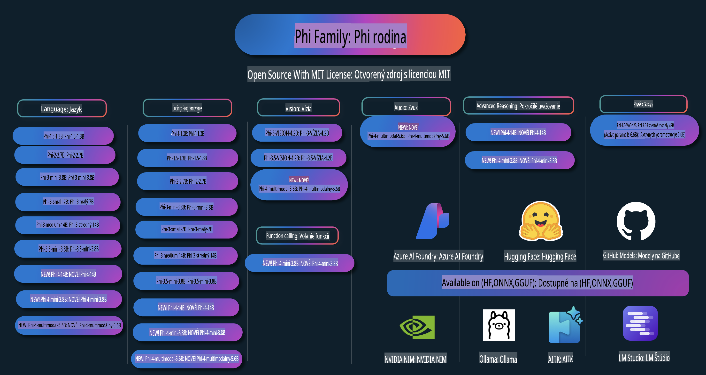

# Phi Cookbook: Praktické príklady s modelmi Phi od Microsoftu

  

  
  
  

  
  

Phi je séria open source AI modelov vyvinutých spoločnosťou Microsoft.

Phi je aktuálne najvýkonnejší a najefektívnejší malý jazykový model (SLM), ktorý dosahuje výborné výsledky v oblasti viacjazyčnosti, logického uvažovania, generovania textu/četu, kódovania, obrázkov, audia a ďalších scenárov.

Model Phi je možné nasadiť do cloudu alebo na edge zariadenia a ľahko s ním vytvárať generatívne AI aplikácie s obmedzenými výpočtovými zdrojmi.

Postupujte podľa týchto krokov, aby ste mohli začať používať tieto zdroje:  
1. **Forknite repozitár**: Kliknite na   
2. **Klonujte repozitár**:   `git clone https://github.com/microsoft/PhiCookBook.git`  
3. [**Pridajte sa do komunity Microsoft AI Discord a spoznajte expertov a ďalších vývojárov**](https://discord.com/invite/ByRwuEEgH4?WT.mc_id=aiml-137032-kinfeylo)

## Obsah

- Úvod
  - [Vitajte v rodine Phi](./md/01.Introduction/01/01.PhiFamily.md)
  - [Nastavenie vášho prostredia](./md/01.Introduction/01/01.EnvironmentSetup.md)
  - [Porozumenie kľúčovým technológiám](./md/01.Introduction/01/01.Understandingtech.md)
  - [Bezpečnosť AI pre modely Phi](./md/01.Introduction/01/01.AISafety.md)
  - [Podpora hardvéru pre Phi](./md/01.Introduction/01/01.Hardwaresupport.md)
  - [Modely Phi a ich dostupnosť na rôznych platformách](./md/01.Introduction/01/01.Edgeandcloud.md)
  - [Používanie Guidance-ai a Phi](./md/01.Introduction/01/01.Guidance.md)
  - [Modely na GitHub Marketplace](https://github.com/marketplace/models)
  - [Katalóg modelov Azure AI](https://ai.azure.com)

- Inferencia Phi v rôznych prostrediach
    - [Hugging face](./md/01.Introduction/02/01.HF.md)
    - [Modely na GitHube](./md/01.Introduction/02/02.GitHubModel.md)
    - [Katalóg modelov Azure AI Foundry](./md/01.Introduction/02/03.AzureAIFoundry.md)
    - [Ollama](./md/01.Introduction/02/04.Ollama.md)
    - [AI Toolkit VSCode (AITK)](./md/01.Introduction/02/05.AITK.md)
    - [NVIDIA NIM](./md/01.Introduction/02/06.NVIDIA.md)

- Inferencia rodiny Phi
    - [Inferencia Phi na iOS](./md/01.Introduction/03/iOS_Inference.md)
    - [Inferencia Phi na Android](./md/01.Introduction/03/Android_Inference.md)
- [Inference Phi v Jetson](./md/01.Introduction/03/Jetson_Inference.md)  
    - [Inference Phi na AI PC](./md/01.Introduction/03/AIPC_Inference.md)  
    - [Inference Phi s Apple MLX Framework](./md/01.Introduction/03/MLX_Inference.md)  
    - [Inference Phi na lokálnom serveri](./md/01.Introduction/03/Local_Server_Inference.md)  
    - [Inference Phi na vzdialenom serveri pomocou AI Toolkit](./md/01.Introduction/03/Remote_Interence.md)  
    - [Inference Phi s Rust](./md/01.Introduction/03/Rust_Inference.md)  
    - [Inference Phi--Vision lokálne](./md/01.Introduction/03/Vision_Inference.md)  
    - [Inference Phi s Kaito AKS, Azure Containers (oficiálna podpora)](./md/01.Introduction/03/Kaito_Inference.md)  

- [Kvantifikácia rodiny Phi](./md/01.Introduction/04/QuantifyingPhi.md)  
    - [Kvantifikácia Phi-3.5 / 4 pomocou llama.cpp](./md/01.Introduction/04/UsingLlamacppQuantifyingPhi.md)  
    - [Kvantifikácia Phi-3.5 / 4 pomocou rozšírení Generative AI pre onnxruntime](./md/01.Introduction/04/UsingORTGenAIQuantifyingPhi.md)  
    - [Kvantifikácia Phi-3.5 / 4 pomocou Intel OpenVINO](./md/01.Introduction/04/UsingIntelOpenVINOQuantifyingPhi.md)  
    - [Kvantifikácia Phi-3.5 / 4 pomocou Apple MLX Framework](./md/01.Introduction/04/UsingAppleMLXQuantifyingPhi.md)  

- Hodnotenie Phi  
    - [Zodpovedná AI](./md/01.Introduction/05/ResponsibleAI.md)  
    - [Azure AI Foundry pre hodnotenie](./md/01.Introduction/05/AIFoundry.md)  
    - [Použitie Promptflow na hodnotenie](./md/01.Introduction/05/Promptflow.md)  

- RAG s Azure AI Search  
    - [Ako používať Phi-4-mini a Phi-4-multimodal (RAG) s Azure AI Search](https://github.com/microsoft/PhiCookBook/blob/main/code/06.E2E/E2E_Phi-4-RAG-Azure-AI-Search.ipynb)  

- Ukážky vývoja aplikácií Phi  
  - Textové a chatovacie aplikácie  
    - Ukážky Phi-4 🆕  
      - [📓] [Chat s Phi-4-mini ONNX modelom](./md/02.Application/01.TextAndChat/Phi4/ChatWithPhi4ONNX/README.md)  
      - [Chat s lokálnym ONNX modelom Phi-4 .NET](../../md/04.HOL/dotnet/src/LabsPhi4-Chat-01OnnxRuntime)  
      - [Konzolová aplikácia .NET pre chat s Phi-4 ONNX pomocou Semantic Kernel](../../md/04.HOL/dotnet/src/LabsPhi4-Chat-02SK)  
    - Ukážky Phi-3 / 3.5  
      - [Lokálny chatbot v prehliadači pomocou Phi3, ONNX Runtime Web a WebGPU](https://github.com/microsoft/onnxruntime-inference-examples/tree/main/js/chat)  
      - [OpenVino Chat](./md/02.Application/01.TextAndChat/Phi3/E2E_OpenVino_Chat.md)  
      - [Multi Model - Interaktívny Phi-3-mini a OpenAI Whisper](./md/02.Application/01.TextAndChat/Phi3/E2E_Phi-3-mini_with_whisper.md)  
      - [MLFlow - Vytvorenie obalu a použitie Phi-3 s MLFlow](./md//02.Application/01.TextAndChat/Phi3/E2E_Phi-3-MLflow.md)  
      - [Optimalizácia modelu - Ako optimalizovať Phi-3-mini model pre ONNX Runtime Web s Olive](https://github.com/microsoft/Olive/tree/main/examples/phi3)  
      - [WinUI3 aplikácia s Phi-3 mini-4k-instruct-onnx](https://github.com/microsoft/Phi3-Chat-WinUI3-Sample/)  
      - [WinUI3 Multi Model AI Powered Notes App Sample](https://github.com/microsoft/ai-powered-notes-winui3-sample)  
      - [Jemné doladenie a integrácia vlastných modelov Phi-3 pomocou Prompt flow](./md/02.Application/01.TextAndChat/Phi3/E2E_Phi-3-FineTuning_PromptFlow_Integration.md)  
      - [Jemné doladenie a integrácia vlastných modelov Phi-3 pomocou Prompt flow v Azure AI Foundry](./md/02.Application/01.TextAndChat/Phi3/E2E_Phi-3-FineTuning_PromptFlow_Integration_AIFoundry.md)  
      - [Hodnotenie jemne doladeného modelu Phi-3 / Phi-3.5 v Azure AI Foundry so zameraním na princípy zodpovednej AI od Microsoftu](./md/02.Application/01.TextAndChat/Phi3/E2E_Phi-3-Evaluation_AIFoundry.md)  
- [📓] [Phi-3.5-mini-instruct jazykové predikčné ukážky (Čínština/Angličtina)](../../md/02.Application/01.TextAndChat/Phi3/phi3-instruct-demo.ipynb)
      - [Phi-3.5-Instruct WebGPU RAG Chatbot](./md/02.Application/01.TextAndChat/Phi3/WebGPUWithPhi35Readme.md)
      - [Použitie Windows GPU na vytvorenie Prompt flow riešenia s Phi-3.5-Instruct ONNX](./md/02.Application/01.TextAndChat/Phi3/UsingPromptFlowWithONNX.md)
      - [Použitie Microsoft Phi-3.5 tflite na vytvorenie Android aplikácie](./md/02.Application/01.TextAndChat/Phi3/UsingPhi35TFLiteCreateAndroidApp.md)
      - [Q&A .NET príklad s lokálnym ONNX Phi-3 modelom pomocou Microsoft.ML.OnnxRuntime](../../md/04.HOL/dotnet/src/LabsPhi301)
      - [Konzolová chat .NET aplikácia so Semantic Kernel a Phi-3](../../md/04.HOL/dotnet/src/LabsPhi302)

  - Azure AI Inference SDK Ukážky kódu 
    - Phi-4 Ukážky 🆕
      - [📓] [Generovanie projektového kódu pomocou Phi-4-multimodal](./md/02.Application/02.Code/Phi4/GenProjectCode/README.md)
    - Phi-3 / 3.5 Ukážky
      - [Vytvorte si vlastný Visual Studio Code GitHub Copilot Chat s Microsoft Phi-3 Family](./md/02.Application/02.Code/Phi3/VSCodeExt/README.md)
      - [Vytvorte si vlastného Visual Studio Code Chat Copilot Agenta s Phi-3.5 pomocou GitHub modelov](/md/02.Application/02.Code/Phi3/CreateVSCodeChatAgentWithGitHubModels.md)

  - Pokročilé uvažovanie - Ukážky
    - Phi-4 Ukážky 🆕
      - [📓] [Phi-4-mini Ukážky uvažovania](./md/02.Application/03.AdvancedReasoning/Phi4/AdvancedResoningPhi4mini/README.md)
  
  - Demos
      - [Phi-4-mini ukážky hostované na Hugging Face Spaces](https://huggingface.co/spaces/microsoft/phi-4-mini?WT.mc_id=aiml-137032-kinfeylo)
      - [Phi-4-multimodal ukážky hostované na Hugging Face Spaces](https://huggingface.co/spaces/microsoft/phi-4-multimodal?WT.mc_id=aiml-137032-kinfeylo)
  - Vision Ukážky
    - Phi-4 Ukážky 🆕
      - [📓] [Použitie Phi-4-multimodal na čítanie obrázkov a generovanie kódu](./md/02.Application/04.Vision/Phi4/CreateFrontend/README.md) 
    - Phi-3 / 3.5 Ukážky
      -  [📓][Phi-3-vision-Text obrázka na text](../../md/02.Application/04.Vision/Phi3/E2E_Phi-3-vision-image-text-to-text-online-endpoint.ipynb)
      - [Phi-3-vision-ONNX](https://onnxruntime.ai/docs/genai/tutorials/phi3-v.html)
      - [📓][Phi-3-vision CLIP Vloženie](../../md/02.Application/04.Vision/Phi3/E2E_Phi-3-vision-image-text-to-text-online-endpoint.ipynb)
      - [DEMO: Phi-3 Recyklovanie](https://github.com/jennifermarsman/PhiRecycling/)
      - [Phi-3-vision - Vizuálny jazykový asistent - s Phi3-Vision a OpenVINO](https://docs.openvino.ai/nightly/notebooks/phi-3-vision-with-output.html)
      - [Phi-3 Vision Nvidia NIM](./md/02.Application/04.Vision/Phi3/E2E_Nvidia_NIM_Vision.md)
      - [Phi-3 Vision OpenVino](./md/02.Application/04.Vision/Phi3/E2E_OpenVino_Phi3Vision.md)
      - [📓][Phi-3.5 Vision ukážka pre viacero snímok alebo obrázkov](../../md/02.Application/04.Vision/Phi3/phi3-vision-demo.ipynb)
      - [Phi-3 Vision Lokálny ONNX Model pomocou Microsoft.ML.OnnxRuntime .NET](../../md/04.HOL/dotnet/src/LabsPhi303)
      - [Menu-based Phi-3 Vision Lokálny ONNX Model pomocou Microsoft.ML.OnnxRuntime .NET](../../md/04.HOL/dotnet/src/LabsPhi304)

  - Audio Ukážky
    - Phi-4 Ukážky 🆕
      - [📓] [Extrahovanie audio prepisov pomocou Phi-4-multimodal](./md/02.Application/05.Audio/Phi4/Transciption/README.md)
      - [📓] [Phi-4-multimodal Audio Ukážka](../../md/02.Application/05.Audio/Phi4/Siri/demo.ipynb)
      - [📓] [Phi-4-multimodal Ukážka prekladu reči](../../md/02.Application/05.Audio/Phi4/Translate/demo.ipynb)
      - [.NET konzolová aplikácia používajúca Phi-4-multimodal Audio na analýzu audio súboru a generovanie prepisu](../../md/04.HOL/dotnet/src/LabsPhi4-MultiModal-02Audio)

  - MOE Ukážky
    - Phi-3 / 3.5 Ukážky
      - [📓] [Phi-3.5 Mixture of Experts Models (MoEs) Ukážka pre sociálne siete](../../md/02.Application/06.MoE/Phi3/phi3_moe_demo.ipynb)
      - [📓] [Vytváranie Retrieval-Augmented Generation (RAG) pipeline s NVIDIA NIM Phi-3 MOE, Azure AI Search a LlamaIndex](../../md/02.Application/06.MoE/Phi3/azure-ai-search-nvidia-rag.ipynb)
  - Ukážky volania funkcií
    - Phi-4 Ukážky 🆕
      -  [📓] [Použitie volania funkcií s Phi-4-mini](./md/02.Application/07.FunctionCalling/Phi4/FunctionCallingBasic/README.md)
  - Ukážky multimodálneho miešania
    - Phi-4 Ukážky 🆕
- [📓] [Používanie Phi-4-multimodal ako technologický novinár](../../md/02.Application/08.Multimodel/Phi4/TechJournalist/phi_4_mm_audio_text_publish_news.ipynb)
  - [.NET konzolová aplikácia využívajúca Phi-4-multimodal na analýzu obrázkov](../../md/04.HOL/dotnet/src/LabsPhi4-MultiModal-01Images)

- Doladenie vzoriek Phi
  - [Scenáre doladenia](./md/03.FineTuning/FineTuning_Scenarios.md)
  - [Doladenie vs RAG](./md/03.FineTuning/FineTuning_vs_RAG.md)
  - [Doladenie: Nechajte Phi-3 stať sa odborníkom v odvetví](./md/03.FineTuning/LetPhi3gotoIndustriy.md)
  - [Doladenie Phi-3 s AI Toolkit pre VS Code](./md/03.FineTuning/Finetuning_VSCodeaitoolkit.md)
  - [Doladenie Phi-3 s Azure Machine Learning Service](./md/03.FineTuning/Introduce_AzureML.md)
  - [Doladenie Phi-3 s Lora](./md/03.FineTuning/FineTuning_Lora.md)
  - [Doladenie Phi-3 s QLora](./md/03.FineTuning/FineTuning_Qlora.md)
  - [Doladenie Phi-3 s Azure AI Foundry](./md/03.FineTuning/FineTuning_AIFoundry.md)
  - [Doladenie Phi-3 s Azure ML CLI/SDK](./md/03.FineTuning/FineTuning_MLSDK.md)
  - [Doladenie s Microsoft Olive](./md/03.FineTuning/FineTuning_MicrosoftOlive.md)
  - [Doladenie s Microsoft Olive - Praktické cvičenie](./md/03.FineTuning/olive-lab/readme.md)
  - [Doladenie Phi-3-vision s Weights and Bias](./md/03.FineTuning/FineTuning_Phi-3-visionWandB.md)
  - [Doladenie Phi-3 s Apple MLX Framework](./md/03.FineTuning/FineTuning_MLX.md)
  - [Doladenie Phi-3-vision (oficiálna podpora)](./md/03.FineTuning/FineTuning_Vision.md)
  - [Doladenie Phi-3 s Kaito AKS, Azure Containers (oficiálna podpora)](./md/03.FineTuning/FineTuning_Kaito.md)
  - [Doladenie Phi-3 a 3.5 Vision](https://github.com/2U1/Phi3-Vision-Finetune)

- Praktické cvičenia
  - [Preskúmanie najmodernejších modelov: LLMs, SLMs, lokálny vývoj a viac](https://github.com/microsoft/aitour-exploring-cutting-edge-models)
  - [Odomknutie potenciálu NLP: Doladenie s Microsoft Olive](https://github.com/azure/Ignite_FineTuning_workshop)

- Akademické výskumné práce a publikácie
  - [Textbooks Are All You Need II: technická správa phi-1.5](https://arxiv.org/abs/2309.05463)
  - [Technická správa Phi-3: Vysoko schopný jazykový model priamo vo vašom telefóne](https://arxiv.org/abs/2404.14219)
  - [Technická správa Phi-4](https://arxiv.org/abs/2412.08905)
  - [Optimalizácia malých jazykových modelov pre volanie funkcií vo vozidlách](https://arxiv.org/abs/2501.02342)
  - [(WhyPHI) Doladenie PHI-3 pre odpovede na otázky s výberom z viacerých možností: Metodológia, výsledky a výzvy](https://arxiv.org/abs/2501.01588)

## Používanie modelov Phi

### Phi na Azure AI Foundry

Môžete sa naučiť, ako používať Microsoft Phi a ako vytvárať E2E riešenia na rôznych hardvérových zariadeniach. Ak chcete Phi vyskúšať, začnite s modelmi a prispôsobte Phi pre svoje scenáre pomocou [Azure AI Foundry Azure AI Model Catalog](https://aka.ms/phi3-azure-ai). Viac informácií nájdete v časti Začíname s [Azure AI Foundry](/md/02.QuickStart/AzureAIFoundry_QuickStart.md).

**Playground**  
Každý model má vlastné ihrisko na testovanie modelu [Azure AI Playground](https://aka.ms/try-phi3).

### Phi na GitHub Models

Môžete sa naučiť, ako používať Microsoft Phi a ako vytvárať E2E riešenia na rôznych hardvérových zariadeniach. Ak chcete Phi vyskúšať, začnite s modelmi a prispôsobte Phi pre svoje scenáre pomocou [GitHub Model Catalog](https://github.com/marketplace/models?WT.mc_id=aiml-137032-kinfeylo). Viac informácií nájdete v časti Začíname s [GitHub Model Catalog](/md/02.QuickStart/GitHubModel_QuickStart.md).

**Playground**
Každý model má vyhradené [ihrisko na testovanie modelu](/md/02.QuickStart/GitHubModel_QuickStart.md).

### Phi na Hugging Face

Model môžete nájsť aj na [Hugging Face](https://huggingface.co/microsoft)

**Ihrisko**  
[Hugging Chat ihrisko](https://huggingface.co/chat/models/microsoft/Phi-3-mini-4k-instruct)

## Zodpovedná AI

Microsoft sa zaväzuje pomáhať svojim zákazníkom používať naše AI produkty zodpovedne, zdieľať naše poznatky a budovať partnerstvá založené na dôvere prostredníctvom nástrojov ako Poznámky o transparentnosti a Hodnotenia dopadov. Mnohé z týchto zdrojov nájdete na [https://aka.ms/RAI](https://aka.ms/RAI).  
Prístup Microsoftu k zodpovednej AI je založený na našich princípoch AI: spravodlivosť, spoľahlivosť a bezpečnosť, súkromie a ochrana, inkluzívnosť, transparentnosť a zodpovednosť.

Veľkorozmerné modely pre spracovanie prirodzeného jazyka, obrazu a reči – ako tie použité v tomto príklade – môžu potenciálne správať spôsobom, ktorý je nespravodlivý, nespoľahlivý alebo urážlivý, čo môže spôsobiť škody. Pre informácie o rizikách a obmedzeniach si prosím preštudujte [Poznámku o transparentnosti služby Azure OpenAI](https://learn.microsoft.com/legal/cognitive-services/openai/transparency-note?tabs=text).

Odporúčaný prístup na zmiernenie týchto rizík je zahrnúť do svojej architektúry bezpečnostný systém, ktorý dokáže detegovať a zabrániť škodlivému správaniu. [Azure AI Content Safety](https://learn.microsoft.com/azure/ai-services/content-safety/overview) poskytuje nezávislú vrstvu ochrany, schopnú detegovať škodlivý obsah vytvorený používateľmi alebo AI v aplikáciách a službách. Azure AI Content Safety zahŕňa textové a obrazové API, ktoré umožňujú detegovať škodlivý materiál. V rámci Azure AI Foundry služba Content Safety umožňuje zobraziť, preskúmať a vyskúšať ukážkový kód na detekciu škodlivého obsahu naprieč rôznymi modalitami. Nasledujúca [dokumentácia rýchleho začiatku](https://learn.microsoft.com/azure/ai-services/content-safety/quickstart-text?tabs=visual-studio%2Clinux&pivots=programming-language-rest) vás prevedie vytváraním požiadaviek na službu.

Ďalším aspektom, ktorý treba zohľadniť, je celkový výkon aplikácie. Pri multimodálnych a multi-modelových aplikáciách považujeme výkon za schopnosť systému splniť vaše a používateľské očakávania, vrátane neprodukovania škodlivých výstupov. Je dôležité hodnotiť výkon vašej aplikácie pomocou [hodnotiacich nástrojov pre výkon, kvalitu, riziká a bezpečnosť](https://learn.microsoft.com/azure/ai-studio/concepts/evaluation-metrics-built-in). Máte tiež možnosť vytvárať a hodnotiť pomocou [vlastných hodnotiacich nástrojov](https://learn.microsoft.com/azure/ai-studio/how-to/develop/evaluate-sdk#custom-evaluators).

Vašu AI aplikáciu môžete hodnotiť vo vývojovom prostredí pomocou [Azure AI Evaluation SDK](https://microsoft.github.io/promptflow/index.html). Pri použití testovacej dátovej sady alebo cieľa sú generácie vašej generatívnej AI aplikácie kvantitatívne merané zabudovanými alebo vlastnými hodnotiacimi nástrojmi podľa vášho výberu. Ak chcete začať s Azure AI Evaluation SDK na hodnotenie vášho systému, môžete postupovať podľa [sprievodcu rýchlym začiatkom](https://learn.microsoft.com/azure/ai-studio/how-to/develop/flow-evaluate-sdk). Po vykonaní hodnotiaceho behu môžete [vizualizovať výsledky v Azure AI Foundry](https://learn.microsoft.com/azure/ai-studio/how-to/evaluate-flow-results).

## Ochranné známky

Tento projekt môže obsahovať ochranné známky alebo logá projektov, produktov alebo služieb. Autorizované používanie ochranných známok alebo log spoločnosti Microsoft podlieha a musí byť v súlade s [Pravidlami používania ochranných známok a značiek spoločnosti Microsoft](https://www.microsoft.com/legal/intellectualproperty/trademarks/usage/general).  
Používanie ochranných známok alebo log spoločnosti Microsoft v modifikovaných verziách tohto projektu nesmie spôsobovať zmätok alebo naznačovať sponzorstvo zo strany Microsoftu. Akékoľvek používanie ochranných známok alebo log tretích strán podlieha pravidlám týchto tretích strán.

**Upozornenie**:  
Tento dokument bol preložený pomocou strojových AI prekladateľských služieb. Hoci sa snažíme o presnosť, uvedomte si, že automatizované preklady môžu obsahovať chyby alebo nepresnosti. Pôvodný dokument v jeho pôvodnom jazyku by mal byť považovaný za záväzný zdroj. Pre dôležité informácie sa odporúča profesionálny ľudský preklad. Nenesieme zodpovednosť za akékoľvek nedorozumenia alebo nesprávne interpretácie vyplývajúce z použitia tohto prekladu.