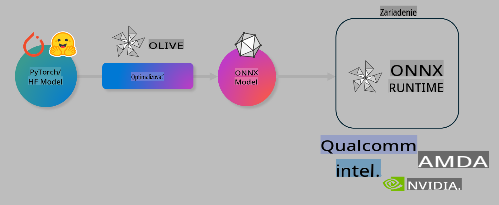

# Lab. Optimalizácia AI modelov pre inferenciu na zariadení

## Úvod

> [!IMPORTANT]
> Tento lab vyžaduje **Nvidia A10 alebo A100 GPU** s nainštalovanými príslušnými ovládačmi a CUDA toolkitom (verzia 12+).

> [!NOTE]
> Ide o **35-minútový** lab, ktorý vám poskytne praktický úvod do základných konceptov optimalizácie modelov pre inferenciu na zariadení pomocou OLIVE.

## Ciele učenia

Na konci tohto labu budete vedieť používať OLIVE na:

- Kvantizáciu AI modelu pomocou metódy AWQ.
- Doladenie AI modelu pre konkrétnu úlohu.
- Generovanie LoRA adaptérov (doladeného modelu) pre efektívnu inferenciu na zariadení pomocou ONNX Runtime.

### Čo je Olive

Olive (*O*NNX *live*) je nástroj na optimalizáciu modelov s priloženým CLI, ktorý vám umožňuje nasadzovať modely pre ONNX runtime +++https://onnxruntime.ai+++ s vysokou kvalitou a výkonom.



Vstupom do Olive je zvyčajne model PyTorch alebo Hugging Face a výstupom je optimalizovaný ONNX model, ktorý je spustený na zariadení (cieľovom nasadení) s ONNX runtime. Olive optimalizuje model pre AI akcelerátor cieľového zariadenia (NPU, GPU, CPU), ktorý poskytuje hardvérový dodávateľ, ako je Qualcomm, AMD, Nvidia alebo Intel.

Olive vykonáva *workflow*, čo je usporiadaná sekvencia jednotlivých úloh optimalizácie modelu nazývaných *passes* - príkladmi sú: kompresia modelu, zachytávanie grafu, kvantizácia, optimalizácia grafu. Každý *pass* má sadu parametrov, ktoré je možné doladiť na dosiahnutie najlepších metrík, napríklad presnosti a latencie, ktoré hodnotí príslušný evaluátor. Olive používa stratégiu hľadania, ktorá využíva vyhľadávací algoritmus na automatické doladenie jednotlivých *passov* alebo ich skupín.

#### Výhody Olive

- **Zníženie frustrácie a času** pri manuálnom experimentovaní s rôznymi technikami optimalizácie grafu, kompresie a kvantizácie. Definujte svoje požiadavky na kvalitu a výkon a Olive automaticky nájde najlepší model pre vás.
- **40+ zabudovaných komponentov na optimalizáciu modelov**, ktoré pokrývajú najnovšie techniky kvantizácie, kompresie, optimalizácie grafov a doladenia.
- **Jednoduché CLI** pre bežné úlohy optimalizácie modelov. Napríklad: `olive quantize`, `olive auto-opt`, `olive finetune`.
- Zabudované balenie a nasadzovanie modelov.
- Podpora generovania modelov pre **Multi LoRA serving**.
- Možnosť vytvárať workflowy pomocou YAML/JSON na orchestráciu úloh optimalizácie a nasadenia modelov.
- Integrácia s **Hugging Face** a **Azure AI**.
- Zabudovaný mechanizmus **cachovania** na **šetrenie nákladov**.

## Inštrukcie k labu
> [!NOTE]
> Uistite sa, že ste nakonfigurovali svoj Azure AI Hub a Projekt a nastavili svoj A100 výpočtový uzol podľa Labu 1.

### Krok 0: Pripojte sa k Azure AI Compute

Pripojíte sa k Azure AI výpočtovému uzlu pomocou vzdialenej funkcie v **VS Code.**

1. Otvorte svoju **VS Code** desktopovú aplikáciu:
1. Otvorte **príkazovú paletu** pomocou **Shift+Ctrl+P**
1. V príkazovej palete vyhľadajte **AzureML - remote: Connect to compute instance in New Window**.
1. Postupujte podľa pokynov na obrazovke na pripojenie k výpočtovému uzlu. To zahŕňa výber vášho Azure Subscription, Resource Group, Projektu a názvu Compute, ktorý ste nastavili v Labe 1.
1. Po pripojení k vášmu Azure ML Compute uzlu sa to zobrazí v **spodnom ľavom rohu Visual Code** `><Azure ML: Compute Name`

### Krok 1: Naklonujte toto repo

Vo VS Code môžete otvoriť nový terminál pomocou **Ctrl+J** a naklonovať toto repo:

V termináli by ste mali vidieť prompt

```
azureuser@computername:~/cloudfiles/code$ 
```
Naklonujte riešenie

```bash
cd ~/localfiles
git clone https://github.com/microsoft/phi-3cookbook.git
```

### Krok 2: Otvorte priečinok vo VS Code

Ak chcete otvoriť VS Code v príslušnom priečinku, vykonajte nasledujúci príkaz v termináli, ktorý otvorí nové okno:

```bash
code phi-3cookbook/code/04.Finetuning/Olive-lab
```

Prípadne môžete otvoriť priečinok výberom **File** > **Open Folder**. 

### Krok 3: Závislosti

Otvorte okno terminálu vo VS Code vo vašom Azure AI Compute uzle (tip: **Ctrl+J**) a vykonajte nasledujúce príkazy na inštaláciu závislostí:

```bash
conda create -n olive-ai python=3.11 -y
conda activate olive-ai
pip install -r requirements.txt
az extension remove -n azure-cli-ml
az extension add -n ml
```

> [!NOTE]
> Inštalácia všetkých závislostí bude trvať ~5 minút.

V tomto labe budete sťahovať a nahrávať modely do katalógu modelov Azure AI. Aby ste mali prístup ku katalógu modelov, budete sa musieť prihlásiť do Azure pomocou:

```bash
az login
```

> [!NOTE]
> Počas prihlasovania budete vyzvaní na výber vášho subscription. Uistite sa, že nastavíte subscription na ten, ktorý bol poskytnutý pre tento lab.

### Krok 4: Vykonajte Olive príkazy 

Otvorte okno terminálu vo VS Code vo vašom Azure AI Compute uzle (tip: **Ctrl+J**) a uistite sa, že je aktivované conda prostredie `olive-ai`:

```bash
conda activate olive-ai
```

Potom vykonajte nasledujúce Olive príkazy v príkazovom riadku.

1. **Preskúmajte dáta:** V tomto príklade budete doladiť model Phi-3.5-Mini tak, aby sa špecializoval na odpovedanie na otázky týkajúce sa cestovania. Nasledujúci kód zobrazí prvé záznamy datasetu vo formáte JSON lines:

    ```bash
    head data/data_sample_travel.jsonl
    ```
1. **Kvantizujte model:** Pred tréningom modelu najprv vykonajte kvantizáciu pomocou nasledujúceho príkazu, ktorý využíva techniku Active Aware Quantization (AWQ) +++https://arxiv.org/abs/2306.00978+++. AWQ kvantizuje váhy modelu na základe aktivácií produkovaných počas inferencie. To znamená, že proces kvantizácie zohľadňuje skutočné rozdelenie dát v aktiváciách, čo vedie k lepšiemu zachovaniu presnosti modelu v porovnaní s tradičnými metódami kvantizácie váh.
    
    ```bash
    olive quantize \
       --model_name_or_path microsoft/Phi-3.5-mini-instruct \
       --trust_remote_code \
       --algorithm awq \
       --output_path models/phi/awq \
       --log_level 1
    ```
    
    Dokončenie kvantizácie AWQ trvá **~8 minút**, pričom **zníži veľkosť modelu z ~7.5GB na ~2.5GB**.
   
   V tomto labe vám ukážeme, ako vkladať modely z Hugging Face (napríklad: `microsoft/Phi-3.5-mini-instruct`). However, Olive also allows you to input models from the Azure AI catalog by updating the `model_name_or_path` argument to an Azure AI asset ID (for example:  `azureml://registries/azureml/models/Phi-3.5-mini-instruct/versions/4`). 

1. **Train the model:** Next, the `olive finetune` príkaz doladí kvantizovaný model. Kvantizácia modelu *pred* doladením namiesto po ňom poskytuje lepšiu presnosť, pretože proces doladenia obnovuje časť straty z kvantizácie.
    
    ```bash
    olive finetune \
        --method lora \
        --model_name_or_path models/phi/awq \
        --data_files "data/data_sample_travel.jsonl" \
        --data_name "json" \
        --text_template "<|user|>\n{prompt}<|end|>\n<|assistant|>\n{response}<|end|>" \
        --max_steps 100 \
        --output_path ./models/phi/ft \
        --log_level 1
    ```
    
    Dokončenie doladenia (so 100 krokmi) trvá **~6 minút**.

1. **Optimalizujte:** Po trénovaní modelu teraz optimalizujte model pomocou Olive príkazu `auto-opt` command, which will capture the ONNX graph and automatically perform a number of optimizations to improve the model performance for CPU by compressing the model and doing fusions. It should be noted, that you can also optimize for other devices such as NPU or GPU by just updating the `--device` and `--provider` - pre účely tohto labu použijeme CPU.

    ```bash
    olive auto-opt \
       --model_name_or_path models/phi/ft/model \
       --adapter_path models/phi/ft/adapter \
       --device cpu \
       --provider CPUExecutionProvider \
       --use_ort_genai \
       --output_path models/phi/onnx-ao \
       --log_level 1
    ```
    
    Dokončenie optimalizácie trvá **~5 minút**.

### Krok 5: Rýchly test inferencie modelu

Na otestovanie inferencie modelu vytvorte Python súbor vo vašom priečinku s názvom **app.py** a skopírujte a vložte nasledujúci kód:

```python
import onnxruntime_genai as og
import numpy as np

print("loading model and adapters...", end="", flush=True)
model = og.Model("models/phi/onnx-ao/model")
adapters = og.Adapters(model)
adapters.load("models/phi/onnx-ao/model/adapter_weights.onnx_adapter", "travel")
print("DONE!")

tokenizer = og.Tokenizer(model)
tokenizer_stream = tokenizer.create_stream()

params = og.GeneratorParams(model)
params.set_search_options(max_length=100, past_present_share_buffer=False)
user_input = "what is the best thing to see in chicago"
params.input_ids = tokenizer.encode(f"<|user|>\n{user_input}<|end|>\n<|assistant|>\n")

generator = og.Generator(model, params)

generator.set_active_adapter(adapters, "travel")

print(f"{user_input}")

while not generator.is_done():
    generator.compute_logits()
    generator.generate_next_token()

    new_token = generator.get_next_tokens()[0]
    print(tokenizer_stream.decode(new_token), end='', flush=True)

print("\n")
```

Spustite kód pomocou:

```bash
python app.py
```

### Krok 6: Nahrajte model do Azure AI

Nahranie modelu do úložiska modelov Azure AI umožňuje zdieľanie modelu s ostatnými členmi vášho vývojového tímu a tiež rieši kontrolu verzií modelu. Na nahratie modelu vykonajte nasledujúci príkaz:

> [!NOTE]
> Aktualizujte `{}` placeholders with the name of your resource group and Azure AI Project Name. 

To find your resource group `"resourceGroup" a názov projektu Azure AI, a spustite nasledujúci príkaz

```
az ml workspace show
```

Alebo prejdite na +++ai.azure.com+++ a vyberte **management center** **project** **overview**

Aktualizujte zástupné symboly `{}` názvom vašej Resource Group a názvom vášho Azure AI Projektu.

```bash
az ml model create \
    --name ft-for-travel \
    --version 1 \
    --path ./models/phi/onnx-ao \
    --resource-group {RESOURCE_GROUP_NAME} \
    --workspace-name {PROJECT_NAME}
```
Potom môžete vidieť váš nahraný model a nasadiť ho na https://ml.azure.com/model/list

**Upozornenie**:  
Tento dokument bol preložený pomocou strojových AI prekladateľských služieb. Hoci sa snažíme o presnosť, prosím, majte na pamäti, že automatizované preklady môžu obsahovať chyby alebo nepresnosti. Pôvodný dokument v jeho pôvodnom jazyku by mal byť považovaný za autoritatívny zdroj. Pre kritické informácie sa odporúča profesionálny ľudský preklad. Nenesieme zodpovednosť za akékoľvek nedorozumenia alebo nesprávne interpretácie vyplývajúce z použitia tohto prekladu.