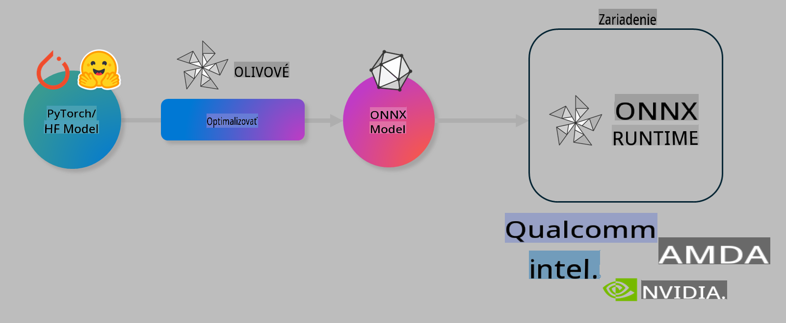

# Lab. Optimalizácia AI modelov pre inferenciu na zariadení

## Úvod

> [!IMPORTANT]
> Tento lab vyžaduje **Nvidia A10 alebo A100 GPU** s nainštalovanými príslušnými ovládačmi a CUDA toolkitom (verzia 12+).

> [!NOTE]
> Tento **35-minútový** lab vám poskytne praktický úvod do základných konceptov optimalizácie modelov pre inferenciu na zariadení pomocou OLIVE.

## Ciele učenia

Na konci tohto labu budete schopní používať OLIVE na:

- Kvantizáciu AI modelu pomocou metódy AWQ.
- Jemné doladenie AI modelu pre konkrétnu úlohu.
- Generovanie LoRA adaptérov (jemne doladeného modelu) pre efektívnu inferenciu na zariadení v prostredí ONNX Runtime.

### Čo je Olive

Olive (*O*NNX *live*) je nástroj na optimalizáciu modelov s priloženým CLI, ktorý umožňuje nasadzovať modely pre ONNX runtime +++https://onnxruntime.ai+++ s vysokou kvalitou a výkonom.



Vstupom pre Olive je zvyčajne model PyTorch alebo Hugging Face a výstupom je optimalizovaný ONNX model, ktorý sa spúšťa na zariadení (cieľ nasadenia) s ONNX runtime. Olive optimalizuje model pre AI akcelerátor cieľového zariadenia (NPU, GPU, CPU), ktorý poskytuje hardvérový výrobca ako Qualcomm, AMD, Nvidia alebo Intel.

Olive vykonáva *workflow*, čo je usporiadaná sekvencia jednotlivých úloh optimalizácie modelu nazývaných *passes* - príkladmi sú: kompresia modelu, zachytávanie grafov, kvantizácia, optimalizácia grafov. Každý pass má sadu parametrov, ktoré je možné doladiť na dosiahnutie najlepších metrík, ako sú presnosť a latencia, ktoré vyhodnocuje príslušný evaluátor. Olive používa stratégiu vyhľadávania, ktorá využíva algoritmus vyhľadávania na automatické doladenie každého passu jeden po druhom alebo skupiny passov naraz.

#### Výhody Olive

- **Zníženie frustrácie a času** spojeného s manuálnym experimentovaním s rôznymi technikami optimalizácie grafov, kompresie a kvantizácie. Definujte svoje požiadavky na kvalitu a výkon a Olive automaticky nájde najlepší model za vás.
- **Viac ako 40 zabudovaných komponentov optimalizácie modelov** pokrývajúcich najmodernejšie techniky kvantizácie, kompresie, optimalizácie grafov a jemného doladenia.
- **Jednoduché CLI** pre bežné úlohy optimalizácie modelov, napríklad: olive quantize, olive auto-opt, olive finetune.
- Zabudované balenie a nasadzovanie modelov.
- Podpora generovania modelov pre **Multi LoRA serving**.
- Možnosť vytvárať workflowy pomocou YAML/JSON na orchestráciu úloh optimalizácie a nasadzovania modelov.
- Integrácia s **Hugging Face** a **Azure AI**.
- Zabudovaný mechanizmus **cachovania** na **úsporu nákladov**.

## Inštrukcie k labu
> [!NOTE]
> Uistite sa, že máte pripravený svoj Azure AI Hub a Projekt a nastavili ste svoj A100 výpočtový uzol podľa Labu 1.

### Krok 0: Pripojte sa k svojmu Azure AI Compute

Pripojíte sa k Azure AI výpočtu pomocou vzdialenej funkcie v **VS Code.**

1. Otvorte si desktopovú aplikáciu **VS Code**:
2. Otvorte **command palette** pomocou **Shift+Ctrl+P**
3. V command palette vyhľadajte **AzureML - remote: Connect to compute instance in New Window**.
4. Postupujte podľa pokynov na obrazovke na pripojenie k výpočtu. Tento proces bude zahŕňať výber vášho Azure Subscription, Resource Group, Projektu a Názvu Compute, ktorý ste nastavili v Labe 1.
5. Po pripojení k Azure ML Compute uzlu sa toto pripojenie zobrazí v **ľavom dolnom rohu Visual Code** `><Azure ML: Compute Name`

### Krok 1: Naklonujte toto úložisko

V VS Code môžete otvoriť nový terminál pomocou **Ctrl+J** a naklonovať toto úložisko:

V termináli by ste mali vidieť výzvu

```
azureuser@computername:~/cloudfiles/code$ 
```
Naklonujte riešenie

```bash
cd ~/localfiles
git clone https://github.com/microsoft/phi-3cookbook.git
```

### Krok 2: Otvorte priečinok vo VS Code

Na otvorenie VS Code v príslušnom priečinku vykonajte v termináli nasledujúci príkaz, ktorý otvorí nové okno:

```bash
code phi-3cookbook/code/04.Finetuning/Olive-lab
```

Prípadne môžete otvoriť priečinok výberom **File** > **Open Folder**.

### Krok 3: Závislosti

Otvorte okno terminálu vo VS Code vo vašej Azure AI Compute Instance (tip: **Ctrl+J**) a vykonajte nasledujúce príkazy na inštaláciu závislostí:

```bash
conda create -n olive-ai python=3.11 -y
conda activate olive-ai
pip install -r requirements.txt
az extension remove -n azure-cli-ml
az extension add -n ml
```

> [!NOTE]
> Inštalácia všetkých závislostí bude trvať ~5 minút.

V tomto labe budete sťahovať a nahrávať modely do katalógu modelov Azure AI. Aby ste mali prístup ku katalógu modelov, budete sa musieť prihlásiť do Azure pomocou:

```bash
az login
```

> [!NOTE]
> Pri prihlásení budete vyzvaní na výber svojho subscription. Uistite sa, že ste nastavili subscription na ten, ktorý bol poskytnutý pre tento lab.

### Krok 4: Spustite príkazy Olive 

Otvorte okno terminálu vo VS Code vo vašej Azure AI Compute Instance (tip: **Ctrl+J**) a uistite sa, že je aktivované prostredie `olive-ai` v conda:

```bash
conda activate olive-ai
```

Ďalej vykonajte nasledujúce príkazy Olive v príkazovom riadku.

1. **Preskúmajte dáta:** V tomto príklade budete jemne doladzovať model Phi-3.5-Mini tak, aby sa špecializoval na odpovedanie na otázky súvisiace s cestovaním. Nasledujúci kód zobrazí prvých niekoľko záznamov datasetu, ktoré sú vo formáte JSON lines:

    ```bash
    head data/data_sample_travel.jsonl
    ```
2. **Kvantizujte model:** Pred tréningom modelu ho najskôr kvantizujte nasledujúcim príkazom, ktorý používa techniku nazývanú Active Aware Quantization (AWQ) +++https://arxiv.org/abs/2306.00978+++. AWQ kvantizuje váhy modelu zohľadňovaním aktivácií produkovaných počas inferencie. To znamená, že proces kvantizácie berie do úvahy skutočné rozdelenie dát v aktiváciách, čo vedie k lepšiemu zachovaniu presnosti modelu v porovnaní s tradičnými metódami kvantizácie váh.

    ```bash
    olive quantize \
       --model_name_or_path microsoft/Phi-3.5-mini-instruct \
       --trust_remote_code \
       --algorithm awq \
       --output_path models/phi/awq \
       --log_level 1
    ```
    
    Tento proces trvá **~8 minút** a zníži veľkosť modelu z ~7.5GB na ~2.5GB.
   
   V tomto labe vám ukazujeme, ako importovať modely z Hugging Face (napríklad: `microsoft/Phi-3.5-mini-instruct`). However, Olive also allows you to input models from the Azure AI catalog by updating the `model_name_or_path` argument to an Azure AI asset ID (for example:  `azureml://registries/azureml/models/Phi-3.5-mini-instruct/versions/4`). 

1. **Train the model:** Next, the `olive finetune` príkaz jemne doladí kvantizovaný model. Kvantizácia modelu *pred* jemným doladením namiesto po ňom prináša lepšiu presnosť, pretože proces jemného doladenia obnovuje časť straty z kvantizácie.

    ```bash
    olive finetune \
        --method lora \
        --model_name_or_path models/phi/awq \
        --data_files "data/data_sample_travel.jsonl" \
        --data_name "json" \
        --text_template "<|user|>\n{prompt}<|end|>\n<|assistant|>\n{response}<|end|>" \
        --max_steps 100 \
        --output_path ./models/phi/ft \
        --log_level 1
    ```
    
    Jemné doladenie trvá **~6 minút** (so 100 krokmi).

3. **Optimalizujte:** S vytrénovaným modelom teraz optimalizujte model pomocou Olive príkazu `auto-opt` command, which will capture the ONNX graph and automatically perform a number of optimizations to improve the model performance for CPU by compressing the model and doing fusions. It should be noted, that you can also optimize for other devices such as NPU or GPU by just updating the `--device` and `--provider` argumentov - ale pre účely tohto labu použijeme CPU.

    ```bash
    olive auto-opt \
       --model_name_or_path models/phi/ft/model \
       --adapter_path models/phi/ft/adapter \
       --device cpu \
       --provider CPUExecutionProvider \
       --use_ort_genai \
       --output_path models/phi/onnx-ao \
       --log_level 1
    ```
    
    Optimalizácia trvá **~5 minút**.

### Krok 5: Rýchly test inferencie modelu

Na otestovanie inferencie modelu vytvorte vo svojom priečinku Python súbor s názvom **app.py** a skopírujte a vložte nasledujúci kód:

```python
import onnxruntime_genai as og
import numpy as np

print("loading model and adapters...", end="", flush=True)
model = og.Model("models/phi/onnx-ao/model")
adapters = og.Adapters(model)
adapters.load("models/phi/onnx-ao/model/adapter_weights.onnx_adapter", "travel")
print("DONE!")

tokenizer = og.Tokenizer(model)
tokenizer_stream = tokenizer.create_stream()

params = og.GeneratorParams(model)
params.set_search_options(max_length=100, past_present_share_buffer=False)
user_input = "what is the best thing to see in chicago"
params.input_ids = tokenizer.encode(f"<|user|>\n{user_input}<|end|>\n<|assistant|>\n")

generator = og.Generator(model, params)

generator.set_active_adapter(adapters, "travel")

print(f"{user_input}")

while not generator.is_done():
    generator.compute_logits()
    generator.generate_next_token()

    new_token = generator.get_next_tokens()[0]
    print(tokenizer_stream.decode(new_token), end='', flush=True)

print("\n")
```

Spustite kód pomocou:

```bash
python app.py
```

### Krok 6: Nahrajte model do Azure AI

Nahraním modelu do úložiska modelov Azure AI sprístupníte model ostatným členom vášho vývojového tímu a zároveň zaistíte správu verzií modelu. Na nahranie modelu spustite nasledujúci príkaz:

> [!NOTE]
> Aktualizujte `{}` placeholders with the name of your resource group and Azure AI Project Name. 

To find your resource group `"resourceGroup"a názov projektu Azure AI, spustite nasledujúci príkaz 

```
az ml workspace show
```

Alebo prejdite na +++ai.azure.com+++ a vyberte **management center** **project** **overview**

Aktualizujte zástupné znaky `{}` názvom vašej resource group a názvom vášho Azure AI Projektu.

```bash
az ml model create \
    --name ft-for-travel \
    --version 1 \
    --path ./models/phi/onnx-ao \
    --resource-group {RESOURCE_GROUP_NAME} \
    --workspace-name {PROJECT_NAME}
```
Následne môžete vidieť váš nahraný model a nasadiť ho na stránke https://ml.azure.com/model/list

**Upozornenie**:  
Tento dokument bol preložený pomocou strojových AI prekladateľských služieb. Aj keď sa snažíme o presnosť, prosím, uvedomte si, že automatizované preklady môžu obsahovať chyby alebo nepresnosti. Pôvodný dokument v jeho pôvodnom jazyku by mal byť považovaný za autoritatívny zdroj. Pre kritické informácie sa odporúča profesionálny ľudský preklad. Nezodpovedáme za akékoľvek nedorozumenia alebo nesprávne interpretácie vyplývajúce z použitia tohto prekladu.