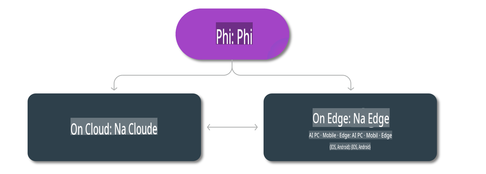

# Modely Phi a dostupnosť na rôznych platformách 

## Scenáre Edge & Cloud

## Dostupnosť modelov a zdroje

| | | | | | | | | |
|-|-|-|-|-|-|-|-|-|
|Model|Vstup|Dĺžka obsahu|Azure AI (MaaS)|Azure ML (MaaP)|ONNX|Hugging Face|Ollama|Nvidia NIM|
|Phi-3-vision-128k-instruct|Text+Obrázok|128k|[Playground & Nasadenie](https://ai.azure.com/explore/models/Phi-3-vision-128k-instruct/version/2/registry/azureml)|[Playground, Nasadenie & Doladenie](https://ml.azure.com/registries/azureml/models/Phi-3-vision-128k-instruct/version/2)|[CUDA](https://huggingface.co/microsoft/Phi-3-vision-128k-instruct-onnx-cuda/tree/main),[CPU](https://huggingface.co/microsoft/Phi-3-vision-128k-instruct-onnx-cpu/tree/main), [DirectML](https://huggingface.co/microsoft/Phi-3-vision-128k-instruct-onnx-directml/tree/main)|[Stiahnuť](https://huggingface.co/microsoft/Phi-3-vision-128k-instruct)|-NA-|[NIM API](https://build.nvidia.com/microsoft/phi-3-vision-128k-instruct)|
|Phi-3-mini-4k-instruct|Text|4k|[Playground & Nasadenie](https://aka.ms/phi3-mini-4k-azure-ml)|[Playground, Nasadenie](https://aka.ms/phi3-mini-4k-azure-ml) & Doladenie|[CUDA](https://huggingface.co/microsoft/Phi-3-mini-4k-instruct-onnx), [Web](https://huggingface.co/microsoft/Phi-3-mini-4k-instruct-onnx)|[Playground & Stiahnuť](https://huggingface.co/chat/models/microsoft/Phi-3-mini-4k-instruct)|[GGUF](https://huggingface.co/microsoft/Phi-3-mini-4k-instruct-gguf)|[NIM API](https://build.nvidia.com/microsoft/phi-3-mini-4k)|
|Phi-3-mini-128k-instruct|Text|128k|[Playground & Nasadenie](https://ai.azure.com/explore/models/Phi-3-mini-128k-instruct/version/9/registry/azureml)|[Playground, Nasadenie](https://ai.azure.com/explore/models/Phi-3-mini-128k-instruct/version/9/registry/azureml) & Doladenie|[CUDA](https://huggingface.co/microsoft/Phi-3-mini-128k-instruct-onnx)|[Stiahnuť](https://huggingface.co/microsoft/Phi-3-mini-128k-instruct-onnx)|-NA-|[NIM API](https://build.nvidia.com/microsoft/phi-3-mini)|
|Phi-3-small-8k-instruct|Text|8k|[Playground & Nasadenie](https://ml.azure.com/registries/azureml/models/Phi-3-small-8k-instruct/version/2)|[Playground, Nasadenie](https://ai.azure.com/explore/models/Phi-3-small-8k-instruct/version/2/registry/azureml) & Doladenie|[CUDA](https://huggingface.co/microsoft/Phi-3-small-8k-instruct-onnx-cuda)|[Stiahnuť](https://huggingface.co/microsoft/Phi-3-small-8k-instruct-onnx-cuda)|-NA-|[NIM API](https://build.nvidia.com/microsoft/phi-3-small-8k-instruct?docker=false)|
|Phi-3-small-128k-instruct|Text|128k|[Playground & Nasadenie](https://ai.azure.com/explore/models/Phi-3-small-128k-instruct/version/2/registry/azureml)|[Playground, Nasadenie](https://ml.azure.com/registries/azureml/models/Phi-3-small-128k-instruct/version/2) & Doladenie|[CUDA](https://huggingface.co/microsoft/Phi-3-medium-128k-instruct-onnx-cuda)|[Stiahnuť](https://huggingface.co/microsoft/Phi-3-small-128k-instruct)|-NA-|[NIM API](https://build.nvidia.com/microsoft/phi-3-small-128k-instruct?docker=false)|
|Phi-3-medium-4k-instruct|Text|4k|[Playground a nasadenie](https://huggingface.co/microsoft/Phi-3-medium-4k-instruct)|[Playground, nasadenie](https://ml.azure.com/registries/azureml/models/Phi-3-medium-4k-instruct/version/2) a doladenie|[CUDA](https://huggingface.co/microsoft/Phi-3-medium-4k-instruct-onnx-cuda/tree/main), [CPU](https://huggingface.co/microsoft/Phi-3-medium-4k-instruct-onnx-cpu/tree/main), [DirectML](https://huggingface.co/microsoft/Phi-3-medium-4k-instruct-onnx-directml/tree/main)|[Stiahnuť](https://huggingface.co/microsoft/Phi-3-medium-4k-instruct)|-NA-|[NIM API](https://build.nvidia.com/microsoft/phi-3-medium-4k-instruct?docker=false)|
|Phi-3-medium-128k-instruct|Text|128k|[Playground a nasadenie](https://ai.azure.com/explore/models/Phi-3-medium-128k-instruct/version/2)|[Playground, nasadenie](https://ml.azure.com/registries/azureml/models/Phi-3-medium-128k-instruct/version/2) a doladenie|[CUDA](https://huggingface.co/microsoft/Phi-3-medium-128k-instruct-onnx-cuda/tree/main), [CPU](https://huggingface.co/microsoft/Phi-3-medium-128k-instruct-onnx-cpu/tree/main), [DirectML](https://huggingface.co/microsoft/Phi-3-medium-128k-instruct-onnx-directml/tree/main)|[Stiahnuť](https://huggingface.co/microsoft/Phi-3-medium-128k-instruct)|-NA-|-NA-|

**Upozornenie**:  
Tento dokument bol preložený pomocou strojových prekladových služieb AI. Aj keď sa snažíme o presnosť, prosím, majte na pamäti, že automatizované preklady môžu obsahovať chyby alebo nepresnosti. Pôvodný dokument v jeho pôvodnom jazyku by mal byť považovaný za záväzný zdroj. Pre kritické informácie sa odporúča profesionálny ľudský preklad. Nenesieme zodpovednosť za akékoľvek nedorozumenia alebo nesprávne interpretácie vyplývajúce z použitia tohto prekladu.