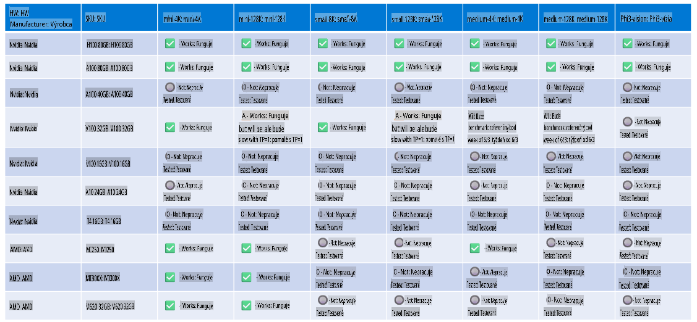

# Podpora hardvéru Phi

Microsoft Phi bol optimalizovaný pre ONNX Runtime a podporuje Windows DirectML. Funguje spoľahlivo na rôznych typoch hardvéru, vrátane GPU, CPU a dokonca aj mobilných zariadení.

## Hardvér zariadenia
Podporovaný hardvér zahŕňa konkrétne:

- GPU SKU: RTX 4090 (DirectML)
- GPU SKU: 1 A100 80GB (CUDA)
- CPU SKU: Standard F64s v2 (64 vCPU, 128 GiB pamäte)

## Mobilné SKU

- Android - Samsung Galaxy S21
- Apple iPhone 14 alebo vyšší procesor A16/A17

## Špecifikácie hardvéru Phi

- Minimálna požadovaná konfigurácia.
- Windows: GPU kompatibilné s DirectX 12 a minimálne 4 GB kombinovanej RAM

CUDA: NVIDIA GPU s výpočtovou schopnosťou >= 7.02



## Spúšťanie onnxruntime na viacerých GPU

Aktuálne dostupné Phi ONNX modely sú iba pre 1 GPU. Je možné podporovať viac GPU pre Phi model, avšak ORT s 2 GPU nezaručuje vyššiu priepustnosť v porovnaní s dvoma inštanciami ORT. Pre najnovšie aktualizácie si pozrite [ONNX Runtime](https://onnxruntime.ai/).

Na [Build 2024 tím GenAI ONNX](https://youtu.be/WLW4SE8M9i8?si=EtG04UwDvcjunyfC) oznámil, že umožnil viacnásobné inštancie namiesto viacerých GPU pre Phi modely.

Momentálne to umožňuje spustiť jednu inštanciu onnxruntime alebo onnxruntime-genai s premennou prostredia CUDA_VISIBLE_DEVICES takto:

```Python
CUDA_VISIBLE_DEVICES=0 python infer.py
CUDA_VISIBLE_DEVICES=1 python infer.py
```

Neváhajte a preskúmajte Phi viac na [Azure AI Foundry](https://ai.azure.com)

**Upozornenie**:  
Tento dokument bol preložený pomocou strojových AI prekladových služieb. Aj keď sa snažíme o presnosť, prosím, uvedomte si, že automatizované preklady môžu obsahovať chyby alebo nepresnosti. Pôvodný dokument v jeho pôvodnom jazyku by mal byť považovaný za autoritatívny zdroj. Pre kritické informácie sa odporúča profesionálny ľudský preklad. Nezodpovedáme za akékoľvek nedorozumenia alebo nesprávne interpretácie vyplývajúce z použitia tohto prekladu.