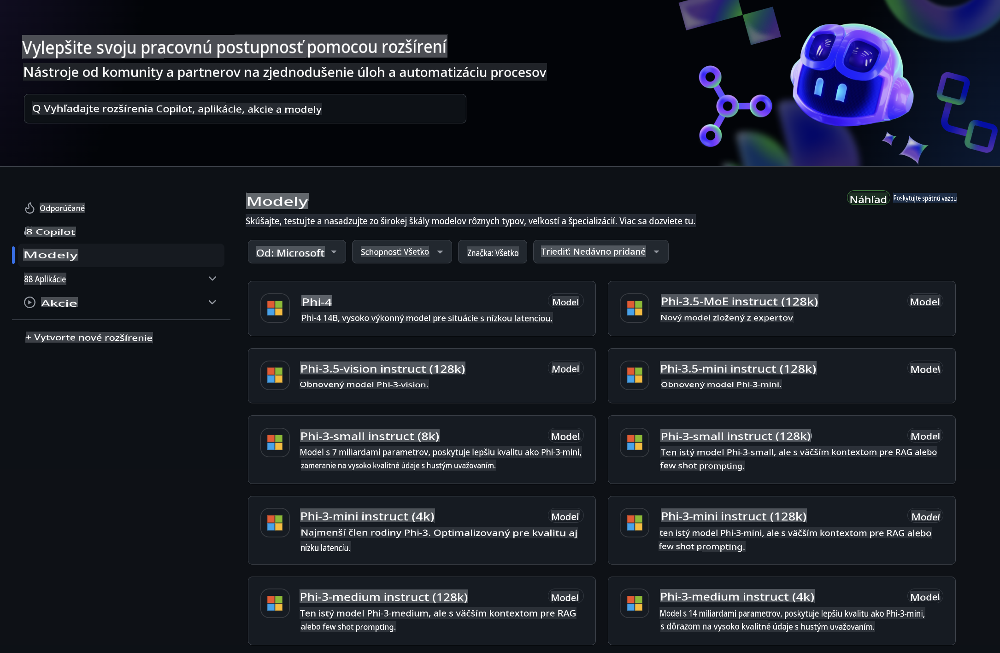
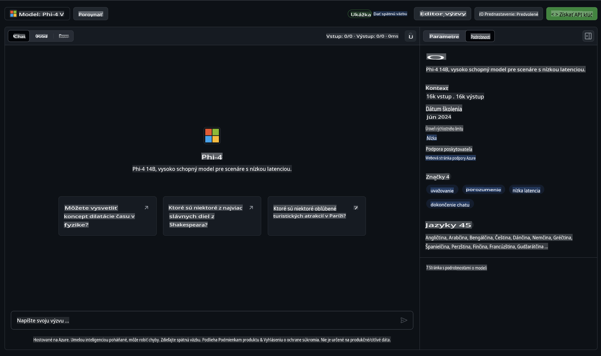
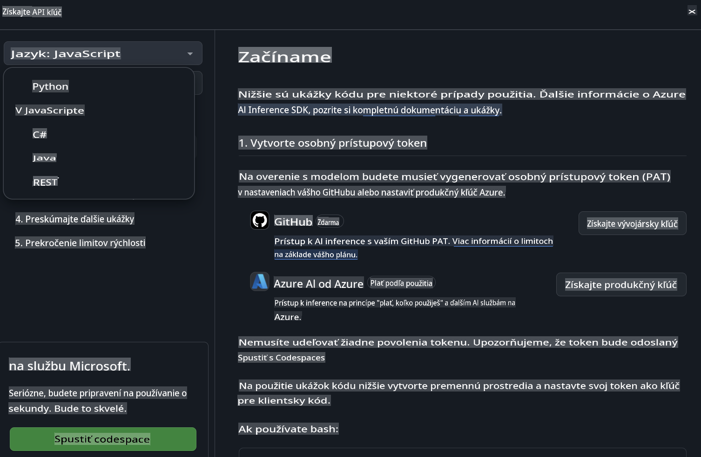
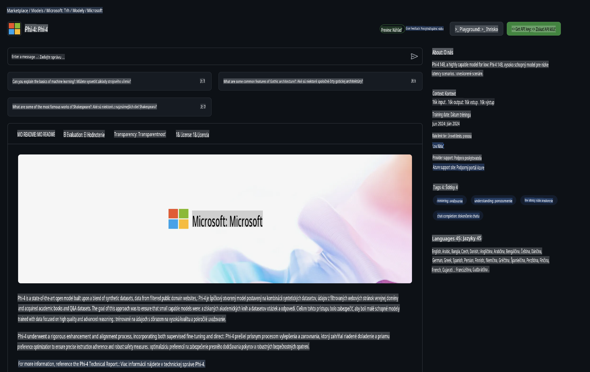

## Phi rodina v GitHub Models

Vitajte na [GitHub Models](https://github.com/marketplace/models)! Všetko je pripravené, aby ste mohli preskúmať AI modely hostované na Azure AI.



Viac informácií o modeloch dostupných na GitHub Models nájdete na [GitHub Model Marketplace](https://github.com/marketplace/models).

## Dostupné modely

Každý model má svoj vlastný playground a ukážkový kód.



### Phi rodina v GitHub Model Catalog

- [Phi-4](https://github.com/marketplace/models/azureml/Phi-4)

- [Phi-3.5-MoE instruct (128k)](https://github.com/marketplace/models/azureml/Phi-3-5-MoE-instruct)

- [Phi-3.5-vision instruct (128k)](https://github.com/marketplace/models/azureml/Phi-3-5-vision-instruct)

- [Phi-3.5-mini instruct (128k)](https://github.com/marketplace/models/azureml/Phi-3-5-mini-instruct)

- [Phi-3-Medium-128k-Instruct](https://github.com/marketplace/models/azureml/Phi-3-medium-128k-instruct)

- [Phi-3-medium-4k-instruct](https://github.com/marketplace/models/azureml/Phi-3-medium-4k-instruct)

- [Phi-3-mini-128k-instruct](https://github.com/marketplace/models/azureml/Phi-3-mini-128k-instruct)

- [Phi-3-mini-4k-instruct](https://github.com/marketplace/models/azureml/Phi-3-mini-4k-instruct)

- [Phi-3-small-128k-instruct](https://github.com/marketplace/models/azureml/Phi-3-small-128k-instruct)

- [Phi-3-small-8k-instruct](https://github.com/marketplace/models/azureml/Phi-3-small-8k-instruct)

## Začíname

Máme pre vás pripravených niekoľko základných príkladov, ktoré môžete ihneď spustiť. Nájdete ich v priečinku samples. Ak chcete preskočiť rovno na svoj obľúbený jazyk, príklady sú dostupné v nasledujúcich jazykoch:

- Python
- JavaScript
- C#
- Java
- cURL

Taktiež je k dispozícii špeciálne prostredie Codespaces na spúšťanie príkladov a modelov.



## Ukážkový kód

Nižšie sú uvedené ukážky kódu pre niekoľko prípadov použitia. Pre ďalšie informácie o Azure AI Inference SDK si pozrite kompletnú dokumentáciu a príklady.

## Nastavenie

1. Vytvorte osobný prístupový token  
Nie je potrebné udeľovať žiadne povolenia tomuto tokenu. Upozorňujeme, že token bude odoslaný do služby Microsoft.

Ak chcete použiť nasledujúce ukážky kódu, vytvorte premennú prostredia a nastavte svoj token ako kľúč pre klientský kód.

Ak používate bash:  
```
export GITHUB_TOKEN="<your-github-token-goes-here>"
```  
Ak používate powershell:  

```
$Env:GITHUB_TOKEN="<your-github-token-goes-here>"
```  

Ak používate Windows command prompt:  

```
set GITHUB_TOKEN=<your-github-token-goes-here>
```  

## Python ukážka

### Inštalácia závislostí  
Nainštalujte Azure AI Inference SDK pomocou pip (Vyžaduje: Python >=3.8):  

```
pip install azure-ai-inference
```  

### Spustenie základného príkladu kódu  

Táto ukážka demonštruje základné volanie API pre dokončenie konverzácie. Využíva GitHub AI model inference endpoint a váš GitHub token. Volanie je synchronné.  

```python
import os
from azure.ai.inference import ChatCompletionsClient
from azure.ai.inference.models import SystemMessage, UserMessage
from azure.core.credentials import AzureKeyCredential

endpoint = "https://models.inference.ai.azure.com"
model_name = "Phi-4"
token = os.environ["GITHUB_TOKEN"]

client = ChatCompletionsClient(
    endpoint=endpoint,
    credential=AzureKeyCredential(token),
)

response = client.complete(
    messages=[
        UserMessage(content="I have $20,000 in my savings account, where I receive a 4% profit per year and payments twice a year. Can you please tell me how long it will take for me to become a millionaire? Also, can you please explain the math step by step as if you were explaining it to an uneducated person?"),
    ],
    temperature=0.4,
    top_p=1.0,
    max_tokens=2048,
    model=model_name
)

print(response.choices[0].message.content)
```  

### Spustenie viacotáčkového rozhovoru  

Táto ukážka demonštruje viacotáčkový rozhovor s API pre dokončenie konverzácie. Pri použití modelu pre chatovaciu aplikáciu budete musieť spravovať históriu rozhovoru a odosielať najnovšie správy modelu.  

```
import os
from azure.ai.inference import ChatCompletionsClient
from azure.ai.inference.models import AssistantMessage, SystemMessage, UserMessage
from azure.core.credentials import AzureKeyCredential

token = os.environ["GITHUB_TOKEN"]
endpoint = "https://models.inference.ai.azure.com"
# Replace Model_Name
model_name = "Phi-4"

client = ChatCompletionsClient(
    endpoint=endpoint,
    credential=AzureKeyCredential(token),
)

messages = [
    SystemMessage(content="You are a helpful assistant."),
    UserMessage(content="What is the capital of France?"),
    AssistantMessage(content="The capital of France is Paris."),
    UserMessage(content="What about Spain?"),
]

response = client.complete(messages=messages, model=model_name)

print(response.choices[0].message.content)
```  

### Streamovanie výstupu  

Pre lepší používateľský zážitok budete chcieť streamovať odpoveď modelu, aby sa prvý token zobrazil čo najskôr a nemuseli ste čakať na dlhé odpovede.  

```
import os
from azure.ai.inference import ChatCompletionsClient
from azure.ai.inference.models import SystemMessage, UserMessage
from azure.core.credentials import AzureKeyCredential

token = os.environ["GITHUB_TOKEN"]
endpoint = "https://models.inference.ai.azure.com"
# Replace Model_Name
model_name = "Phi-4"

client = ChatCompletionsClient(
    endpoint=endpoint,
    credential=AzureKeyCredential(token),
)

response = client.complete(
    stream=True,
    messages=[
        SystemMessage(content="You are a helpful assistant."),
        UserMessage(content="Give me 5 good reasons why I should exercise every day."),
    ],
    model=model_name,
)

for update in response:
    if update.choices:
        print(update.choices[0].delta.content or "", end="")

client.close()
```  

## BEZPLATNÉ používanie a limity pre GitHub Models  



[Limity pre playground a bezplatné používanie API](https://docs.github.com/en/github-models/prototyping-with-ai-models#rate-limits) sú navrhnuté tak, aby vám pomohli experimentovať s modelmi a prototypovať vašu AI aplikáciu. Pre použitie nad tieto limity a na škálovanie vašej aplikácie musíte zriadiť zdroje z Azure účtu a autentifikovať sa odtiaľ namiesto vášho GitHub osobného prístupového tokenu. V kóde nemusíte nič meniť. Použite tento odkaz, aby ste zistili, ako prekročiť limity bezplatnej vrstvy v Azure AI.

### Upozornenia

Pamätajte, že pri interakcii s modelom experimentujete s AI, takže môžu nastať chyby v obsahu.

Táto funkcia podlieha rôznym limitom (vrátane požiadaviek za minútu, požiadaviek za deň, tokenov na požiadavku a súbežných požiadaviek) a nie je určená na produkčné použitie.

GitHub Models používa Azure AI Content Safety. Tieto filtre nemožno vypnúť v rámci GitHub Models skúsenosti. Ak sa rozhodnete využívať modely prostredníctvom platenej služby, nakonfigurujte svoje filtre obsahu podľa svojich požiadaviek.

Táto služba podlieha predbežným podmienkam GitHub.

**Upozornenie**:  
Tento dokument bol preložený pomocou strojových AI prekladateľských služieb. Aj keď sa snažíme o presnosť, prosím, uvedomte si, že automatizované preklady môžu obsahovať chyby alebo nepresnosti. Pôvodný dokument v jeho pôvodnom jazyku by mal byť považovaný za autoritatívny zdroj. Pre dôležité informácie sa odporúča profesionálny ľudský preklad. Nezodpovedáme za žiadne nedorozumenia alebo nesprávne interpretácie vyplývajúce z použitia tohto prekladu.