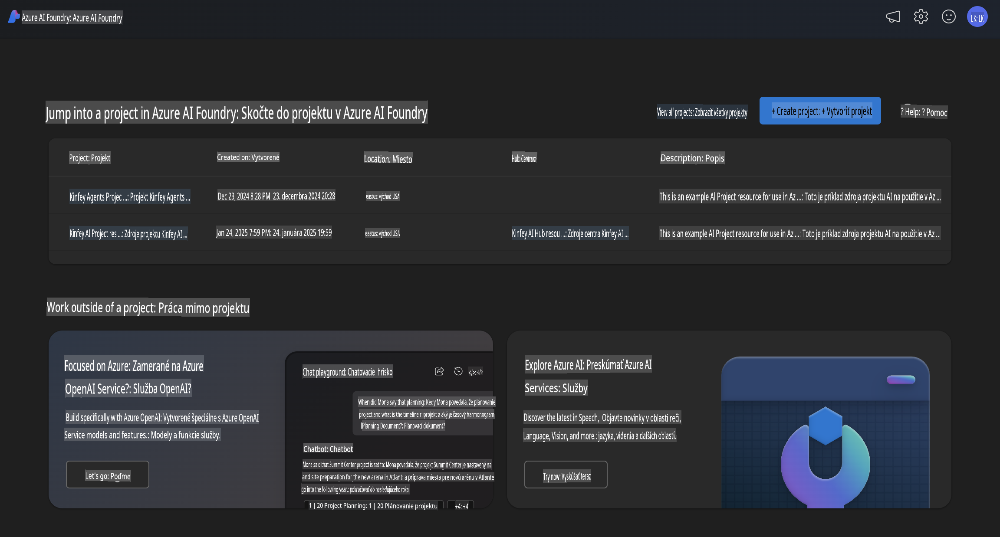
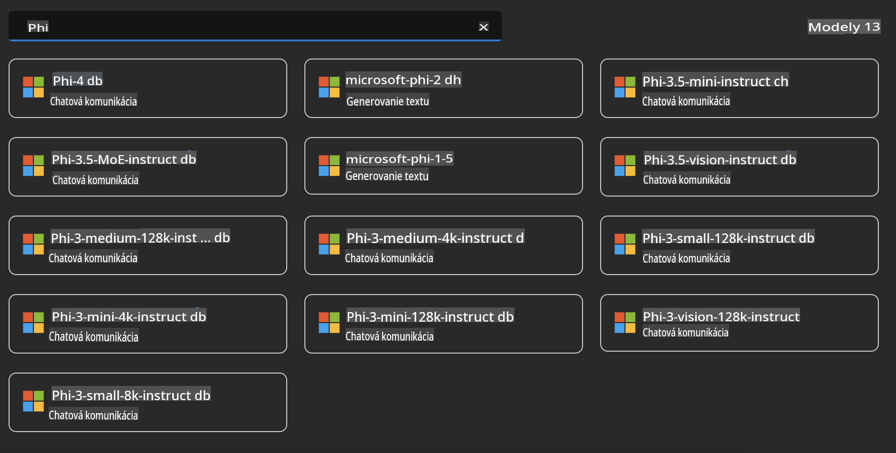
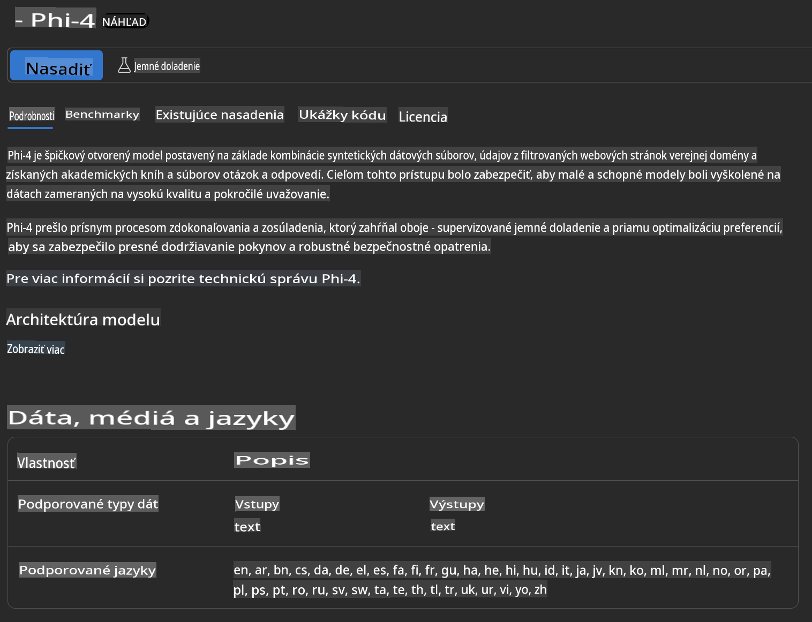
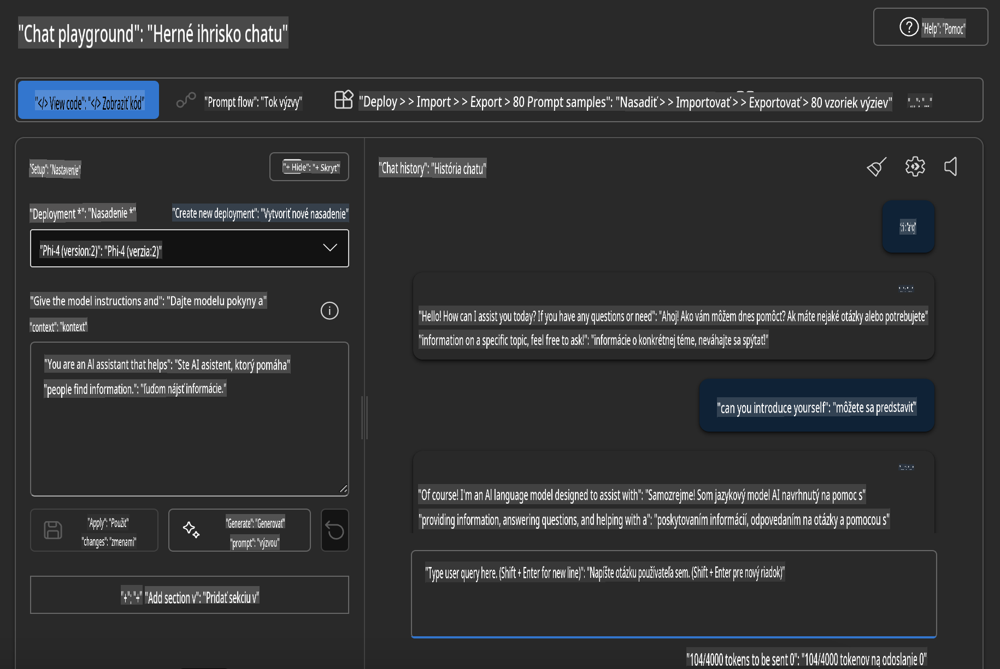

## Phi Family v Azure AI Foundry

[Azure AI Foundry](https://ai.azure.com) je dôveryhodná platforma, ktorá umožňuje vývojárom podporovať inovácie a formovať budúcnosť s AI bezpečným, zabezpečeným a zodpovedným spôsobom.

[Azure AI Foundry](https://ai.azure.com) je navrhnutá pre vývojárov, aby mohli:

- Budovať generatívne AI aplikácie na platforme podnikovej úrovne.
- Preskúmavať, vytvárať, testovať a nasadzovať pomocou najmodernejších AI nástrojov a ML modelov, založených na princípoch zodpovedného AI.
- Spolupracovať s tímom počas celého životného cyklu vývoja aplikácie.

S Azure AI Foundry môžete preskúmať širokú škálu modelov, služieb a funkcií a začať budovať AI aplikácie, ktoré najlepšie vyhovujú vašim cieľom. Platforma Azure AI Foundry umožňuje škálovateľnosť, vďaka ktorej sa koncepty môžu ľahko transformovať na plnohodnotné produkčné aplikácie. Neustále monitorovanie a zdokonaľovanie podporujú dlhodobý úspech.



Okrem použitia služby Azure AOAI v Azure AI Foundry môžete tiež využiť modely tretích strán dostupné v Modelovom katalógu Azure AI Foundry. Toto je výborná voľba, ak chcete použiť Azure AI Foundry ako svoju platformu pre AI riešenia.

Modely rodiny Phi môžeme rýchlo nasadiť prostredníctvom Modelového katalógu v Azure AI Foundry.



### **Nasadenie Phi-4 v Azure AI Foundry**



### **Testovanie Phi-4 v Azure AI Foundry Playground**



### **Spustenie Python kódu na volanie Azure AI Foundry Phi-4**

```python

import os  
import base64
from openai import AzureOpenAI  
from azure.identity import DefaultAzureCredential, get_bearer_token_provider  
        
endpoint = os.getenv("ENDPOINT_URL", "Your Azure AOAI Service Endpoint")  
deployment = os.getenv("DEPLOYMENT_NAME", "Phi-4")  
      
token_provider = get_bearer_token_provider(  
    DefaultAzureCredential(),  
    "https://cognitiveservices.azure.com/.default"  
)  
  
client = AzureOpenAI(  
    azure_endpoint=endpoint,  
    azure_ad_token_provider=token_provider,  
    api_version="2024-05-01-preview",  
)  
  

chat_prompt = [
    {
        "role": "system",
        "content": "You are an AI assistant that helps people find information."
    },
    {
        "role": "user",
        "content": "can you introduce yourself"
    }
] 
    
# Include speech result if speech is enabled  
messages = chat_prompt 

completion = client.chat.completions.create(  
    model=deployment,  
    messages=messages,
    max_tokens=800,  
    temperature=0.7,  
    top_p=0.95,  
    frequency_penalty=0,  
    presence_penalty=0,
    stop=None,  
    stream=False  
)  
  
print(completion.to_json())  

```

**Upozornenie**:  
Tento dokument bol preložený pomocou strojových prekladových služieb AI. Aj keď sa snažíme o presnosť, prosím, uvedomte si, že automatizované preklady môžu obsahovať chyby alebo nepresnosti. Pôvodný dokument v jeho pôvodnom jazyku by mal byť považovaný za autoritatívny zdroj. Pre kritické informácie sa odporúča profesionálny ľudský preklad. Nenesieme zodpovednosť za akékoľvek nedorozumenia alebo nesprávne interpretácie vyplývajúce z použitia tohto prekladu.