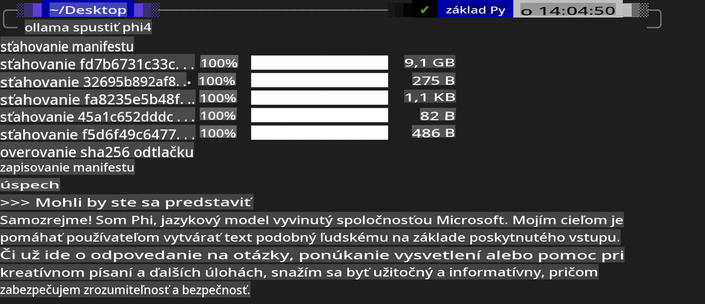
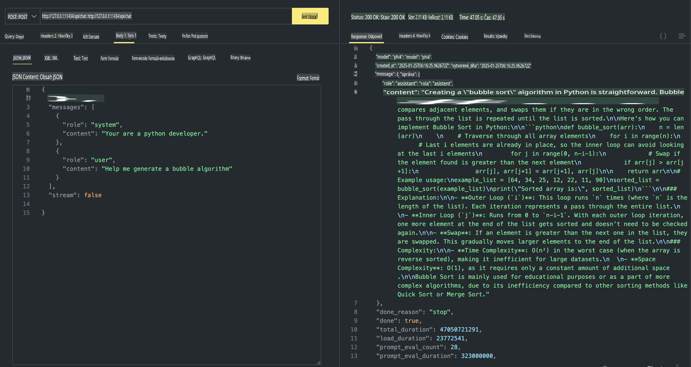

## Phi Family v Ollama

[Ollama](https://ollama.com) umožňuje viac ľuďom priamo nasadzovať open source LLM alebo SLM pomocou jednoduchých skriptov a zároveň vytvárať API na podporu lokálnych Copilot aplikácií.

## **1. Inštalácia**

Ollama podporuje spustenie na Windows, macOS a Linux. Ollama si môžete nainštalovať prostredníctvom tohto odkazu ([https://ollama.com/download](https://ollama.com/download)). Po úspešnej inštalácii môžete priamo používať Ollama skript na volanie Phi-3 cez terminálové okno. Všetky [dostupné knižnice v Ollama](https://ollama.com/library) si môžete prezrieť tu. Ak otvoríte toto úložisko v Codespace, Ollama už bude nainštalovaná.

```bash

ollama run phi4

```

> [!NOTE]
> Model sa pri prvom spustení najskôr stiahne. Samozrejme, môžete tiež priamo špecifikovať stiahnutý model Phi-4. Ako príklad použijeme WSL na spustenie príkazu. Po úspešnom stiahnutí modelu môžete interagovať priamo v termináli.



## **2. Volanie Phi-4 API z Ollama**

Ak chcete volať Phi-4 API generované Ollama, môžete v termináli použiť tento príkaz na spustenie Ollama servera.

```bash

ollama serve

```

> [!NOTE]
> Ak používate macOS alebo Linux, môžete naraziť na nasledujúcu chybu **"Error: listen tcp 127.0.0.1:11434: bind: address already in use"**. Táto chyba sa môže objaviť pri spustení príkazu. Môžete ju buď ignorovať, pretože zvyčajne znamená, že server už beží, alebo zastaviť a reštartovať Ollama:

**macOS**

```bash

brew services restart ollama

```

**Linux**

```bash

sudo systemctl stop ollama

```

Ollama podporuje dve API: generate a chat. Podľa svojich potrieb môžete volať modelové API poskytované Ollama zasielaním požiadaviek na lokálnu službu bežiacu na porte 11434.

**Chat**

```bash

curl http://127.0.0.1:11434/api/chat -d '{
  "model": "phi3",
  "messages": [
    {
      "role": "system",
      "content": "Your are a python developer."
    },
    {
      "role": "user",
      "content": "Help me generate a bubble algorithm"
    }
  ],
  "stream": false
  
}'

This is the result in Postman



## Additional Resources

Check the list of available models in Ollama in [their library](https://ollama.com/library).

Pull your model from the Ollama server using this command

```bash
ollama pull phi4
```

Run the model using this command

```bash
ollama run phi4
```

***Note:*** Visit this link [https://github.com/ollama/ollama/blob/main/docs/api.md](https://github.com/ollama/ollama/blob/main/docs/api.md) to learn more

## Calling Ollama from Python

You can use `requests` or `urllib3` to make requests to the local server endpoints used above. However, a popular way to use Ollama in Python is via the [openai](https://pypi.org/project/openai/) SDK, since Ollama provides OpenAI-compatible server endpoints as well.

Here is an example for phi3-mini:

```python
import openai

client = openai.OpenAI(
    base_url="http://localhost:11434/v1",
    api_key="nokeyneeded",
)

response = client.chat.completions.create(
    model="phi4",
    temperature=0.7,
    n=1,
    messages=[
        {"role": "system", "content": "You are a helpful assistant."},
        {"role": "user", "content": "Write a haiku about a hungry cat"},
    ],
)

print("Response:")
print(response.choices[0].message.content)
```

## Calling Ollama from JavaScript 

```javascript
// Príklad zhrnutia súboru pomocou Phi-4
script({
    model: "ollama:phi4",
    title: "Summarize with Phi-4",
    system: ["system"],
})

// Príklad zhrnutia
const file = def("FILE", env.files)
$`Summarize ${file} in a single paragraph.`
```

## Calling Ollama from C#

Create a new C# Console application and add the following NuGet package:

```bash
dotnet add package Microsoft.SemanticKernel --version 1.34.0
```

Then replace this code in the `Program.cs` file

```csharp
using Microsoft.SemanticKernel;
using Microsoft.SemanticKernel.ChatCompletion;

// pridanie chat completion služby pomocou lokálneho Ollama servera
#pragma warning disable SKEXP0001, SKEXP0003, SKEXP0010, SKEXP0011, SKEXP0050, SKEXP0052
builder.AddOpenAIChatCompletion(
    modelId: "phi4",
    endpoint: new Uri("http://localhost:11434/"),
    apiKey: "non required");

// vyvolanie jednoduchého promptu na chatovaciu službu
string prompt = "Write a joke about kittens";
var response = await kernel.InvokePromptAsync(prompt);
Console.WriteLine(response.GetValue<string>());
```

Run the app with the command:

```bash
dotnet run

**Upozornenie**:  
Tento dokument bol preložený pomocou strojových AI prekladových služieb. Hoci sa snažíme o presnosť, upozorňujeme, že automatizované preklady môžu obsahovať chyby alebo nepresnosti. Pôvodný dokument v jeho pôvodnom jazyku by mal byť považovaný za autoritatívny zdroj. Pre kritické informácie sa odporúča profesionálny ľudský preklad. Nenesieme zodpovednosť za akékoľvek nedorozumenia alebo nesprávne interpretácie vyplývajúce z použitia tohto prekladu.