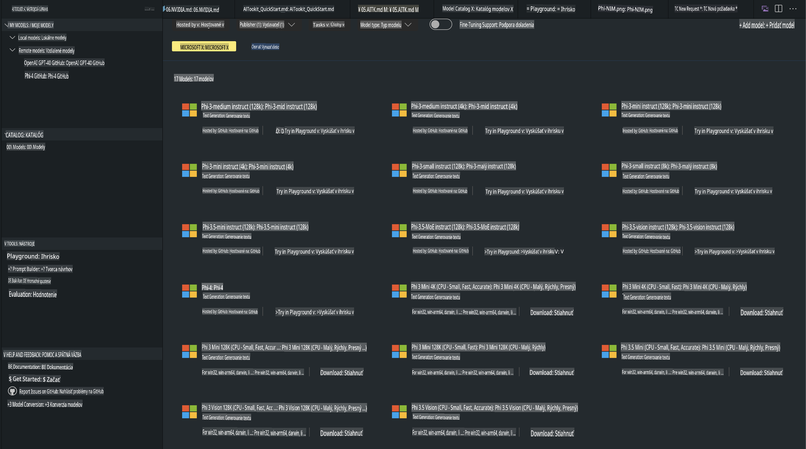
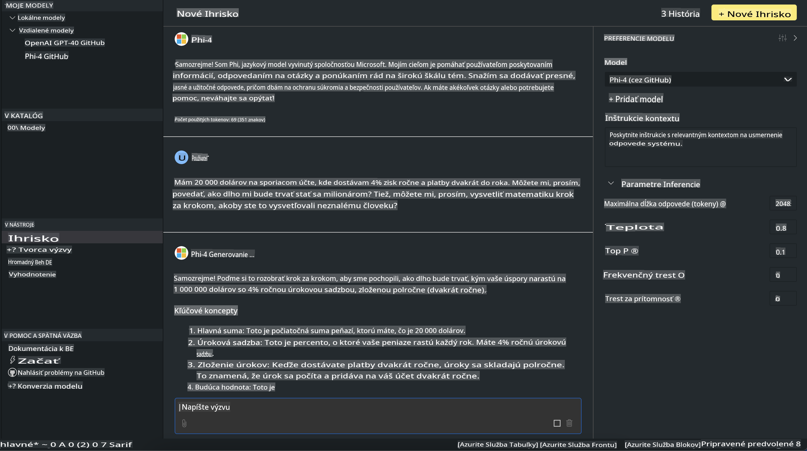

# Rodina Phi v AITK

[AI Toolkit pre VS Code](https://marketplace.visualstudio.com/items?itemName=ms-windows-ai-studio.windows-ai-studio) zjednodušuje vývoj generatívnych AI aplikácií tým, že spája najmodernejšie nástroje a modely z katalógu Azure AI Foundry a iných katalógov, ako je Hugging Face. Budete môcť prehliadať katalóg AI modelov podporovaný GitHub Models a Azure AI Foundry Model Catalogs, stiahnuť ich lokálne alebo vzdialene, doladiť, otestovať a použiť ich vo svojej aplikácii.

AI Toolkit Preview beží lokálne. Lokálna inferencia alebo doladenie závisí od modelu, ktorý ste si vybrali, a môže vyžadovať GPU, ako napríklad NVIDIA CUDA GPU. GitHub Models môžete spustiť priamo aj cez AITK.

## Začíname

[Prečítajte si viac o tom, ako nainštalovať Windows Subsystem for Linux](https://learn.microsoft.com/windows/wsl/install?WT.mc_id=aiml-137032-kinfeylo)

a [ako zmeniť predvolenú distribúciu](https://learn.microsoft.com/windows/wsl/install#change-the-default-linux-distribution-installed).

[Repozitár AI Toolkit na GitHube](https://github.com/microsoft/vscode-ai-toolkit/)

- Windows, Linux, macOS
  
- Na doladenie na Windows a Linuxe budete potrebovať Nvidia GPU. Navyše, **Windows** vyžaduje subsystem pre Linux s distribúciou Ubuntu 18.4 alebo novšou. [Prečítajte si viac o tom, ako nainštalovať Windows Subsystem for Linux](https://learn.microsoft.com/windows/wsl/install) a [ako zmeniť predvolenú distribúciu](https://learn.microsoft.com/windows/wsl/install#change-the-default-linux-distribution-installed).

### Inštalácia AI Toolkit

AI Toolkit je dostupný ako [rozšírenie pre Visual Studio Code](https://code.visualstudio.com/docs/setup/additional-components#_vs-code-extensions), takže najprv musíte nainštalovať [VS Code](https://code.visualstudio.com/docs/setup/windows?WT.mc_id=aiml-137032-kinfeylo) a potom stiahnuť AI Toolkit z [VS Marketplace](https://marketplace.visualstudio.com/items?itemName=ms-windows-ai-studio.windows-ai-studio).  
[AI Toolkit je dostupný na Visual Studio Marketplace](https://marketplace.visualstudio.com/items?itemName=ms-windows-ai-studio.windows-ai-studio) a môžete ho nainštalovať ako akékoľvek iné rozšírenie pre VS Code.

Ak nemáte skúsenosti s inštaláciou rozšírení pre VS Code, postupujte podľa týchto krokov:

### Prihlásenie

1. Vo VS Code vyberte **Rozšírenia** na paneli aktivít.
2. Do vyhľadávacieho poľa rozšírení zadajte "AI Toolkit".
3. Vyberte "AI Toolkit for Visual Studio Code".
4. Kliknite na **Inštalovať**.

Teraz ste pripravení používať rozšírenie!

Budete vyzvaní, aby ste sa prihlásili na GitHub, preto prosím kliknite na "Povoliť" na pokračovanie. Budete presmerovaní na prihlasovaciu stránku GitHub.

Prihláste sa a postupujte podľa pokynov. Po úspešnom dokončení budete presmerovaní späť do VS Code.

Po nainštalovaní rozšírenia sa na paneli aktivít zobrazí ikona AI Toolkit.

Preskúmajme dostupné akcie!

### Dostupné akcie

Primárny bočný panel AI Toolkit je organizovaný do sekcií:

- **Modely**
- **Zdroje**
- **Ihrisko**
- **Doladenie**
- **Hodnotenie**

Tieto sekcie sú dostupné v časti Zdroje. Ak chcete začať, vyberte **Katalóg modelov**.

### Stiahnutie modelu z katalógu

Po spustení AI Toolkit z postranného panela VS Code si môžete vybrať z nasledujúcich možností:



- Nájdite podporovaný model v **Katalógu modelov** a stiahnite ho lokálne.
- Otestujte inferenciu modelu na **Ihrisku modelov**.
- Doladite model lokálne alebo vzdialene v sekcii **Doladenie modelu**.
- Nasadzujte doladené modely do cloudu cez príkazový panel AI Toolkit.
- Hodnoťte modely.

> [!NOTE]
>
> **GPU vs CPU**
>
> Zistíte, že karty modelov zobrazujú veľkosť modelu, platformu a typ akcelerátora (CPU, GPU). Pre optimalizovaný výkon na **Windows zariadeniach, ktoré majú aspoň jeden GPU**, vyberte verzie modelov, ktoré sú zamerané len na Windows.
>
> To zabezpečí, že máte model optimalizovaný pre akcelerátor DirectML.
>
> Názvy modelov majú formát
>
> - `{model_name}-{accelerator}-{quantization}-{format}`.
>
> Ak chcete zistiť, či máte GPU na svojom Windows zariadení, otvorte **Správcu úloh** a vyberte kartu **Výkon**. Ak máte GPU, budú uvedené pod názvami ako "GPU 0" alebo "GPU 1".

### Spustenie modelu na ihrisku

Po nastavení všetkých parametrov kliknite na **Generovať projekt**.

Keď sa váš model stiahne, vyberte **Načítať na ihrisko** na karte modelu v katalógu:

- Spustite sťahovanie modelu.
- Nainštalujte všetky predpoklady a závislosti.
- Vytvorte pracovný priestor vo VS Code.



### Použitie REST API vo vašej aplikácii

AI Toolkit obsahuje lokálny REST API webový server **na porte 5272**, ktorý používa [formát OpenAI chat completions](https://platform.openai.com/docs/api-reference/chat/create).

To vám umožňuje testovať aplikáciu lokálne bez závislosti na cloudových AI modelových službách. Nasledujúci JSON súbor ukazuje, ako nakonfigurovať telo požiadavky:

```json
{
    "model": "Phi-4",
    "messages": [
        {
            "role": "user",
            "content": "what is the golden ratio?"
        }
    ],
    "temperature": 0.7,
    "top_p": 1,
    "top_k": 10,
    "max_tokens": 100,
    "stream": true
}
```

REST API môžete otestovať pomocou nástrojov, ako sú [Postman](https://www.postman.com/) alebo utilita CURL (Client URL):

```bash
curl -vX POST http://127.0.0.1:5272/v1/chat/completions -H 'Content-Type: application/json' -d @body.json
```

### Použitie knižnice OpenAI pre Python

```python
from openai import OpenAI

client = OpenAI(
    base_url="http://127.0.0.1:5272/v1/", 
    api_key="x" # required for the API but not used
)

chat_completion = client.chat.completions.create(
    messages=[
        {
            "role": "user",
            "content": "what is the golden ratio?",
        }
    ],
    model="Phi-4",
)

print(chat_completion.choices[0].message.content)
```

### Použitie klientskej knižnice Azure OpenAI pre .NET

Pridajte [klientsku knižnicu Azure OpenAI pre .NET](https://www.nuget.org/packages/Azure.AI.OpenAI/) do vášho projektu pomocou NuGet:

```bash
dotnet add {project_name} package Azure.AI.OpenAI --version 1.0.0-beta.17
```

Pridajte súbor C# s názvom **OverridePolicy.cs** do vášho projektu a vložte nasledujúci kód:

```csharp
// OverridePolicy.cs
using Azure.Core.Pipeline;
using Azure.Core;

internal partial class OverrideRequestUriPolicy(Uri overrideUri)
    : HttpPipelineSynchronousPolicy
{
    private readonly Uri _overrideUri = overrideUri;

    public override void OnSendingRequest(HttpMessage message)
    {
        message.Request.Uri.Reset(_overrideUri);
    }
}
```

Ďalej vložte nasledujúci kód do vášho súboru **Program.cs**:

```csharp
// Program.cs
using Azure.AI.OpenAI;

Uri localhostUri = new("http://localhost:5272/v1/chat/completions");

OpenAIClientOptions clientOptions = new();
clientOptions.AddPolicy(
    new OverrideRequestUriPolicy(localhostUri),
    Azure.Core.HttpPipelinePosition.BeforeTransport);
OpenAIClient client = new(openAIApiKey: "unused", clientOptions);

ChatCompletionsOptions options = new()
{
    DeploymentName = "Phi-4",
    Messages =
    {
        new ChatRequestSystemMessage("You are a helpful assistant. Be brief and succinct."),
        new ChatRequestUserMessage("What is the golden ratio?"),
    }
};

StreamingResponse<StreamingChatCompletionsUpdate> streamingChatResponse
    = await client.GetChatCompletionsStreamingAsync(options);

await foreach (StreamingChatCompletionsUpdate chatChunk in streamingChatResponse)
{
    Console.Write(chatChunk.ContentUpdate);
}
```

## Doladenie pomocou AI Toolkit

- Začnite s objavovaním modelov a ihriskom.
- Doladenie modelov a inferencia pomocou lokálnych výpočtových zdrojov.
- Vzdialené doladenie a inferencia pomocou Azure zdrojov.

[Doladenie pomocou AI Toolkit](../../03.FineTuning/Finetuning_VSCodeaitoolkit.md)

## AI Toolkit Q&A Zdroje

Pozrite si našu [Q&A stránku](https://github.com/microsoft/vscode-ai-toolkit/blob/main/archive/QA.md) pre najčastejšie problémy a ich riešenia.

**Upozornenie**:  
Tento dokument bol preložený pomocou strojových AI prekladateľských služieb. Aj keď sa snažíme o presnosť, vezmite prosím na vedomie, že automatizované preklady môžu obsahovať chyby alebo nepresnosti. Pôvodný dokument v jeho pôvodnom jazyku by mal byť považovaný za záväzný zdroj. Pre kritické informácie sa odporúča profesionálny ľudský preklad. Nenesieme zodpovednosť za akékoľvek nedorozumenia alebo nesprávne interpretácie vyplývajúce z použitia tohto prekladu.