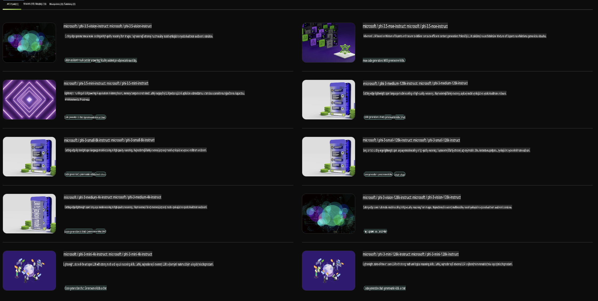

## Phi Family v NVIDIA NIM

NVIDIA NIM je súbor ľahko použiteľných mikroslužieb navrhnutých na urýchlenie nasadenia generatívnych AI modelov v cloude, dátových centrách a pracovných staniciach. NIM sú kategorizované podľa rodiny modelov a individuálne podľa modelov. Napríklad, NVIDIA NIM pre veľké jazykové modely (LLMs) prináša silu najmodernejších LLMs do podnikových aplikácií, poskytujúc bezkonkurenčné schopnosti spracovania a porozumenia prirodzeného jazyka.

NIM umožňuje tímom IT a DevOps jednoducho samostatne hostovať veľké jazykové modely (LLMs) vo svojich vlastných spravovaných prostrediach a zároveň poskytuje vývojárom štandardné API, ktoré im umožňujú vytvárať výkonných kopilotov, chatboty a AI asistentov, ktorí môžu transformovať ich podnikanie. Využitím najmodernejšej GPU akcelerácie a škálovateľného nasadenia od NVIDIA, NIM ponúka najrýchlejšiu cestu k inferencii s bezkonkurenčným výkonom.

Pomocou NVIDIA NIM môžete vykonávať inferenciu modelov Phi Family.



### **Príklady - Phi-3-Vision v NVIDIA NIM**

Predstavte si, že máte obrázok (`demo.png`) a chcete vygenerovať Python kód, ktorý tento obrázok spracuje a uloží jeho novú verziu (`phi-3-vision.jpg`).

Vyššie uvedený kód tento proces automatizuje takto:

1. Nastavenie prostredia a potrebných konfigurácií.
2. Vytvorenie promptu, ktorý inštruuje model na generovanie požadovaného Python kódu.
3. Odoslanie promptu modelu a zhromaždenie vygenerovaného kódu.
4. Extrakcia a spustenie vygenerovaného kódu.
5. Zobrazenie pôvodného a spracovaného obrázku.

Tento prístup využíva silu AI na automatizáciu úloh spracovania obrázkov, čím ich robí jednoduchšími a rýchlejšími na dosiahnutie vašich cieľov.

[Ukážka kódu riešenia](../../../../../code/06.E2E/E2E_Nvidia_NIM_Phi3_Vision.ipynb)

Rozoberme si, čo celý kód robí krok za krokom:

1. **Inštalácia potrebného balíka**:
    ```python
    !pip install langchain_nvidia_ai_endpoints -U
    ```
    Tento príkaz inštaluje balík `langchain_nvidia_ai_endpoints`, čím zabezpečuje, že je vo svojej najnovšej verzii.

2. **Import potrebných modulov**:
    ```python
    from langchain_nvidia_ai_endpoints import ChatNVIDIA
    import getpass
    import os
    import base64
    ```
    Tieto importy zabezpečujú prístup k modulom na interakciu s NVIDIA AI endpointmi, bezpečné spracovanie hesiel, prácu so súborovým systémom a kódovanie/dekódovanie dát vo formáte base64.

3. **Nastavenie API kľúča**:
    ```python
    if not os.getenv("NVIDIA_API_KEY"):
        os.environ["NVIDIA_API_KEY"] = getpass.getpass("Enter your NVIDIA API key: ")
    ```
    Tento kód kontroluje, či je nastavená premenná prostredia `NVIDIA_API_KEY`. Ak nie, vyzve používateľa na bezpečné zadanie jeho API kľúča.

4. **Definovanie modelu a cesty k obrázku**:
    ```python
    model = 'microsoft/phi-3-vision-128k-instruct'
    chat = ChatNVIDIA(model=model)
    img_path = './imgs/demo.png'
    ```
    Toto nastavuje model, ktorý sa použije, vytvorí inštanciu `ChatNVIDIA` so špecifikovaným modelom a definuje cestu k súboru obrázka.

5. **Vytvorenie textového promptu**:
    ```python
    text = "Please create Python code for image, and use plt to save the new picture under imgs/ and name it phi-3-vision.jpg."
    ```
    Toto definuje textový prompt, ktorý inštruuje model na generovanie Python kódu na spracovanie obrázka.

6. **Kódovanie obrázka v base64**:
    ```python
    with open(img_path, "rb") as f:
        image_b64 = base64.b64encode(f.read()).decode()
    image = f''
    ```
    Tento kód načíta súbor obrázka, zakóduje ho v base64 a vytvorí HTML tag obrázka s zakódovanými dátami.

7. **Kombinácia textu a obrázka do promptu**:
    ```python
    prompt = f"{text} {image}"
    ```
    Toto kombinuje textový prompt a HTML tag obrázka do jedného reťazca.

8. **Generovanie kódu pomocou ChatNVIDIA**:
    ```python
    code = ""
    for chunk in chat.stream(prompt):
        print(chunk.content, end="")
        code += chunk.content
    ```
    Tento kód odošle prompt do `ChatNVIDIA` model and collects the generated code in chunks, printing and appending each chunk to the `code` reťazca.

9. **Extrakcia Python kódu z vygenerovaného obsahu**:
    ```python
    begin = code.index('```python') + 9
    code = code[begin:]
    end = code.index('```')
    code = code[:end]
    ```
    Toto extrahuje skutočný Python kód z vygenerovaného obsahu odstránením markdown formátovania.

10. **Spustenie vygenerovaného kódu**:
    ```python
    import subprocess
    result = subprocess.run(["python", "-c", code], capture_output=True)
    ```
    Tento kód spúšťa extrahovaný Python kód ako subprocess a zachytáva jeho výstup.

11. **Zobrazenie obrázkov**:
    ```python
    from IPython.display import Image, display
    display(Image(filename='./imgs/phi-3-vision.jpg'))
    display(Image(filename='./imgs/demo.png'))
    ```
    Tieto riadky zobrazujú obrázky pomocou modulu `IPython.display`.

**Upozornenie**:  
Tento dokument bol preložený pomocou strojových prekladových služieb AI. Aj keď sa snažíme o presnosť, upozorňujeme, že automatizované preklady môžu obsahovať chyby alebo nepresnosti. Pôvodný dokument v jeho rodnom jazyku by mal byť považovaný za záväzný zdroj. Pre dôležité informácie sa odporúča profesionálny ľudský preklad. Nenesieme zodpovednosť za akékoľvek nedorozumenia alebo nesprávne interpretácie vyplývajúce z použitia tohto prekladu.