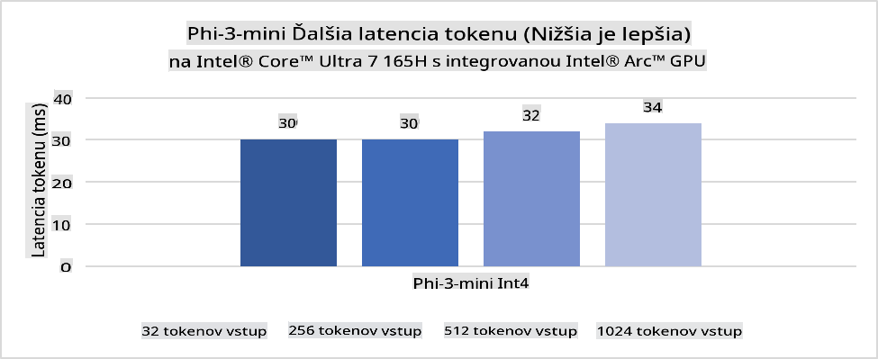
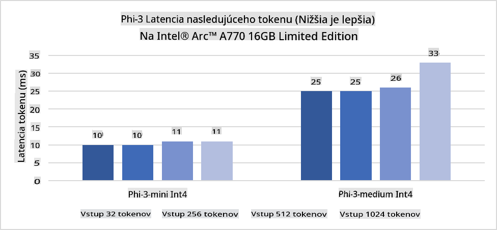
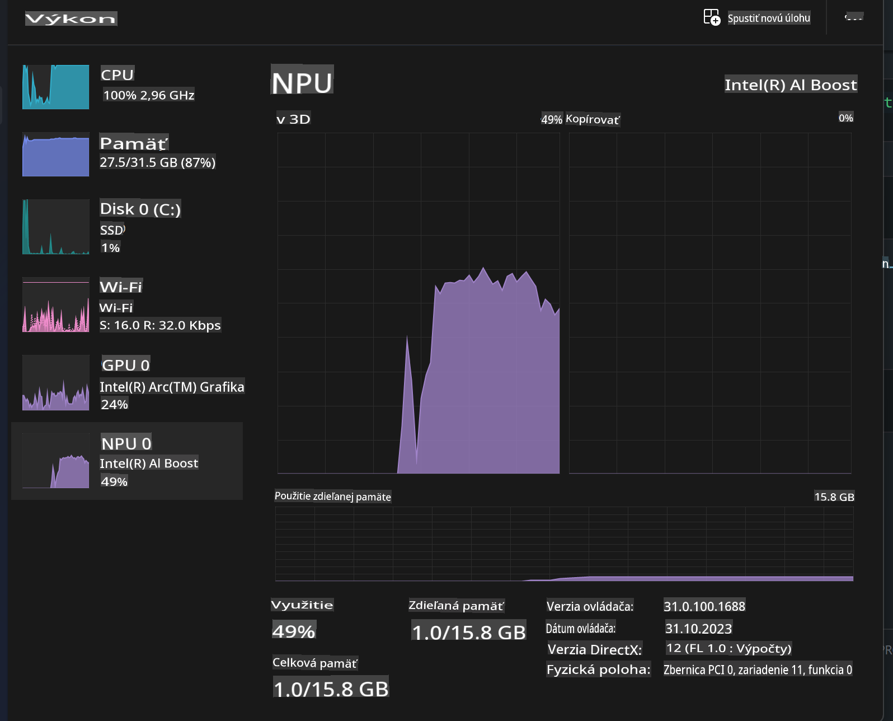
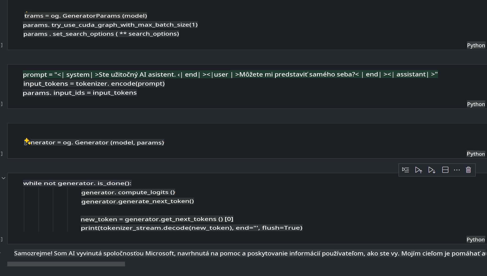
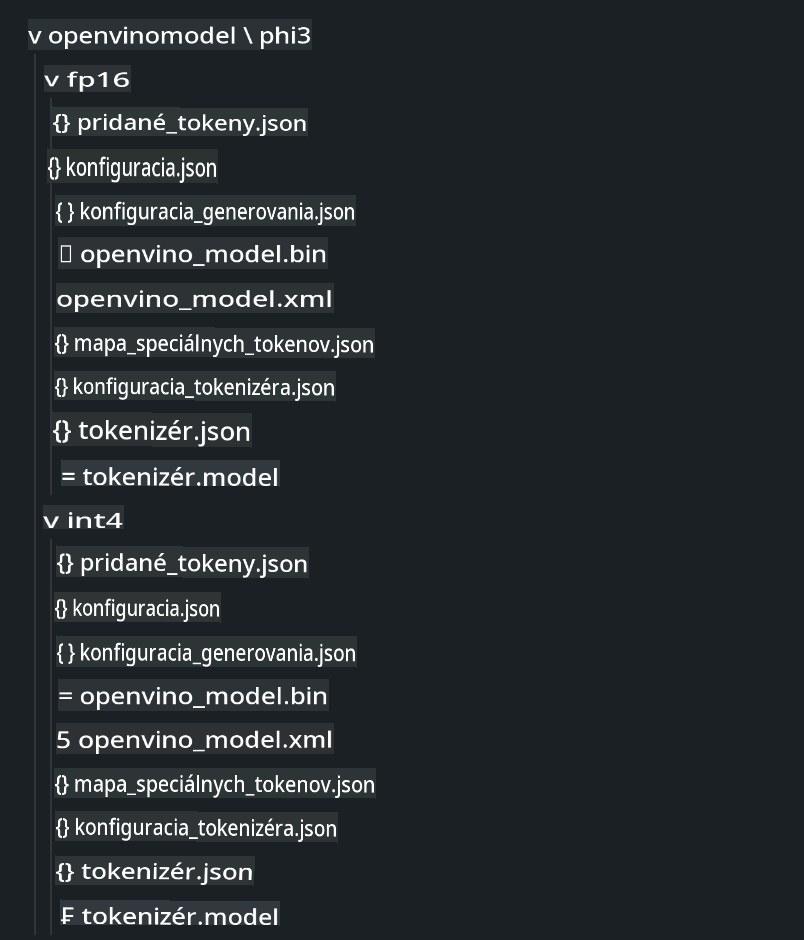
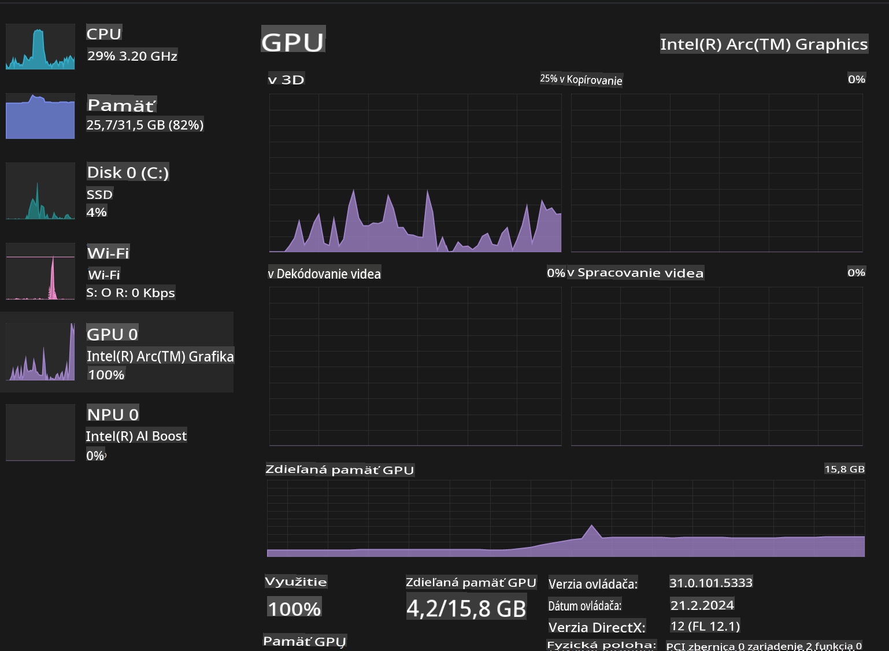

# **Inferencia Phi-3 na AI PC**

S rozvojom generatívnej AI a zlepšovaním hardvérových schopností zariadení na okraji siete je možné integrovať čoraz viac generatívnych AI modelov do zariadení používateľov BYOD (Bring Your Own Device). Medzi tieto modely patria aj AI PC. Od roku 2024 spolupracujú spoločnosti Intel, AMD a Qualcomm s výrobcami PC na zavedení AI PC, ktoré umožňujú nasadenie lokalizovaných generatívnych AI modelov prostredníctvom hardvérových úprav. V tejto diskusii sa zameriame na Intel AI PC a preskúmame, ako nasadiť Phi-3 na Intel AI PC.

### Čo je NPU

NPU (Neural Processing Unit) je špecializovaný procesor alebo spracovacia jednotka na väčšom SoC navrhnutá špeciálne na zrýchlenie operácií neurónových sietí a úloh AI. Na rozdiel od univerzálnych CPU a GPU sú NPU optimalizované na paralelné spracovanie založené na údajoch, čo ich robí mimoriadne efektívnymi pri spracovaní veľkého množstva multimediálnych údajov, ako sú videá a obrázky, a pri spracovaní údajov pre neurónové siete. Sú obzvlášť zdatné pri riešení úloh súvisiacich s AI, ako je rozpoznávanie reči, rozostrovanie pozadia počas videohovorov a úpravy fotografií alebo videí, ako je detekcia objektov.

## NPU vs GPU

Aj keď mnohé úlohy AI a strojového učenia bežia na GPU, medzi GPU a NPU je zásadný rozdiel.
GPU sú známe svojimi schopnosťami paralelného spracovania, no nie všetky GPU sú rovnako efektívne mimo spracovania grafiky. NPU sú naopak špeciálne navrhnuté na zložité výpočty spojené s operáciami neurónových sietí, vďaka čomu sú mimoriadne účinné pri úlohách AI.

Stručne povedané, NPU sú matematickí géniovia, ktorí zrýchľujú výpočty AI a zohrávajú kľúčovú úlohu v nastupujúcej ére AI PC!

***Tento príklad je založený na najnovšom procesore Intel Core Ultra***

## **1. Použitie NPU na spustenie modelu Phi-3**

Zariadenie Intel® NPU je akcelerátor inferencie AI integrovaný do klientských procesorov Intel, počnúc generáciou procesorov Intel® Core™ Ultra (predtým známe ako Meteor Lake). Umožňuje energeticky efektívne vykonávanie úloh umelej neurónovej siete.





**Intel NPU Acceleration Library**

Knižnica Intel NPU Acceleration Library [https://github.com/intel/intel-npu-acceleration-library](https://github.com/intel/intel-npu-acceleration-library) je Python knižnica navrhnutá na zvýšenie efektivity vašich aplikácií využitím výkonu Intel Neural Processing Unit (NPU) na vykonávanie vysokorýchlostných výpočtov na kompatibilnom hardvéri.

Príklad Phi-3-mini na AI PC poháňanom procesormi Intel® Core™ Ultra.


Inštalácia Python knižnice cez pip

```bash

   pip install intel-npu-acceleration-library

```

***Poznámka*** Projekt je stále vo vývoji, ale referenčný model je už veľmi kompletný.

### **Spustenie Phi-3 s Intel NPU Acceleration Library**

Použitím akcelerácie Intel NPU táto knižnica neovplyvňuje tradičný proces kódovania. Stačí použiť túto knižnicu na kvantizáciu pôvodného modelu Phi-3, ako napr. FP16, INT8, INT4, napríklad:

```python
from transformers import AutoTokenizer, pipeline,TextStreamer
from intel_npu_acceleration_library import NPUModelForCausalLM, int4
from intel_npu_acceleration_library.compiler import CompilerConfig
import warnings

model_id = "microsoft/Phi-3-mini-4k-instruct"

compiler_conf = CompilerConfig(dtype=int4)
model = NPUModelForCausalLM.from_pretrained(
    model_id, use_cache=True, config=compiler_conf, attn_implementation="sdpa"
).eval()

tokenizer = AutoTokenizer.from_pretrained(model_id)

text_streamer = TextStreamer(tokenizer, skip_prompt=True)
```

Po úspešnej kvantizácii pokračujte v vykonávaní a zavolajte NPU na spustenie modelu Phi-3.

```python
generation_args = {
   "max_new_tokens": 1024,
   "return_full_text": False,
   "temperature": 0.3,
   "do_sample": False,
   "streamer": text_streamer,
}

pipe = pipeline(
   "text-generation",
   model=model,
   tokenizer=tokenizer,
)

query = "<|system|>You are a helpful AI assistant.<|end|><|user|>Can you introduce yourself?<|end|><|assistant|>"

with warnings.catch_warnings():
    warnings.simplefilter("ignore")
    pipe(query, **generation_args)
```

Pri vykonávaní kódu môžeme sledovať stav behu NPU cez Správcu úloh.



***Príklady*** : [AIPC_NPU_DEMO.ipynb](../../../../../code/03.Inference/AIPC/AIPC_NPU_DEMO.ipynb)

## **2. Použitie DirectML + ONNX Runtime na spustenie modelu Phi-3**

### **Čo je DirectML**

[DirectML](https://github.com/microsoft/DirectML) je vysokovýkonná hardvérovo akcelerovaná knižnica DirectX 12 pre strojové učenie. DirectML poskytuje akceleráciu GPU pre bežné úlohy strojového učenia na širokej škále podporovaného hardvéru a ovládačov vrátane všetkých GPU kompatibilných s DirectX 12 od výrobcov ako AMD, Intel, NVIDIA a Qualcomm.

Pri samostatnom použití je API DirectML nízkoúrovňová knižnica DirectX 12 a je vhodná pre vysokovýkonné, nízkolatenčné aplikácie, ako sú frameworky, hry a iné aplikácie v reálnom čase. Bezproblémová interoperabilita DirectML s Direct3D 12, ako aj jej nízka režijná záťaž a súlad naprieč hardvérom robia z DirectML ideálny nástroj na akceleráciu strojového učenia, keď je žiadaný vysoký výkon a spoľahlivosť a predvídateľnosť výsledkov naprieč hardvérom sú kritické.

***Poznámka*** : Najnovší DirectML už podporuje NPU(https://devblogs.microsoft.com/directx/introducing-neural-processor-unit-npu-support-in-directml-developer-preview/)

###  DirectML a CUDA z hľadiska ich schopností a výkonu:

**DirectML** je knižnica strojového učenia vyvinutá spoločnosťou Microsoft. Je navrhnutá na akceleráciu úloh strojového učenia na zariadeniach so systémom Windows, vrátane stolných počítačov, notebookov a zariadení na okraji siete.
- DX12-Based: DirectML je postavený na DirectX 12 (DX12), ktorý poskytuje širokú škálu hardvérovej podpory na GPU, vrátane NVIDIA a AMD.
- Širšia podpora: Vďaka využívaniu DX12 môže DirectML pracovať s akýmkoľvek GPU, ktorý podporuje DX12, dokonca aj s integrovanými GPU.
- Spracovanie obrázkov: DirectML spracováva obrázky a iné údaje pomocou neurónových sietí, čo ho robí vhodným pre úlohy ako rozpoznávanie obrázkov, detekcia objektov a podobne.
- Jednoduchá inštalácia: Nastavenie DirectML je jednoduché a nevyžaduje špecifické SDK alebo knižnice od výrobcov GPU.
- Výkon: V niektorých prípadoch DirectML dosahuje dobrý výkon a môže byť rýchlejší ako CUDA, najmä pri určitých úlohách.
- Obmedzenia: Existujú však prípady, keď môže byť DirectML pomalší, najmä pri float16 a veľkých dávkach.

**CUDA** je platforma paralelného výpočtu a programovací model od spoločnosti NVIDIA. Umožňuje vývojárom využiť výkon GPU NVIDIA na všeobecné výpočty, vrátane strojového učenia a vedeckých simulácií.
- Špecifické pre NVIDIA: CUDA je úzko integrovaná s GPU NVIDIA a je špeciálne navrhnutá pre ne.
- Vysoko optimalizovaná: Poskytuje vynikajúci výkon pre úlohy akcelerované GPU, najmä pri použití GPU NVIDIA.
- Široko používaná: Mnoho frameworkov a knižníc pre strojové učenie (ako TensorFlow a PyTorch) má podporu CUDA.
- Prispôsobenie: Vývojári môžu jemne doladiť nastavenia CUDA pre špecifické úlohy, čo môže viesť k optimálnemu výkonu.
- Obmedzenia: Závislosť CUDA od hardvéru NVIDIA môže byť obmedzujúca, ak chcete širšiu kompatibilitu s rôznymi GPU.

### Výber medzi DirectML a CUDA

Výber medzi DirectML a CUDA závisí od konkrétneho prípadu použitia, dostupnosti hardvéru a preferencií.
Ak hľadáte širšiu kompatibilitu a jednoduchosť nastavenia, DirectML môže byť dobrou voľbou. Ak však máte GPU NVIDIA a potrebujete vysoko optimalizovaný výkon, CUDA zostáva silným kandidátom. Stručne povedané, obe možnosti majú svoje silné a slabé stránky, preto zvážte svoje požiadavky a dostupný hardvér pri rozhodovaní.

### **Generatívna AI s ONNX Runtime**

V ére AI je prenositeľnosť AI modelov veľmi dôležitá. ONNX Runtime umožňuje jednoducho nasadiť trénované modely na rôzne zariadenia. Vývojári sa nemusia zaoberať inferenčnými frameworkami a môžu použiť jednotné API na dokončenie inferencie modelov. V ére generatívnej AI ONNX Runtime tiež vykonal optimalizáciu kódu (https://onnxruntime.ai/docs/genai/). Prostredníctvom optimalizovaného ONNX Runtime je možné kvantizovaný generatívny AI model inferovať na rôznych termináloch. Pri použití Generative AI s ONNX Runtime môžete inferovať AI model API cez Python, C#, C / C++. Samozrejme, nasadenie na iPhone môže využiť Generative AI s ONNX Runtime API v C++.

[Ukážkový kód](https://github.com/Azure-Samples/Phi-3MiniSamples/tree/main/onnx)

***Kompilácia generatívnej AI s knižnicou ONNX Runtime***

```bash

winget install --id=Kitware.CMake  -e

git clone https://github.com/microsoft/onnxruntime.git

cd .\onnxruntime\

./build.bat --build_shared_lib --skip_tests --parallel --use_dml --config Release

cd ../

git clone https://github.com/microsoft/onnxruntime-genai.git

cd .\onnxruntime-genai\

mkdir ort

cd ort

mkdir include

mkdir lib

copy ..\onnxruntime\include\onnxruntime\core\providers\dml\dml_provider_factory.h ort\include

copy ..\onnxruntime\include\onnxruntime\core\session\onnxruntime_c_api.h ort\include

copy ..\onnxruntime\build\Windows\Release\Release\*.dll ort\lib

copy ..\onnxruntime\build\Windows\Release\Release\onnxruntime.lib ort\lib

python build.py --use_dml


```

**Inštalácia knižnice**

```bash

pip install .\onnxruntime_genai_directml-0.3.0.dev0-cp310-cp310-win_amd64.whl

```

Toto je výsledok spustenia.



***Príklady*** : [AIPC_DirectML_DEMO.ipynb](../../../../../code/03.Inference/AIPC/AIPC_DirectML_DEMO.ipynb)

## **3. Použitie Intel OpenVino na spustenie modelu Phi-3**

### **Čo je OpenVINO**

[OpenVINO](https://github.com/openvinotoolkit/openvino) je open-source nástrojová sada na optimalizáciu a nasadenie modelov hlbokého učenia. Poskytuje zvýšený výkon hlbokého učenia pre modely zamerané na víziu, zvuk a jazyk z populárnych frameworkov, ako sú TensorFlow, PyTorch a ďalšie. Začnite s OpenVINO. OpenVINO môže byť tiež použitý v kombinácii s CPU a GPU na spustenie modelu Phi-3.

***Poznámka***: OpenVINO aktuálne nepodporuje NPU.

### **Inštalácia knižnice OpenVINO**

```bash

 pip install git+https://github.com/huggingface/optimum-intel.git

 pip install git+https://github.com/openvinotoolkit/nncf.git

 pip install openvino-nightly

```

### **Spustenie Phi-3 s OpenVINO**

Rovnako ako pri NPU, OpenVINO vykonáva volanie generatívnych AI modelov spustením kvantizovaných modelov. Najprv musíme kvantizovať model Phi-3 a dokončiť kvantizáciu modelu cez príkazový riadok pomocou optimum-cli.

**INT4**

```bash

optimum-cli export openvino --model "microsoft/Phi-3-mini-4k-instruct" --task text-generation-with-past --weight-format int4 --group-size 128 --ratio 0.6  --sym  --trust-remote-code ./openvinomodel/phi3/int4

```

**FP16**

```bash

optimum-cli export openvino --model "microsoft/Phi-3-mini-4k-instruct" --task text-generation-with-past --weight-format fp16 --trust-remote-code ./openvinomodel/phi3/fp16

```

Konvertovaný formát vyzerá takto:



Načítajte cesty k modelom (model_dir), súvisiace konfigurácie (ov_config = {"PERFORMANCE_HINT": "LATENCY", "NUM_STREAMS": "1", "CACHE_DIR": ""}) a hardvérovo akcelerované zariadenia (GPU.0) cez OVModelForCausalLM.

```python

ov_model = OVModelForCausalLM.from_pretrained(
     model_dir,
     device='GPU.0',
     ov_config=ov_config,
     config=AutoConfig.from_pretrained(model_dir, trust_remote_code=True),
     trust_remote_code=True,
)

```

Pri vykonávaní kódu môžeme sledovať stav GPU cez Správcu úloh.



***Príklady*** : [AIPC_OpenVino_Demo.ipynb](../../../../../code/03.Inference/AIPC/AIPC_OpenVino_Demo.ipynb)

### ***Poznámka*** : Vyššie uvedené tri metódy majú každá svoje výhody, ale odporúča sa použiť akceleráciu NPU pre inferenciu na AI PC.

**Upozornenie**:  
Tento dokument bol preložený pomocou strojových AI prekladateľských služieb. Hoci sa snažíme o presnosť, upozorňujeme, že automatizované preklady môžu obsahovať chyby alebo nepresnosti. Pôvodný dokument v jeho pôvodnom jazyku by mal byť považovaný za autoritatívny zdroj. Pre dôležité informácie sa odporúča profesionálny ľudský preklad. Nezodpovedáme za akékoľvek nedorozumenia alebo nesprávne interpretácie vyplývajúce z použitia tohto prekladu.