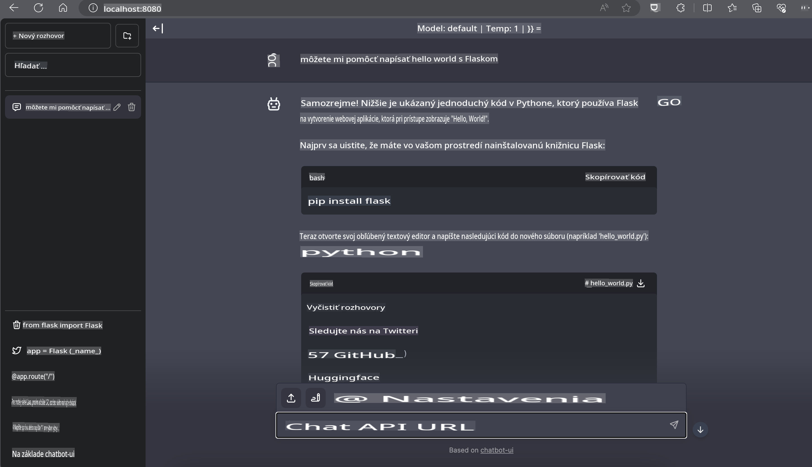

# **Inferencia Phi-3 na Nvidia Jetson**

Nvidia Jetson je séria zabudovaných výpočtových dosiek od spoločnosti Nvidia. Modely Jetson TK1, TX1 a TX2 sú vybavené procesorom Tegra (alebo SoC) od Nvidia, ktorý integruje centrálnu procesorovú jednotku (CPU) s architektúrou ARM. Jetson je nízkoenergetický systém navrhnutý na zrýchlenie aplikácií strojového učenia. Nvidia Jetson využívajú profesionálni vývojári na vytváranie prelomových AI produktov vo všetkých odvetviach, ako aj študenti a nadšenci na praktické učenie AI a tvorbu úžasných projektov. SLM je nasadený na edge zariadeniach, ako je Jetson, čo umožňuje lepšiu implementáciu priemyselných generatívnych AI scenárov.

## Nasadenie na NVIDIA Jetson:
Vývojári pracujúci na autonómnej robotike a zabudovaných zariadeniach môžu využiť Phi-3 Mini. Relatívne malá veľkosť Phi-3 ho robí ideálnym pre edge nasadenie. Počas tréningu boli parametre starostlivo vyladené, aby sa zabezpečila vysoká presnosť odpovedí.

### Optimalizácia TensorRT-LLM:
Knižnica [TensorRT-LLM od NVIDIA](https://github.com/NVIDIA/TensorRT-LLM?WT.mc_id=aiml-138114-kinfeylo) optimalizuje inferenciu veľkých jazykových modelov. Podporuje dlhé kontextové okno Phi-3 Mini, čím zlepšuje priepustnosť aj latenciu. Optimalizácie zahŕňajú techniky ako LongRoPE, FP8 a inflight batching.

### Dostupnosť a nasadenie:
Vývojári môžu preskúmať Phi-3 Mini s 128K kontextovým oknom na stránke [NVIDIA's AI](https://www.nvidia.com/en-us/ai-data-science/generative-ai/). Je zabalený ako NVIDIA NIM, mikroslužba so štandardným API, ktorá môže byť nasadená kdekoľvek. Navyše, pozrite si [implementácie TensorRT-LLM na GitHub](https://github.com/NVIDIA/TensorRT-LLM).

## **1. Príprava**

a. Jetson Orin NX / Jetson NX

b. JetPack 5.1.2+
   
c. Cuda 11.8
   
d. Python 3.8+

## **2. Spustenie Phi-3 na Jetson**

Môžeme si vybrať [Ollama](https://ollama.com) alebo [LlamaEdge](https://llamaedge.com)

Ak chcete používať gguf v cloude aj edge zariadeniach súčasne, LlamaEdge možno chápať ako WasmEdge (WasmEdge je ľahký, vysokovýkonný, škálovateľný WebAssembly runtime vhodný pre cloudové, edge a decentralizované aplikácie. Podporuje serverless aplikácie, zabudované funkcie, mikroslužby, smart kontrakty a IoT zariadenia). Prostredníctvom LlamaEdge môžete nasadiť kvantitatívny model gguf na edge zariadenia aj do cloudu.


Tu sú kroky na použitie:

1. Nainštalujte a stiahnite súvisiace knižnice a súbory

```bash

curl -sSf https://raw.githubusercontent.com/WasmEdge/WasmEdge/master/utils/install.sh | bash -s -- --plugin wasi_nn-ggml

curl -LO https://github.com/LlamaEdge/LlamaEdge/releases/latest/download/llama-api-server.wasm

curl -LO https://github.com/LlamaEdge/chatbot-ui/releases/latest/download/chatbot-ui.tar.gz

tar xzf chatbot-ui.tar.gz

```

**Poznámka**: llama-api-server.wasm a chatbot-ui musia byť v rovnakom adresári

2. Spustite skripty v termináli

```bash

wasmedge --dir .:. --nn-preload default:GGML:AUTO:{Your gguf path} llama-api-server.wasm -p phi-3-chat

```

Tu je výsledok spustenia



***Ukážkový kód*** [Phi-3 mini WASM Notebook Sample](https://github.com/Azure-Samples/Phi-3MiniSamples/tree/main/wasm)

Na záver, Phi-3 Mini predstavuje pokrok v modelovaní jazyka, spájajúc efektivitu, kontextové uvedomenie a optimalizačné schopnosti NVIDIA. Či už budujete roboty alebo edge aplikácie, Phi-3 Mini je mocný nástroj, ktorý stojí za to poznať.

**Upozornenie**:  
Tento dokument bol preložený pomocou strojových AI prekladateľských služieb. Hoci sa snažíme o presnosť, upozorňujeme, že automatické preklady môžu obsahovať chyby alebo nepresnosti. Pôvodný dokument v jeho pôvodnom jazyku by mal byť považovaný za záväzný zdroj. Pre kritické informácie sa odporúča profesionálny ľudský preklad. Nezodpovedáme za žiadne nedorozumenia alebo nesprávne interpretácie vyplývajúce z použitia tohto prekladu.