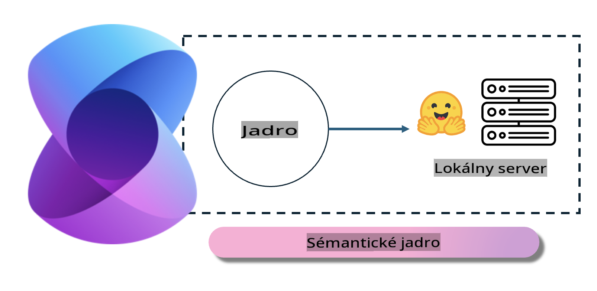
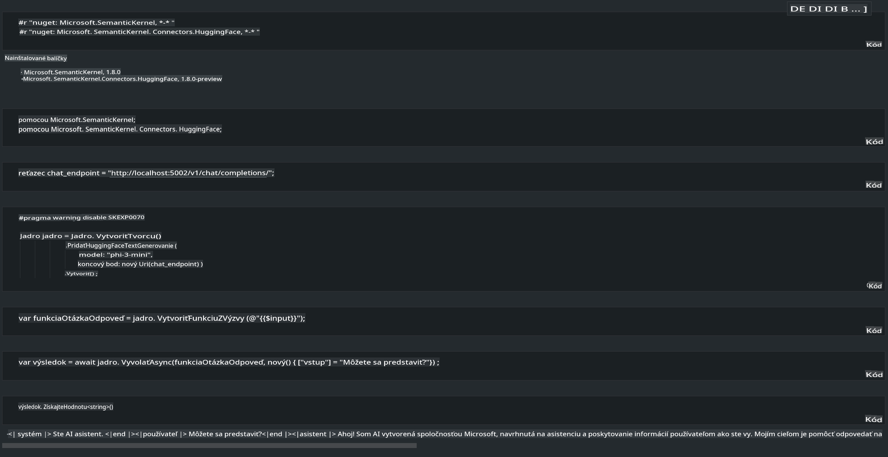

# **Inference Phi-3 na lokálnom serveri**

Môžeme nasadiť Phi-3 na lokálnom serveri. Používatelia si môžu vybrať riešenia [Ollama](https://ollama.com) alebo [LM Studio](https://llamaedge.com), prípadne si môžu napísať vlastný kód. K lokálnym službám Phi-3 sa môžete pripojiť cez [Semantic Kernel](https://github.com/microsoft/semantic-kernel?WT.mc_id=aiml-138114-kinfeylo) alebo [Langchain](https://www.langchain.com/) na vytváranie aplikácií Copilot.

## **Použitie Semantic Kernel na prístup k Phi-3-mini**

V aplikácii Copilot vytvárame aplikácie pomocou Semantic Kernel / LangChain. Tento typ aplikačného rámca je vo všeobecnosti kompatibilný s Azure OpenAI Service / OpenAI modelmi a môže tiež podporovať open source modely na Hugging Face a lokálne modely. Čo robiť, ak chceme použiť Semantic Kernel na prístup k Phi-3-mini? Použitím .NET ako príkladu ho môžeme skombinovať s Hugging Face Connector v Semantic Kernel. Štandardne zodpovedá model id na Hugging Face (pri prvom použití sa model stiahne z Hugging Face, čo môže trvať dlhší čas). Môžete sa tiež pripojiť k vybudovanej lokálnej službe. Z porovnania oboch možností odporúčame použiť druhú, pretože ponúka vyšší stupeň autonómie, najmä v podnikových aplikáciách.

Z obrázka je zrejmé, že prístup k lokálnym službám cez Semantic Kernel umožňuje jednoduché pripojenie k vlastnému serveru modelu Phi-3-mini. Tu je výsledok spustenia:

***Ukážkový kód*** https://github.com/kinfey/Phi3MiniSamples/tree/main/semantickernel

**Upozornenie**:  
Tento dokument bol preložený pomocou strojových AI prekladateľských služieb. Aj keď sa snažíme o presnosť, vezmite prosím na vedomie, že automatizované preklady môžu obsahovať chyby alebo nepresnosti. Pôvodný dokument v jeho pôvodnom jazyku by mal byť považovaný za záväzný zdroj. Pre dôležité informácie sa odporúča profesionálny preklad od človeka. Nenesieme zodpovednosť za akékoľvek nedorozumenia alebo nesprávne interpretácie vyplývajúce z použitia tohto prekladu.