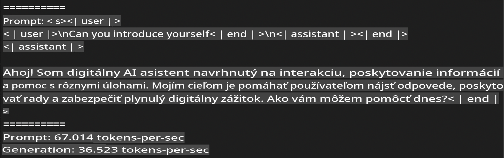
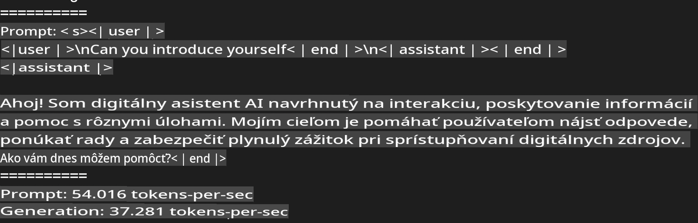
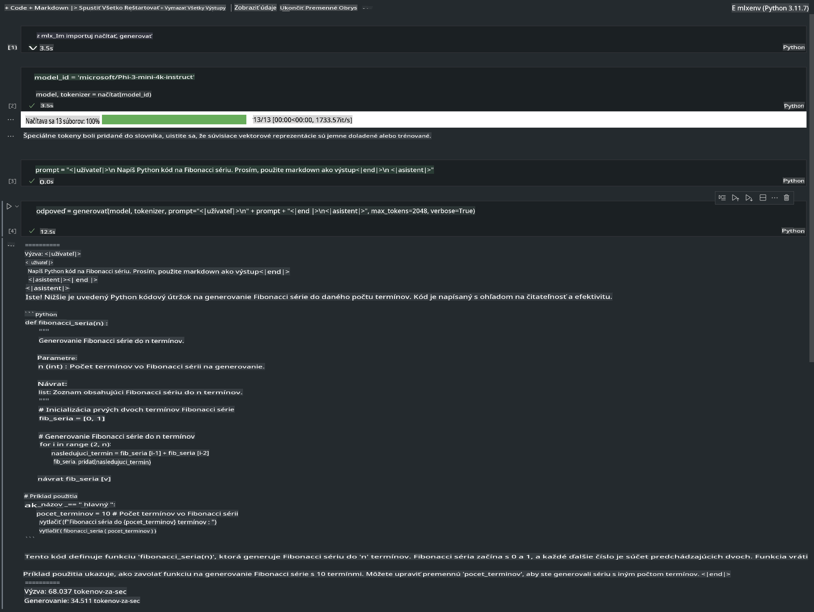

# **Inference Phi-3 s Apple MLX Frameworkom**

## **Čo je MLX Framework**

MLX je framework pre výskum strojového učenia na Apple Silicon, ktorý prináša Apple Machine Learning Research.

MLX je navrhnutý strojovými vedcami pre strojových vedcov. Framework je vytvorený tak, aby bol užívateľsky prívetivý, no zároveň efektívny pri trénovaní a nasadzovaní modelov. Dizajn frameworku je koncepčne jednoduchý, aby výskumníci mohli ľahko rozširovať a zlepšovať MLX s cieľom rýchlo skúmať nové nápady.

LLM modely môžu byť na zariadeniach s Apple Silicon akcelerované pomocou MLX a modely môžu byť spúšťané lokálne veľmi pohodlne.

## **Použitie MLX na inferenciu Phi-3-mini**

### **1. Nastavenie MLX prostredia**

1. Python 3.11.x  
2. Nainštalujte MLX knižnicu  

```bash

pip install mlx-lm

```

### **2. Spustenie Phi-3-mini v Termináli s MLX**

```bash

python -m mlx_lm.generate --model microsoft/Phi-3-mini-4k-instruct --max-token 2048 --prompt  "<|user|>\nCan you introduce yourself<|end|>\n<|assistant|>"

```

Výsledok (moje prostredie je Apple M1 Max, 64GB) je:



### **3. Kvantizácia Phi-3-mini pomocou MLX v Termináli**

```bash

python -m mlx_lm.convert --hf-path microsoft/Phi-3-mini-4k-instruct

```

***Poznámka:*** Model môže byť kvantizovaný pomocou mlx_lm.convert a predvolená kvantizácia je INT4. Tento príklad kvantizuje Phi-3-mini na INT4.

Model môže byť kvantizovaný pomocou mlx_lm.convert a predvolená kvantizácia je INT4. Tento príklad ukazuje kvantizáciu Phi-3-mini na INT4. Po kvantizácii bude model uložený v predvolenom adresári ./mlx_model.

Model kvantizovaný pomocou MLX môžeme otestovať z terminálu:

```bash

python -m mlx_lm.generate --model ./mlx_model/ --max-token 2048 --prompt  "<|user|>\nCan you introduce yourself<|end|>\n<|assistant|>"

```

Výsledok je:



### **4. Spustenie Phi-3-mini s MLX v Jupyter Notebooku**



***Poznámka:*** Prečítajte si tento príklad [kliknite na tento odkaz](../../../../../code/03.Inference/MLX/MLX_DEMO.ipynb)

## **Zdroje**

1. Viac o Apple MLX Framework [https://ml-explore.github.io](https://ml-explore.github.io/mlx/build/html/index.html)  

2. Apple MLX GitHub Repo [https://github.com/ml-explore](https://github.com/ml-explore)  

**Upozornenie**:  
Tento dokument bol preložený pomocou strojových AI prekladových služieb. Aj keď sa snažíme o presnosť, upozorňujeme, že automatické preklady môžu obsahovať chyby alebo nepresnosti. Pôvodný dokument v jeho pôvodnom jazyku by mal byť považovaný za autoritatívny zdroj. Pre dôležité informácie sa odporúča profesionálny preklad od človeka. Nezodpovedáme za žiadne nedorozumenia alebo nesprávne interpretácie vyplývajúce z použitia tohto prekladu.